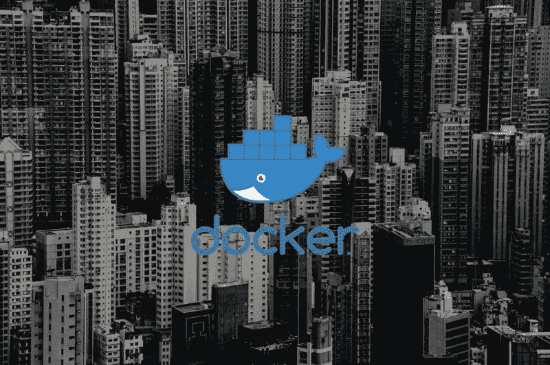

# 如何封装一个 spring 数据 cassandra 应用程序

> 原文：<https://www.freecodecamp.org/news/how-to-containerise-a-spring-data-cassandra-application-de4254240511/>

丹尼尔·牛顿

# 如何封装一个 spring 数据 cassandra 应用程序



[Hong Kong Skyline](https://pixabay.com/en/hong-kong-skyline-cityscape-day-1139367/) by [skeeze](https://pixabay.com/en/users/skeeze-272447/)

在这篇文章中，我将继续我学习 Docker 的旅程。在这一点上，我仍然保持简单。这一次，我打算将 Spring 和 Cassandra 应用程序转换成使用容器，而不是在主机上本地运行。更准确的说，是用 Spring Data Cassandra 来整理应用。

我希望不久前我能看到这样做。我在 Cassandra 上写了相当多的帖子。每次我都必须`cd`到正确的目录或者有一个快捷方式来启动它。我想这没什么大不了的，但是还涉及到其他一些事情——比如删除和重新创建键空间，这样我就可以从头开始测试我的应用程序了。现在，我删除容器并重启它。对我来说，反正这是有帮助的！

这篇文章将不同于我之前的文章,[使用 Docker 将现有的应用程序放入容器](https://lankydanblog.com/2018/09/02/using-docker-to-shove-an-existing-application-into-some-containers/)。相反，我将在这里更多地关注应用程序端，并删除仅使用 Docker 的中间步骤。我会直接跳到 Docker Compose。

### 集装箱，集装箱，集装箱

我认为最好从项目的容器端开始。应用程序取决于 Cassandra 容器的配置。

我们走吧！

这里没什么事情。这个`Dockerfile`构建了 Spring 应用程序映像，稍后将放入容器中。

接下来是`docker-compose`文件。这将构建 Spring 应用程序和 Cassandra 容器:

再说一遍，这里没有太多。`app`容器使用之前定义的`Dockerfile`构建 Spring 应用程序。相反，`cassandra`容器依赖于一个现有的图像，适当地命名为`cassandra`。

突出的一点是`restart`属性被设置为`always`。这是我偷懒的尝试，想知道卡珊德拉需要多长时间才能开始。再加上所有的集装箱都以`docker-compose`同时启动。这导致应用程序在没有准备好的情况下试图连接到 Cassandra。不幸的是，这会导致应用程序死亡。我希望它有一些内置的初始连接重试功能…但是没有。

当我们浏览代码时，我们将看到如何以编程方式处理初始的 Cassandra 连接，而不是依赖于应用程序死亡和多次重启。无论如何，您将看到我处理连接的版本。我不太喜欢我的解决方案，但是我尝试的其他方法都让我更加痛苦。

### 一小段代码

我说过这篇文章将更多地关注应用程序代码，事实也的确如此。我们不打算深入研究我在这个应用程序中投入的所有内容以及如何使用 Cassandra。对于这类信息，你可以看看我以前的帖子，我会在最后链接。不过，我们要做的是检查创建连接到 Cassandra 的 beans 的配置代码。

首先，让我们来看一下设置 Cassandra 集群的`ClusterConfig`:

那里没有太多。如果 Spring 重新尝试与 Cassandra 的初始连接，这个数目会更少。不管怎样，让我们先把这一部分放几分钟，然后把注意力放在这节课的其他要点上。

我创建`ClusterConfig`的最初原因是为了创建应用程序将使用的密钥空间。为此，`getKeyspaceCreations`被覆盖。当应用程序连接时，它将执行该方法中定义的查询来创建密钥空间。

如果不需要这样做，并且密钥空间是以其他方式创建的，例如，作为创建 Cassandra 容器的一部分执行的脚本，那么可以依赖 Spring Boot 的自动配置。这实际上允许通过`application.properties`中定义的属性来配置整个应用程序，除此之外别无其他。唉，这不是命中注定的。

由于我们已经定义了一个`AbstractClusterConfiguration`，Spring Boot 将禁用它在这个区域的配置。因此，我们需要通过重写`getContactPoints`方法来手动定义`contactPoints`(我将变量命名为`hosts`)。最初这只是在`application.properties`中定义的。当我开始得到以下错误时，我意识到我需要做这个改变:

```
All host(s) tried for query failed (tried: localhost/127.0.0.1:9042 (com.datastax.driver.core.exceptions.TransportException: [localhost/127.0.0.1:9042] Cannot connect))
```

在我创建`ClusterConfig`之前，地址是`cassandra`而不是`localhost`。

不需要配置群集的其他属性。Spring 的默认设置对于这个场景已经足够好了。

至此我已经提到了这么多，也许我应该给你看看里面有什么。

`keyspace-name`和`contact-points`已经弹出，因为它们与配置集群有关。需要`schema-action`来基于项目中的实体创建表格。我们不需要在这里做任何事情，因为自动配置仍然在这个领域工作。

将`contact-points`值设置为`cassandra`非常重要。这个域名来源于容器的名称，在本例中是`cassandra`。因此，可以使用`cassandra`或容器的实际 IP。域名肯定更容易，因为它在部署之间总是静态的。为了测试这个理论，您可以将`cassandra`容器的名称改为您想要的任何名称。只要您在`application.properties`中更改它，它仍然会连接。

回到`ClusterConfig`代码。更准确地说，是`cluster` bean。我再次粘贴了下面的代码，以便于查看:

这个代码只需要允许在初始 Cassandra 连接上重试。这很烦人，但我想不出另一个简单的解决方案。如果你有更好的，请告诉我！

我做的其实挺简单的，只是代码本身不太好看。除了`RetryingCassandraClusterFactoryBean`(我自己的类)之外，`cluster`方法是`AbstractClusterConfiguration`重写版本的翻版。原来的函数用了一个`CassandraClusterFactoryBean` (Spring 类)代替。

下面是`RetryingCassandraClusterFactoryBean`:

最初的`CassandraClusterFactoryBean`中的`afterPropertiesSet`方法获取其值，并通过最终委托给 Datastax Java 驱动程序来创建 Cassandra 集群的表示(正如我在整篇文章中提到的)。如果无法建立连接，将会引发异常。如果没有捕捉到异常，将导致应用程序终止。这就是上面代码的全部意义。它将`afterPropertiesSet`包装在为可能抛出的异常指定的 try-catch 块中。

添加`sleep`是为了给 Cassandra 一些时间来实际启动。当先前的尝试失败时，尝试立即重新连接是没有意义的。

使用这个代码，应用程序将最终连接到 Cassandra。

在这一点上，我通常会向您展示一些无意义的日志来证明该应用程序可以工作。但在这种情况下，它不会带来任何东西。相信我，如果你运行下面的命令:

```
mvn clean install && docker-compose up
```

然后创建 Spring 应用程序映像，两个容器都旋转起来。

### 结论

我们已经了解了如何将连接到 Cassandra 数据库的 Spring 应用程序放入容器中。一份给应用程序，另一份给卡珊德拉。

应用程序映像是从项目代码中构建的。卡桑德拉图片取自 Docker Hub。图像名为`cassandra`只是为了确保没有人会忘记。

一般来说，将两个容器连接在一起相对简单。应用程序需要做一些调整，以便在连接到运行在另一个容器中的 Cassandra 时允许重试。这使得代码有点难看，但至少可以工作。

感谢这篇文章中的代码，我现在有了另一个不需要在自己的机器上安装的应用程序。

这篇文章中使用的代码可以在我的 [GitHub](https://github.com/lankydan/spring-data-cassandra-docker) 上找到。

如果你觉得这篇文章很有帮助，你可以在 Twitter 上关注我，地址是 [@LankyDanDev](http://www.twitter.com/LankyDanDev) 来了解我的新文章。

### 链接到我的春季数据卡珊德拉帖子

*   [Spring Data Cassandra 入门](https://lankydanblog.com/2017/10/12/getting-started-with-spring-data-cassandra/)
*   [用 Spring Data Cassandra](https://lankydanblog.com/2017/10/22/separate-keyspaces-with-spring-data-cassandra/) 分隔键位
*   [使用单个 Spring 数据 CassandraTemplate 的多个键空间](https://lankydanblog.com/2017/11/12/multiple-keyspaces-using-a-single-spring-data-cassandratemplate/)
*   [使用 Spring Data Cassandra 进行更复杂的建模](https://lankydanblog.com/2017/11/26/more-complex-modelling-with-spring-data-cassandra/)
*   [Spring Data Cassandra 中的启动和关闭脚本](https://lankydanblog.com/2017/12/03/startup-and-shutdown-scripts-in-spring-data-cassandra/)
*   [与 Spring Data Cassandra 的反应流](https://lankydanblog.com/2017/12/11/reactive-streams-with-spring-data-cassandra/)
*   [Spring Data Cassandra](https://lankydanblog.com/2017/12/16/plumbing-included-with-auto-configuration-in-spring-data-cassandra/)中自动配置包含的管道
*   [使用 Datastax Java 驱动程序与 Cassandra 交互](https://lankydanblog.com/2018/04/15/interacting-with-cassandra-using-the-datastax-java-driver/)

哇，我没意识到我写了这么多卡珊德拉帖子。

我帖子中的观点和看法是我自己的，不代表埃森哲在任何问题上的观点。[查看丹·牛顿的所有帖子](https://lankydanblog.com/author/danknewton/)

*最初发布于 2018 年 9 月 8 日[lankydanblog.com](https://lankydanblog.com/2018/09/08/containerising-a-spring-data-cassandra-application/)。*