# 如何在 JavaScript 中将字符串转换成数字

> 原文：<https://www.freecodecamp.org/news/how-to-convert-a-string-to-a-number-in-javascript/>

使用 JavaScript 将字符串转换成数字有很多种方法。但是这在代码中是什么样子的呢？

在本文中，我将向您展示 11 种将字符串转换为数字的方法。

## 如何在 JavaScript 中使用`Number()`函数将字符串转换成数字

将字符串转换成数字的一种方法是使用`Number()`函数。

在这个例子中，我们有一个名为`quantity`的字符串，其值为`"12"`。

```
const quantity = "12";
```

如果我们在`quantity`上使用了`typeof`操作符，那么它将返回字符串的类型。

```
console.log(typeof quantity);
```

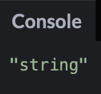

我们可以像这样使用`Number`函数将`quantity`转换成一个数字:

```
Number(quantity)
```

我们可以通过再次使用`typeof`操作符来检查它现在是一个数字。

```
console.log(typeof Number(quantity));
```

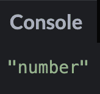

如果您试图传入一个不能转换成数字的值，那么返回值将是`NaN`(不是数字)。

```
console.log(Number("awesome"));
```


## 如何在 JavaScript 中使用 **`parseInt()`** 函数将字符串转换成数字

另一种将字符串转换成数字的方法是使用 **`parseInt()`** 函数。这个函数接受一个字符串和一个可选的基数。

基数是一个介于 2 和 36 之间的数，它代表数字系统中的基数。例如，基数 2 表示二进制，而基数 10 表示十进制。

我们可以使用前面的`quantity`变量将字符串转换成数字。

```
const quantity = "12";

console.log(parseInt(quantity, 10));
```

如果我试图将`quantity`变量改为`"12.99"`会发生什么？使用 **`parseInt()`** 的结果会是数字 12.99 吗？

```
const quantity = "12.99";

console.log(parseInt(quantity, 10));
```


如您所见，结果是一个四舍五入的整数。如果你想返回一个浮点数，那么你需要使用 **`parseFloat()`。**

## 如何在 JavaScript 中使用 **`parseFloat()`** 函数将字符串转换成数字

**`parseFloat()`** 函数将接受一个值并返回一个浮点数。浮点数的例子有 12.99 或 3.14。

如果我们修改前面的例子，使用`parseFloat()`，那么结果将是浮点数 12.99。

```
const quantity = "12.99";

console.log(parseFloat(quantity));
```

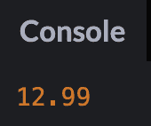

如果字符串中有前导或尾随空格，那么`parseFloat()`仍然会将该字符串转换成浮点数。

```
const quantity = "   12.99    ";

console.log(parseFloat(quantity));
```

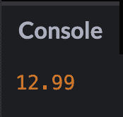

如果字符串中的第一个字符不能转换成数字，那么`parseFloat()`将返回`NaN`。

```
const quantity = "F12.99";

console.log(parseFloat(quantity));
```


## 如何在 JavaScript 中使用一元加号运算符(`+`)将字符串转换成数字

一元加号运算符(`+`)将字符串转换成数字。运算符将位于操作数之前。

```
const quantity = "12";

console.log(+quantity);
```

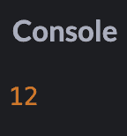

我们也可以使用一元加号运算符(`+`)将字符串转换成浮点数。

```
const quantity = "12.99";

console.log(+quantity);
```

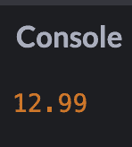

如果字符串值不能转换成数字，那么结果将是`NaN`。

```
const quantity = "awesome";

console.log(+quantity);
```

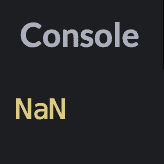

## 如何在 JavaScript 中将字符串乘以数字 1 转换成数字

将字符串转换成数字的另一种方法是使用基本的数学运算。您可以将字符串值乘以 1，它将返回一个数字。

```
const quantity = "12";

console.log(quantity * 1);
```

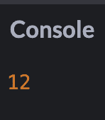

正如您所看到的，当我们将`quantity`值乘以 1 时，它返回数字 12。但是这是如何工作的呢？

在这个例子中，JavaScript 将我们的字符串值转换成一个数字，然后执行数学运算。如果字符串不能转换成数字，那么数学运算将不起作用，它将返回`NaN`。

```
const quantity = "awesome";

console.log(quantity * 1);
```


这个方法也适用于浮点数。

```
const quantity = "10.5";

console.log(quantity * 1);
```

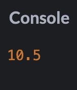

## 如何在 JavaScript 中通过将字符串除以数字 1 来将字符串转换为数字

您也可以将字符串除以 1，而不是乘以 1。JavaScript 将我们的字符串值转换成一个数字，然后执行数学运算。

```
const quantity = "10.5";

console.log(quantity / 1);
```

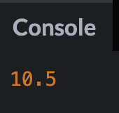

## 如何在 JavaScript 中通过从字符串中减去数字 0 将字符串转换为数字

另一种方法是从字符串中减去 0。像以前一样，JavaScript 将字符串值转换成数字，然后执行数学运算。

```
const quantity = "19";

console.log(quantity - 0);
```

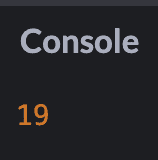

## 如何在 JavaScript 中使用按位 NOT 运算符(`~`)将字符串转换成数字

按位非运算符(`~`)将反转操作数的位，并将该值转换为 32 位有符号整数。32 位有符号整数是用 32 位(或 4 个字节)表示整数的值。

如果我们对一个数使用一个按位非运算符(`~`)，那么它将执行这个操作:-(x + 1)

```
console.log(~19);
```

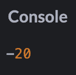

但是如果我们使用两个按位 NOT 运算符(`~`)，那么它会将我们的字符串转换成一个数字。

```
const quantity = "19";

console.log(~~quantity);
```

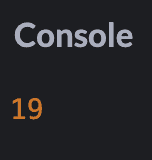

这个方法不适用于浮点数，因为结果将是一个整数。

```
const quantity = "19.99";

console.log(~~quantity);
```


如果您试图对非数字字符使用此方法，那么结果将是零。

```
const quantity = "awesome";

console.log(~~quantity);
```

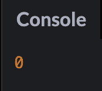

这种方法确实有其局限性，因为对于被认为太大的值，它会开始中断。确保您的数字在有符号的 32 位整数值之间是很重要的。

```
const quantity = "2700000000";

console.log(~~quantity);
```

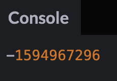

要了解更多关于位非运算符(`~`)的信息，请阅读[文档](https://developer.mozilla.org/en-US/docs/Web/JavaScript/Reference/Operators/Bitwise_NOT)。

## 如何在 JavaScript 中使用 **`Math.floor()`** 函数将字符串转换成数字

另一种将字符串转换成数字的方法是使用 **`Math.floor()`** 函数。这个函数会将数字向下舍入到最接近的整数。

```
const quantity = "13.4";

console.log(Math.floor(quantity));
```

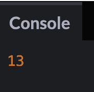

就像前面的例子一样，如果我们试图使用非数字字符，那么结果将是`NaN`。

```
const quantity = "awesome";

console.log(Math.floor(quantity));
```

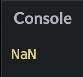

## 如何在 JavaScript 中使用 **`Math.ceil()`** 函数将字符串转换成数字

`Math.ceil()`函数会将一个数字向上舍入到最接近的整数。

```
const quantity = "7.18";

console.log(Math.ceil(quantity));
```


## 如何在 JavaScript 中使用 **`Math.round()`** 函数将字符串转换成数字

**`Math.round()`** 函数会将数字四舍五入到最接近的整数。

如果我的值是 6.3，那么 **`Math.round()`** 将返回 6。

```
const quantity = "6.3";

console.log(Math.round(quantity));
```

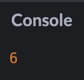

但是如果我把那个值改成 6.5，那么 **`Math.round()`** 就会返回 7。

```
const quantity = "6.5";

console.log(Math.round(quantity));
```

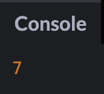

## 如何在 JavaScript 中将字符串转换成数字的视频说明

[https://scrimba.com/scrim/co2894c679bc693326603ac73?embed=freecodecamp,mini-header](https://scrimba.com/scrim/co2894c679bc693326603ac73?embed=freecodecamp,mini-header)

## 结论

在本文中，我向您展示了使用 JavaScript 将字符串转换为数字的 11 种方法。

下面是文章中讨论的 11 种不同的方法。

1.  使用`Number()`功能
2.  使用`parseInt()`功能
3.  使用`parseFloat()`功能
4.  使用一元加号运算符(`+`)
5.  将字符串乘以数字 1
6.  将字符串除以数字 1
7.  从字符串中减去数字 0
8.  使用按位非运算符(`~`)
9.  使用`Math.floor()`功能
10.  使用`Math.ceil()`功能
11.  使用`Math.round()`功能

我希望您喜欢这篇文章，并祝您的 JavaScript 之旅好运。