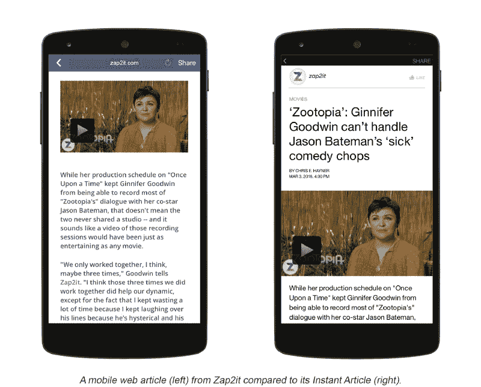
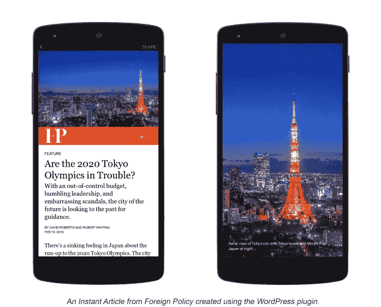
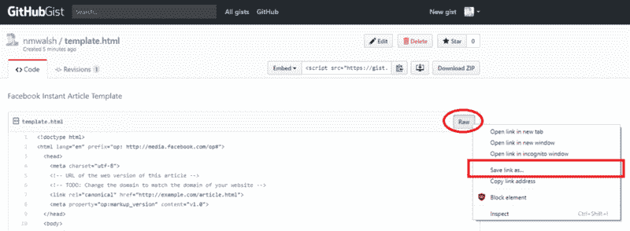
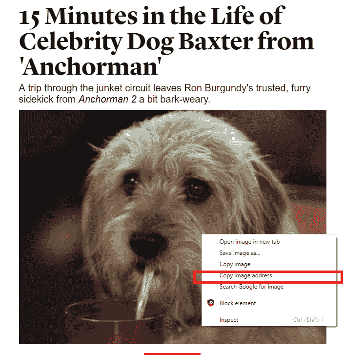
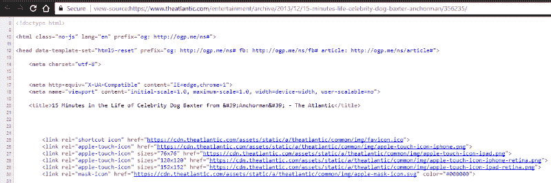
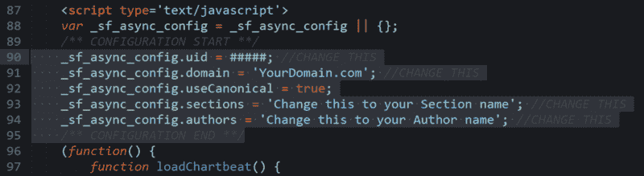
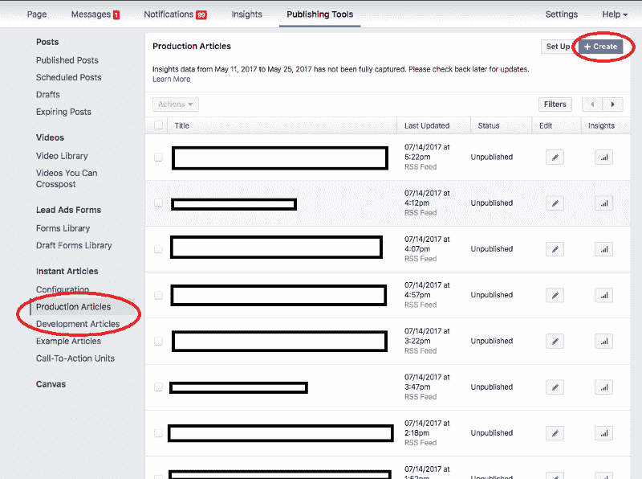

# 如何将博客文章转换成 Facebook 即时文章——无需编码

> 原文：<https://www.freecodecamp.org/news/how-to-convert-blog-posts-into-facebook-instant-articles-no-coding-required-fefea28c8701/>

尼古拉斯·沃尔什

# 如何将博客文章转换成 Facebook 即时文章——无需编码


我的一个朋友让我帮忙把之前发布到他们网站上的文章转换成 Facebook 即时文章。后来，我决定编写一个指南，帮助非技术人员转换他们的旧文章、博客帖子或在线内容。

即使你不知道什么是 Facebook 即时文章，你可能已经在使用它们了。根据脸书 IA 的 [FAQ](https://developers.facebook.com/docs/instant-articles/faq#FAQ-basics) 页面:

> “即时文章是一种移动发布格式，使新闻出版商能够将文章发布到脸书的应用程序，其加载和显示速度比标准移动网络快 10 倍。”

IA 规定了一个内容发布标准，既能带来令人愉悦的设计，又能优化从脸书移动应用中打开的文章的性能。您可以阅读更多关于信息架构的[优势](https://contently.com/strategist/2015/05/13/7-things-you-need-to-know-about-facebook-instant-articles/)的信息。



脸书提供了多种方式来加速 IA 的生产和转化。然而，目前的指南似乎是为拥有更复杂的出版生态系统的开发人员或大型企业准备的。



很难找到不涉及使用脸书 IA API、PHP SDK 或 WordPress [插件](https://media.fb.com/2016/03/07/instant-articles-wordpress-plugin/)来转换以前发布的文章的指南。对于非开发人员来说，这些工具大多需要太多的技术经验。即使当一个人试图找到 WordPress 插件教程时，他也不得不在脸书的开发者门户网站上挖掘文档。这对于那些在找到这个页面之前就被劝阻的非开发人员来说并不理想。

让我们一起努力将任何已经发表在网上的文章转换成脸书即时文章！对于我们的教程，我们将使用电影'[主持人](https://www.theatlantic.com/entertainment/archive/2013/12/15-minutes-life-celebrity-dog-baxter-anchorman/356235/)'中关于一只名人狗的文章。

### 让我们开始吧！

**第 0 步:准备**

我们不需要安装任何插件或集成，但我们需要一个文本编辑器来处理 HTML 源代码。有很多不同的面向代码的文本编辑器，但是为了这个例子，我推荐[](https://www.sublimetext.com/)**。它拥有我们需要的所有功能，并且易于开箱即用，全新安装。**

**一旦你安装了 Sublime，我们将需要从 GitHubGist 下载将要使用的代码[模板](https://gist.github.com/nmwalsh/e67c8474b038a5286c95d15e2ad82285#file-template-html)。**

****

```
`On the right side of the screen: 1\. Right click the "Raw" button2\. Click "Save link as..." By default, it should save as an HTML file with the name "template".`
```

**现在我们已经有了代码编辑器和将要编辑的模板代码！**

```
`For the last step of setup:1\. Boot up Sublime2\. Open the template file we downloaded`
```

#### **步骤 1:获取横幅图像**

**回到你的网络浏览器，在它的 live 网站上找到你想要转换的文章。我们将首先抓取**横幅图像**，我们将在脸书即时新闻文章的顶部使用它。**

**为此，右击图像，并选择*复制图像地址*。****

******

***切换回我们在 Sublime 中打开的模板。在代码中搜索位于第 35 行的***

***标记(行号在左边可见)。***

```
*`Highlight the original URL located between quotes on line 36, and replace it by pasting the image address that we copied from the banner image. Make sure there are double quotes on each side of the URL to preserve the format. And make sure to not delete the “ />” at the end of the line.`*
```

```
*`Edit the text inside of <figcaption> </figcaption> with the caption that you will want to appear below the image. This is often where the image attribution goes.`*
```

***注意我们是如何小心翼翼地不去改变代码的任何格式。当我们试图渲染网站时，乱搞标签本身会导致错误。Sublime 为我们的代码着色，这有助于我们识别错误或不匹配的 HTML 标签。***

***请特别注意我们是如何替换图片标题的文本的。我们将以完全相同的方式编辑许多其他值。***

#### ***步骤 2:检索元数据***

***我们现在需要收集一些信息。由于这些数据中的大部分都应该是可检索的，而不需要挖掘源代码，所以手动复制这些信息效果很好。不过我们以后会需要这个源代码，所以现在打开它也没什么坏处。***

*   ***原始文章 URL***
*   ***文章标题***
*   ***文章副标题***
*   ***文章作者***
*   ***文章最初发布的日期和时间***
*   ***文章上次更新的日期和时间***

***如果很难获得这些信息，我们可以使用网站上的源代码。如何访问这些数据将取决于您使用的浏览器。***

```
*`Chrome: CTRL + U, or Right Click → View Page SourceFirefox: Right Click → View Page SourceSafari: Safari menu → Preferences → Advanced, Enable "Show Develop menu in menu bar", then Develop menu → Show Page Source`*
```

***

The source code should resemble this*** 

***现在我们已经有了源代码和原始网站，让我们开始寻找我们的信息。***

*****Title:** 复制文章标题，用它替换模板第 14 行< h1 > < /h1 >标签 **s** 中的“文章标题”。在源代码中，这通常在<标题></标题>标签内。举个例子，***

```
*`<h1>Article Title</h1>`*
```

```
*`becomes`*
```

```
*`<h1>15 Minutes in the Life of Celebrity Dog Baxter from 'Anchorman'</h1>`*
```

*****副标题:**同上，但有副标题。用这个替换 **t** he 模板第 15 行<H2>/H2>标签 **s** 中的“文章副标题”。***

*****网址:**复制直播网站文章的网址。使用它来替换出现在模板第 7 行的 URL。例如:***

```
*`<link rel="canonical" href="http://example.com/article.html">`*
```

```
*`becomes...`*
```

```
*`<link rel="canonical" href="https://www.theatlantic.com/entertainment/archive/2013/12/15-minutes-life-celebrity-dog-baxter-anchorman/356235/">`*
```

*****发布时间:**在模板的第 18 行，您可以指定文章最初发布的日期和时间。请注意，“datetime”参数采用非常特殊的格式。**datetime =***里面的数据决定元数据(不显示)，而“ **> <** /time >”标签之间的文本将决定显示什么日期(这里可以是任何格式)。****

```
**`For example, <time class="op-published" datetime="2014-11-11T04:44:16Z">November 11th, 4:44 PM</time>`**
```

```
**`Displays as: November 11th, 4:44 PMLet's change it to: July 24th, 2017\. 6:30 PM`**
```

```
**`<time class="op-published" datetime="2017-7-24T06:30:16Z">July 24th, 2017\. 6:30 PM</time>`**
```

```
**`Last Update Time: Same plan as above, but on line 21 of the template.`**
```

******作者:**模板的第 24–27 行代表一个作者，他的名字链接到网络上的某个地方。第 28–31 行表示一个作者的名字没有被链接。您可以复制该作者的整个代码块，并将其连续粘贴到前面的代码块中，然后根据需要进行编辑。您也可以对多个作者这样做。请参阅下面的示例，了解多个作者的简单姓名和标题。****

#### ****步骤 3:复制正文内容****

****现在我们将检索我们想要转换的文章内容。有很大范围的内容类型，如混合媒体、花式 JavaScript、嵌入式内容。对于更复杂的内容，如果不进行故障诊断，事情不工作的可能性更高，因此您的里程数可能会有所不同。****

****我将解释如何处理文本、图像(静态或 gif)和视频，因为这些是我见过的大多数即时文章的基础。****

****源代码可能有数百(甚至数千)行。找到正文内容开头的一个简单技巧是对文章正文的前几个词进行“查找”。我们希望从正文开头的****

****标签开始复制，直到(包括)文章结尾词后面的****

****标签。

接下来，我们需要将它转储到我们的模板中。在模板的第 58 行附近，应该有一行如下内容:

```
<p> Article content </p>
```

突出显示这一整行，并粘贴我们从 live 文章源代码中复制的正文内容。注意:我们从源代码中复制了开始

和结束

，这就是为什么我们在这里的模板中粘贴它们。正文之后的另一组标签中有一些代码，但这是样式化的——注意不要将它与正文一起复制。

*您想将一个视频整合到您的 IA 中？从第 64 行开始修改和标签之间的 URL，就像我们在步骤 1 中对横幅图像 URL 所做的那样。

**法律注释:**第 84 行。这段文字会很小，在你文章的最后。

#### 第四步:花里胡哨(广告、分析跟踪器等等)

我建议现在跳过这一步。如果你想确认我们到目前为止所做的工作，或者如果你没有定制广告或跟踪器，请跳到第 5 步。

与其他专有的文章转换工具相比，Facebook Instant Articles 最好的一点是，你可以保留你已经在自己的网站上使用的定制分析跟踪器和广告。

每个定制集成都是不同的，而且难度也可能不同。对于这个例子，我们将使用 [ChartBeat](https://chartbeat.com/) ，一个流量分析和跟踪工具。我们可以使用谷歌快速搜索“ChartBeat 文档”，找到[入门指南](http://support.chartbeat.com/docs/)。

一些公司的文档页面可能是面向开发者的。如果这对你不起作用，搜索一个教程来代替。

ChartBeat 为我们提供了如何添加它们的集成的所有代码和说明。

在指南中，它告诉我们以下内容，所以这就是我们要做的:

```
Insert this script right before the closing </body> tag:
```

现在我们已经添加了我们的 ChartBeat 跟踪器，我们需要做一些快速编辑，以便跟踪器知道如何同步到我们的 ChartBeat 帐户。



Code from the ChartBeat snippet that we’ll need to customize

每个突出显示的行(除了“，”以外)。useCanonical" one)将需要一个编辑，以便它可以记录数据。

```
CHANGES (to the right of the "=").uid - The unique ID for your ChartBeat account.domain - The full domain of the original article.sections - The name of the 'section/genre/tags' your article belongs to.authors - The name of the author to associate with this piece
```

答对了。您已经添加了跟踪器，它会将发送的数据与您唯一的 ChartBeat 帐户相关联。保存您编辑的模板文件，让我们准备发布。

#### 步骤 5:部署您的即时文章

在脸书上，转到您想要发布的页面的仪表板。导航到发布工具，然后导航到文章列表。点击右上角的蓝色“+创建”按钮。



IA Dashboard

现在应该会提示您粘贴新文章的代码。

从我们一直在编辑的模板中选择所有代码，并将其粘贴到这里。点击保存！您可以在认为合适时发布草稿，或者使用仪表板安排在预定时间发布。

#### 恭喜，你成功了！我等不及要看你即将发表的精彩文章了。


嘿，我是 [**尼克·沃什**](http://twitter.com/thenickwalsh) 。

我是 Wolfram Research 的技术布道者，也是 T2 职业黑客大联盟的黑客马拉松蔻驰，对技术、电子竞技和授权学生开发者充满热情。****