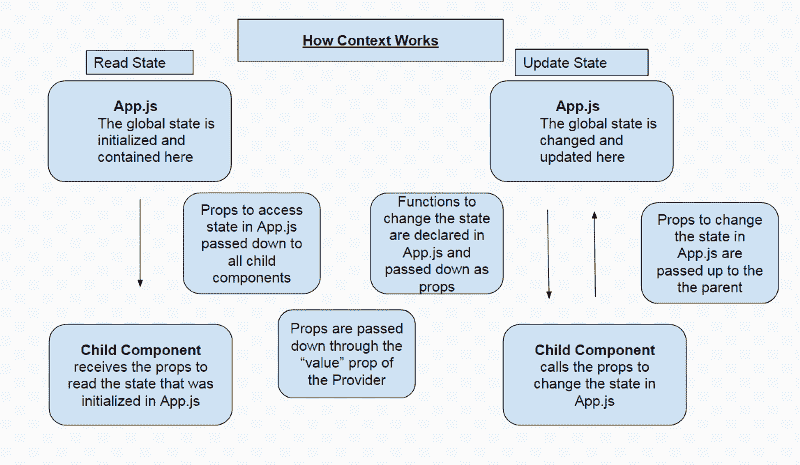
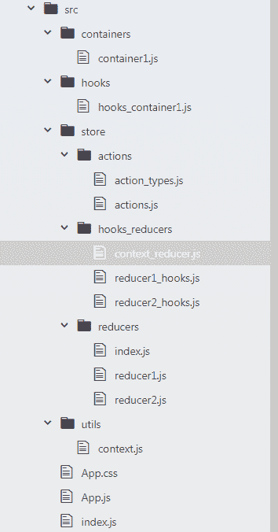

# 如何从 React-Redux 类转换到 React 钩子，简单的方法

> 原文：<https://www.freecodecamp.org/news/how-to-convert-from-react-redux-classes-to-react-hooks-the-easy-way-eca2233e0e7a/>

大家好！随着 create-react-app v3 和 React hooks 的最新发布，我决定写一篇关于如何将类组件重构为功能性 hooks 组件的教程。

在本教程中，我将分享我是如何做到的。我称之为“简单的方法”,因为它根本不需要您更改 Redux 代码。减少器和动作实际上可以保持原样。

如果你想要一个更基本的 React Hooks 集成介绍，请查看我之前的教程。

你可以在这里找到项目代码[。](https://github.com/iqbal125/react_hooks_with_react_redux)

你也可以在 twitter 上关注我，了解更多教程:[这里](https://twitter.com/iqbal125sf)

这个项目同时使用了 Redux 和 React 钩子，这将允许你并排看到代码和差异。在您的文本编辑器中打开`hooks_container1.js`文件和`container1.js`文件，查看它们的区别。我尽最大努力匹配 React 类和 React 挂钩，以便更容易看出区别。然而，由于 React 钩子和 React 类之间有一些主要的区别，它并没有完美地工作。我试图保持两个组件的功能相同，这样你就可以更容易地找出语法上的差异。

#### **目录**

1.  TLDR 版本
2.  用户和上下文
3.  何时使用本地或全局状态以及使用状态和用户
4.  背景是如何工作的
5.  目录结构
6.  上下文对象
7.  减速器和动作
8.  读取和更新 React Redux 与 React 挂钩中的状态
9.  在 React 钩子中合并旧状态
10.  使用 useReducer 和 Redux Reducers 读取和更新状态
11.  读取状态和调度操作
12.  具有使用状态的上下文
13.  带有用户的上下文

### **最简单的方法—TL；博士**

**步骤 1:** 对于您的减速器，导出初始状态和减速器。不要`export default`减速器。

**步骤 2:** 动作可以从 React-Redux 中保持原样

**步骤 3:** 将所有的 reducers 及其初始状态导入到根 App.js 文件中。正常导入操作。

**步骤 4:** 将每个 reducer 及其初始状态传递给 App.js 文件中一个单独的`useReducer()` 钩子。

**第五步:**将`React.createContext()`函数在自己的文件中初始化后导入 App.js。用`<Context.Provider />`包装所有子组件

**第六步:**接下来简单地剪切并粘贴你的 React-Redux `mapStateToProps()`和 `mapDispatchToProps()`函数中定义的属性到`<Context.Provider />`的`value`属性中

**第 7 步:**将属性中的 dispatch 关键字从`mapDispatchToProps()`函数改为`useReducer()`钩子中的 dispatch actions 函数(数组析构中的第 2 个元素)的名称。因为每个缩减器都有自己的 useReducer 挂钩，所以您必须将适当的动作分派与正确的缩减器相匹配。

**第 8 步:**对`mapStateToProps()`函数做同样的事情。更改属性的名称以匹配 useReducer 挂钩。`useReducer()`钩子(析构数组中的第一个元素)的状态值包含了缩减器的整个初始状态。您需要用点符号访问 state 的每个属性，然后将它传递到“value”属性中。

**第 9 步:**最后，为了在一个子组件中实际使用全局上下文状态，首先要将原始的上下文对象导入到子组件中。然后将导入的上下文对象传递给`useContext()`钩子。将 useContext 挂钩的结果保存在一个变量中。现在您可以访问我们在根 App.js 文件的`<Context.Provider />`的`value`属性中定义的所有属性。

使用上下文访问子组件中的状态值:`context.stateprop1`

在具有上下文的子组件中调度动作:`() => context.action1()`

这是一个 React Redux 类容器和 React Hooks 功能组件的例子，它们具有相似的功能。

```
 class Container1 extends Component {
    constructor(props) {
      super(props)

      this.state = {
        local_state_prop1: true,
        local_state_prop2: 0,
        cDM_value: ''
      }
    }

 ...

    inc_local = () => {
      this.setState({local_state_prop2: this.state.local_state_prop2 + 1})
    }

    dec_local = () => {
      this.setState({local_state_prop2: this.state.local_state_prop2 - 1})
    }

  ...
    <button onClick={() => this.inc_local()}> INC Local State  </button>
    <button onClick={() => this.dec_local()}> DEC Local State  </button>
    <br />
    <br />
      {this.state.local_state_prop2}
    <br />
 ... 
```

```
 const HooksContainer1 = () => {
    const [value, setValue] = useState({local_state_prop1: true,
                                        local_state_prop2: 0
                                       })

...    
    const incrementValue_uS = () => {
      setValue({...value, local_state_prop2: value.local_state_prop2 + 1} )
    }

    const decrementValue_uS = () => {
      setValue({...value, local_state_prop2: value.local_state_prop2 - 1} )
    }

...

      <button onClick={() => incrementValue_uS()}> Add Local Value uS </button>
      <button onClick={() => decrementValue_uS()}> Dec Local Value uS</button>
      <br />
      <p>Local useState Value: {value.local_state_prop2}</p>
      <br />
 ...
```

在开始之前，我想澄清一些我第一次使用 React 钩子时感到困惑的事情。

#### **用户和上下文**

一开始我被 useReducer 弄得有点晕头转向。我认为只要使用 useReducer，我就可以自动模仿 Redux 功能并拥有一个全局状态。事实并非如此。是环境使我们的国家全球化。Context 可以与 useReducer 和 useState 一起使用。

> **全局状态**:意味着状态从一个组件持续到另一个组件。如果您更改了一个组件中的状态，并转到另一个组件，如果该状态是全局的，则会保存该状态。如果状态是本地的，并且您转到了另一个组件，则状态不会被保存。

#### **何时使用本地或全局状态，以及使用状态和用户身份**

出于教学目的，我将向您展示使用 useState 和 useReducer 的本地和全局状态的所有四种可能的组合。在真实的应用程序中，我会使用 useReducer 钩子来处理复杂的全局状态，比如身份验证和存储来自服务器的数据。对于更简单的本地状态，我会使用 useState 钩子，比如打开和关闭一个模态。

#### **语境如何运作**



上下文早于 React 挂钩，是将属性传递给深层嵌套子组件的一种方式。如果没有上下文，props 将不得不被传递给每个中间组件，以到达预期的子组件。

Context 通过向父组件传递一个属性解决了这个问题。那么它将自动对所有子组件可用。你不需要通过中间人来传递。这基本上就是我们如何有一个全球性的国家。通过使用根组件中的上下文，我们的状态对所有子组件都可用。因为 App.js 是根组件，而其他所有组件都是子组件，所以我们在 App.js 中定义的状态对所有组件都可用。

请记住，所有状态都包含在 App.js 文件中，并在其中进行初始化和更新，这一点很重要。您可以调用一个函数来更改子组件的状态，但它最终是在 App.js 文件中更新的。

### **目录结构和简介**

我将不再关注如何一步一步地构建这个应用程序，而是更多地关注 React-Redux 类和 React 挂钩之间的区别。

以下是我使用的几个首字母缩写词及其含义

uS T1 = useState 表示什么时候使用了 useState 钩子

uR = useReducer 表示某个东西正在使用 useReducer 钩子



这是目录结构。这是一个非常基本的应用程序，具有:

*   1 React-Redux 类
*   1 使用 useState、useReducer 和 useContext 挂钩的 React 功能组件
*   动作和动作类型
*   与反作用钩一起使用的异径管
*   与 React-Redux 一起使用的减速器
*   上下文文件
*   根 App.js 文件

#### **上下文对象**

我喜欢把上下文放在它自己的文件中，因为你必须把它导入到你用 `useContext()` 钩子使用的每个子组件中。我们不需要做任何其他事情来设置上下文对象，我们只需要这个函数。

```
 import React from 'react';

const Context = React.createContext()

export default Context;
```

另外，请注意，我们没有向上下文对象传递任何状态。您可能会看到其他将值传递给`createContext()`函数的教程。这是没有意义的，因为当我们设置`<Context.Provider />`并将状态传递给`value`属性时，我们将覆盖这些值。

#### **减速器和动作**

现在我将展示一个用于 React 挂钩的缩减器和一个用于常规 React Redux 的缩减器。

与反作用吊钩一起使用的异径管:

```
 import * as ACTION_TYPES from '../actions/action_types'

export const initialState = {
  hooks_stateprop1: false,
}

export const Reducer1 = (state = initialState, action) => {
    switch(action.type) {
      case ACTION_TYPES.SUCCESS:
        return {
          ...state,
          hooks_stateprop1: true,
        }
      case ACTION_TYPES.FAILURE:
        return {
          ...state,
          hooks_stateprop1: false,
        }
      default:
        throw new Error();
    }
}
```

React Redux 的减速器:

```
import * as ACTION_TYPES from '../actions/action_types'

const initialState = {
  stateprop1: false
}

const Reducer1 = (state = initialState, action) => {
    switch(action.type) {
      case ACTION_TYPES.SUCCESS:
        return {
          ...state,
          stateprop1: true
        }
      case ACTION_TYPES.FAILURE:
        return {
          ...state,
          stateprop1: false
        }
      default:
        return state
    }
}

export default Reducer1;
```

注意，在 React Hooks reducer 中，我们导出了初始状态和 reducer。我们没有在底层使用`export default`。在 React Redux 减速器中我们`export default`了减速器。

接下来，我们有我们的动作和动作类型:

```
export const SUCCESS = "SUCCESS"

export const FAILURE = "FAILURE"

...
```

```
 import * as ACTION_TYPES from './action_types'

export const SUCCESS = {
  type: ACTION_TYPES.SUCCESS
}

export const FAILURE = {
  type: ACTION_TYPES.FAILURE
}

export const success = () => {
  return {
    type: ACTION_TYPES.SUCCESS
  }
}

export const failure = () => {
  return {
    type: ACTION_TYPES.FAILURE
  }
}
...
```

动作和动作创建者不需要 React Redux 的任何更改。

#### **读取和更新 React Redux vs React Hooks 中的状态**

有了初步的信息，我们现在可以看看`hooks_container1.js`和`container1.js`，看看代码中 React Hooks 和 React Redux 之间的区别。

让我们先来看看每个的本地状态，看看如何实现一个简单的计数器。

**React-Redux**

```
class Container1 extends Component {
    constructor(props) {
      super(props)

      this.state = {
        local_state_prop1: true,
        local_state_prop2: 0,
        cDM_value: ''
      }
    }

 ...

    inc_local = () => {
      this.setState({local_state_prop2: this.state.local_state_prop2 + 1})
    }

    dec_local = () => {
      this.setState({local_state_prop2: this.state.local_state_prop2 - 1})
    }

  ...
    <button onClick={() => this.inc_local()}> INC Local State  </button>
    <button onClick={() => this.dec_local()}> DEC Local State  </button>
    <br />
    <br />
      {this.state.local_state_prop2}
    <br />
 ... 
```

**反应钩子**

```
 const HooksContainer1 = () => {
    const [value, setValue] = useState({local_state_prop1: true,
                                        local_state_prop2: 0
                                       })

...    
    const incrementValue_uS = () => {
      setValue({...value, local_state_prop2: value.local_state_prop2 + 1} )
    }

    const decrementValue_uS = () => {
      setValue({...value, local_state_prop2: value.local_state_prop2 - 1} )
    }

...

      <button onClick={() => incrementValue_uS()}> Add Local Value uS </button>
      <button onClick={() => decrementValue_uS()}> Dec Local Value uS</button>
      <br />
      <p>Local useState Value: {value.local_state_prop2}</p>
      <br />
 ...
```

首先要注意的是，我们将从 React Redux 中的类组件转变为 React Hooks 中的功能组件。因此，为什么我们在 React Hooks 代码中没有“this”关键字。由于我们不在一个类中，我们可以直接引用变量和函数名。

在 React Redux 中，我们在构造函数中初始化状态，并有一个专用的`setState()`函数。“state”和“setState()”都是保留名称。

在 React 钩子中却不是这样。在 React 钩子中，我们用 useState()钩子创建了自己的“state”关键字和 setState()函数。在上面的例子中，你可以把`value`看作是类组件中`this.state`的等价物。和`this.state`类似，我们用点符号来访问状态的每个单独属性，所以我们的语法将是:

```
 value.name_of_property
```

当我刚开始学习钩子的时候，我曾经混淆了`useState()` 钩子和 React Redux 中的`setState()`函数。事实并非如此。React Redux `setState()`函数相当于数组析构中的第二个元素。在上面的例子中是`setValue()`。这个`setValue()`函数就是我们如何用钩子更新状态的。`useState()`只是我们初始化读取和更新功能组件状态的能力的一种方式。这在以前仅适用于类组件。

#### **在 React 钩子中合并旧状态**

React Hooks 示例中另一个需要注意的重要事情是，在更新递增和递减函数中的状态之前，我使用了`…value` 。这是 spread 操作符，它将整个展平的前一个状态传递给 setState()函数。

在 React Redux 示例中，我不需要传入先前的状态。当我们在 React Redux 中更新一个状态属性时，新的状态属性会自动与旧的状态属性合并

这个**不会**发生在 React 钩子中。当您更新 React 钩子中的状态时，会创建一个新的状态。在 React 钩子的例子中，我们有两个状态属性: `local_state_prop1`和`local_state_prop2`。如果我们只使用`local_state_prop2`更新状态，而不传入`…value`，那么将会创建一个只有`local_state_prop2`的新状态。这意味着我们的`local_state_prop1`将被删除。

因此，当将状态从 React Redux 转换为 React Hooks 时，在更新单个状态属性时，需要使用 spread 操作符传递整个先前的状态。

#### **用用户减速器和 Redux 减速器读取和更新状态**

我们现在可以用 useReducer 和 Reducer 比较读取和更新状态。

我们使用与上面例子中相同的减速器。具有`SUCCESS`和`FAILURE`动作类型的减速器，将`stateprop1`从真变为假，反之亦然。

useReducer Hook

```
import * as Reducer1 from '../store/hooks_reducers/reducer1_hooks';

...
const HooksContainer1 = () => {
      const [stateLocal1, dispatchLocal1] = useReducer(Reducer1.Reducer1,
                                                     Reducer1.initialState)

...

    const action1 = () => {
      //    dispatchLocal1({type: "SUCCESS"})
      //  dispatchLocal1(ACTIONS.success())
          dispatchLocal1(ACTIONS.SUCCESS)

    }

    const action2 = () => {
      //   dispatchLocal1({type: "FAILURE"})
      //   dispatchLocal1(ACTIONS.failure())
           dispatchLocal1(ACTIONS.FAILURE)

    }
 ...

    <button onClick={() => action1()}>Dispatch Action 1  </button>
    <button onClick={() => action2()}>Dispatch Action 2 </button>
      <br />
      {stateLocal1.stateprop1
        ? <p> stateprop1 is true </p>
        : <p> stateprop1 is false </p>
      }
      <br />
...
```

反应还原

```
...

function mapStateToProps(state) {
  return {
    stateprop1: state.reducer1.stateprop1,
  }
}

function mapDispatchToProps(dispatch) {
  return {
    // action_creator1: () => dispatch(ACTIONS.success()),
    // action_creator2: () => dispatch(ACTIONS.failure()),
    // action_type1: () => dispatch({type: "SUCCESS"}),
    // action_type2: () => dispatch({type: "FAILURE}),
    action1: () => dispatch(ACTIONS.SUCCESS),
    action2: () => dispatch(ACTIONS.FAILURE),
  }
}

...

  <button onClick={() => this.props.action1()}> Dispatch Action 1 </button>
  <button onClick={() => this.props.action2()}>Dispatch Action 2 </button>
  <br />
  {this.props.stateprop1
    ? <p> stateprop1 is true </p>
    : <p> stateprop1 is false </p>
  }
  <br />
...
```

正如介绍中提到的，即使我们在功能组件中使用了`useReducer()`，我们仍然只更新本地组件状态。在下一节中，我将向您展示如何用上下文模拟 Redux 功能，并拥有一个全局状态。重要的是要记住，即使我们使用了 actions 和 reducers，我们仍然只更新钩子容器中的本地状态。

另一方面，在我们的 React 类组件中，我们正在更新全局状态，因为我们正在使用 Redux。

所以你会注意到 useReducer 的第一个区别是，我们必须导入我们的 Reducer 和初始状态，并将其传递给 useReducer 钩子，这是我们在 React Redux 中没有做的事情。在 React Redux 中，我们只使用了`connect()`函数。

#### **读取状态和调度动作**

接下来，为了在 React 钩子中分派动作，我们使用一个箭头函数，然后在函数体中分派动作。您可以直接在`onClick()`事件中调度动作，但是在函数中调度会使您的代码可读性更好。

在 React Redux 中，我们在`mapDispatchToProps()`函数中设置属性，然后每个属性都是一个分配动作的箭头函数。

您会注意到，在 React Hooks 和 React Redux 中，我们以完全相同的方式将动作和动作创建者传递给分派函数。实际上没有区别，这就是为什么我们根本不需要改变我们的行为。我已经将所有调度动作的方式作为注释包含在内。

React Hooks 和 React Redux 的唯一区别是 React Redux 中保留了“dispatch”函数名。在 React 钩子中，我们通过 useReducer 钩子创建自己的“dispatch”函数名。

为了调用 React Redux 中的 dispatch 函数，我们使用语法`this.props`，然后使用`mapDispatchToProps()`函数中的属性名。在 React 钩子中，我们直接调用调度函数名。

为了读取 React Redux 中的状态，我们先读取`this.props`，然后读取`mapStateToProps()`函数中属性的名称。属性的名称包含特定缩减器中特定属性的值。在 React 钩子中，我们只做状态值的名字。这是 useReducer 挂钩调用中构造的数组中的第一个元素。然后是我们在 reducer 的 intialState 中定义的属性的名称。

#### **具有使用状态的上下文**

现在我将回顾一下我们如何设置全局状态的上下文。需要注意的是，上下文不是 React 挂钩的一部分。是一个 React 钩子，但是上下文本身不是 React 钩子的一部分。上下文只是将属性从父组件传递到深层嵌套的子组件的一种方式。关于完整的解释，请参见本教程开头的“上下文如何工作”一节。

此外，我不会在 React Redux 和 Context 之间进行比较，因为 Context 在 React Redux 中没有相反的内容。我将向您展示如何使用`useReducer()`和`useState()`钩子实现带有上下文的全局状态。

我们将首先使用`useState()`钩子来设置一个全局状态。

我们将开始在根 App.js 文件中设置我们的全局状态。我们将首先导入我们在`context.js` 文件中设置的上下文对象。我们还需要导入我们的钩子功能组件。

```
 import Context from '../utils/context';
import HooksContainer1 from './hooks/hooks_container1';
...

const App = () => {
    const [valueGlobal_uS, setValueGlobal_uS] = useState(0)

    const incrementValueGlobal_uS = () => {
      setValueGlobal_uS(valueGlobal_uS + 1 )
    }

    const decrementValueGlobal_uS = () => {
      setValueGlobal_uS(valueGlobal_uS - 1 )
    }

...    

    <div>
     <Context.Provider
          value={{
            //global state with useState
            valueGlobalState_uS: valueGlobal_uS,
            addGlobalValue_uS: () => incrementValueGlobal_uS(),
            decGlobalValue_uS: () => decrementValueGlobal_uS(),
          }}>
        <HooksContainer1 />
      </Context.Provider>
     </div>
...
```

我们现在可以设置一个简单的计数器。我们的`useState()`钩子照常设置。在我们的 JSX 中，我们用 T2 元素包装 T1。这使得我们可以将状态从 App.js 传递给子组件。我们也有 3 个属性提供给我们的`value`道具。1 个用于保存状态值，2 个用于更改状态的属性。注意，我们在 App.js 中没有使用`useContext()`钩子。实际上在子组件中使用`useContext()`钩子来读取和更新状态。

你可以把`value`属性看作是将`mapStateToProps()`和`mapDispatchToProps()`功能合二为一，因为`value`属性允许你读取和更新子组件可以调用和访问的状态，这正是`mapStateToProps()`和`mapDispatchToProps()`功能所做的。

现在让我们看看如何在子组件中使用这个上下文对象。

```
 import Context from '../utils/context';

...
const HooksContainer1 = () => {

...
    const context = useContext(Context)

    <p>Global useState Value: {context.valueGlobalState_uS}</p>

    <button onClick={() => context.addGlobalValue_uS()}> Add Global Value uS </button>
    <button onClick={() => context.decGlobalValue_uS()}> Dec Global Value uS </button>

...
```

我们首先必须在顶部导入上下文对象。这是我们用`createContext()`函数创建的原始上下文对象，而不是我们刚刚设置的`<Context.Provider />`。然后我们简单地将这个上下文对象传递给`useContext()`钩子，并保存在一个变量中。这个上下文变量现在拥有我们刚刚在`<Context.Provider />`的`value`属性中定义的所有属性。

要访问`value`属性，我们可以使用点符号。例如，为了访问我们的子组件中的状态值，我们使用语法`context.valueGlobalstate_uS`。

注意，`valueGlobalState`是我们在值属性的 App.js 文件中定义的*属性*的名称。`valueGlobalState`是保存状态值的属性，在 App.js 中我们将其定义为`valueGlobal_uS`。类似地，为了改变状态，我们调用属性名，而不是我们在 App.js 中设置的函数名。

我有意保持属性和函数名称的不同，以便更容易看到上下文在子组件中是如何工作的。

这是使用带有 useState 的上下文。我现在将使用 useReducer 进行演示。

#### **带有用户标识符的上下文**

在 useReducer 中使用上下文本质上是我们实现 Redux 功能的方式。

为了避免混淆，我将为此设置一个新的减速器和动作。

```
 export const CONTEXT_INC = "CONTEXT_INC"

export const CONTEXT_DEC = "CONTEXT_DEC"
```

```
export const CONTEXT_INC = {
  type: ACTION_TYPES.CONTEXT_INC
}

export const CONTEXT_DEC = {
  type: ACTION_TYPES.CONTEXT_DEC
}
```

```
import * as ACTION_TYPES from '../actions/action_types'

export const initialState = {
  context_prop1: 0,
}

export const ContextReducer = (state = initialState, action) => {
    switch(action.type) {
      case ACTION_TYPES.CONTEXT_INC:
        return {
          ...state,
          context_prop1: state.context_prop1 + 1
        }
      case ACTION_TYPES.CONTEXT_DEC:
        return {
          ...state,
          context_prop1: state.context_prop1 - 1
        }
      default:
        throw new Error();
    }
}
```

所以我们有一个简单的减压器作为计数器。现在，我们可以在 App.js 文件中设置 useReducer 挂钩，我们将按照与在 Hooks 容器中设置 useReducer 完全相同的方式进行设置。我们导入 ContextReducer 及其初始状态，并将其传递给 App.js 中的 useReducer 挂钩。因为我们现在使用上下文，所以我们不会将上下文缩减器导入到子组件中。状态将在我们的 App.js 文件中进行更改，并简单地作为道具传递下去。

```
import * as ACTIONS from './store/actions/actions';
import * as ContextReducer from './store/reducers/context_reducer';

...

const App = () => {

...

    const [contextState, contextDispatch] = useReducer(ContextReducer.ContextReducer,
                                                       ContextReducer.initialState)

    const dispatchContextInc = () => {
      contextDispatch(ACTIONS.CONTEXT_INC)
    }

    const dispatchContextDec = () => {
      contextDispatch(ACTIONS.CONTEXT_DEC)
    }
 ...

       <div>
      <Context.Provider
          value={{
            //global state with useState
            valueGlobalState_uS: valueGlobal_uS,
            addGlobalValue_uS: () => incrementValueGlobal_uS(),
            decGlobalValue_uS: () => decrementValueGlobal_uS(),

            //global state with useReducer
            valueGlobalState_uR: contextState,
            addGlobalValue_uR: () => dispatchContextInc(),
            decGlobalValue_uR: () => dispatchContextDec()
          }}>
              <HooksContainer1 />
          </Context.Provider>
        </div>
...
```

我们在`value`属性中设置我们的属性，就像我们在`useState()`钩子中使用上下文一样。动作的分派方式也和我们之前看到的完全一样。

现在是我们的子组件:

```
...

const HooksContainer1 = () => {

 const context = useContext(Context)

...

 <button onClick={() => context.addGlobalValue_uR()}> Add Global Value uR </button>
 <button onClick={() => context.decGlobalValue_uR()}> Dec Global Value uR </button>

 <p>Global useReducer Value: {context.valueGlobalState_uR.context_prop1}</p>
```

如您所见，用`useReducer()`钩子读取和更新状态与`useState()`例子非常相似。我们甚至可以使用与`useState()`相同的上下文变量，我们不需要初始化另一个变量。要更新状态，我们只需调用我们在提供者的`value` prop 中定义的属性名。这将更新 App.js 中的状态。因为我们正在更新 App.js 中的状态，所以我们不必在我们的子组件中导入 ContextReducer 并将其传递到`useReducer()`钩子中。

阅读状态有一点不同。由于`valueGlobalState_uR`包含了我们的整个状态，我们必须指定一个状态属性，在本例中就是`context_prop1`。

这就是了！此后，您可以使用相同的模式读取和更新应用程序中任何组件的状态，这允许您从本质上模仿 Redux 功能。

对于本教程的 100%免费视频版本和更深入的 React Hooks 内容，请参见我的 Udemy 课程或 Youtube 播放列表:

[https://www . udemy . com/react-hooks-with-react-redux-migration](https://www.udemy.com/react-hooks-with-react-redux-migration)

[https://www . YouTube . com/watch？v = l8 ODM-kodpa&list = plmc 67 xeat-yplhhdpoj 5 vakceznr 8s 0b](https://www.youtube.com/watch?v=l8ODM-KoDpA&list=PLMc67XEAt-ywplHhDpoj5vakceZNr8S0B)