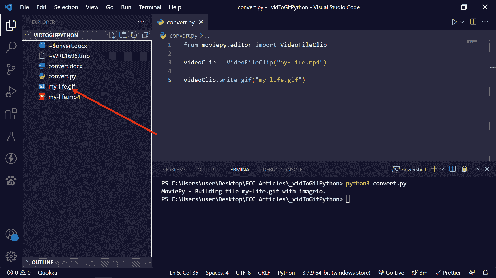

# 如何在 Python 中将视频文件转换成 Gif

> 原文：<https://www.freecodecamp.org/news/how-to-convert-video-files-to-gif-in-python/>

最近，我能够将一些视频文件转换成 gif 格式，因为我的一些文章需要 gif 格式的文件。

我决定用 3 行代码向您展示我是如何做到这一点的，这样您就可以省去查找 Saas 来为您做这件事的额外工作。

## 如何用 Python 将视频转换成 Gif

用 Python 把视频转换成 gif，需要打开终端运行`pip install moviepy`，用 pip 安装一个名为`moviepy`的包。

这个模块有几种方法，你可以用它们来编辑和增强视频。


成功安装`moviepy`后，需要从中导入一个名为`VideoFileClip`的方法。通过这种方法，您可以指定视频文件的名称及其相对路径。

```
from moviepy.editor import VideoFileClip 
```

接下来，您需要在 VideoFileClip 方法中指定要转换为 gif 的视频的相对路径。然后你需要把它赋给一个变量。

在下面的代码片段中，我将该变量称为`videoClip`:

```
videoClip = VideoFileClip("my-life.mp4") 
```

为了最终将视频转换成 gif，您需要引入`videoClip`变量并对其使用`write_gif()`方法，然后指定您想要给其中的 gif 命名。

```
videoClip.write_gif("my-life.gif") 
```

打开终端，运行文件:


检查视频文件所在的文件夹，您应该会看到 gif 文件。如果你使用的是 VS 代码，按下`CTRL + B`打开侧边栏，你应该会看到 gif 文件。


你也可以用 VS 代码打开 gif。

进行转换的整个代码如下所示:

```
from moviepy.editor import VideoFileClip

videoClip = VideoFileClip("my-life.mp4")

videoClip.write_gif("my-life.gif") 
```

你可以在[他们的官方网站](https://zulko.github.io/moviepy/)上了解更多关于`moviepy`模块的信息。

如果您有任何问题，请随时通过 [Twitter](https://twitter.com/Ksound22) 联系我。

感谢您的阅读。