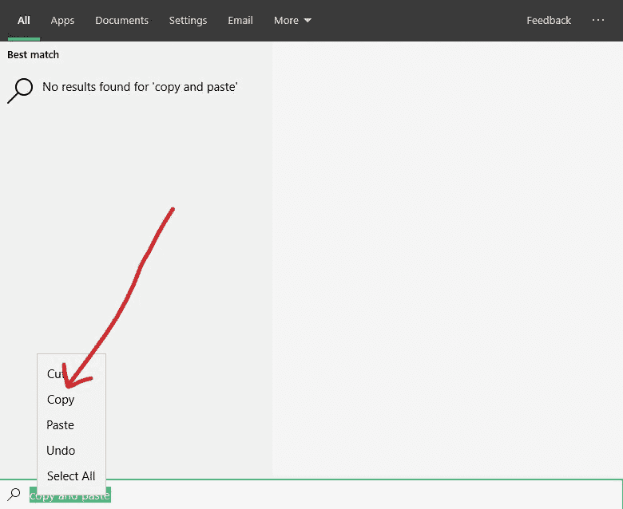
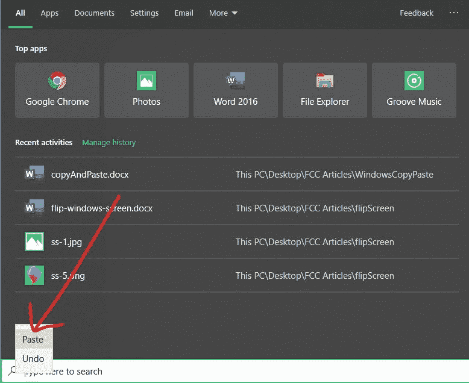
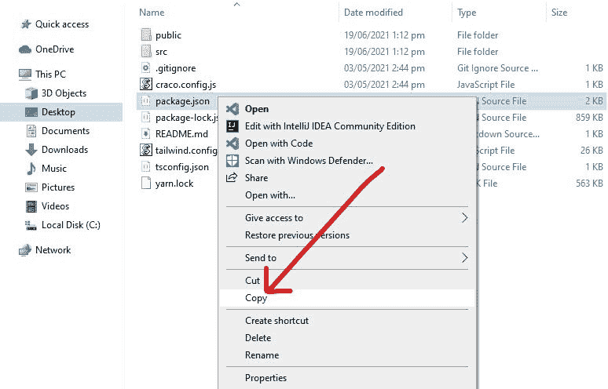
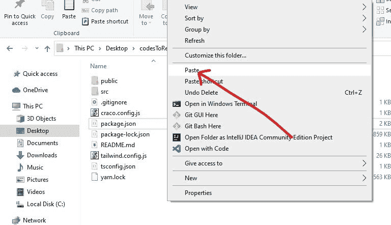
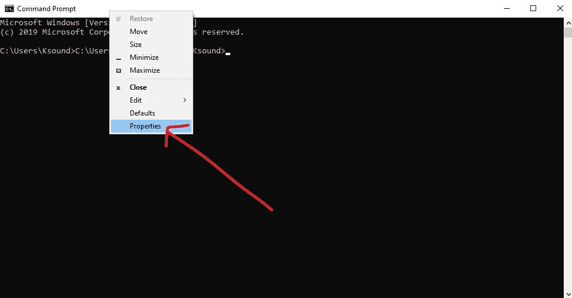

# 如何在计算机上复制和粘贴[Windows PC 键盘快捷键指南]

> 原文：<https://www.freecodecamp.org/news/how-to-copy-and-paste-on-a-computer-windows-pc-keyboard-shortcut-guide/>

当你在电脑上工作时，你想尽可能快地做事情。您可能不想一遍又一遍地重复输入相同的内容。

知道如何复制和粘贴文本和其他数据将有助于您高效地工作，而不会重复自己。

因此，在本指南中，我将向您展示在 Windows PC 上复制和粘贴文本、文件和文件夹的不同方式，包括从命令行。

然后，我还将向您展示如何访问您计算机的剪贴板，这样您就可以看到您复制的项目的历史。

## 如何在 Windows PC 上复制和粘贴文本

您可以通过在任何编辑器中突出显示文本，右键单击突出显示的文本，然后选择“复制”来复制文本。

要突出显示多个单词，请按住鼠标左键，然后向下滚动到要停止复制文本的位置。右键单击并选择“复制”来复制您突出显示的文本。

要高亮显示文档中的整个文本，请按`CTRL` + `A`。

例如，如果您正在 MS Word 中处理大量文本，您可以双击一个单词来选择它，三击一行中的任何单词来选择整个段落，右键单击，然后选择“复制”。

要粘贴复制的文本，再次右键单击任意编辑器并选择“粘贴”。确保在您想要粘贴文本的地方单击鼠标右键。

您可以在任何编辑器中使用的复制文本的快捷键是`CTRL` + `C`。要粘贴文本，按住`CTRL`，然后按住`V`。

## 如何复制和粘贴文件和文件夹

要在 Windows PC 上复制文件，请右键单击该文件，并从弹出的项目列表中选择“复制”:

要将复制的文件或文件夹粘贴到另一个文件夹中，右击文件夹中的空白处，选择“粘贴”:

您也可以批量复制文件和文件夹。你可以通过按住`SHIFT`键并使用上下箭头键来上下移动你的文件。然后点击右键，选择“复制”。

如果您不想选择某些文件或文件夹，请按住`CTRL`键而不是`SHIFT`，用鼠标选择您想要的每个文件和文件夹。然后点击右键，选择“复制”。

要选择一个文件夹中的所有文件或文件夹，或者同时选择一个文件夹中的所有文件和文件夹，请按`CTRL` + `A`。

## 如何在命令行中复制和粘贴文本

在命令行中，`CTRL` + `C`和`CTRL` + `V`表示不同的东西，但是您仍然可以在那里复制和粘贴。

通过在 Windows 搜索栏中键入“cmd”打开命令行。要复制任何文本，请用鼠标或触控板高亮显示该文本，然后右键单击高亮显示的文本。

要在命令行中粘贴文本，请再次右键单击。

在命令行中，仍然可以使用`CTRL` + `C`和`CTRL` + `V`进行复制粘贴。为此，将光标指向窗口顶部，右键选择属性:

勾选“使用 Ctrl+Shift+C/V 作为复制/粘贴”:

现在，您可以在命令行中使用`CTRL` + `C`和`CTRL` + `V`进行复制和粘贴。

## 如何访问 Windows 剪贴板

如果您正在进行大量的复制和粘贴操作，则只能粘贴您复制的最后一个文本。

但是，如果您想要粘贴您复制的倒数第二个(倒数第二个)或倒数第三个(倒数第三个)项目呢？如果您按下`CTRL V`或右键单击并选择“粘贴”,您复制的最后一个项目将被粘贴。

要在 Windows 电脑上访问之前复制的项目，只需按住`WIN` (Windows)键，然后按住`V`。在那里，您将看到一个自您打开电脑后复制的项目列表。

如果您以前从未访问过剪贴板，系统会提示您打开 Windows 计算机的剪贴板历史记录。

要粘贴剪贴板中的项目，请左键单击它。

## 结论

在本指南中，您了解了复制和粘贴文本和文件的几种方法，包括如何在命令行中执行此操作。

您还学习了如何查看您的剪贴板历史记录，因此您可以粘贴您以前复制的任何项目。

感谢您的阅读。如果你觉得这篇文章有帮助，请分享给你的朋友和家人。