# 如何用 Deno 创建一个静态的 Markdown 博客并部署它

> 原文：<https://www.freecodecamp.org/news/how-to-create-a-blog-with-deno/>

Deno 是 JavaScript 和 TypeScript 的运行时。Node.js 的创建者构建了它，而 Node 是用 C 和 C++构建的，Deno 是用 Rust 语言构建的。

您可能想知道 Node 和 Deno 之间的主要区别是什么。嗯，Rust 是一种类似于 C 和 Java 的低级语言。它有助于使 Deno 超快，Deno 也比 Node 更安全。

在本文中，我们将用 Deno 在不到五分钟的时间内构建一个静态 markdown 博客。最后，我们将使用 Deno deploy 部署 markdown 博客。

我们将使用 Deno 的第三方博客包[由 Ryan Dahl 和另一个博客贡献者创建](https://deno.land/x/blog)

有了 Deno 博客模块，你可以创建一个梦幻般的超快的博客。然后，您可以用两行代码设置和部署博客。配置它只需不到五分钟的时间。

### 什么是降价？

[Markdown](https://en.wikipedia.org/wiki/Markdown) 是一种轻量级的标记语言。它有助于创建格式一致的文本。要开始使用 markdown，您需要一个支持 markdown 的 IDE，并且需要创建一个扩展名为`.md`的文件。Markdown 通常支持书面文档、博客等等。

用 Markdown 编写的文档的例子有 GitHub 和 npm READMEs、React.js 等等。

Deno blog 模块(包)带有 markdown 支持，并允许您创建静态博客。该模块具有许多功能，例如:

1.  降价支持。
2.  自动刷新。减价文件中的任何更改都会自动构建并在浏览器中重新加载您的网站。
3.  您可以自定义页眉，添加注释和页脚部分。
4.  它支持搜索引擎优化，搜索引擎优化标记，和一个内置的饲料(网站地图)。
5.  降价文件的 iFrames 支持。
6.  它有内置的 Preact、TypeScript 和 Tailwind CSS 支持。
7.  它允许多个作者
8.  它有中间件和重定向路径名支持
9.  它带有服务器端的谷歌分析支持

这里是我们将要构建和部署的博客的[演示:](https://deno-markdown-blog.deno.dev/)

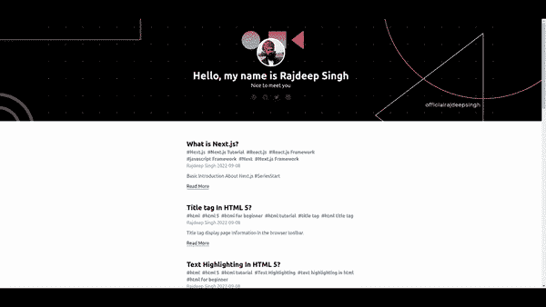

deno blog demo

所有代码[都可以在 GitHub](https://github.com/officialrajdeepsingh/deno-markdown-blog) 上获得。

### 以下是我们将遵循的步骤:

1.  如何安装和设置博客
2.  如何理解文件夹结构
3.  如何启动本地开发人员服务器
4.  如何给博客添加更多配置？
5.  如何使用 Deno 进行部署

## 如何安装和设置博客

首先，您需要安装 Deno 博客模块。blog 模块附带了 init 命令来创建新的 blog 设置。看起来是这样的:

```
deno run -r --allow-read --allow-write https://deno.land/x/blog/init.ts my-deno-demo-blog-name
```

Setup the project

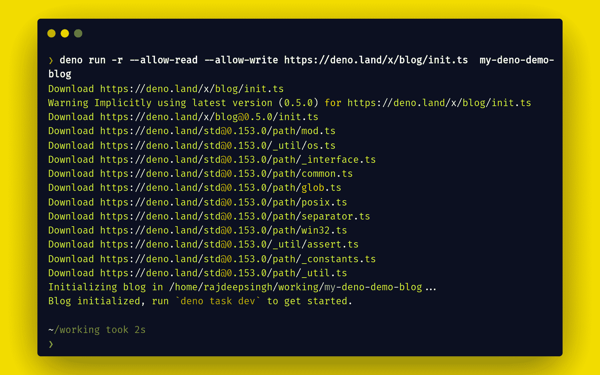

Create a blog setup with the deno blog module

## 如何理解文件夹结构

Deno 的妙处在于，你只需要几个文件就可以启动一个项目。对于 markdown 博客，您只需要四个文件:

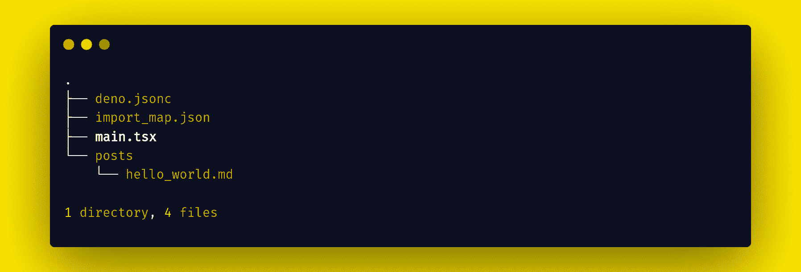

deno folder structure

让我们仔细检查上述文件夹结构中的每个文件:

*   在`deno.jsonc`文件中，添加任务和 importMap 文件。任务类似于 Node 中的脚本，在 importMap 部分，传递一个 JSON 文件，其中包含来自 Deno 的所有导入包。
*   `import_map.json`文件包含运行项目所需的所有包的导入。
*   `posts`文件夹包含所有降价文件。
*   `main.tsx`文件包含博客模块的所有配置。

## 如何启动本地开发人员服务器

安装完成后，用`deno task dev`命令运行本地开发服务器。

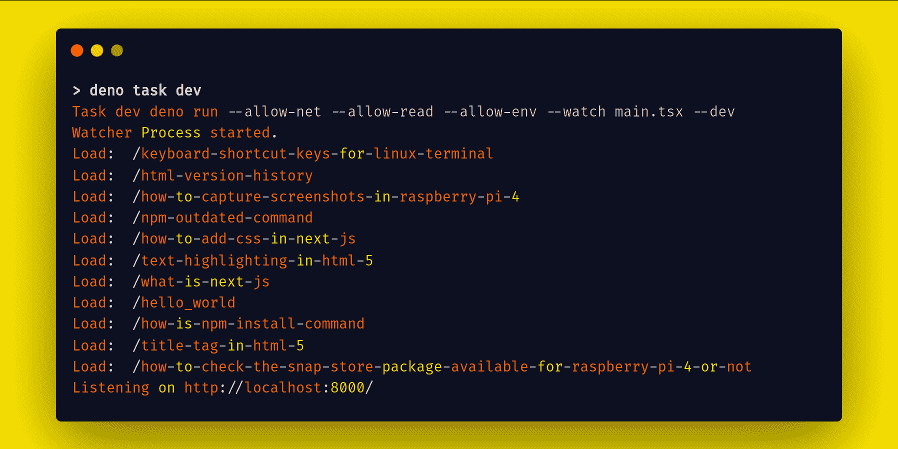

Run deno local development server

## 如何给博客添加更多配置

博客模块默认在`main.tsx`文件中有如下配置。您可以根据自己的需求轻松更改博客配置。

```
// main.tsx

import blog, { ga, redirects, h } from "blog";

blog({
  title: "My Blog",
  description: "This is my new blog.",
  // header: <header>Your custom header</header>,
  // section: <section>Your custom section</section>,
  // footer: <footer>Your custom footer</footer>,
  avatar: "https://deno-avatar.deno.dev/avatar/blog.svg",
  avatarClass: "rounded-full",
  author: "An author",

  // middlewares: [

    // If you want to set up Google Analytics, paste your GA key here.
    // ga("UA-XXXXXXXX-X"),

    // If you want to provide some redirections, you can specify them here,
    // pathname specified in a key will redirect to pathname in the value.
    // redirects({
    //  "/hello_world.html": "/hello_world",
    // }),

  // ]
});
```

By default, code for main.tsx

### 自定义配置

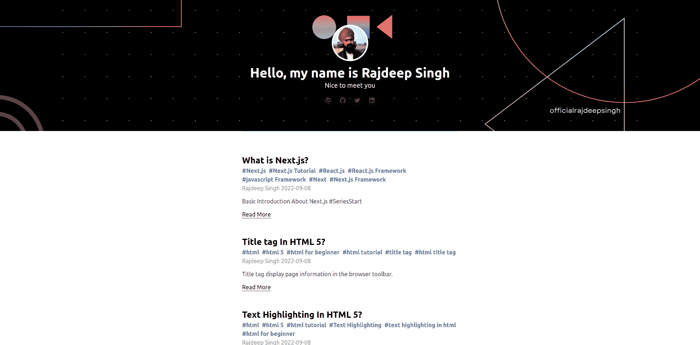

Demo of custom configuration

通过自定义配置，你可以让你的网站看起来像你想要的那样——甚至像上面的例子。此外，您可以快速向您的博客添加更多自定义配置。

例如，您可以更改默认的页眉、页脚、标题、作者、主题、自定义样式、链接、节等。下面是实现这一点的一些代码:

```
// main.tsx

/** @jsx h */
import blog, { h } from "blog";
import { Section } from './components/Section.jsx';

blog({
  author: "Rajdeep singh",
  title: "Hello, my name is Rajdeep Singh",
  description: "Nice to meet you",
  avatar:"assets/logos/profile.jpg",
  avatarClass: "rounded-full",
  coverTextColor:"white",
  links: [
    { title: "Email", url: "mailto:officialrajdeepsingh@gmail.com" },
    { title: "GitHub", url: "https://github.com/officialrajdeepsingh" },
    { title: "Twitter", url: "https://twitter.com/Official_R_deep" },
    { title: "Linkedin", url: "https://www.linkedin.com/in/officalrajdeepsingh/" },
  ],
  lang: "en",
  favicon: "favicon.ico",
  section: <Section/>,
  theme:"auto",
  cover:"assets/logos/backgroundbanner.png",
  ogImage: {
    url: "http://localhost:8000/assets/logos/Frame.png",
    twitterCard:  "summary_large_image" 
  },
  style:".markdown-body ul, .markdown-body ol { list-style: disc !important;}"
});
```

custom code for main.tsx

降价文件支持各种类型的 frontMatter。最常见和最广泛使用的字体类型有:

1.  YAML: YAML 是通过开合`---`来识别的。
2.  JSON: JSON 由'`{`'和'`}`'标识。
3.  TOML:通过打开和关闭`+++`来识别 TOML。

最常见的锋物质是 YAML。YAML frontMatter support markdown 文件随处可见。但是**Deno 博客模块只支持 yml frontMatter** 。

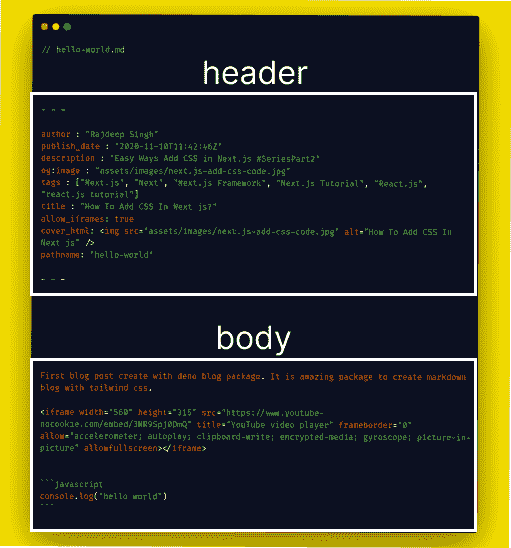

yml front matter example

降价文件分为两部分。第一部分是标题(frontMatter)，第二部分是正文。

标题部分包含文章的所有元数据。所有元数据都写在三个破折号(`---`)内，包括开始和结束——例如，文章标题、标签、描述、发布日期等等。

最后，在正文部分，你写你的文章正文并解释它。

```
// hello-world.md

---
author : "Rajdeep Singh"
publish_date : "2020-11-10T11:42:46Z"
description : "Easy Ways Add CSS in Next.js #SeriesPart2"
og:image : "assets/images/next.js-add-css-code.jpg"
tags : ["Next.js", "Next", "Next.js Framework", "Next.js Tutorial", "React.js", "react.js tutorial"]
title : "How To Add CSS In Next js?"
allow_iframes: true
cover_html: 
pathname: "hello-world"
---

First blog post created with the Deno blog package. It is an amazing package you can use to create markdown blogs with Tailwind CSS. 

<iframe width="560" height="315" src="https://www.youtube-nocookie.com/embed/3NR9Spj0DmQ" title="YouTube video player" frameborder="0" allow="accelerometer; autoplay; clipboard-write; encrypted-media; gyroscope; picture-in-picture" allowfullscreen></iframe>

```javascript
console.log("hello world")
``` 
```

hello-world markdown example

Deno 博客模块支持 markdown 文件中的以下 YML FrontMatter 字段:

1.  author(string):`author`包含作者的名字。例如，`author : "Rajdeep singh , deno"`
2.  publish_date(日期):文章需要`publish_date`。
3.  描述(字符串):描述需要`description`。
4.  og:image(string):不需要`og:image`。它用于`<meta property="og:image" content="assets/images/Title-tag-In-HTML-5.jpg">`
5.  标签(string[]):`tags`只是用于 SEO 的关键字。它们不是强制性的。
6.  标题(字符串):标题需要`title`。
7.  allow _ iframes(boolean):`allow_iframes`允许您使用`iframe` HTML。
8.  pathname(字符串):pathname 不是必需的。例如，域`hello-world`后面的`http://yourdomain.com/hello-world`是您的路径名
9.  cover _ html(string):`cover_html`包含博客的 HTML。

```
author : "Rajdeep Singh , Rajvinder singh"
publish_date : "2022-03-20T13:09:24Z"
description : "Npm install command help to install package from npmjs.org"
og:image : "assets/images/npm-init-command-1.png"
tags : ["npm-test", "npm-cli", "npm install command"]
title : "What is the npm install command?"
allow_iframes: true
pathname:"/how-is-npm-install-command"
cover_html: 
```

example for cover_html

这些是 YML frontMatter 为降价文件支持的所有字段:

```
title, author, publish_date, description, og:image, tags, allow_iframes, pathname, cover_html
```

All the parameters for the markdown file

这是减价文件的必填字段:

```
title
```

All the required parameters for the markdown file

如果没有标题文件，博客模块会产生一个错误`Uncaught TypeError: Cannot read properties of undefined (reading 'snippet')`。

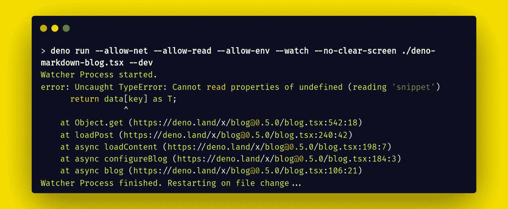

Error: Uncaught TypeError: Cannot read properties of undefined (reading 'snippet')

## 如何用 Deno 部署你的博客

最后一步是在 Deno 中部署我们的静态博客。目前 Deno 博客模块只支持 Deno 进行部署。但是 Deno deploy 提供了一个类似于 Netlify 和 Vercel 的接口。因此，如果您以前使用过这些工具，您可以很容易地理解仪表板。

要在 Deno 上部署一个新的博客，你需要两样东西。第一个是 [Deno deploy](https://deno.com/deploy) 上的账号，第二个是 GitHub 账号。有了 GitHub 库来帮助管理你的文章，这是一个类似于 [Vercel](https://vercel.com/) 和 [Netlify](https://www.freecodecamp.org/news/p/00c3cfd3-6447-48dc-a915-804b26bf056e/netlify.com) 的简单过程。

### 部署步骤:

以下是使用 Deno deploy 部署您的博客的步骤(我们将在下面详细介绍每个步骤):

1.  首先，在 Deno deploy 上登录您的帐户
2.  单击以创建新项目
3.  配置 GitHub 存储库和环境变量
4.  部署静态博客

### 在 Deno deploy 上登录您的帐户

首先，转到 [Deno deploy](https://deno.com/deploy) 网站，如果您还没有帐户，请创建一个新帐户。如果有，请登录您的帐户。

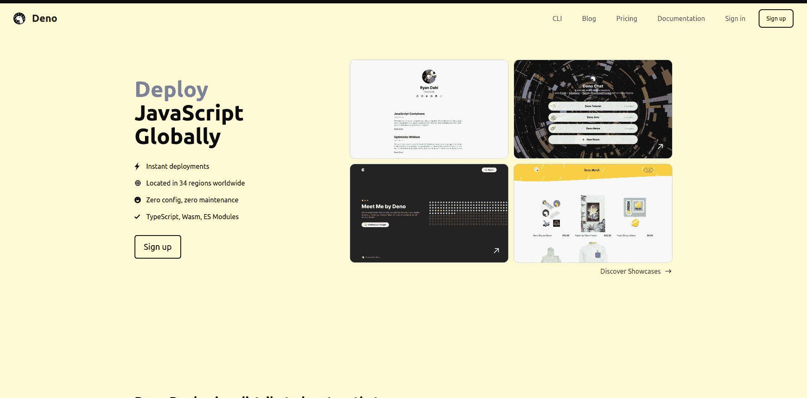

deno deploy website

### 单击以创建新项目

成功登录后，您现在可以访问 Deno 仪表板，并单击“+ **新项目**”按钮。

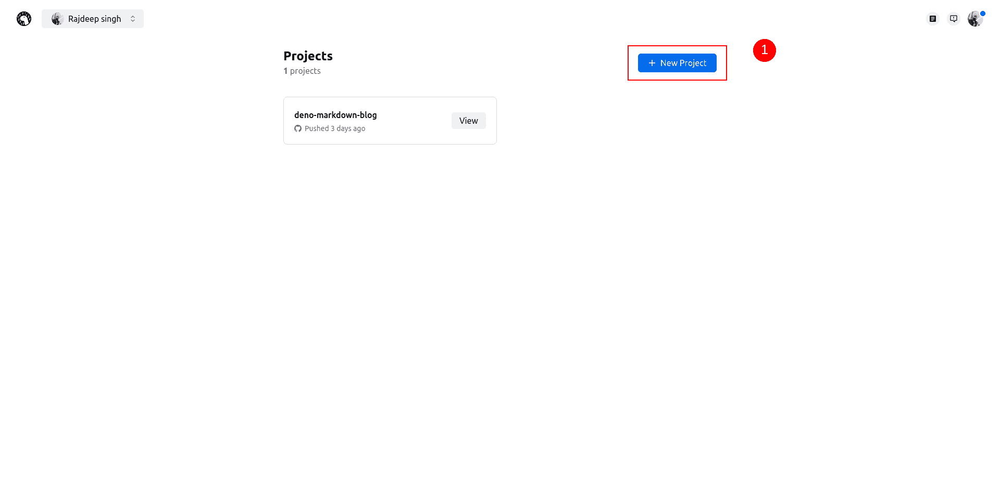

Create a new project with deno deploy

### 配置 GitHub 存储库和环境变量

点击**新建项目**按钮后，您将被重定向到项目配置页面。您的项目页面将如下所示。请填写所有细节:

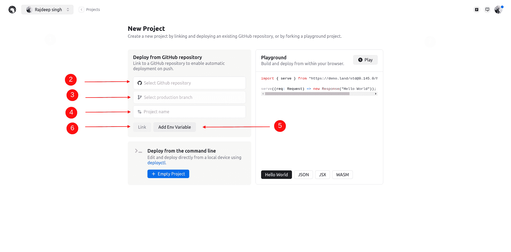

Fill out your new project configuration and link to GitHub

第一次点击 GitHub 按钮。之后，Deno 部署并请求 GitHub 帐户的许可。授予所有权限后，您的项目页面如下所示:

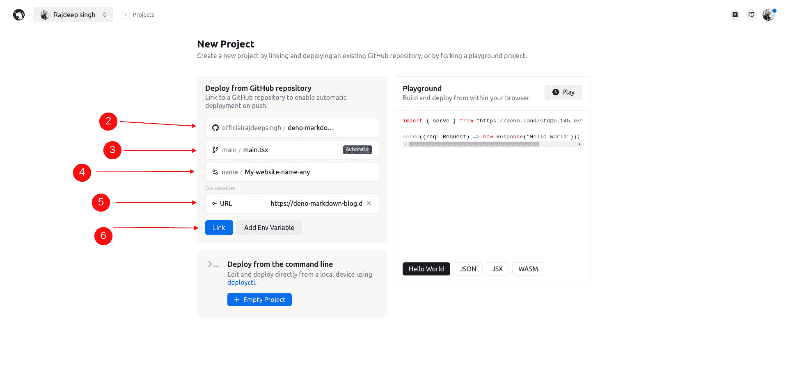

After finishing the information

1.  打开项目页面后，填写所有必需的信息。
2.  然后，在第二步中，选择 GitHub 存储库。
3.  选择 GitHub 存储库后，选择一个分支，然后选择`main.tsx`文件。
4.  给出任何项目名称，但确保您的名称是小写字母-例如，我的新网站。否则，你会得到一个大写错误。
5.  单击环境变量并添加一个环境(如果您有一个环境——否则，跳过它)。

就这样——您已经成功地完成了所有的配置。现在点击链接按钮。

### 部署完成

部署完成后，您将看到网站仪表板。单击“查看”按钮，查看您的生产就绪网站。

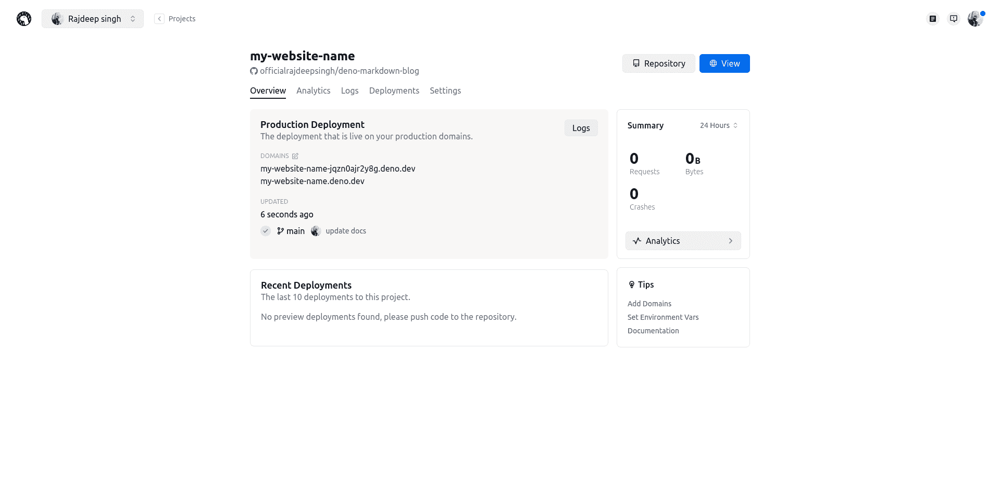

Your website dashboard with deno looks like this after successful website deployment.

这里有一个技巧可以帮助你管理所有的减价文件，并加快你的书面工作。VS Code 代码编辑器有一个免费开源的 [FrontMatter VS 代码扩展](https://frontmatter.codes/)。这是一个很好的工具，可以用 FrontMatter 仪表板管理 VS 代码中的所有 markdown 文件。

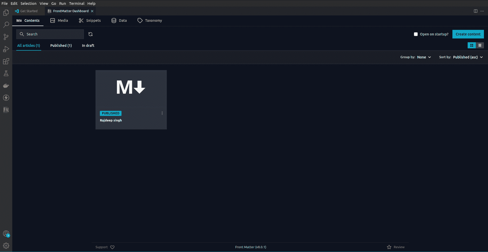

Manage markdown files with VS Code extension

## 结论

Deno blog 模块是一个优秀的库，可以在五分钟内创建个人博客并使用 Deno 部署它。Deno 部署速度很快。不到十秒钟。

我认为 Deno 博客模块最适合个人使用，因为你不需要定制很多东西。您只需自定义页眉、页脚和各个部分。

感谢您的阅读！

### 帮助您创建博客的参考资料:

*   [https://deno.land/](https://deno.land/)
*   [https://deno.com/deploy](https://deno.com/deploy)
*   [https://deno.land/x/blog](https://deno.land/x/blog@0.5.0)
*   [https://deno.land/x/dotenv](https://deno.land/x/dotenv)
*   [https://front matter . codes/](https://frontmatter.codes/)

* * *