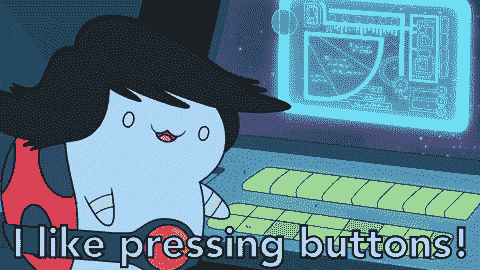

# 如何创建按钮 UI 工具包

> 原文：<https://www.freecodecamp.org/news/how-to-create-a-buttons-ui-kit-fdd354ee0815/>

[每周编码挑战](https://www.florin-pop.com/blog/2019/03/weekly-coding-challenge/)第 6 周的**主题**是:

### 小跟班

“一个按钮？?"你可能会问…是的！一个按钮！？

“但是为什么呢？”

因为按钮是任何网站/web 应用程序的组成部分之一。无论你是在脸书、推特还是谷歌等网站上，你总能找到一个按钮，让你以某种方式与应用程序互动。所以本周我们要制作按钮——很多按钮！

如果你想参加挑战，可以随意构建任何种类的按钮: **3D 按钮**，带**涟漪效果的按钮**，**动画**按钮等等——前途无量？。有创意！你知道我有多重视创意！？



在本文中，我们将构建多个按钮，并将它们全部放在一个[按钮 UI 套件](https://codepen.io/FlorinPop17/full/MRbOMJ)中:

在我们进入实现部分之前，让我们看看按钮可能处于的不同状态:

1.  **默认**状态
2.  **悬停**状态——当鼠标在按钮上时
3.  **激活**状态——按下按钮时
4.  **焦点**状态——按钮高亮显示时。允许在接受键盘事件的元素上使用。这是用来给那些只使用键盘的用户在浏览应用程序时一些指导。
5.  **禁用**状态

我们需要设计按钮的样式来覆盖所有这些状态。

此外，我们将有三种不同的按钮类型:`primary`、`secondary`和`tertiary`，以及两种额外的尺寸:`large`和`small`。

### HTML

```
<div>
    <h4>Primary</h4>
    <button class="btn btn-primary">Default</button>
    <button class="btn btn-primary btn-hover">Hover</button>
    <button class="btn btn-primary" disabled>Disabled</button>
    <button class="btn btn-primary btn-large">Large</button>
    <button class="btn btn-primary btn-small">Small</button>

    <h4>Secondary</h4>
    <button class="btn btn-secondary">Default</button>
    <button class="btn btn-secondary btn-hover">Hover</button>
    <button class="btn btn-secondary" disabled>Disabled</button>
    <button class="btn btn-secondary btn-large">Large</button>
    <button class="btn btn-secondary btn-small">Small</button>

    <h4>Tertiary</h4>
    <button class="btn btn-tertiary">Default</button>
    <button class="btn btn-tertiary btn-hover">Hover</button>
    <button class="btn btn-tertiary" disabled>Disabled</button>
    <button class="btn btn-tertiary btn-large">Large</button>
    <button class="btn btn-tertiary btn-small">Small</button>
</div>
```

我们使用类来区分不同类型的按钮。

### CSS

是我们所有按钮使用的主类:

```
.btn {
    border-radius: 2px;
    border: 1px solid;
    color: #ffffff;
    cursor: pointer;
    font-family: 'Open Sans', sans-serif;
    font-size: 14px;
    padding: 8px 24px;
}
```

☝️一些通用的样式，使它看起来比默认版本更好。？

接下来，我们有不同的状态:

```
.btn-hover,
.btn:hover {
    opacity: 0.9;
}

.btn:disabled {
    background-color: transparent;
    cursor: not-allowed;
    opacity: 0.7;
}

.btn:active {
    opacity: 1;
}

.btn:focus {
    outline: 0;
}
```

为了在状态之间有所区别，我们可以使用`opacity`属性。

最初，按钮有`opacity: 1`，当我们悬停在按钮上时，我们稍微减小`opacity`，然后当按钮是`disabled`时，再稍微减小一点。当我们点击按钮时，我们将不透明度设置回 1，因为它给出了一个很好的效果。

对于`focus`状态，我们移除了默认的`outline`属性，我们将添加一个`box-shadow`属性，但是我们将为每种按钮类型分别做这件事，因为颜色根据类的不同而变化(见下文)。

单独的颜色被设置为`.btn-primary`、`.btn-secondary`和`.btn-tertiary`等级:

```
.btn-primary {
    border-color: var(--primary-color);
    background-color: var(--primary-color);
}

.btn-primary:disabled {
    color: var(--primary-color);
}

.btn-primary:focus {
    box-shadow: 0 0 5px var(--primary-color);
}

.btn-secondary {
    border-color: var(--secondary-color);
    background-color: var(--secondary-color);
}

.btn-secondary:disabled {
    color: var(--secondary-color);
}

.btn-secondary:focus {
    box-shadow: 0 0 5px var(--secondary-color);
}

.btn-tertiary {
    border-color: var(--tertiary-color);
    background-color: var(--tertiary-color);
}

.btn-tertiary:disabled {
    color: var(--tertiary-color);
}

.btn-tertiary:focus {
    box-shadow: 0 0 5px var(--tertiary-color);
}
```

正如你所看到的，我们使用了 CSS 变量[和](https://www.w3schools.com/css/css3_variables.asp)方法来为不同的属性设置相同的颜色。但是要做到这一点，我们需要在`:root`上声明颜色变量如下:

```
:root {
    --primary-color: #3457dc;
    --secondary-color: #ea4d67;
    --tertiary-color: #ea674d;
}
```

注意，在 css 文件的顶部添加`:root`声明是一个好习惯。

最后，让我们添加两个额外的尺寸；`.btn-large`和`.btn-small`类:

```
.btn-large {
    font-size: 16px;
    padding: 12px 36px;
}

.btn-small {
    font-size: 12px;
    padding: 4px 12px;
}
```

### 结论

看看创建一个*按钮 UI 套件*有多简单？？

作为**的额外特性**，你可以通过 **JavaScript** 给按钮添加一个`ripple effect`。我在之前的一篇文章中已经这么做了——你可以点击[这里](https://www.florin-pop.com/blog/2017/09/button-ripple-effect)查看一下！

我希望你喜欢这个挑战，我迫不及待地想看看你要创造什么！

编码快乐！？

*最初发表于[www.florin-pop.com](https://www.florin-pop.com/blog/2019/04/buttons-ui-kit/)。*