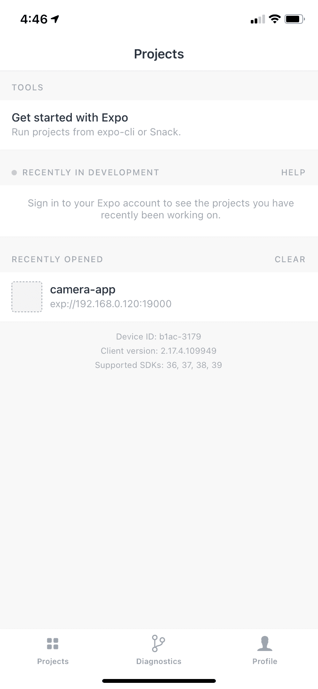
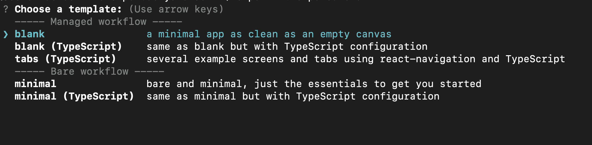
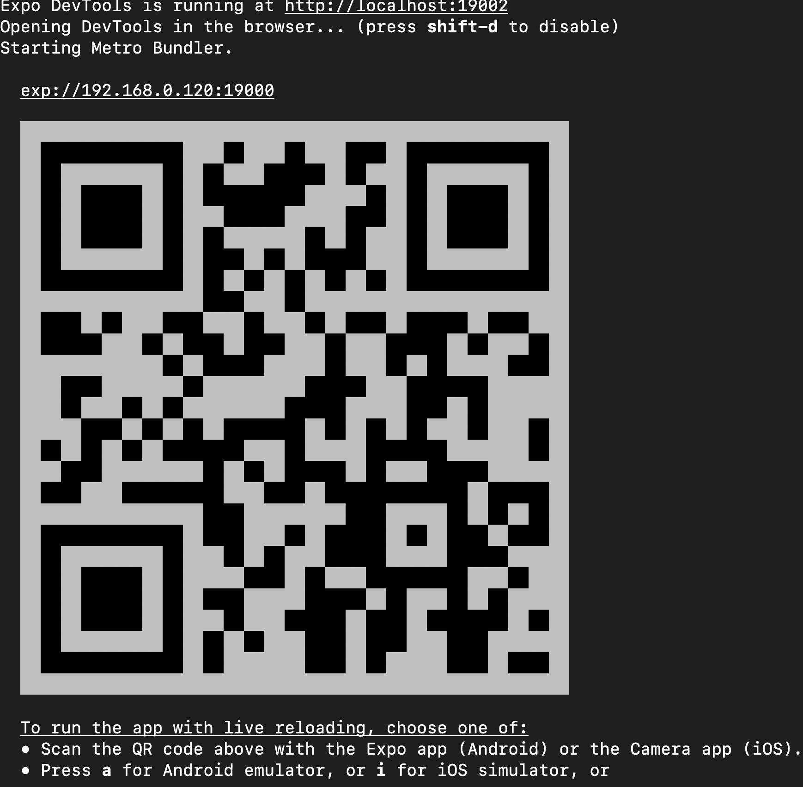
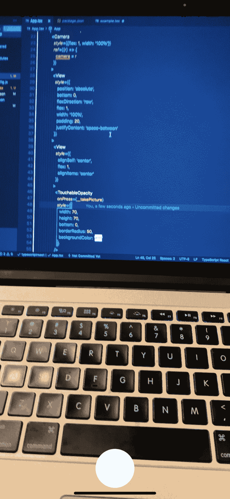
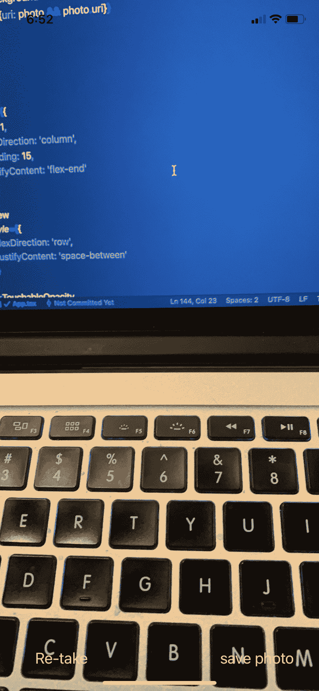
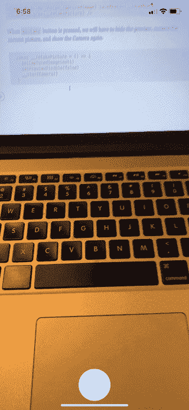
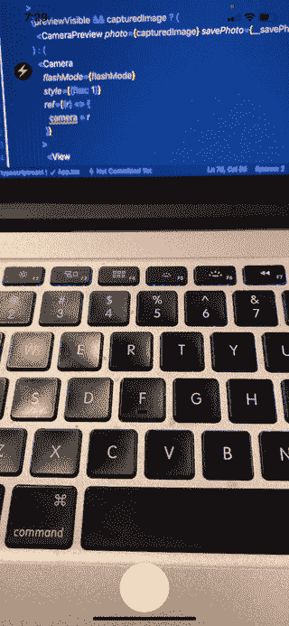
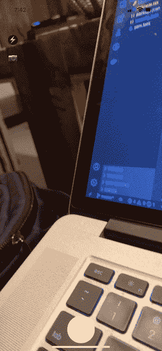

# 如何使用 Expo 和 React Native 创建相机应用程序

> 原文：<https://www.freecodecamp.org/news/how-to-create-a-camera-app-with-expo-and-react-native/>

如果您不熟悉 [expo](https://expo.io/) ，它是一个帮助您以更低的构建复杂度构建 React 原生应用的客户端。它还可以帮助您处理安装和设置环境以运行 React Native 的压力。

在本教程中，我们将构建一个简单的相机应用程序，用户可以在其中拍照，预览照片，使用闪光灯模式，并在前后摄像头之间切换。

## 先决条件

Expo 不需要太多就可以开始构建你的第一个 React 原生应用。你可以在文档中了解更多关于安装 [expo 和 expo-cli 的信息。](https://docs.expo.io/get-started/installation/)

注意:在本教程中，我将使用 macOS 和 iOS。你也可以使用 Android，在这一点上使用 expo 没有太大区别。

您可以通过运行以下命令来全局安装 expo 和 expo-cli:

```
npm install --global expo-cli
```

世博会需要[节点](https://nodejs.org/en/)才能运行。你可以在官网[这里](https://nodejs.org/en/)运行最新版本。

## 入门指南

安装完 Expo 和 Nodejs 之后，可以使用下面的命令启动一个新的 Expo 项目:

```
expo init expo-camera-app
```

### 如何安装软件包和运行应用程序

Expo 为我们提供了一个客户端应用程序，我们可以运行并查看我们正在构建的应用程序的预览。在[应用商店](https://apps.apple.com/us/app/expo-client/id982107779)和 [Google Play](https://play.google.com/store/apps/details?id=host.exp.exponent) 都可以下载。

这是 app 的界面。



### 如何启动世博项目

转到应用程序目录并运行应用程序。

```
cd expo-camera-app 
```

您将被询问几个问题来选择应用程序的默认模板。在本教程中，我们简单地选择一个空白(TypeScript)选项，但是您可以自由选择适合您的选项。



### 运行应用程序

启动项目后，我们可以使用`expo run`运行应用程序



这将在您的浏览器中打开一个窗口，您可以在其中查看日志。它还会生成一个二维码，你可以扫描这个二维码，在你的设备上运行这个应用程序。

expo 的好处是您不需要安装和配置模拟器来运行应用程序。它仍然给你在模拟器上运行 expo 的选项，但是你必须自己安装和配置模拟器。

回到我们的应用程序。假设您已在设备上成功运行该应用程序，这将是默认屏幕:


在您喜欢的代码编辑器中打开应用程序目录。我用的是 [VS 代码](https://code.visualstudio.com/)。

`App.tsx`将看起来像这样:

```
import {StatusBar} from 'expo-status-bar'
import React from 'react'
import {StyleSheet, Text, View} from 'react-native'

export default function App() {
  return (
    <View style={styles.container}>
      <Text>Open up App.tsx to start working on your app!</Text>
      <StatusBar style="auto" />
    </View>
  )
}

const styles = StyleSheet.create({
  container: {
    flex: 1,
    backgroundColor: '#fff',
    alignItems: 'center',
    justifyContent: 'center'
  }
}) 
```

## 如何创建用户界面

项目运行之后，现在是时候开始创建一些 UI 了。

### 安装世博摄像机

下一步是安装[曝光摄像机](https://docs.expo.io/versions/latest/sdk/camera/)，像这样:

```
expo install expo-camera
```

我们将创建一个简单的用户界面，允许用户开始使用相机的过程。


```
import {StatusBar} from 'expo-status-bar'
import React from 'react'
import {StyleSheet, Text, View, TouchableOpacity} from 'react-native'

export default function App() {
  return (
    <View style={styles.container}>
      <View
        style={{
          flex: 1,
          backgroundColor: '#fff',
          justifyContent: 'center',
          alignItems: 'center'
        }}
      >
        <TouchableOpacity
          style={{
            width: 130,
            borderRadius: 4,
            backgroundColor: '#14274e',
            flexDirection: 'row',
            justifyContent: 'center',
            alignItems: 'center',
            height: 40
          }}
        >
          <Text
            style={{
              color: '#fff',
              fontWeight: 'bold',
              textAlign: 'center'
            }}
          >
            Take picture
          </Text>
        </TouchableOpacity>
      </View>

      <StatusBar style="auto" />
    </View>
  )
}

const styles = StyleSheet.create({
  container: {
    flex: 1,
    backgroundColor: '#fff',
    alignItems: 'center',
    justifyContent: 'center'
  }
}) 
```

这是一个简单的 UI:我们为按钮导入`TouchableOpacity`并做一些简单的样式。如果您想知道 React Native 中的样式是如何工作的，您可以在这里查看我的两篇文章:

*   [React Native 中的造型](https://blog.bitsrc.io/styling-in-react-native-c48caddfbe47)
*   [揭开 React Native 中 Flexbox 的神秘面纱](https://blog.bitsrc.io/demystifying-flexbox-in-react-native-4b62979fa9ea)

现在我们必须使用一个`useState`钩子来管理状态，并在用户按下**拍照**按钮时显示相机视图。

```
 <TouchableOpacity
        onPress={__startCamera}
          style={{
            width: 130,
            borderRadius: 4,
            backgroundColor: '#14274e',
            flexDirection: 'row',
            justifyContent: 'center',
            alignItems: 'center',
            height: 40
          }}
        >
          <Text
            style={{
              color: '#fff',
              fontWeight: 'bold',
              textAlign: 'center'
            }}
          >
            Take picture
          </Text>
        </TouchableOpacity>
```

```
 const [startCamera,setStartCamera] = React.useState(false)

const __startCamera = ()=>{

}
```

当用户按下按钮时，我们必须做两件重要的事情:

*   请求允许进入摄像头。在移动开发中，访问许多本地 API 和移动特性通常受到用户权限和隐私的限制。这只是你在开发移动应用程序时必须习惯的事情。
*   改变状态，呈现相机。

让我们用这个命令从`expo-camera`导入摄像头模块:

```
import {Camera} from 'expo-camera'
```

并添加摄像机视图，就像这样:

```
 <Camera
    style={{flex: 1,width:"100%"}}
    ref={(r) => {
    camera = r
    }}
    ></Camera>
```

我们可以使用`ref`来访问摄像机的方法:

```
let camera: Camera
```

当按下`take picture`按钮时，将调用`__startCamera`功能:

```
 const __startCamera = async () => {
    const {status} = await Camera.requestPermissionsAsync()
 if(status === 'granted'){
   // do something

 }else{
   Alert.alert("Access denied")
 }
```

该函数将首先请求许可。如果用户允许访问摄像机，我们可以继续并打开摄像机。如果没有，我们显示一个简单的警告。

### 添加相机组件

让我们在用户授权访问设备的摄像头时显示摄像头。

```
 const __startCamera = async () => {
    const {status} = await Camera.requestPermissionsAsync()
    if (status === 'granted') {
      // start the camera
      setStartCamera(true)
    } else {
      Alert.alert('Access denied')
    }
  }
```

我们必须对 UI 进行一些更改，并添加一个条件渲染。我们只在用户请求时显示摄像机，否则我们显示默认屏幕。

```
 {startCamera ? (
        <Camera
          style={{flex: 1,width:"100%"}}
          ref={(r) => {
            camera = r
          }}
        ></Camera>
      ) : (
        <View
          style={{
            flex: 1,
            backgroundColor: '#fff',
            justifyContent: 'center',
            alignItems: 'center'
          }}
        >
          <TouchableOpacity
            onPress={__startCamera}
            style={{
              width: 130,
              borderRadius: 4,
              backgroundColor: '#14274e',
              flexDirection: 'row',
              justifyContent: 'center',
              alignItems: 'center',
              height: 40
            }}
          >
            <Text
              style={{
                color: '#fff',
                fontWeight: 'bold',
                textAlign: 'center'
              }}
            >
              Take picture
            </Text>
          </TouchableOpacity>
        </View>
      )}
```


酷，现在我们需要添加一个按钮，以便我们可以采取实际的图片。

### 添加“捕捉”按钮



这是一个简单的`View`在相机视图中有一个绝对位置。所以我们确保它总是在摄像机的顶部。

```
 <View
        style={{
        position: 'absolute',
        bottom: 0,
        flexDirection: 'row',
        flex: 1,
        width: '100%',
        padding: 20,
        justifyContent: 'space-between'
        }}
      >
        <View
        style={{
        alignSelf: 'center',
        flex: 1,
        alignItems: 'center'
        }}
        >
            <TouchableOpacity
            onPress={__takePicture}
            style={{
            width: 70,
            height: 70,
            bottom: 0,
            borderRadius: 50,
            backgroundColor: '#fff'
            }}
            />
    </View>
    </View>
```

### 如何拍照

该应用程序应采取一张照片时，捕捉按钮被按下。该函数如下所示:

```
 const __takePicture = async () => {
    if (!camera) return
    const photo = await camera.takePictureAsync()

  }
```

首先，我们使用`ref`检查我们是否可以访问`Camera`组件:

```
 if (!camera) return
  // if the camera is undefined or null, we stop the function execution
```

然后我们通过调用`takePictureAsync`方法来拍照。它返回一个承诺和一个包含图片细节的对象。结果将如下所示:

```
Object {
  "height": 4224,
  "uri": "file:///var/mobile/Containers/Data/Application/E6740A15-93AF-4120-BF11-6E8B74AFBF93/Library/Caches/ExponentExperienceData/%2540anonymous%252Fcamera-app-ee0fa3c8-1bb1-4d62-9863-33bf26341c55/Camera/19F0C5DD-7CA6-4043-8D89-AF65A1055C7E.jpg",
  "width": 1952,
}
```

我们只对图片网址`uri`感兴趣。在我们拍照后，我们必须显示照片预览并隐藏相机视图。为此，我们将使用两个钩子来改变状态:

```
 const [previewVisible, setPreviewVisible] = useState(false)
  const [capturedImage, setCapturedImage] = useState<any>(null)
```

```
 const __takePicture = async () => {
    if (!camera) return
    const photo = await camera.takePictureAsync()
    console.log(photo)
    setPreviewVisible(true)
    setCapturedImage(photo)
  }
```

*   `setPreviewVisible`显示预览
*   `setCapturedImage(photo)`存储对象结果

然后我们像这样显示预览:

```
 {previewVisible && capturedImage ? (
            <CameraPreview photo={capturedImage} />
          ) : (
            <Camera
              style={{flex: 1}}
              ref={(r) => {
                camera = r
              }}
            >
              <View
                style={{
                  flex: 1,
                  width: '100%',
                  backgroundColor: 'transparent',
                  flexDirection: 'row'
                }}
              >
                <View
                  style={{
                    position: 'absolute',
                    bottom: 0,
                    flexDirection: 'row',
                    flex: 1,
                    width: '100%',
                    padding: 20,
                    justifyContent: 'space-between'
                  }}
                >
                  <View
                    style={{
                      alignSelf: 'center',
                      flex: 1,
                      alignItems: 'center'
                    }}
                  >
                    <TouchableOpacity
                      onPress={__takePicture}
                      style={{
                        width: 70,
                        height: 70,
                        bottom: 0,
                        borderRadius: 50,
                        backgroundColor: '#fff'
                      }}
                    />
                  </View>
                </View>
              </View>
            </Camera>
          )}
```

`CameraPreview`组件看起来像这样:

```
const CameraPreview = ({photo}: any) => {
  console.log('sdsfds', photo)
  return (
    <View
      style={{
        backgroundColor: 'transparent',
        flex: 1,
        width: '100%',
        height: '100%'
      }}
    >
      <ImageBackground
        source={{uri: photo && photo.uri}}
        style={{
          flex: 1
        }}
      />
    </View>
  )
}
```

结果是这样的:


### 如何重新拍照

我们可以在预览中添加一些按钮，允许用户执行更多的操作。例如，他们可以重新拍摄或保存照片。



向`CameraPreview`组件添加`savePhoto`和`retakePicture`道具，如下所示:

```
<CameraPreview photo={capturedImage} savePhoto={__savePhoto} retakePicture={__retakePicture} />
```

当按下`Re-take`按钮时，我们将不得不隐藏预览，移除当前图片，并再次显示相机。用下面的代码来实现:

```
 const __retakePicture = () => {
    setCapturedImage(null)
    setPreviewVisible(false)
    __startCamera()
  }
```



## 如何添加其他选项–后置摄像头、闪光灯等

expo-camra 提供了许多定制相机的选项，如闪光模式、设置相机类型(前/后)、变焦等。

### 如何添加 FlashMode

让我们添加一个选项，以便用户可以打开和关闭 FlashMode:



我们只需创建一个小按钮来关闭/打开闪光灯，就像这样:

```
 <TouchableOpacity
            onPress={__handleFlashMode}
            style={{
            position: 'absolute',
            left: '5%',
            top: '10%',
            backgroundColor: flashMode === 'off' ? '#000' : '#fff',
            borderRadius: '50%',
            height: 25,
            width: 25
        }}
        >
            <Text
                style={{
                fontSize: 20
                }}
            >
            ⚡️
            </Text>
        </TouchableOpacity>
```

当按钮被按下时，我们只是改变状态:

```
 const [flashMode, setFlashMode] = React.useState('off')

   const __handleFlashMode = () => {
    if (flashMode === 'on') {
      setFlashMode('off')
    } else if (flashMode === 'off') {
      setFlashMode('on')
    } else {
      setFlashMode('auto')
    }

  }
```

然后我们添加了 FlashMode 道具:

```
 <Camera
    flashMode={flashMode}
    style={{flex: 1}}
    ref={(r) => {
    camera = r
    }}
    ></Camera>
```

### 如何访问前置和后置摄像头

我们将添加一个在前后摄像头之间切换的按钮。

我们可以直接从相机模块中获取默认的相机类型，如下所示:

```
 const [cameraType, setCameraType] = React.useState(Camera.Constants.Type.back)
```

添加`type`这样的道具:

```
 <Camera
    type={cameraType}
    flashMode={flashMode}
    style={{flex: 1}}
    ref={(r) => {
    camera = r
    }}
    ></Camera>
```

并添加开关按钮:

```
<TouchableOpacity
    onPress={__switchCamera}
    style={{
    marginTop: 20,
    borderRadius: '50%',
    height: 25,
    width: 25
    }}
   >
       <Text
           style={{
           fontSize: 20
           }}
           >
       {cameraType === 'front' ? '?' : '?'}
       </Text>
</TouchableOpacity>
```

和开关功能:

```
 const __switchCamera = () => {
    if (cameraType === 'back') {
      setCameraType('front')
    } else {
      setCameraType('back')
    }
  }
```

结果如下:



你可以在 [GitHub](https://github.com/hayanisaid/expo-camera-tutorial/tree/master) 找到完整的源代码。

## 包扎

总的来说，Expo 是一个神奇的工具，可以节省你很多时间。它帮助您直接开始构建，并省去环境设置的麻烦。

有时，您可能希望构建一个本机扩展，并以自己的方式处理本机特性的使用。在这种情况下，我建议使用 [react-native](https://github.com/react-native-community/cli) CLI，这样您就可以轻松地修改和使用本机代码。

> 嗨，我叫赛义德·哈亚尼。我创建了 [subscribi.io](https://subscribi.io/) 来帮助创作者、博客作者和有影响力的人通过时事通讯增加他们的受众。

如果你有兴趣阅读更多关于 React Native 的内容，请加入我的邮件列表。