# 如何使用 EF Core 在 Blazor 中创建级联 DropDownList

> 原文：<https://www.freecodecamp.org/news/how-to-create-a-cascading-dropdownlist-in-blazor-using-ef-core-d230bb5bff5f/>

### 介绍

在本文中，我们将使用实体框架核心数据库优先的方法在 Blazor 中创建一个级联下拉列表。我们将创建两个下拉列表— **国家**和**城市**。从国家下拉列表中选择值后，我们将更改城市下拉列表的值。

我们将使用 Visual Studio 2017 和 SQL Server 2014。

让我们来看看最终的产品。

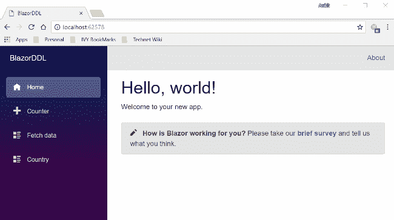

### 先决条件

*   安装。NET Core 2.1 预览版 2 SDK 从[这里](https://www.microsoft.com/net/download/dotnet-core/sdk-2.1.300-preview2)
*   从此处[安装 Visual Studio 2017 v15.7 或以上版本](https://www.visualstudio.com/downloads/)
*   从[这里](https://marketplace.visualstudio.com/items?itemName=aspnet.blazor)安装 ASP.NET 核心 Blazor 语言服务扩展
*   SQL Server 2008 或以上版本

低于 Visual Studio 2017 v15.7 的版本不支持 Blazor 框架。

### 源代码

在继续之前，我建议您从 [GitHub](https://github.com/AnkitSharma-007/Blazor-CascadingDDL-EFCore) 获取源代码。

### 创建表格

我们将使用两个表来存储我们的数据。

1.  国家:用于存储国家的名称。它包含两个字段— CountryId 和 CountryName。
2.  城市:这包含我们将在国家表中插入的国家的城市列表。它包含三个字段-城市 Id、国家 Id 和城市名称。CountryId 列是引用 Country 表中 CountryId 的外键。

执行以下命令创建两个表:

```
CREATE TABLE Country(CountryId VARCHAR(5) PRIMARY KEY,CountryName VARCHAR(20) NOT NULL)GOCREATE TABLE Cities(CityId VARCHAR(5) PRIMARY KEY,CountryId VARCHAR(5) FOREIGN KEY REFERENCES Country(CountryId),CityName VARCHAR(20) NOT NULL)GO
```

现在，我们将在两个表中放入一些数据。打开 Country 表并执行以下 insert 语句。

```
INSERT INTO Country VALUES ('C1', 'India')INSERT INTO Country VALUES ('C2', 'China')INSERT INTO Country VALUES ('C3', 'USA')
```

然后执行以下 insert 语句，将数据插入到 Cities 表中。

```
INSERT INTO Cities VALUES ('P1','C1','New Delhi')INSERT INTO Cities VALUES ('P2','C1','Mumbai')INSERT INTO Cities VALUES ('P3','C1','Chennai')INSERT INTO Cities VALUES ('P4','C1','Hyderabad')INSERT INTO Cities VALUES ('P5','C1','Bengaluru')INSERT INTO Cities VALUES ('P6','C2','Beijing')INSERT INTO Cities VALUES ('P7','C2','Shanghai')INSERT INTO Cities VALUES ('P8','C2','Hong Kong')INSERT INTO Cities VALUES ('P9','C2','Macau')INSERT INTO Cities VALUES ('P10','C3','New York')INSERT INTO Cities VALUES ('P11','C3','Chicago')INSERT INTO Cities VALUES ('P12','C3','Las Vegas')
```

### 创建 Blazor Web 应用程序

打开 Visual Studio 并选择文件>>新建>>项目。

选择项目后，将会打开一个“新项目”对话框。选择。NET Core 内的 Visual C#菜单从左侧面板。然后，选择“ASP。NET Core Web Application”从可用的项目类型。将项目命名为“BlazorDDL”*并按 OK。*

*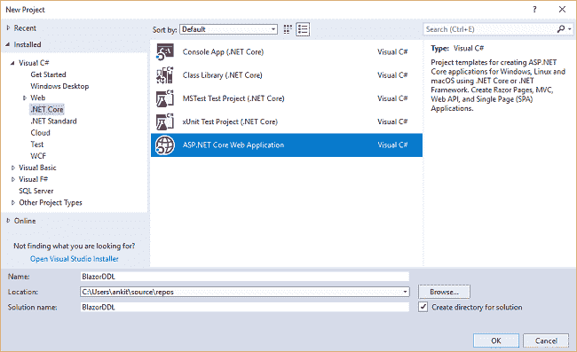*

*单击 OK 后，将打开一个新对话框，要求您选择项目模板。您可以在模板窗口的左上角看到两个下拉菜单。选择”。NET Core”和“ASP。NET Core 2.0”。然后，选择“Blazor (ASP。NET Core hosted)”模板，然后按确定。*

*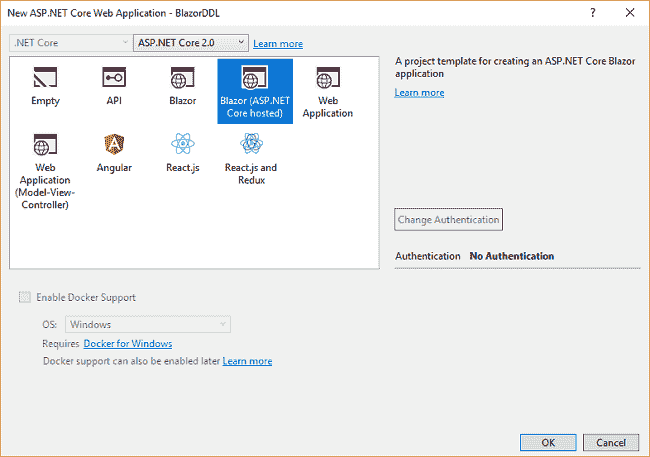*

*现在，我们的 Blazor 解决方案将被创建。您可以在解决方案资源管理器中看到文件夹结构，如下图所示。*

*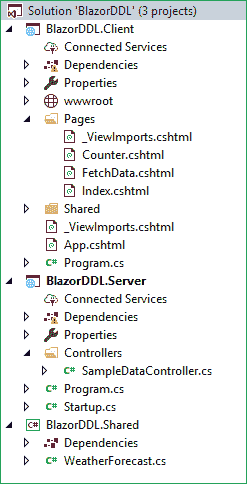*

*您可以看到，我们在这个解决方案中创建了三个项目文件。*

1.  *BlazorDDL。Client:它有客户端代码，包含将在浏览器上呈现的页面。*
2.  *BlazorDDL。服务器:有服务器端代码，比如 DB 相关操作和 web API。*
3.  *BlazorDDL。Shared:它包含客户机和服务器都可以访问的共享代码。*

### *将模型搭建到应用程序*

*我们使用实体框架核心数据库优先的方法来创建我们的模型。我们将在“BlazorDDL”中创建我们的模型类。共享”项目，以便客户端和服务器项目都可以访问它。*

*导航到工具>>获取软件包管理器>>软件包管理器控制台。选择“BlazorDDL。共享”。请参考下图:*

*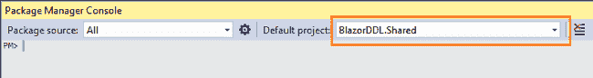*

*首先，我们将为我们的目标数据库提供者安装这个包，在这个例子中是 SQL Server。运行以下命令:*

```
*`Install-Package Microsoft.EntityFrameworkCore.SqlServer`*
```

*因为我们使用实体框架工具从现有的数据库中创建一个模型，所以我们也将安装工具包。运行以下命令:*

```
*`Install-Package Microsoft.EntityFrameworkCore.Tools`*
```

*在您安装了这两个包之后，我们将使用以下命令从数据库表中构建我们的模型:*

```
*`Scaffold-DbContext "Your connection string here" Microsoft.EntityFrameworkCore.SqlServer -OutputDir Models -Tables Country, Cities`*
```

*不要忘记放入您自己的连接字符串(在" ")中。成功执行该命令后，您可以看到已经创建了一个 Models 文件夹，其中包含三个类文件:“myTestDBContext.cs”、“T0”、“T1”cities . cs”和“Country.cs”。因此，我们使用 EF 核心数据库优先方法成功搭建了我们的模型。*

*此时，Models 文件夹将具有以下结构。*

*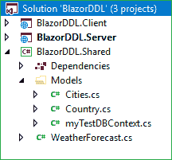*

### *为应用程序创建数据访问层*

*右键单击“BlazorDDL。服务器”项目，然后选择添加>>新文件夹，并将文件夹命名为“DataAccess”。我们将添加我们的类来处理这个文件夹中与数据库相关的操作。*

*右键单击“数据访问”文件夹并选择添加>>类。将您的类命名为“DataAccessCl *ass* 。cs”。这个类将处理我们的数据库相关的操作。*

*打开“dataaccesslayer . cs”*，将以下代码放入其中。**

```
**`using BlazorDDL.Shared.Models;using System;using System.Collections.Generic;using System.Linq;using System.Threading.Tasks;namespace BlazorDDL.Server.DataAcces{    public class DataAccessLayer    {        myTestDBContext db = new myTestDBContext();        public IEnumerable<Country> GetAllCountries()        {            try            {                return db.Country.ToList();            }            catch            {                throw;            }        }        public IEnumerable<Cities> GetCityData(string id)        {            try            {                List<Cities> lstCity = new List<Cities>();                lstCity = (from CityName in db.Cities where CityName.CountryId == id select CityName).ToList();                return lstCity;            }            catch            {                throw;            }        }    }}`**
```

**这里我们定义了两种方法:**

1.  **GetAllCountries:它将从 country 表中获取所有国家的数据。**
2.  **GetCityData:它将获取与提供给它的国家 id 相对应的城市数据。**

**现在我们的数据访问层完成了。我们将继续创建我们的 web API 控制器。**

### **向应用程序添加 web API 控制器**

**右键单击“BlazorDDL。服务器/控制器”文件夹，并选择添加>>新项目。将会打开“添加新项目”对话框。选择“ASP。NET”，然后从模板面板中选择“API 控制器类”并将其命名为“CountriesController.cs”。按添加。**

**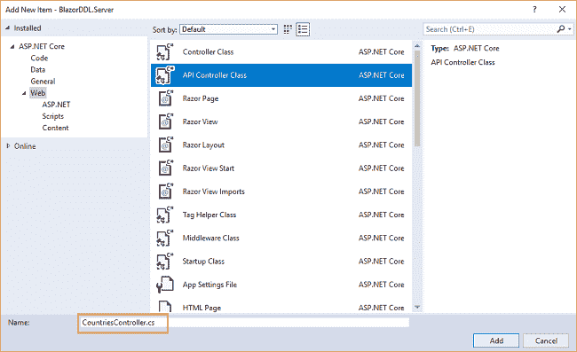**

**这将创建我们的 API“countries controller”类。**

**我们将调用“DataAccessLayer”类的方法来获取数据并将数据传递给客户端。**

**打开“countries controller . cs”*文件，将以下代码放入其中。***

```
***`using System;using System.Collections.Generic;using System.Linq;using System.Threading.Tasks;using BlazorDDL.Server.DataAcces;using BlazorDDL.Shared.Models;using Microsoft.AspNetCore.Mvc;using Microsoft.AspNetCore.Http;namespace BlazorDDL.Server.Controllers{    public class CountriesController : Controller    {        DataAccessLayer objCountry= new DataAccessLayer();        [HttpGet]        [Route("api/Countries/GetCountryList")]        public IEnumerable<Country> GetCountryList()        {            return objCountry.GetAllCountries();        }        [HttpGet]        [Route("api/Countries/GetCities/{id}")]        public IEnumerable<Cities> GetCities(string id)        {            return objCountry.GetCityData(id);        }    }}`***
```

***此时此刻我们的 BlazorDDL。服务器项目具有以下结构。***

***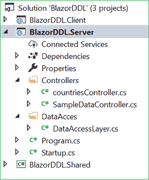***

***我们已经完成了后端逻辑。因此，我们现在开始编写客户端代码。***

### ***向应用程序添加 Razor 视图***

***右键单击“BlazorDDL。客户端/页面" *s* 文件夹然后选择>添加>新项。将会打开“添加新项目”对话框。从左侧面板中选择 Web，然后从模板面板中选择“Razor View”并将其命名为“CountryData.c *s* html”。***

**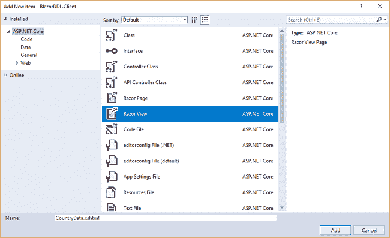**

**这将为我们的“BlazorDDL”添加一个“country data . cs html”*页面。客户端/页面”文件夹。***

***打开“country data . cs html”*页面，将以下代码放入其中。****

```
***`@using BlazorDDL.Shared.Models@page "/country"@inject HttpClient Http<h1>Country Data</h1><p>This component demonstrates cascading dropdownlist using EntityFrameWork Core</p><hr />@if (countryList == null){    <p><em>Loading...</em></p>}else{    <div class="row">        <div class="col-md-4">            <label for="Country" class="control-label">Country</label>        </div>        <div class="col-md-4">            <label asp-for="Cities" class="control-label">Cities</label>        </div>    </div>    <div class="row" style="padding-top:10px">        <div class="col-md-4">            <select class="form-control" onchange="@CountryClicked">                <option value="">-- Select Country --</option>                @foreach (var country in countryList)                {                    <option value="@country.CountryId">@country.CountryName</option>                }            </select>        </div>        <div class="col-md-4">            <select class="form-control" onchange="@CityClicked">                <option value="">-- Select City --</option>                @if (cityList != null)                {                    @foreach (var city in cityList)                    {                        <option value="@city.CityName">@city.CityName</option>                    }                }            </select>        </div>    </div>    <div class="row" style="padding-top:50px">        <div class="col-md-4">            <label class="control-label">Country Name: @countryName</label>        </div>        <div class="col-md-4">            <label class="control-label">City Name: @cityName</label>        </div>    </div>}@functions {List<Country> countryList = new List<Country>();List<Cities> cityList = new List<Cities>();string countryId { get; set; }string countryName { get; set; }string cityName { get; set; }protected override async Task OnInitAsync(){    countryList = await Http.GetJsonAsync<List<Country>>("api/Countries/GetCountryList");}protected async void CountryClicked(UIChangeEventArgs countryEvent){    cityList.Clear();    cityName = string.Empty;    countryId = countryEvent.Value.ToString();    countryName = countryList.FirstOrDefault(s => s.CountryId == countryId).CountryName;    cityList = await Http.GetJsonAsync<List<Cities>>("api/Countries/GetCities/" + countryId);    this.StateHasChanged();}void CityClicked(UIChangeEventArgs cityEvent){    cityName = cityEvent.Value.ToString();    this.StateHasChanged();}}`***
```

***让我们来理解这个代码。***

***在顶部，我们包括了 BlazorDDL。共享的. Models 命名空间，以便我们可以在此页面上使用我们的国家和城市模型类。我们使用@page 指令定义这个页面的路由。因此，在这个应用程序中，如果我们将“/country”附加到基本 URL，那么我们将被重定向到这个页面。我们还注入了 HttpClient 服务来支持 web API 调用。***

***然后我们定义了 HTML 部分，在我们的网页上显示两个下拉列表。我们在国家下拉列表的“onchange”事件上调用“CountryClicked”方法。该方法将调用“get cites”web API 方法，从与所选国家/地区的 countryid 相对应的 Cities 表中获取城市数据。***

***我们还将“countryName”属性的值设置为所选的国家。调用“StateHasChanged”方法来刷新 UI。这将确保在更改国家下拉列表时刷新城市下拉列表。***

***同样，我们有另一个下拉列表来显示每个国家对应的城市数据。在 city 下拉列表的“onchange”事件中，我们将“cityName”属性的值设置为所选的城市。***

***我们还会在网页上显示所选的国家名称和城市名称值。***

***@functions 部分包含了我们所有的属性和方法。我们定义了两个变量:Country 类型的 countryList 和 City 类型的 cityList。它们分别处理国家和城市数据。我们还声明了三个属性来处理 countryId、countryName 和 cityName 数据。***

***在“OnInitAsync”方法中，我们调用 GetCountryList web API 方法来填充 CountryList。此变量用于在页面加载时将数据绑定到国家下拉列表。***

### ***将链接添加到导航菜单***

***最后一步是将链接添加到导航菜单中的“CountryData”页面。打开“BlazorDDL。Client/Shared/NavMenu.cshtml "页面，并将以下代码放入其中。***

```
***`<div class="top-row pl-4 navbar navbar-dark">    <a class="navbar-brand" href="/">BlazorDDL</a>    <button class="navbar-toggler" onclick=@ToggleNavMenu>        <span class="navbar-toggler-icon"></span>    </button></div><div class=@(collapseNavMenu ? "collapse" : null) onclick=@ToggleNavMenu>    <ul class="nav flex-column">        <li class="nav-item px-3">            <NavLink class="nav-link" href="/" Match=NavLinkMatch.All>                <span class="oi oi-home" aria-hidden="true"></span> Home            </NavLink>        </li>        <li class="nav-item px-3">            <NavLink class="nav-link" href="/counter">                <span class="oi oi-plus" aria-hidden="true"></span> Counter            </NavLink>        </li>        <li class="nav-item px-3">            <NavLink class="nav-link" href="/fetchdata">                <span class="oi oi-list-rich" aria-hidden="true"></span> Fetch data            </NavLink>        </li>        <li class="nav-item px-3">            <NavLink class="nav-link" href="/country">                <span class="oi oi-list-rich" aria-hidden="true"></span> Country            </NavLink>        </li>    </ul></div>@functions {bool collapseNavMenu = true;void ToggleNavMenu(){    collapseNavMenu = !collapseNavMenu;}}`***
```

***现在我们已经完成了级联下拉列表应用程序。***

### ***执行演示***

***启动应用程序。***

***将打开一个网页，如下图所示。左侧的导航菜单显示了 CountryData 页面的导航链接。***

***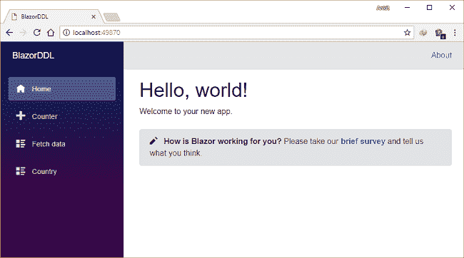***

***点击导航菜单中的“国家”。它将重定向到 CountryData 视图，您可以在页面上看到两个下拉列表——国家和城市。请注意，URL 后面附加了“/ *country* ”，这是我们使用@page 指令定义的。***

****

**在这里，您可以看到两个下拉列表。国家下拉列表已经填充了国家数据。如果我们从这个下拉列表中选择任何国家名称，那么城市下拉列表也会填充相应的城市数据。我们还可以在两个下拉列表下方的标签中看到所选的国家和城市值。**

**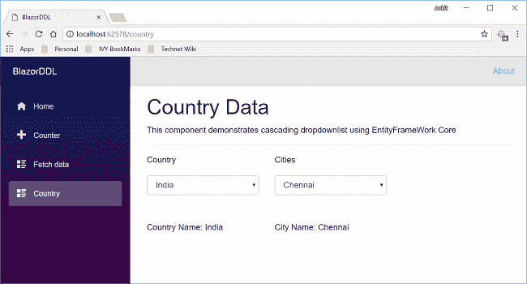**

### **托管应用程序**

**要了解如何使用 IIS 托管 Blazor 应用程序，请参考[在 IIS 上部署 Blazor 应用程序](http://ankitsharmablogs.com/deploying-a-blazor-application-on-iis/)**

### **结论**

**我们已经学习了如何在 Visual Studio 2017 和 SQL Server 2014 的帮助下，使用实体框架核心数据库优先方法在 Blazor 中创建级联下拉列表。请从 [GitHub](https://github.com/AnkitSharma-007/Blazor-CascadingDDL-EFCore) 获取源代码，并四处播放，以便更好地理解。**

**获取我的书 [Blazor 快速入门指南](https://www.amazon.com/Blazor-Quick-Start-Guide-applications/dp/178934414X/ref=sr_1_1?ie=UTF8&qid=1542438251&sr=8-1&keywords=Blazor-Quick-Start-Guide)以了解更多关于 Blazor 的信息。**

**你可以在这里查看我在 Blazor 上的其他文章**

**你也可以在 [C#角](https://www.c-sharpcorner.com/article/cascading-dropdownlist-in-blazor-using-ef-core/)找到这篇文章。**

### **请参见**

*   **[ASP.NET 核心 Blazor 入门](http://ankitsharmablogs.com/asp-net-core-getting-started-with-blazor/)**
*   **[ASP.NET 核心—使用 Blazor 的 CRUD 和实体框架核心](http://ankitsharmablogs.com/asp-net-core-crud-using-blazor-and-entity-framework-core/)**
*   **[ASP.NET 核心—使用 Angular 5 和实体框架核心的 CRUD】](http://ankitsharmablogs.com/asp-net-core-crud-using-angular-5-and-entity-framework-core/)**
*   **[ASP.NET 核心—带有 React.js 的 CRUD 和实体框架核心](http://ankitsharmablogs.com/asp-net-core-crud-with-react-js-and-entity-framework-core/)**
*   **[ASP.NET 岩心——使用角度为 5 的高图表](http://ankitsharmablogs.com/asp-net-core-using-highcharts-with-angular-5/)**

***最初发表于 https://ankitsharmablogs.com/*T2**