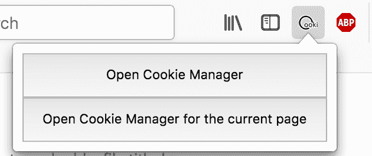

# 如何创建一个 Chrome 扩展

> 原文：<https://www.freecodecamp.org/news/how-to-create-a-chrome-extension-part-1-ad2a3a77541/>

作者 Erika Tan

# 如何创建一个 Chrome 扩展


在这篇文章中，我将教你如何[制作你自己的](https://developer.chrome.com/extensions/getstarted)的 Chrome 扩展。我是基于在创建 [TalkToMe](https://github.com/PalashTanejaPro/BlindHelper) 时学到的经验，这是一个 Chrome 扩展，通过阅读网站内容和导航到其他网页来帮助视障人士。

我将介绍设置扩展的基础知识，包括:

*   为安装配置文件
*   准备好放入 Chrome 商店

> 我不会讨论如何管理音频特性，比如处理麦克风权限。我的朋友 Palash 在这篇文章中已经谈到了这一点，并使用了 [TalkToMe](https://github.com/PalashTanejaPro/BlindHelper) 扩展作为例子。

#### 为安装配置文件

首先，在你的浏览器中进入 **chrome://extensions** ，或者简单地点击 chrome 菜单上的“更多工具”和“扩展”。这应该会把你带到扩展管理页面，在那里你可以**打开开发者模式**(应该在右上角)。

然后，您需要在一个新目录中为您的扩展名创建一个`manifest.json`文件。该文件为您的扩展功能提供了重要信息，例如权限和您将链接到项目的脚本文件。您的清单内容应该是这样的:

```
{    "name": "Chrome Extension Example",    "version": "1.0",    "description": "Build an Extension!",    "manifest_version": 2}
```

要将您的目录上传到扩展管理页面，请单击“Load Unpacked”按钮并选择您的目录。这将把您的文件链接到基于 web 的用户界面。

您必须配置的另一个重要文件是`background.js`，它是项目的后台脚本。

一个示例后台脚本具有以下类型的结构:

```
chrome.runtime.onInstalled.addListener(function() {    // add an action here});
```

当您的扩展打开时，它将始终运行，并且对于监听不同的事件(如键盘按键)或导航到不同的页面非常有用。

你甚至可以有多个后台脚本。您只需要首先在您的清单文件中注册它们。为此，只需像这样构造`manifest.js`,这就是我们扩展的清单文件的样子:

```
{    "name": "Chrome Extension Example",    ...
```

```
 "background": {        "scripts": [            "js/es6-promise.auto.min.js",            "js/defaults.js",            "js/speech.js",            "js/document.js",            "js/events.js",            "js/stt.js",            "js/listen.js"        ],        "persistent": false    }}
```

现在，您将需要一个文件，不仅用于扩展的功能，还用于 UI。为此，创建一个名为`popup.html`的文件。弹出窗口是一个小窗口，单击扩展图标后就会出现。例如，这是 Cookie 管理器 Firefox 扩展的弹出窗口。



`popup.html`文件可能非常简单。下面是用一个按钮制作弹出窗口的一些代码。这就像在文档主体中添加开始和结束按钮标签以及一些样式规则一样简单。

```
<!DOCTYPE html>  <html>    <head>      <style>        button {          height: 30px;          width: 30px;          outline: none;        }      </style>    </head>;    <body>      <button></button>    </body>  </html>
```

当然，我们扩展的`popup.html`代码比这多得多。随意添加更多的按钮、样式表和任何你认为适合你的扩展想法的东西。

是时候配置弹出代码和图标了。然而，对于图标，您需要在两个地方添加代码，“default_icon”和“icons”。“default_icon”属性用于工具栏图标，“icons”用于扩展管理页面上显示的图像。

回到`manifest.json`，添加以下代码行，用你自己的图像替换默认图标的图像路径。您也可以将相同的图像放入“默认图标”和“图标”中。并且，你不需要*T2 来放入与下面指定尺寸相同的图片。例如，如果您只有 16 x 16 和 48 x 48 的图像，请随意删除指定 32 和 128 像素的其他两行。*

```
{   "name": "Chrome Extension Example",    ...
```

```
 "page_action": {        "default_popup": "popup.html",        "default_icon": {            "16": "images/img16.png",            "32": "images/img32.png",            "48": "images/img48.png",            "128": "images/img128.png"        }    },    "icons": {        "16": "images/img16.png",        "32": "images/img32.png",        "48": "images/img48.png",        "128": "images/img128.png"    }}
```

这些是构建 chrome 扩展的基本文件:

*   清单文件，
*   后台脚本，以及
*   弹出文件

您可能想要配置的其他一些文件有:

*   `options.html`和
*   `options.js`

在使用您的扩展时，将为您的用户提供更广泛的选择。它将负责你的选项页面的外观(它非常类似于`popup.html`)，而`options.js`将处理功能。

这些文件是可选的，但是如果您决定添加它们，不要忘记在清单中配置`options.html`，并通过添加`<script src=”options.js”><`来链接您的`options.js`文件；/script >就在结束 HTML 标签之前。

```
{    "name": "Chrome Extension Example",    ...    "options_page": "options.html"}
```

要查看运行中的扩展，请保存所有文件，然后在扩展管理页面上单击“重新加载”。您应该会在工具栏中看到您的图标。要查看您的选项页面，您也可以单击您的扩展下的“详细信息”并向下滚动到显示“扩展选项”的位置。

#### 将您的项目发布到 web 商店

所以你已经开发并测试了你的扩展。现在你需要分发它！

要开始上传您的项目，请先将其转换为. zip 文件。该文件至少应该包含`manifest.json`文件。然后，访问 [Chrome 网络商店开发者仪表板](https://chrome.google.com/webstore/developer/dashboard)，确保你有一个开发者账户。

点击“添加新项目”按钮，它应该让你上传你的`.zip`文件。除非你想为你的应用程序注册支付，否则你可以跳过设置支付系统的步骤。然而，当你把你的项目放到网上商店时，你必须一次性支付 5 美元的开发费用。

此外，不要忘了包括你的扩展的详细描述和图片，这样潜在的用户将确切地知道你的项目是做什么的！

所有这些完成后，您将收到一个应用 ID 和一个 OAuth 令牌。app ID 用于向 Google APIs 发出请求，而 OAuth 令牌用于进行网上商店支付。

恭喜你，你已经发布了你的扩展！？

如果你喜欢这篇文章，看看下一篇文章。我们将深入探讨如何在你的 Chrome 扩展中配置音频功能，就像我们对 TalkToMe 所做的那样。