# 如何用 Netlify Forms 和 Next.js 创建联系人表单

> 原文：<https://www.freecodecamp.org/news/how-to-create-a-contact-form-with-netlify-forms-and-nextjs/>

如果你想让某人能够联系你或者在网站上提交信息，HTML 表单是一个非常标准的实现方式。

但是接受表单提交通常需要额外的服务或复杂的服务器端代码。如何利用 Netlify 轻松创建新表单？

*   什么是网络生活？
*   我们要建造什么？
*   这要花多少钱？
*   [第 1 部分:用 HTML 创建联系人表单](#part-1-creating-a-contact-form-with-html)
*   [第 2 部分:向 Next.js React 应用程序添加自定义 Netlify 表单](#part-2-adding-a-custom-netlify-form-to-a-next-js-react-app)

[https://www.youtube.com/embed/GLxgxnLTVLE?feature=oembed](https://www.youtube.com/embed/GLxgxnLTVLE?feature=oembed)

## 什么是 Netlify？

Netlify 是一个网络平台，可以让你轻松地部署新的网络项目，并轻松配置工作流程。这包括部署一个静态网站，lambda 函数，就像我们将在这里讨论的，自定义表单。

他们的表单服务是构建和部署管道的一部分。当我们在页面中包含一个具有特定属性的表单时，Netlify 会识别该表单并对其进行配置。

## 我们要建造什么？

我们将创建一个联系表单，允许人们通过您的网站向您发送消息。

表单本身会非常简单。像标准的联系方式一样，我们会询问某人的姓名、电子邮件地址和信息。

我们将使用普通的 HTML 来演示它是如何工作的，然后使用 [Next.js](https://nextjs.org/) 来构建它，以便在 React 应用程序中创建表单。

## 这要花多少钱？

Netlify 表单可以免费开始使用。这个免费层限于每个网站每月提交 100 份表格，所以如果你保持在这个水平之下，它将永远是免费的。

也就是说，如果你在任何一个特定的网站上提交了超过 100 个表单，那么在我写这篇文章的时候，第一层将会是 19 美元以上。你可以在 Netlify 的网站上查看[最新的定价计划。](https://www.netlify.com/pricing/)

## 第 1 部分:用 HTML 创建联系人表单

首先，我们要用纯 HTML 创建一个基本表单。这是一个演示如何工作的快速胜利。

### 步骤 1:创建 HTML 表单

对于我们的表单，我们真的可以使用任何我们想要的。联系表单可以简单到一个电子邮件地址和一个消息字段，也可以包括各种选项来帮助企业回答特定的问题。

我们从简单的开始。我们将创建一个表单，要求输入某人的姓名、电子邮件地址和消息。

首先，在项目的根目录下创建一个新的 HTML 文件。这个 HTML 文件应该包括 HTML 文档的基本结构。在主体内部，让我们添加新的表单:

```
<form name="contact" method="POST" data-netlify="true">
    <p>
      <label for="name">Name</label>
      <input type="text" id="name" name="name" />
    </p>
    <p>
      <label for="email">Email</label>
      <input type="text" id="email" name="email" />
    </p>
    <p>
      <label for="message">Message</label>
      <textarea id="message" name="message"></textarea>
    </p>
    <p>
      <button type="submit">Send</button>
    </p>
  </form> 
```

在上面的片段中，我们是:

*   创建新表单
*   表单有一个名称属性、一个方法和一个设置为`true`的`data-netlify`属性
*   创建 3 个带标签的表单字段，每个字段都用名称属性标识
*   创建按钮以提交表单

我们最想注意的是属性`data-netlify`和表单`name`。当 Netlify 读取站点时，它会看到这些字段，并使用这些字段将您的表单转换为活动的工作表单。

我还将添加一点 CSS 来使标签看起来更加一致。您可以选择将其添加到文档的`<head>`:

```
<style>
  body {
    font-family: sans-serif;
  }
  label {
    display: block;
    margin-bottom: .2em;
  }
</style> 
```

而在这一点上，我们应该有一个基本的形式！

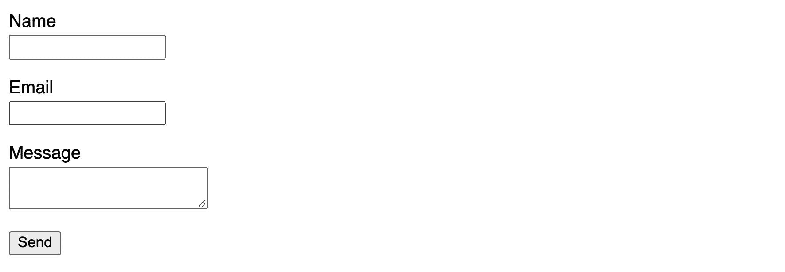

Basic HTML form

现在你需要把这个表单放在 GitHub 或者你最喜欢的 Netlify 支持的 Git 提供者上，我们将为下一步做好准备。

[跟随提交！](https://github.com/colbyfayock/my-html-netlify-form/commit/482a4e14b3c8e10bc9ae29c2f233c3312dd1b89a)

### 步骤 2:用 Netlify 配置新表单

一旦我们的表单被推送到 Git 提供者，我们现在就可以用 Netlify 同步它了。

首先创建一个帐户或使用 Netlify 的现有帐户，然后单击 Git 按钮中的**新站点。**

在这里，选择您使用的 Git 提供者。在我的例子中，我使用了 **GitHub** 。

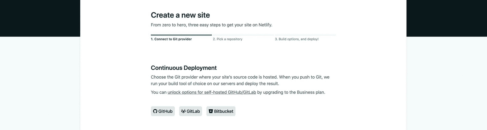

Connecting a Git provider in Netlify

一旦选择了 Git 提供者，它将要求您授权访问，以便 Netlify 可以找到您的 Git 存储库。

成功连接您的帐户后，您现在应该会看到您提供访问权限的存储库列表。找到您添加表单的存储库并选择它。

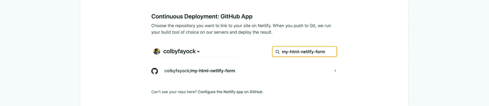

Connecting a Git repository to Netlify

如果你明白我的意思，我们的表单是纯 HTML 的，也就是说，不应该有构建步骤，也不应该有发布到的特殊目录。但是如果您做了一些不同的事情，请随意调整这些设置。

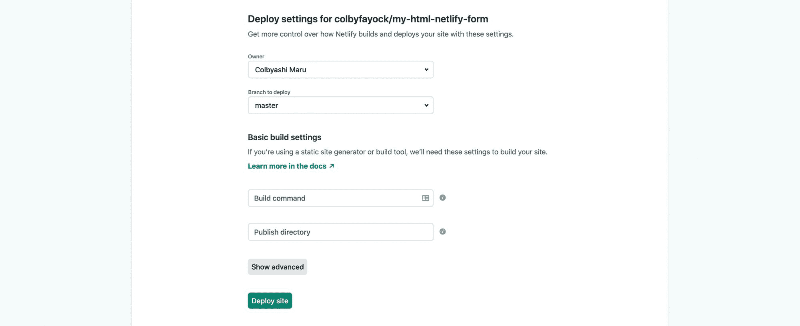

Configuring the build steps in Netlify

现在，点击 **Deploy site** ，这将在 Netlify 中打开一个新页面，很快您的站点就会成功部署。

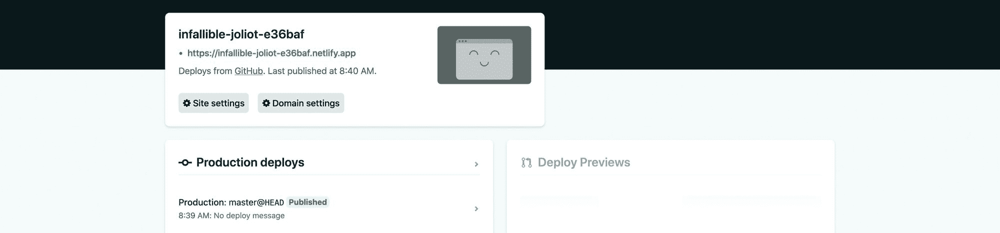

最后，单击 Netlify 项目仪表板顶部以 netlify.app 结尾的 URL。加载后，您将看到您的表单！

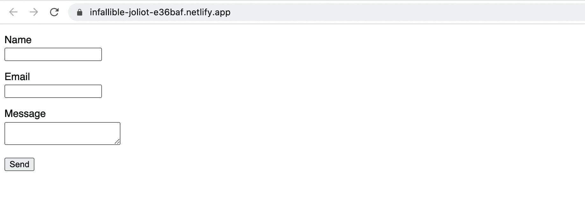

### 步骤 3:查看表单提交

现在我们有了表单，我们最终希望看到响应。

首先，向表单中添加一些信息，然后单击提交。

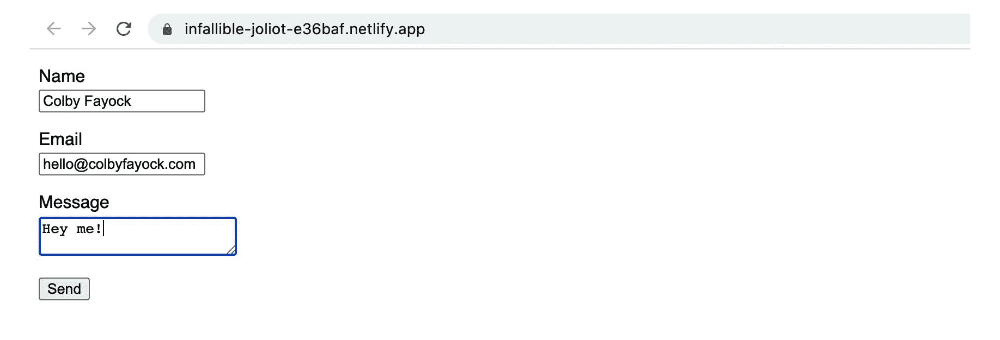

Testing HTML form

提交后，您会注意到进入了一个网页，显示表单已成功提交。

现在，您可以返回到您的 Netlify 项目仪表板，向下滚动一点，您现在可以看到一个框，其中有最近提交的表单和新提交的表单。

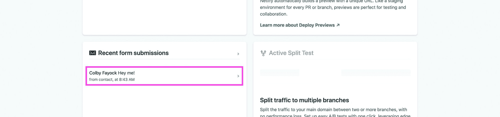

Netlify Form submission

## 第 2 部分:向 Next.js React 应用程序添加自定义 Netlify 表单

如果表单是独立存在的，而不是一个更大的站点的一部分，那么将表单保留为纯 HTML 有很多好处。但通常，我们希望我们的联系方式成为我们网站或应用程序的一部分。

在这里，我们将向一个 [Next.js](https://nextjs.org/) 应用程序添加一个表单。

*注意:我们使用 Next.js 的演示是一个静态渲染的应用程序。如果您正在加载表单客户端，这意味着底层 HTML 不包括表单，请查看本页底部的注释，了解更多关于解决方案的信息。*

### 步骤 0:创建 Next.js 应用程序

首先，我们需要一个应用程序。我们将使用 Next.js，因为我们可以很容易地从头开始构建一个新的应用程序。

为此，您可以导航到要创建应用程序的位置并运行:

```
yarn create next-app [project-name]
# or
npx create-next-app [project-name] 
```

我将把我的项目命名为`my-nextjs-netlify-form`。

一旦 Next.js 完成了依赖项的安装，它将给出导航到项目目录并启动开发服务器的指令。

运行完`yarn dev`或`npm run dev`后，您应该准备好运行您的 Next.js 应用程序:

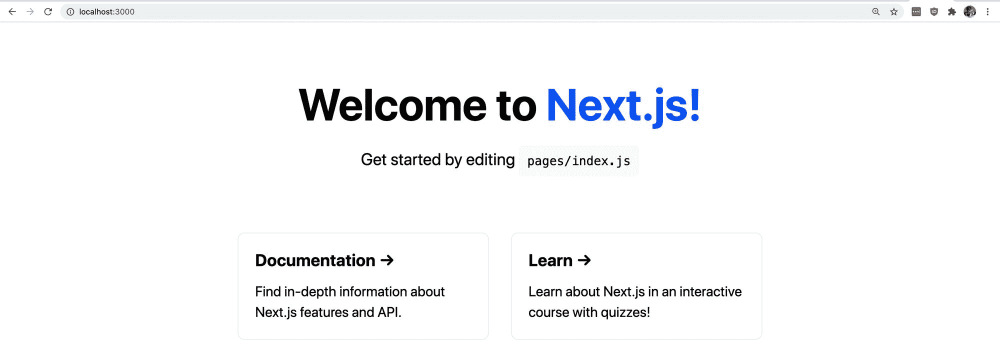

New Next.js app

[跟随提交！](https://github.com/colbyfayock/my-nextjs-netlify-form/commit/6f9fb6966b6c112a3ec934e305f2dd115e9d424e)

### 步骤 1:向 Next.js 应用程序添加 HTML 表单

我们的步骤 1 看起来与第 1 部分非常相似。

在`pages/index.js`中，我们想要找到我们的网格包装器，我们将使用它来添加我们的表单。

找到`<div className={styles.grid}>`并用以下内容替换整个块:

```
<div className={styles.grid}>
  <div className={styles.card}>
    <form name="contact" method="POST" data-netlify="true">
      <p>
        <label htmlFor="name">Name</label>
        <input type="text" id="name" name="name" />
      </p>
      <p>
        <label htmlFor="email">Email</label>
        <input type="text" id="email" name="email" />
      </p>
      <p>
        <label htmlFor="message">Message</label>
        <textarea id="message" name="message"></textarea>
      </p>
      <p>
        <button type="submit">Send</button>
      </p>
    </form>
  </div>
</div> 
```

我们正在做的是:

*   我们正在利用 Next.js 中现有的网格
*   我们还利用了现有的卡，我们将在其中包含我们的表单
*   在卡片内部，我们粘贴了与第 1 部分完全相同的 HTML 表单

如果我们重新加载页面，我们现在可以在卡片中看到我们的表单，就像这样:


Adding a form to a Next.js app

在我们继续之前，我们想做两件事。

首先，因为我们是在 JavaScript 应用程序中创建这个表单， [Netlify 建议](https://www.netlify.com/blog/2017/07/20/how-to-integrate-netlifys-form-handling-in-a-react-app/#form-handling-with-static-site-generators)我们添加一个带有表单名称的隐藏输入。

在我们的表单中，在表单元素的顶部添加以下输入:

```
<input type="hidden" name="form-name" value="contact" /> 
```

确保该输入的值与您的表单名称相同。

其次，因为我们重用的卡片是用于链接列表的，Next.js 包含了一些悬停效果。这使得表单难以使用，所以让我们删除它们

从`styles/Home.module.css`中删除以下内容:

```
.card:hover,
.card:focus,
.card:active {
  color: #0070f3;
  border-color: #0070f3;
} 
```

作为一个额外的奖励步骤，我将更新我的页面标题为“联系我”，并删除描述。你想怎么做都行。


Updating the form title

一旦你准备好了，就像之前一样，把它作为一个新的库添加到 GitHub 或者你喜欢的 Git 提供者。

[跟随提交！](https://github.com/colbyfayock/my-nextjs-netlify-form/commit/b9cac11411c6c71ee648c8631c35740735c599b7)

### 步骤 2:设置 Next.js 应用程序并将其部署到 Netlify

将我们的应用程序部署到 Netlify 看起来非常相似，但是在我们到达那里之前，我们需要设置我们的 Next.js 应用程序，以便能够在构建时导出。

在我们的 Next.js 应用程序中，在`package.json`文件内部，我们希望将`build`脚本更新为:

```
"build": "next build && next export", 
```

现在，当您运行`build`脚本时，它会将应用程序编译成`out`目录中的静态 HTML、CSS 和 JS。这将允许我们将其部署到 Netlify。如果你愿意，你甚至可以在你的机器上尝试一下。

有了这个改变，提交它并把它推给你的 Git 提供者。

接下来，部署应用程序将与第 1 部分类似。唯一的区别是因为我们有一个 Next.js 应用程序，我们需要添加我们的构建步骤。

首先，我们要像第 1 部分一样连接我们的 Git 提供者。

到达部署设置页面后，我们需要配置构建命令和发布目录。

我们的**构建命令**将会是`yarn build`或`npm run build`，这取决于你使用的是什么包管理器，而**发布目录**将会是`out`。

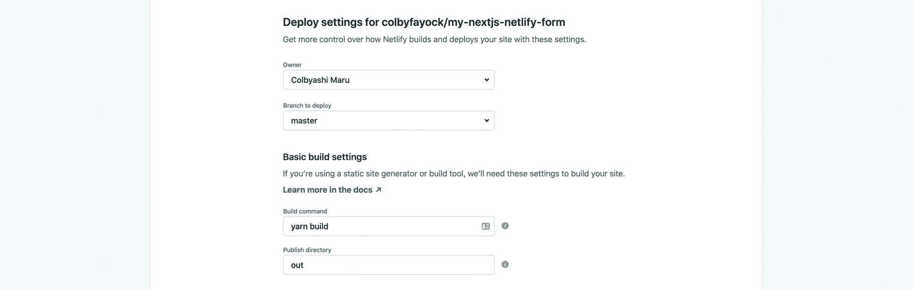

Deploy settings for a static Next.js app

之后点击**部署站点**，和之前一样拉开序幕。

一旦完成部署，我们现在就可以打开应用程序了。

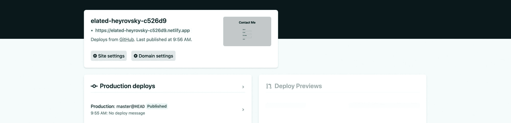

Successfully deployed Next.js app on Netlify

一旦我们打开我们的应用程序，我们可以通过填写并点击提交来测试我们的表单。

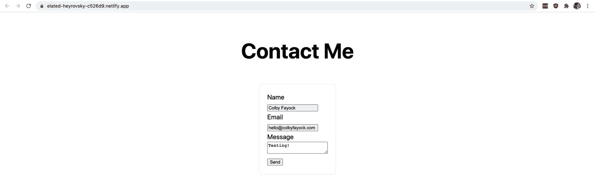

与之前类似，我们将登陆 Netlify 成功页面。但是，如果我们回头看看我们的 Netlify 仪表盘内部，我们会看到我们的提交！

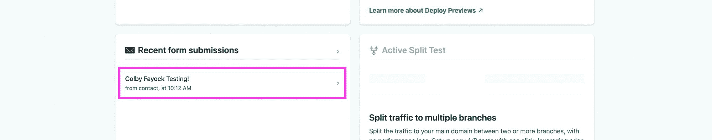

Succesful Next.js form submission on Netlify

[跟随提交！](https://github.com/colbyfayock/my-nextjs-netlify-form/commit/3a4516a706af550a37372a9aa2bbaf54b9d7d691)

### 额外收获:用成功的信息让人们留在你的网站上

Netlify 表单的另一个很酷的特性是，它允许你通过在页面上配置表单来设置你的表单，以使人们留在你的网站上。

您有很多选择，无论是将某人重定向到一个新页面，还是在他们提交的页面上配置消息。

在本演示中，我们将设置一个 URL 参数，如果我们看到该参数，我们可以检测到该参数并显示成功消息。

为此，在 HTML 表单上添加以下属性:

```
action="/?success=true" 
```

这将告诉 Netlify 我们希望留在主页上(因为我们只有一个页面)，但应用 URL 参数，以便我们可以在我们的应用程序中检测到它。

接下来，我们可以使用`useState`和`useEffect`钩子来查看这个参数并更新页面。

在文件的顶部，让我们导入这些钩子:

```
import { useState, useEffect } from 'react'; 
```

在顶部的 Home 组件中，让我们添加我们的州:

```
const [success, setSuccess] = useState(false); 
```

为了检测 URL 参数，我们可以使用`useEffect`钩子:

```
useEffect(() => {
  if ( window.location.search.includes('success=true') ) {
    setSuccess(true);
  }
}, []); 
```

*注意:这是实现演示结果的简单方法。如果您有一个更复杂的应用程序，您可能希望将参数命名为更符合逻辑的名称，并正确解析值的 URL 参数。*

它所做的是，当组件渲染时，它将触发这个`useEffect`钩子，检查 URL 中的参数，并寻找`success=true`。如果它找到了，它会将我们的`success`状态变量更新为`true`！

接下来，在我们的页面标题(`<h1>`)下，让我们添加以下代码片段:

```
{success && (
  <p style={{ color: 'green'}}>
    Successfully submitted form!
  </p>
)} 
```

在这里，我们要看看`success`是否是真的，如果是真的，我们会包含一行文本，说明表单已成功提交。

虽然您不能在本地提交表单，但您可以通过访问您在本地运行的应用程序来测试这一点，该应用程序带有如下的`?success=true` URL 参数:

```
http://localhost:3000/?success=true 
```


Testing success message locally

最后，您可以将这些更改推送给 Git 提供商，Netlify 将自动重建您的站点。

完成后，您可以像以前一样提交表单，并看到成功消息。

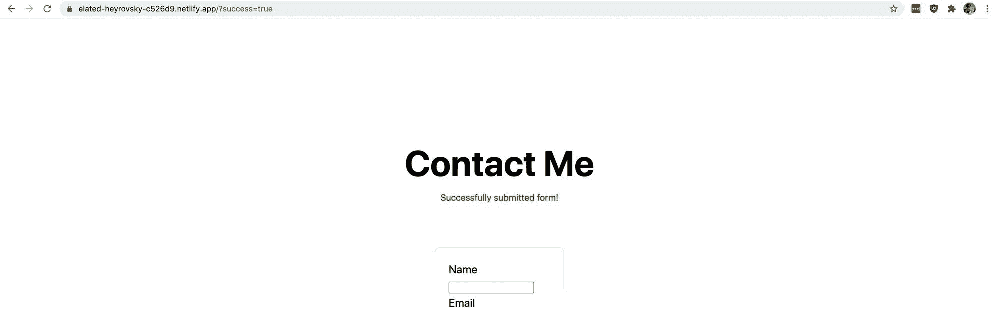

Successful form redirect on Netlify

看到我们的表单仍在提交！

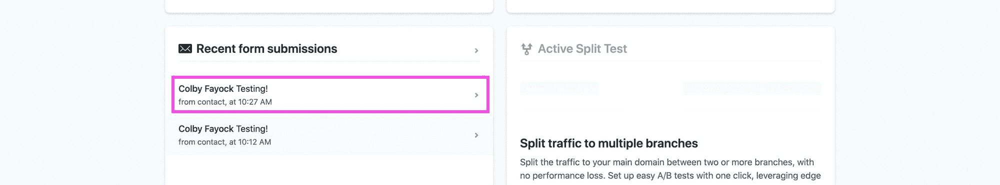

Successful form submission on Netlify

[跟随提交！](https://github.com/colbyfayock/my-nextjs-netlify-form/commit/25378cd6b17ad6bb48dc7281220ab48eba74f478)

## 网络表单和客户端代码

Netlify 的解决方案需要注意的一点是，这只对静态 HTML 页面“简单”有效。

如果您的页面使用 JavaScript 来管理该页面的内容，比如直到页面加载后才添加表单，那么您需要查看 Netlify 的文档，了解如何使用附加的表单属性来实现这个功能[。](https://docs.netlify.com/forms/setup/#javascript-forms)

Netlify 还举了一个例子，告诉你如何用 JavaScript 动态提交表单，这样你就可以在你的应用中创建一个定制的体验。

## 你还能做什么？

### 使用其他工具设置高级工作流程

Netlify 允许您与其他工具集成，以允许您争论表单提交。值得注意的是， [Netlify 与 Zapier](https://zapier.com/apps/netlify/integrations) 合作，这意味着你可以接受提交的内容，并对它们做任何你想做的事情。

[https://docs.netlify.com/forms/notifications/](https://docs.netlify.com/forms/notifications/)

### 使用 reCAPTCHA 防止垃圾邮件

垃圾邮件也是真实存在的。你不希望你的收件箱被垃圾邮件淹没，所以你可以利用 Netlify 的内置蜜罐字段，或者他们指导你如何添加 reCAPTCHA 2。

[https://docs.netlify.com/forms/spam-filters/](https://docs.netlify.com/forms/spam-filters/)

[](https://twitter.com/colbyfayock)

*   [？在 Twitter 上关注我](https://twitter.com/colbyfayock)
*   [？订阅我的 Youtube](https://youtube.com/colbyfayock)
*   [✉️注册我的简讯](https://www.colbyfayock.com/newsletter/)
*   [？赞助我](https://github.com/sponsors/colbyfayock)