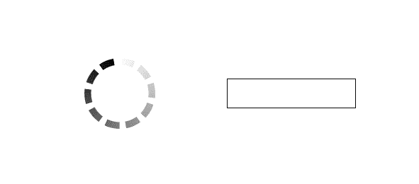
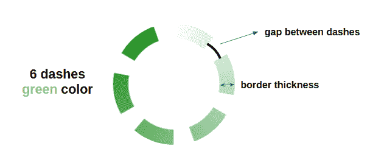
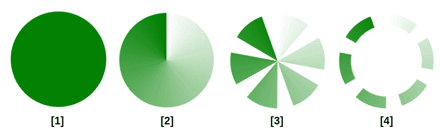
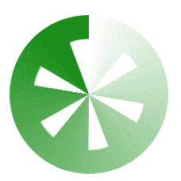
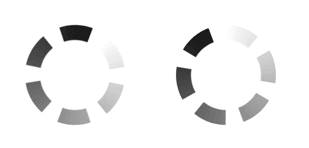
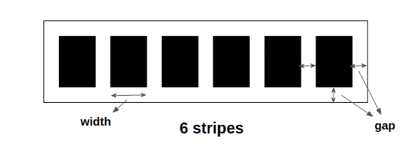
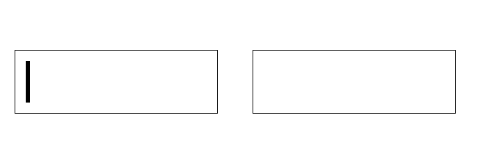

# 如何使用一个元素创建一个仅支持 CSS 的加载器

> 原文：<https://www.freecodecamp.org/news/how-to-create-a-css-only-loader/>

如果你有一个网站，有一个加载器会很有帮助，这样一旦用户点击了一个链接或按钮，他们就可以知道发生了什么。

您可以在很多地方使用这个加载器组件，它应该尽可能简单。

在这篇文章中，我们将看到如何只用一个`<div>`和几行 CSS 代码构建两种类型的加载器。不仅如此，我们还将使它们可定制，这样你就可以轻松地从相同的代码中创建不同的变体。

以下是我们将要构建的内容:



CSS-only Spinner and Progress Loader

## 如何创建旋转装载机

下面是我们正在构建的演示:

[https://codepen.io/t_afif/embed/preview/PoJyaNy?default-tabs=css%2Cresult&height=300&host=https%3A%2F%2Fcodepen.io&slug-hash=PoJyaNy](https://codepen.io/t_afif/embed/preview/PoJyaNy?default-tabs=css%2Cresult&height=300&host=https%3A%2F%2Fcodepen.io&slug-hash=PoJyaNy)

<details><summary>Click to see the full code</summary>

```
 <div class="loader"></div>
 <div class="loader" style="--b: 15px;--c: blue;width: 120px;--n: 8"></div>
 <div class="loader" style="--b: 5px;--c: green;width: 80px;--n: 6;--g: 20deg"></div>
 <div class="loader" style="--b: 20px;--c: #000;width: 80px;--n: 15;--g: 7deg"></div> 
```

```
 .loader {
   --b: 10px;  /* border thickness */
   --n: 10;    /* number of dashes*/
   --g: 10deg; /* gap between dashes*/
   --c: red;   /* the color */

   width: 100px; /* size */
   aspect-ratio: 1;
   border-radius: 50%;
   padding: 1px;
   background: conic-gradient(#0000,var(--c)) content-box;
   -webkit-mask:
     repeating-conic-gradient(#0000 0deg,
        #000 1deg calc(360deg/var(--n) - var(--g) - 1deg),
        #0000     calc(360deg/var(--n) - var(--g)) calc(360deg/var(--n))),
     radial-gradient(farthest-side,#0000 calc(98% - var(--b)),#000 calc(100% - var(--b)));
           mask:
     repeating-conic-gradient(#0000 0deg,
        #000 1deg calc(360deg/var(--n) - var(--g) - 1deg),
        #0000     calc(360deg/var(--n) - var(--g)) calc(360deg/var(--n))),
     radial-gradient(farthest-side,#0000 calc(98% - var(--b)),#000 calc(100% - var(--b)));
   -webkit-mask-composite: destination-in;
           mask-composite: intersect;
   animation: load 1s infinite steps(var(--n));
 }
 @keyframes load {to{transform: rotate(1turn)}} 
```</details> 

我们有 4 个不同的装载机使用相同的代码。只需改变几个变量，我们就可以生成一个新的加载器，而不需要修改 CSS 代码。

变量定义如下:

*   `--b`定义边框粗细。
*   `--n`定义破折号的数量。
*   `--g`定义破折号之间的间隙。因为我们处理的是一个圆形元素，所以这是一个角度值。
*   `--c`定义颜色。

这里有一个插图来看不同的变量。



CSS Variables of the Spinner loader

让我们来处理 CSS 代码。我们将使用另一个图来说明装载机的一步一步的建设。



Step-by-Step illustration of the Spinner Loader

我们首先创建一个像这样的圆:

```
.loader {
  width: 100px; /* size */
  aspect-ratio: 1;
  border-radius: 50%;
}
```

目前还没什么复杂的。注意`aspect-ratio`的使用，它允许我们只修改一个值(T1)来控制大小。

然后我们添加一个从透明到定义颜色的圆锥渐变着色(变量`--c`):

```
.loader {
  width:100px; /* size */
  aspect-ratio: 1;
  border-radius: 50%;
  background: conic-gradient(#0000,var(--c));
}
```

在这一步，我们引入了`mask`属性，以重复的方式隐藏圆的某些部分。这将取决于`--n`和`--d`变量。如果仔细观察该图，我们会注意到以下模式:

```
visible part
invisible part
visible part
invisible part
etc
```

为此，我们使用`repeating-conic-gradient(#000 0 X, #0000 0 Y)`。从`0`到`X`，我们有一个不透明的颜色(可见部分)，从`X`到`Y`，我们有一个透明的颜色(不可见部分)。

我们引入变量:

*   我们需要每个可见部分之间的间隙等于`g`，因此`X`和`Y`之间的公式将是`X = Y - g`。
*   我们需要`n`可见的部分，所以`Y`的公式应该是`Y = 360deg/n`。一个完整的圆是`360deg`，所以我们简单地将它除以`n`

我们目前的代码是:

```
.loader {
  width: 100px; /* size */
  aspect-ratio: 1;
  border-radius: 50%;
  background: conic-gradient(#0000,var(--c));
  mask: repeating-conic-gradient(#000 0 calc(360deg/var(--n) - var(--g)) , #0000 0 calc(360deg/var(--n))
}
```

下一步是最棘手的一步，因为我们需要应用另一个遮罩来创建一个洞，以获得最终的形状。为了做到这一点，我们将逻辑上使用一个带有变量`b`的`radial-gradient()`:

```
radial-gradient(farthest-side,#0000 calc(100% - var(--b)),#000 0)
```

一个完整的圆，从这里我们去掉一个等于`b`的厚度。

我们将它添加到之前的遮罩中:

```
.loader {
  width: 100px; /* size */
  aspect-ratio: 1;
  border-radius: 50%;
  background: conic-gradient(#0000,var(--c));
  mask: 
   radial-gradient(farthest-side,#0000 calc(100% - var(--b)),#000 0),
   repeating-conic-gradient(#000 0 calc(360deg/var(--n) - var(--g)) , #0000 0 calc(360deg/var(--n))
}
```

我们有两个遮罩层，但结果不是我们想要的。我们得到以下结果:



这可能看起来很奇怪，但它是合乎逻辑的。“最终”可见部分只是每个遮罩层的每个可见部分的总和。我们可以使用`mask-composite`来改变这种行为。我需要一整篇文章来解释这个属性，所以我只给出值。

在我们的例子中，我们需要考虑`intersect`(前缀属性为`destination-out`)。我们的代码将变成:

```
.loader {
  width: 100px; /* size */
  aspect-ratio: 1;
  border-radius: 50%;
  background: conic-gradient(#0000,var(--c));
  mask: 
    radial-gradient(farthest-side,#0000 calc(100% - var(--b)),#000 0),
    repeating-conic-gradient(#000 0 calc(360deg/var(--n) - var(--g)) , #0000 0 calc(360deg/var(--n));
  -webkit-mask-composite: destination-in;
          mask-composite: intersect;
}
```

我们完成了造型！我们只是错过了动画。后者是无限旋转。

唯一需要注意的是，我使用了一个`steps`动画来创建固定破折号和移动颜色的幻觉。

这里有一个例子可以看出区别



A Linear Animation vs a Steps Animation

第一个是形状的线性连续旋转(不是我们想要的)，第二个是离散的动画(我们想要的)。

以下是包括动画在内的完整代码:

<details><summary>Click to see the full code</summary>

```
 <div class="loader"></div>
 <div class="loader" style="--b: 15px;--c: blue;width: 120px;--n: 8"></div>
 <div class="loader" style="--b: 5px;--c: green;width: 80px;--n: 6;--g: 20deg"></div>
 <div class="loader" style="--b: 20px;--c: #000;width: 80px;--n: 15;--g: 7deg"></div> 
```

```
 .loader {
   --b: 10px;  /* border thickness */
   --n: 10;    /* number of dashes*/
   --g: 10deg; /* gap between dashes*/
   --c: red;   /* the color */

   width: 100px; /* size */
   aspect-ratio: 1;
   border-radius: 50%;
   padding: 1px;
   background: conic-gradient(#0000,var(--c)) content-box;
   -webkit-mask:
     repeating-conic-gradient(#0000 0deg,
        #000 1deg calc(360deg/var(--n) - var(--g) - 1deg),
        #0000     calc(360deg/var(--n) - var(--g)) calc(360deg/var(--n))),
     radial-gradient(farthest-side,#0000 calc(98% - var(--b)),#000 calc(100% - var(--b)));
           mask:
     repeating-conic-gradient(#0000 0deg,
        #000 1deg calc(360deg/var(--n) - var(--g) - 1deg),
        #0000     calc(360deg/var(--n) - var(--g)) calc(360deg/var(--n))),
     radial-gradient(farthest-side,#0000 calc(98% - var(--b)),#000 calc(100% - var(--b)));
   -webkit-mask-composite: destination-in;
           mask-composite: intersect;
   animation: load 1s infinite steps(var(--n));
 }
 @keyframes load {to{transform: rotate(1turn)}} 
```</details> 

您会注意到我在解释中使用的代码有一些不同:

*   我正在添加`padding: 1px`并将背景设置为`content-box`
*   `repeating-conic-gradient()`的颜色之间有`+/1deg`
*   `radial-gradient()`里面的颜色有几个百分比的差别

这些是避免视觉故障的一些修正。众所周知，渐变在某些情况下会产生“奇怪”的结果，所以我们必须手动调整一些值来避免它们。

## 如何创建进度加载器

像前面的一个加载程序一样，让我们从一个概述开始:

[https://codepen.io/t_afif/embed/preview/bGoNddg?default-tabs=css%2Cresult&height=300&host=https%3A%2F%2Fcodepen.io&slug-hash=bGoNddg](https://codepen.io/t_afif/embed/preview/bGoNddg?default-tabs=css%2Cresult&height=300&host=https%3A%2F%2Fcodepen.io&slug-hash=bGoNddg)

<details><summary>Click to see the full code</summary>

```
 <div class="loader"></div>
 <div class="loader" style="--s:10px;--n:10;color:red"></div>
 <div class="loader" style="--g:0px;color:darkblue"></div>
 <div class="loader" style="--s:25px;--g:8px;border-radius:50px;color:green"></div> 
```

```
 .loader {
   --n:5;    /* control the number of stripes */
   --s:30px; /* control the width of stripes */
   --g:5px;  /* control the gap between stripes */

   width:calc(var(--n)*(var(--s) + var(--g)) - var(--g));
   height:30px;
   padding:var(--g);
   margin:5px auto;
   border:1px solid;
   background:
     repeating-linear-gradient(90deg,
       currentColor  0 var(--s),
       #0000 0 calc(var(--s) + var(--g))
     ) left / calc((var(--n) + 1)*(var(--s) + var(--g))) 100% 
     no-repeat content-box;
   animation: load 1.5s steps(calc(var(--n) + 1)) infinite;
 }
 @keyframes load {
   0% {background-size: 0% 100%}
 } 
```</details> 

我们的配置与之前的加载器相同。控制加载程序的 CSS 变量:

*   `--n`定义虚线/条纹的数量。
*   `--s`定义每个条纹的宽度。
*   `--g`定义条纹之间的间隙。



Illustration of the CSS Variables

从上图我们可以看到，元素的宽度将取决于 3 个变量。CSS 将如下所示:

```
.loader {
  width: calc(var(--n)*(var(--s) + var(--g)) - var(--g));
  height: 30px; /* use any value you want here */
  padding: var(--g);
  border: 1px solid;
}
```

我们使用`padding`来设置每边的间隙。那么宽度将等于条纹的数量乘以它们的宽度和间隙。我们移除一个间隙，因为对于`N`条纹，我们有`N-1`间隙。

为了创建条纹，我们将使用下面的梯度。

```
repeating-linear-gradient(90deg,
  currentColor 0 var(--s),
  #0000        0 calc(var(--s) + var(--g))
 )
```

从`0`到`s`是定义的颜色，从`s`到`s + g`是透明的颜色(间隙)。

我使用的是`currentColor`，它是`color`属性的值。注意，我没有在`border`中定义任何颜色，所以它也将使用`color`的值。如果我们想改变载入器的颜色，我们只需要设置`color`属性。

我们目前的代码是:

```
.loader {
  width: calc(var(--n)*(var(--s) + var(--g)) - var(--g));
  height: 30px;
  padding: var(--g);
  border: 1px solid;
  background:
    repeating-linear-gradient(90deg,
      currentColor  0 var(--s),
      #0000 0 calc(var(--s) + var(--g))
    ) left / 100% 100% content-box no-repeat;
}
```

我使用`content-box`来确保渐变没有覆盖填充区域。然后我定义一个等于`100% 100%`的大小和一个左位。

动画时间到了。对于这个加载器，我们将从`0% 100%`到`100% 100%`制作`background-size`的动画，这意味着从`0%`到`100%`渐变的宽度

和前面的加载器一样，我们将依靠`steps()`来拥有一个离散的动画，而不是连续的。



A Linear Animation vs a Steps Animation

第二个是我们想要创建的，我们可以通过添加以下代码来实现:

```
.loader {
  animation: load 1.5s steps(var(--n)) infinite;
}
@keyframes load {
  0% {background-size: 0% 100%}
}
```

如果仔细观察最后一幅图，您会发现动画并不完整。即使我们使用了`N`，我们在最后还是缺少了一个条纹。这不是一个错误，而是`steps()`应该如何工作。

为了克服这一点，我们需要增加一个额外的步骤。我们增加渐变的`background-size`来包含`N+1`条纹，并使用`steps(N+1)`。这将使我们看到最终的代码:

```
.loader {
  width: calc(var(--n)*(var(--s) + var(--g)) - var(--g));
  height: 30px;
  padding: var(--g);
  margin: 5px auto;
  border: 1px solid;
  background:
    repeating-linear-gradient(90deg,
      currentColor  0 var(--s),
      #0000 0 calc(var(--s) + var(--g))
    ) left / calc((var(--n) + 1)*(var(--s) + var(--g))) 100% 
    content-box no-repeat;
  animation: load 1.5s steps(calc(var(--n) + 1)) infinite;
}
@keyframes load {
  0% {background-size: 0% 100%}
}
```

请注意，渐变的宽度等于`N+1`乘以一个条纹和一个间隙的宽度(而不是`100%`

## 结论

我希望你喜欢这个教程。如果你感兴趣，[我已经做了 500 多个只支持 CSS 的单个 div 加载器](https://dev.to/afif/i-made-100-css-loaders-for-your-next-project-4eje)。我还写了另一个[教程来解释如何只用背景属性](https://dev.to/afif/build-your-css-loader-with-only-one-div-the-dots-3882)创建点加载器。

找到以下有用的链接，以获得关于我使用过的一些属性的更多细节，由于其复杂性，我没有彻底解释这些属性:

*   `mask-composite`:[https://css-tricks.com/mask-compositing-the-crash-course/](https://css-tricks.com/mask-compositing-the-crash-course/)
*   `steps()`:[https://developer . Mozilla . org/en-US/docs/Web/CSS/easing-function # the _ steps _ class _ of _ easing _ functions](https://developer.mozilla.org/en-US/docs/Web/CSS/easing-function#the_steps_class_of_easing_functions)

感谢您的阅读！

更多 CSS 技巧，请关注我的 Twitter。