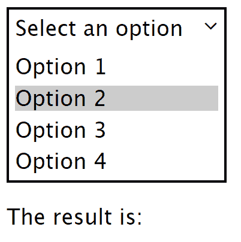
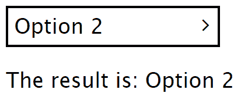

# 如何用 CSS 和 JavaScript 创建下拉菜单

> 原文：<https://www.freecodecamp.org/news/how-to-create-a-dropdown-menu-with-css-and-javascript/>

在本教程中，你将学习如何用普通的 Javascript、HTML 和 CSS 创建一个简单的下拉菜单。我们将遍历 HTML、CSS 和 Javascript 代码，但更多地关注编程，因为这是一个 JS 教程。我们将只使用普通的 JS 和 CSS，没有框架或预处理程序。唯一的例外是导入字体很棒的 CSS 文件，因为我们将使用它的一个图标。

这是针对对 HTML、CSS 和 JS 有一般理解的开发人员的。我试着让它尽可能的干净，但我不会在这里过多关注细节。我希望你们都喜欢。

## **截图**

代码结果如下所示:

初始屏幕:


打开的下拉列表:



选择了选项的下拉列表:



#### **HTML:**

在这一节中，我们将讨论演示页面的 HTML 代码的实现。首先，让我们看看`<head>`代码

```
<!DOCTYPE html>
<html lang="en">
<head>
	<meta charset="UTF-8">
	<meta name="viewport" content="width=device-width, initial-scale=1.0">
	<meta http-equiv="X-UA-Compatible" content="ie=edge">
	<title>Dropdown Example</title>

	<link rel="stylesheet" href="https://cdnjs.cloudflare.com/ajax/libs/'-awesome/4.7.0/css/font-awesome.min.css">
	<link rel="stylesheet" href="styles.css">
</head>
```

这基本上是 HTML 头样板文件，除了`link`标签加载我们将在本教程中使用的两个 CSS 样式表:字体 Awesome 样式和`styles.css`文件，我们将在其中定义该页面的样式。

然后，是 HTML 文件的其余部分，即主体:

```
<body>
	<div class='dropdown'>
		<div class='title pointerCursor'>Select an option <i class="fa fa-angle-right"></i></div>

		<div class='menu pointerCursor hide'>
			<div class='option' id='option1'>Option 1</div>
			<div class='option' id='option2'>Option 2</div>
			<div class='option' id='option3'>Option 3</div>
			<div class='option' id='option4'>Option 4</div>
		</div>

	</div>
	<span id='result'>The result is: </span>
	<script>
	  ...
	</script>
</body>
</html>
```

本节可分为 3 个主要部分:

*   `.dropdown` div，将在其中定义 dropdown 元素的结构。
*   `#result`元素，将包含用户从下拉元素中选择的选项。
*   将脚本写入`<script>`标签。这里隐藏了它的实现，因为它的细节将在本教程的最后一节解释。

下拉元素是一个包含一个`title`和`menu`元素的`div`。前者只是定义在选择任何选项之前元素上将显示什么文本，而后者将定义元素可选择的选项。

元素只是向您显示当前选择了什么选项。

#### **款式:**

下面你可以查看完整的 css 代码。如您所见，它使用了 CSS3 `transition`和`transform`构造。

请注意`.dropdown`类的定义。这些用于定义下拉容器组件的布局及其内部元素，比如`.title`和它的`.option`

```
body{
	font-family: 'Lucida Sans', 'Lucida Sans Regular', 'Lucida Grande', 'Lucida Sans Unicode', Geneva, Verdana, sans-serif;
}

.hide {
    max-height: 0 !important;
}

.dropdown{
	border: 0.1em solid black;
	width: 10em;
	margin-bottom: 1em;
}

.dropdown .title{
	margin: .3em .3em .3em .3em;	
	width: 100%;
}

.dropdown .title .fa-angle-right{
	float: right;
	margin-right: .7em;
	transition: transform .3s;
}

.dropdown .menu{
	transition: max-height .5s ease-out;
	max-height: 20em;
	overflow: hidden;
}

.dropdown .menu .option{
	margin: .3em .3em .3em .3em;
	margin-top: 0.3em;
}

.dropdown .menu .option:hover{
	background: rgba(0,0,0,0.2);
}

.pointerCursor:hover{
	cursor: pointer;
}

.rotate-90{
	transform: rotate(90deg);
}
```

#### **JavaScript:**

现在我们来看看 Javascript 部分是如何实现的。我们将首先查看函数定义，然后查看调用这些函数来执行下拉操作的代码。

基本上，当用户的侦听器被添加到 DOM 元素中时，根据用户交互的内容会发生 3 个动作:

1.  单击下拉元素
2.  选择一个下拉选项
3.  更改当前选定的选项

我想澄清一下，我们使用的是箭头函数(`() => {}`)和`const`关键字，它们是 ES6 的特性。如果你使用的是最新版本的浏览器，你可能很好，但是要记住这一点。

#### **1。点击下拉元素**

```
function toggleClass(elem,className){
	if (elem.className.indexOf(className) !== -1){
		elem.className = elem.className.replace(className,'');
	}
	else{
		elem.className = elem.className.replace(/\s+/g,' ') + 	' ' + className;
	}

	return elem;
}

function toggleDisplay(elem){
	const curDisplayStyle = elem.style.display;			

	if (curDisplayStyle === 'none' || curDisplayStyle === ''){
		elem.style.display = 'block';
	}
	else{
		elem.style.display = 'none';
	}
}

function toggleMenuDisplay(e){
	const dropdown = e.currentTarget.parentNode;
	const menu = dropdown.querySelector('.menu');
	const icon = dropdown.querySelector('.fa-angle-right');

	toggleClass(menu,'hide');
	toggleClass(icon,'rotate-90');
}
```

单击 dropdown 元素时，它会打开(如果关闭)或关闭(如果打开)。这是通过将`toggleMenuDisplay`绑定到 dropdown 元素上的 click 事件监听器来实现的。该功能通过使用`toggleDisplay`和`toggleClass`功能切换其`menu`元素的显示。

#### **2。选择一个下拉选项**

```
function handleOptionSelected(e){
	toggleClass(e.target.parentNode, 'hide');			

	const id = e.target.id;
	const newValue = e.target.textContent + ' ';
	const titleElem = document.querySelector('.dropdown .title');
	const icon = document.querySelector('.dropdown .title .fa');

	titleElem.textContent = newValue;
	titleElem.appendChild(icon);

	//trigger custom event
	document.querySelector('.dropdown .title').dispatchEvent(new Event('change'));
	//setTimeout is used so transition is properly shown
	setTimeout(() => toggleClass(icon,'rotate-90',0));
}
```

#### **3。改变当前选择的选项**

```
function handleTitleChange(e){
	const result = document.getElementById('result');

	result.innerHTML = 'The result is: ' + e.target.textContent;
}
```

函数`handleTitleChange`被绑定到`.title`元素上的自定义`change`事件，以便在标题元素改变时改变`#result`元素的内容。这个事件的触发是在前面的部分中完成的。

#### **主代码**

```
//get elements
const dropdownTitle = document.querySelector('.dropdown .title');
const dropdownOptions = document.querySelectorAll('.dropdown .option');

//bind listeners to these elements
dropdownTitle.addEventListener('click', toggleMenuDisplay);
dropdownOptions.forEach(option => option.addEventListener('click',handleOptionSelected));
document.querySelector('.dropdown .title').addEventListener('change',handleTitleChange);
```

在主要部分，只有一些简单的代码来获取下拉列表的标题和选项元素，以将它们绑定到上一部分讨论的事件。

## **演示**

这个应用程序的完整代码和演示可以在[这里](https://codepen.io/GCrispino/pen/EEXmYd)找到。

## **更多信息**

*   [ES6 简介](https://guide.freecodecamp.org/javascript/es6)
*   [箭头功能](https://guide.freecodecamp.org/javascript/es6/arrow_functions/)
*   [设常数](https://guide.freecodecamp.org/javascript/es6/let_and_const/)