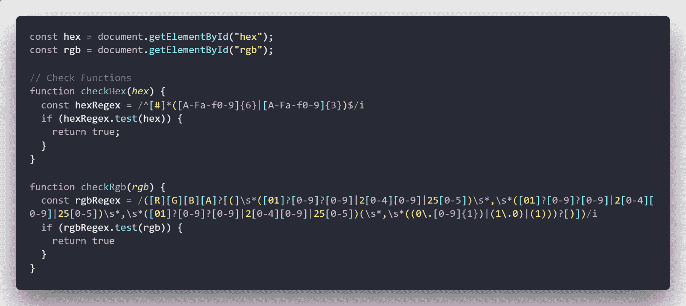
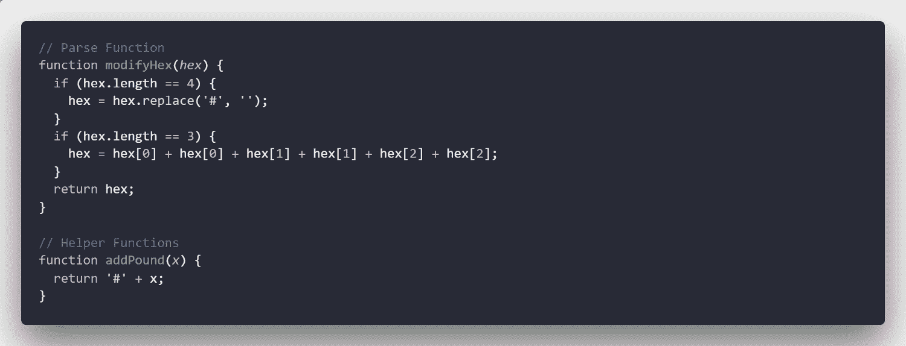
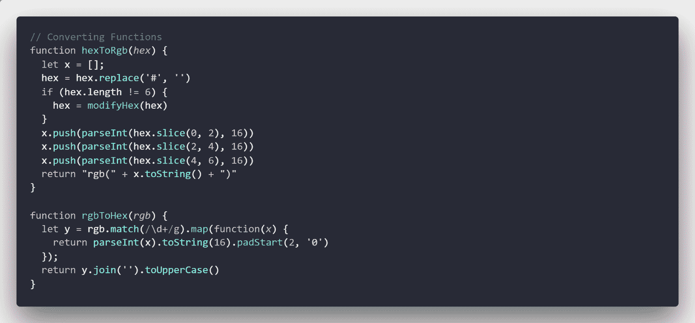
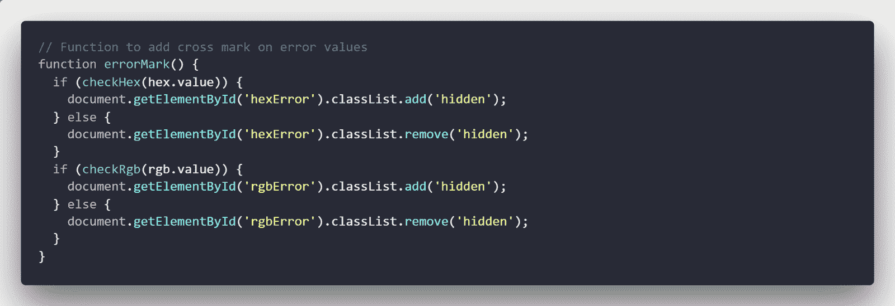
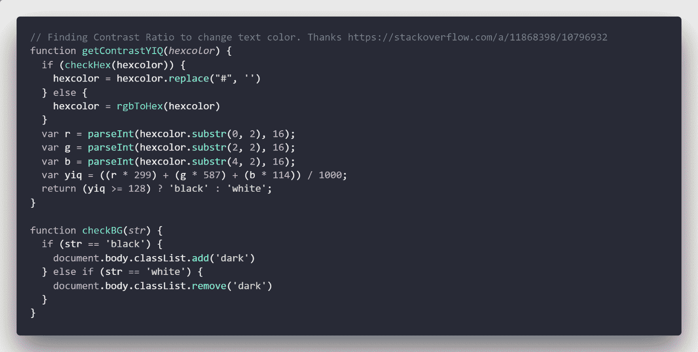
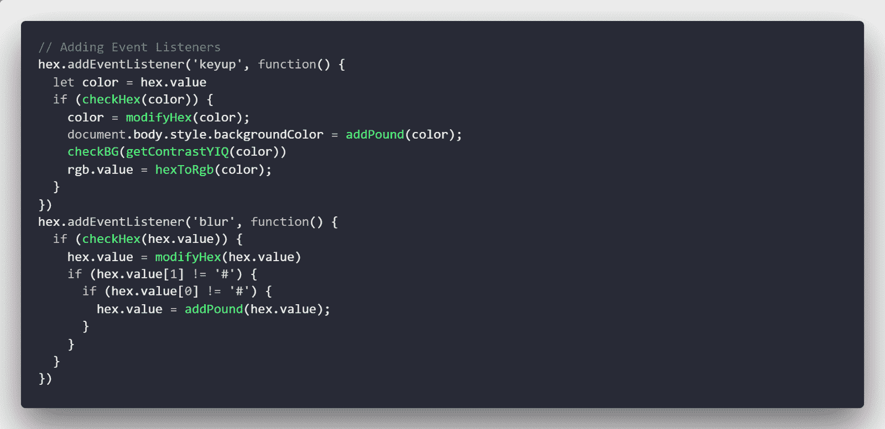
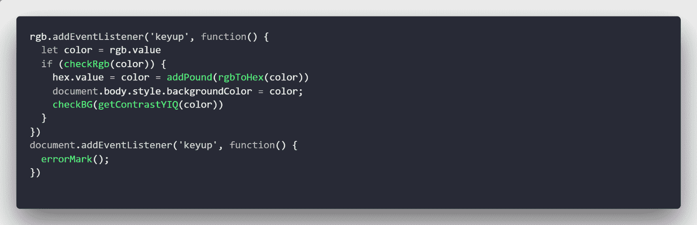

# 深入 JavaScript:如何创建 Hex2RGB 颜色转换器

> 原文：<https://www.freecodecamp.org/news/how-to-create-a-hex2rgb-color-converter-ce32d32afd1f/>

*更新(23/07/2019):我已经纠正了一些语法错误，并通过删除 checkBG 函数对 app.js 代码进行了一点修改。*

在本文中，我们将创建一个 web 应用程序，在十六进制格式和 RGB 格式之间转换颜色代码。

你可以在这里找到一个[演示，在这里](https://boxdox.github.io/hex2rgb/?source=post_page---------------------------)找到[源代码。](https://github.com/boxdox/hex2rgb?source=post_page---------------------------)

## 项目结构:

项目结构非常简单。

1.  `index.html`:包含 app 的结构。
2.  `style.css`:设置页面样式。
3.  `app.js`:包含所有的魔法代码。

## 想法:

以下是我希望这个应用程序执行的任务列表:

1.  每当在十六进制的文本字段中键入内容时，应用程序应该检查颜色是否有效。如果是，将其转换为 RGB，将其设置为背景，然后将 RGB 值放入 RGB 文本字段，反之亦然。
2.  如果在文本字段中键入了一个短的十六进制颜色代码，当文本字段失去焦点时(用户在文本区域外单击)展开它。
3.  自动在十六进制输入前添加“#”符号。

## 我们开始吧！

## index.html

```
<!DOCTYPE html>
<html lang="en">

<head>
  <meta charset="UTF-8">
  <meta name="viewport" content="width=device-width, initial-scale=1.0">
  <meta http-equiv="X-UA-Compatible" content="ie=edge">
  <title>Hex to RGB Converter</title>
  <link rel="stylesheet" href="style.css">
</head>

<body>
  <div class="head">
    HEX &lt;--&gt; RGB
  </div>
  <div id="content">
    <input type="text" id="hex" placeholder="hex">
    
    </br>
    <input type="text" id="rgb" placeholder="rgb">
    
  </div>
  <script src="app.js"></script>
</body>

</html>
```

我们创建了两个文本字段，id 分别为“hex”和“rgb”。每个输入旁边都有一个表示错误的 SVG 图标，默认情况下，它有一个隐藏类。

## style.css

```
:root {
     --color: rgba(255,255,255,0.9);
     --tweet: white;
}
 * {
     margin: 0;
     padding: 0;
     box-sizing: border-box;
}
 ::placeholder {
     color: var(--color)!important;
}
 body {
     padding: 50px;
     width: 100vw;
     height: 100vh;
     display: flex;
     align-items: center;
     justify-content: center;
     background-color: #28a745;
     font-family: -apple-system,BlinkMacSystemFont,"Segoe UI",Roboto,Oxygen-Sans,Ubuntu,Cantarell,"Helvetica Neue",sans-serif;
}
 .head {
     position: absolute;
     top: 30px;
     text-align: center;
     color: var(--tweet);
     font-size: 3rem;
     border-bottom: 2px solid var(--tweet);
}
 #content {
     display: block;
}
 input {
     color: var(--color)!important;
     margin: 1rem 0;
     width: 400px;
     border: none;
     border-bottom: 1px solid var(--color);
     font-size: 2.5rem;
     background-color: transparent;
}
 input:focus {
     outline: none;
}
 img {
     width: 24px;
}
 .hidden {
     visibility: hidden;
     opacity: 0.8;
}
 .dark {
     --color: rgba(0,0,0,0.75);
     --tweet: rgba(0,0,0,0.95);
}
 @media only screen and (max-width: 560px){
     #content input {
         margin: 0.75rem 0;
         width: 90%;
         font-size: 1.875rem;
    }
     #content img {
         width: 16px;
    }
     .head {
         font-size: 2rem;
    }
} 
```

这里有一个基本的布局，使标记看起来更好一点。我们在这里定义了两个类，`.hidden`和`.dark`。`.hidden`用于隐藏/显示错误 SVG 图标，`.dark`用于根据背景颜色改变文本颜色。默认情况下，我将文本设置为深色(用于明亮的背景)。

## app.js

神奇的部分来了。我将把代码分成几个部分:



首先，我们定义了以 id 为“hex”和“rgb”的输入为目标的变量。接下来，我们有函数来检查输入十六进制/RGB 是否有效。它们使用基本的正则表达式设置并返回一个布尔值。如果你被它们吓到了，我推荐你试试这个[reg extratory](http://regextutorials.com/?source=post_page---------------------------)。



这里，我们编写了一个名为`modifyHex`的解析函数，它检查输入的十六进制数是否为 4 个字符长；也就是说，包含“#”并且是简写的(例如，#333)并用空字符替换“#”。然后，它检查长度现在是否为 3，并将其扩展为 6 个字符长(例如，#123 = #112233)。



我们已经定义了两个将十六进制转换为 rgb 的函数，反之亦然。下面是对`hexToRgb`的逐步分解(为了更好地理解，这个过程以展开的形式编写):

1.  定义一个空数组来存储结果。
2.  替换' # '符号，如果存在，长度不等于 6(即简写版)，调用上面的`modifyHex`函数，展开。
3.  在一个非常基本的方法中，十六进制到 rgb 的工作原理是将十六进制代码(以 16 为基数)转换为 rgb 代码(以 10 为基数)。十六进制代码中的每两个字符代表 rgb 颜色代码中的一个值。例如在#aabbcc 中，红色是(aa 对基数 10)，绿色是(bb 对基数 10)，蓝色是(cc 对基数 10)。所以在函数中，我们对十六进制值进行切片，使用`parseInt`将其转换为基数为 10 的值，然后将其存储在定义的数组中。
4.  最后，我们通过连接上面的数组返回输出字符串。

对于`rgbToHex`功能(用较短的逻辑编写):

1.  我们直接使用正则表达式只提取数字值，也就是说，rgb(123，21，24)将返回 123，21，24。
2.  接下来，我们使用一个 map 函数返回一个新数组，它将数字转换为基数 16，然后填充该值。

我们上面使用的正则表达式返回“字符串”类型的数据。要将其转换为 16 进制，我们必须使用`toString()`方法，参数为‘16’。

现在，`toString()`方法只适用于数字数据类型，所以我们使用`parseInt`首先将数组的每个元素转换为数字，然后使用`toString(16)`将其转换为十六进制形式，最后添加填充符使其正好为 2 个字符长。填充是必要的，如果你有类似' 14 '的东西，你想转换成十六进制，它将返回' e '。但是十六进制色码每个部分需要 2 个字符，所以需要填充，这样就成了‘0e’。

**注意:** `**padStart**` **是 ES8 的一项功能，可能不是每个浏览器都支持。为了保持本教程简单，我没有把它转到 ES5。**

3.最后，我们通过连接并将其转换为大写来返回结果数组。



`errorMark()`功能用于显示或隐藏错误 SVG 图标。它只是通过各自的检查函数传递输入(`hex.value`和`rgb.value`)的内容，并使用返回的布尔值来添加/删除`.hidden`类。



现在我们定义一个函数，它获取背景颜色，然后决定它是暗还是亮(我从 StackOverflow 得到这个代码)。它将各个颜色值与一些计算出的数字相乘，并返回“黑色”或“白色”。然后我使用另一个函数通过添加/删除`.dark`类来改变文本颜色。

## 添加事件侦听器:



最后，我们通过添加事件监听器来连接所有的函数。

首先，我们将一个`keyup`事件添加到`hex`输入中。每次释放一个键都会触发此事件。流程如下:

1.  检查输入代码是否有效，如果是简写的就展开。
2.  将主体的背景颜色设置为输入值。
3.  检查颜色对比，并相应地更改文本颜色。
4.  调用 convert 函数，将转换后的颜色放入 RGB 输入字段。

我们使用的另一个事件监听器是`blur`。每当输入失去“焦点”时，或者通俗地说，每当您在输入元素外单击/轻击时，就会触发`blur`。所以修改输入十六进制很好！

所以，我们检查十六进制颜色是否有效，然后如果它很短，我们就扩展它，最后如果它不存在，我们就加一个' # '。请注意，我们正在检查索引 0 和 1 是否包含“#”。这样做是为了使函数不会在前面加上两次' # '。



相同的`keyup`事件监听器被添加到 RGB 输入，它也遵循与十六进制事件监听器相同的一系列步骤。

最后，我们向整个文档添加了一个事件监听器`keyup`，也就是说，它将被两个输入元素中的任何一个触发。在其中，我们调用了`errorMark`函数，该函数在出现错误的情况下添加错误图标，或者在一切都有效的情况下删除它。

下面是`app.js`的最终代码:

```
const hex = document.getElementById("hex");
const rgb = document.getElementById("rgb");

// Check Functions
function checkHex(hex) {
  const hexRegex = /^[#]*([A-Fa-f0-9]{6}|[A-Fa-f0-9]{3})$/i
  if (hexRegex.test(hex)) {
    return true;
  }
}

function checkRgb(rgb) {
  const rgbRegex = /([R][G][B][A]?[(]\s*([01]?[0-9]?[0-9]|2[0-4][0-9]|25[0-5])\s*,\s*([01]?[0-9]?[0-9]|2[0-4][0-9]|25[0-5])\s*,\s*([01]?[0-9]?[0-9]|2[0-4][0-9]|25[0-5])(\s*,\s*((0\.[0-9]{1})|(1\.0)|(1)))?[)])/i
  if (rgbRegex.test(rgb)) {
    return true
  }
}
// Parse Function
function modifyHex(hex) {
  if (hex.length == 4) {
    hex = hex.replace('#', '');
  }
  if (hex.length == 3) {
    hex = hex[0] + hex[0] + hex[1] + hex[1] + hex[2] + hex[2];
  }
  return hex;
}

// Converting Functions
function hexToRgb(hex) {
  let x = [];
  hex = hex.replace('#', '')
  if (hex.length != 6) {
    hex = modifyHex(hex)
  }
  x.push(parseInt(hex.slice(0, 2), 16))
  x.push(parseInt(hex.slice(2, 4), 16))
  x.push(parseInt(hex.slice(4, 6), 16))
  return "rgb(" + x.toString() + ")"
}

function rgbToHex(rgb) {
  let y = rgb.match(/\d+/g).map(function(x) {
    return parseInt(x).toString(16).padStart(2, '0')
  });
  return y.join('').toUpperCase()
}

// Helper Functions
function addPound(x) {
  return '#' + x;
}

// Function to add cross mark on error values
function errorMark() {
  if (checkHex(hex.value)) {
    document.getElementById('hexError').classList.add('hidden');
  } else {
    document.getElementById('hexError').classList.remove('hidden');
  }
  if (checkRgb(rgb.value)) {
    document.getElementById('rgbError').classList.add('hidden');
  } else {
    document.getElementById('rgbError').classList.remove('hidden');
  }
}

// Finding Contrast Ratio to change text color. Thanks https://stackoverflow.com/a/11868398/10796932
function getContrastYIQ(hexcolor) {
  if (checkHex(hexcolor)) {
    hexcolor = hexcolor.replace("#", '')
  } else {
    hexcolor = rgbToHex(hexcolor)
  }
  var r = parseInt(hexcolor.substr(0, 2), 16);
  var g = parseInt(hexcolor.substr(2, 2), 16);
  var b = parseInt(hexcolor.substr(4, 2), 16);
  var yiq = ((r * 299) + (g * 587) + (b * 114)) / 1000;
  return (yiq >= 128) ? document.body.classList.add('dark') : document.body.classList.remove('dark')
}

// Adding Event Listeners
hex.addEventListener('keyup', function() {
  let color = hex.value
  if (checkHex(color)) {
    color = modifyHex(color);
    document.body.style.backgroundColor = addPound(color);
    getContrastYIQ(color)
    rgb.value = hexToRgb(color);
  }
})
hex.addEventListener('blur', function() {
  if (checkHex(hex.value)) {
    hex.value = modifyHex(hex.value)
    if (hex.value[1] != '#') {
      if (hex.value[0] != '#') {
        hex.value = addPound(hex.value);
      }
    }
  }
})
rgb.addEventListener('keyup', function() {
  let color = rgb.value
  if (checkRgb(color)) {
    hex.value = color = addPound(rgbToHex(color))
    document.body.style.backgroundColor = color;
    getContrastYIQ(color)
  }
})
document.addEventListener('keyup', function() {
  errorMark();
})
```

# 结论

你有它！我知道代码并不完美，可以重构，但嘿，这只是开始。如果你想改进这段代码，你可以在我的 [github repo](https://github.com/boxdox/hex2rgb?source=post_page---------------------------) 上打开一个 PR。

编码快乐！