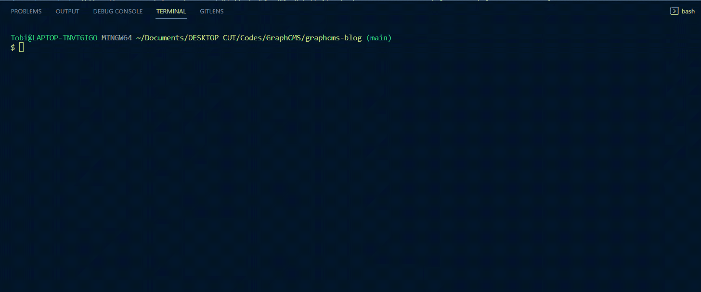
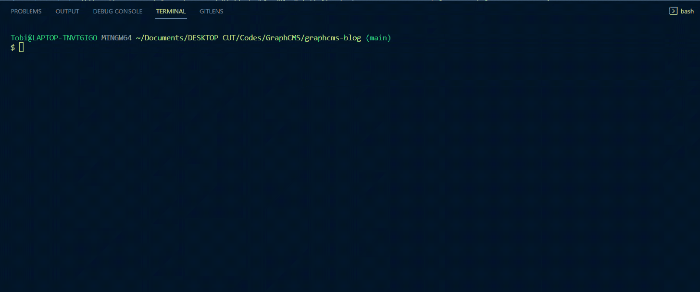

# 如何在 Git 中创建本地分支

> 原文：<https://www.freecodecamp.org/news/how-to-create-a-local-git-branch/>

当您对 Git 存储库进行更改时，最好的做法是先推进到不同的分支。这使您可以在提交“拉”请求并最终合并它之前比较更改。

这在与其他开发人员合作时尤为重要。

您的存储库的`main`分支，被认为是权威分支，是默认情况下存在的唯一分支。现在让我们快速回顾一下如何在 Git 中创建分支。

## 如何在 Git 中创建分支

本质上，Git 中有两种创建分支的方法。

您可以使用一个命令来创建分支并切换到它。或者，您可以先使用一个命令创建分支，然后当您希望使用它时，再使用另一个命令切换到它。

这是 TL。DR 代码的快速版本:

```
// create a branch and switch to the branch
$ git checkout -b <branch-name>

// create a branch only
$ git branch <branch-name> 
```

### 如何创建 Git 分支并切换到新分支

我们可以创建一个新的分支，并使用带有`-b`选项和`<branch-name>`的`git checkout`命令切换到它。看起来是这样的:

```
$ git checkout -b <branch-name> 
```

假设我们想从主分支创建一个名为“pagination”的新 Git 分支。为此，我们将使用带有“-b”选项的“git checkout”命令和分支名“pagination”。



如您所见，我们创建了一个新的分支，checkout 命令导致我们的分支自动从“main”切换到“pagination”。

现在让我们看看如何在不切换到 Git 的情况下创建 Git 分支。

### 如何在不切换到新分支的情况下创建 Git 分支

这是使用`git branch`命令创建分支并指定想要创建的 Git 分支的名称的标准方法。

```
$ git branch <branch-name> 
```

例如，正如我们前面所做的，我们可以通过将“<branch-name>”替换为“pagination”来创建“pagination”的分支。下面是它的样子:</branch-name>



正如我们所看到的，分支没有改变，但是新的分支创建了。要查看所有可用分支的列表，可以使用以下命令:

```
$ git branch 
```

最后，假设我们稍后希望切换到新的 Git 分支或者我们之前创建的任何其他分支。在这种情况下，我们可以使用`git checkout`命令。

```
$ git checkout <branch-name> 
```

## 结论

在本文中，我们学习了如何在终端中使用 Git 命令在本地创建分支。

如果我们想远程添加这个分支，我们所要做的就是使用下面的命令将它推送给 Git 提供者，比如 GitHub:

```
$ git push -u origin <branch-name> 
```

编码快乐！