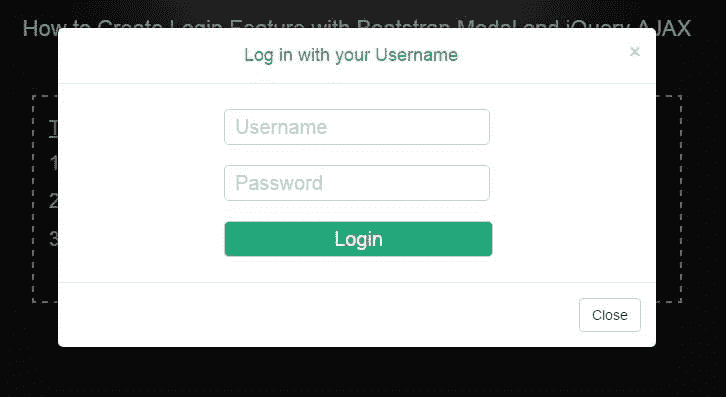
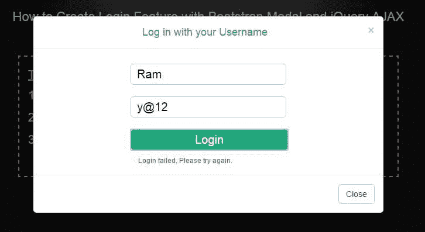
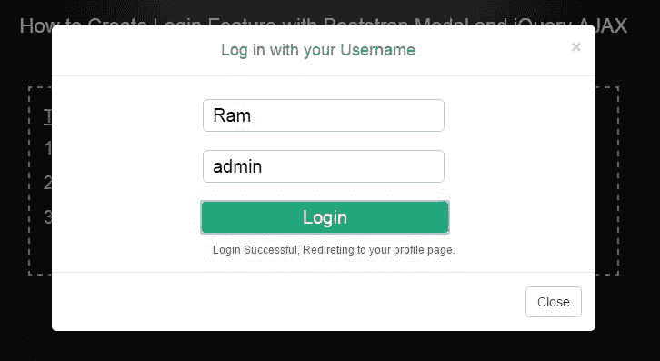

# 如何使用 Bootstrap Modal 和 jQuery AJAX 创建登录功能

> 原文：<https://www.freecodecamp.org/news/how-to-create-a-login-feature-with-bootstrap-modal-and-jquery-ajax-53dc0d281609/>

由瑜伽熊

Bootstrap model 是在你的网站上创建**登录表单**的一个很好的方法。在本教程中，您将学习如何使用 Bootstrap 为 ASP.NET 网站创建登录功能。登录检查功能将使用 jQuery AJAX 创建。

**我将逐步创建以下功能:**

1.将包含登录表单的引导模式。

2.登录表单将包含 2 个字段，“用户名”和“密码”。用户必须在这些字段中输入他们的值。

3.单击表单上的提交按钮，用户的输入(用户名和密码)将被发送到 C#函数。

4.这个 C#函数将检查用户名和密码是否正确。

5.如果它们是正确的，那么用户被重定向到个人资料页面。

#### [你可以在这里查看工作演示](http://www.demo.yogihosting.com/e/bootstrap-modal-login-form/)。

#### **使用登录表单创建引导模式**

在页头添加“bootstrap CSS，jQuery，bootstrap js”文件的引用。

```
<link rel="stylesheet" href="https://maxcdn.bootstrapcdn.com/bootstrap/3.3.7/css/bootstrap.min.css">
```

```
<script src="https://ajax.googleapis.com/ajax/libs/jquery/3.2.1/jquery.min.js"></script>
```

```
<script src="https://maxcdn.bootstrapcdn.com/bootstrap/3.3.7/js/bootstrap.min.js"></script>
```

接下来创建一个包含登录表单的引导模式:

```
<div class="container"><div class="validCredential">
```

```
<h3>Try any one of the following three:</h3><div><p>  1\. Username: Ram</p><p>  Password: admin</p></div>
```

```
<div><p>  2\. Username: Shiv</p><p>  Password: admin</p></div>
```

```
<div><p>  3\. Username: Krishna</p>
```

```
<p>  Password: admin</p></div>
```

```
</div>
```

```
<!-- The button that triggers the Modal --><button type="button" class="btn btn-info btn-lg" data-toggle="modal" data-target="#myModal">Open Modal</button>
```

```
<!-- Bootstrap Modal --><div id="myModal" class="modal fade" role="dialog">  <div class="modal-dialog">
```

```
 <!-- Modal content-->    <div class="modal-content">      <div class="modal-header">        <button type="button" class="close" data-dismiss="modal">×</button>        <h4 class="modal-title">Log in with your Username</h4>      </div>
```

```
 <div class="modal-body">        <table>          <tbody>            <tr>              <td>                <input type="text" id="userNameTextBox" placeholder="Username" />              </td>            </tr>            <tr>              <td>                <span id="userNamSpan"></span>              </td>            </tr>            <tr>              <td>                <input type="text" id="passwordTextBox" placeholder="Password" />              </td>            </tr>            <tr>              <td>                <span id="passwordSpan"></span>              </td>            </tr>            <tr>              <td>                <input type="button" id="submitButton" value="Login" />              </td>            </tr>            <tr>              <td>                <span id="messageSpan"></span>              </td>            </tr>            <tr>              <td>                              </td>            </tr>          </tbody>        </table>      </div>
```

```
 <div class="modal-footer">      <button type="button" class="btn btn-default" data-dismiss="modal">Close</button>    </div>  </div><!-- END Modal content--></div>
```

```
</div>
```

```
<!-- END Bootstrap Modal --></div>
```

这是引导模式登录表单的外观。



**Bootstrap Modal Login Form**

#### **在按钮点击事件上添加 jQuery 代码**

在按钮 click 中，我将强制用户在提交表单之前在用户名和密码字段中输入一些值。

当两个文本框都包含某个值时，我才会使用 [jQuery AJAX 方法](http://www.yogihosting.com/jquery-ajax/)调用 C#函数。使用这个方法，我将能够把两个文本框(用户名和密码)的值传递给我的 C#函数。

将下面的 jQuery 代码添加到页面中:

```
$("#submitButton").click(function (e) {
```

```
if ($("#userNameTextBox").val() == "")
```

```
$("#userNamSpan").text("Enter Username");
```

```
else
```

```
$("#userNamSpan").text("");
```

```
if ($("#passwordTextBox").val() == "")
```

```
$("#passwordSpan").text("Enter Password");
```

```
else
```

```
$("#passwordSpan").text("");
```

```
if (($("#userNameTextBox").val() != "") && ($("#passwordTextBox").val() != ""))
```

```
$.ajax({  type: "POST",  url: "index.aspx/login",  contentType: "application/json; charset=utf-8",  data: '{"username":"' + $("#userNameTextBox").val() + '","password":"' + $("#passwordTextBox").val() + '"}',  dataType: "json",  success: function (result, status, xhr) {    if (result.d == "Success") {      $("#messageSpan").text("Login Successful, Redireting to your profile page.");      setTimeout(function () { window.location = "profile.aspx"; }, 2000);    }    else      $("#messageSpan").text("Login failed, Please try again.");    },   error: function (xhr, status, error) {     $("#dbData").html("Result: " + status + " " + error + " " + xhr.status + " " + xhr.statusText)   }});
```

```
});
```

```
$(document).ajaxStart(function () {  $("#loadingImg").show();});
```

```
$(document).ajaxStop(function () {  $("#loadingImg").hide();});
```

在 success 回调方法中，您可以看到我正在将用户重定向到 **profile.aspx** 页面，前提是且仅当我收到“**成功**消息。

**setTimeout()** 是一个 JavaScript 函数，将在 2 秒内重定向到个人资料页面。

**下面两张图片将解释登录功能:**

> *1。登录失败时。*



**Login Failed for wrong Username and Password**

> *2。当登录成功时。*



**Login Successful when Username and Password are correct**

#### **c#代码:**

现在，在您的 **.aspx.cs** 页面中，添加以下代码:

```
[System.Web.Services.WebMethod]
```

```
public static string login(string username, string password)
```

```
{
```

```
var cred = LoadCredential();
```

```
var count = (from t in cred
```

```
where t.username == username && t.password == password
```

```
select t).Count();
```

```
if (count == 1)
```

```
{
```

```
HttpContext.Current.Session["User"] = username;
```

```
return "Success";
```

```
}
```

```
else
```

```
return "Failed";
```

```
}
```

```
class Credential
```

```
{
```

```
public string username { get; set; }
```

```
public string password { get; set; }
```

```
}
```

```
static List<Credential> LoadCredential()
```

```
{
```

```
List<Credential> credList = new List<Credential>();
```

```
Credential cred = new Credential();
```

```
cred.username = "Ram";
```

```
cred.password = "admin";
```

```
credList.Add(cred);
```

```
cred = new Credential();
```

```
cred.username = "Shiv";
```

```
cred.password = "admin";
```

```
credList.Add(cred);
```

```
cred = new Credential();
```

```
cred.username = "Krishna";
```

```
cred.password = "admin";
```

```
credList.Add(cred);
```

```
return credList;
```

```
}
```

login()函数是由 jQuery 方法调用的函数。它检查*用户名和密码是否正确*，然后返回适当的消息。

#### **CSS**

要设置登录表单和引导模式的样式以使它们看起来完美，请将以下 CSS 添加到您的页面中:

```
.btn {
```

```
margin: 15px 0;
```

```
}
```

```
#loadingImg {
```

```
display: none;
```

```
position: absolute;
```

```
margin: auto;
```

```
top: 0;
```

```
left: 0;
```

```
right: 0;
```

```
bottom: 0;
```

```
}
```

```
.validCredential h3 {
```

```
float: left;
```

```
text-decoration: underline;
```

```
}
```

```
.validCredential div {
```

```
clear: both;
```

```
}
```

```
.validCredential p {
```

```
float: left;
```

```
padding-right: 10px;
```

```
}
```

```
::-webkit-input-placeholder {
```

```
color: #ccc;
```

```
}
```

```
#myModal {
```

```
color: #1fa67b;
```

```
}
```

```
#myModal table {
```

```
position: relative;
```

```
margin: auto;
```

```
}
```

```
#myModal table input {
```

```
border-radius: 5px;
```

```
border: solid 1px #CCC;
```

```
margin: 10px;
```

```
padding: 3px 10px;
```

```
color: #000;
```

```
}
```

```
#myModal table input[type="button"] {
```

```
width: 94%;
```

```
background: #1fa67b;
```

```
color: #FFF;
```

```
}
```

```
#myModal table span {
```

```
float: left;
```

```
font-size: 12px;
```

```
color: #f00;
```

```
padding-left: 23px;
```

```
}
```

#### **个人资料页面**


**Welcome Message on the Profile Page**

在个人资料页面上，用户将收到欢迎消息。配置文件页面的代码如下:

```
<h1 id="welcomeMessage" runat="server"></h1>
```

```
if (!IsPostBack){  welcomeMessage.InnerHtml = "Welcome " + Session["User"] + " to the profile page.";}
```

> ***点击下面的链接查看工作演示:***

#### [工作演示](http://www.demo.yogihosting.com/e/bootstrap-modal-login-form/)

### **结论**

我希望你喜欢这个教程。如有任何问题，请随时联系我。如果你需要，我会在那里帮助你。如果你喜欢这个教程，请在你的社交账户上分享。

**我也发表了另一篇关于 freeCodeCamp 的教程，你也会想看的——[用这些不可思议的技巧](https://medium.freecodecamp.org/master-the-art-of-looping-in-javascript-with-these-incredible-tricks-a5da1aa1d6c5)掌握 JavaScript 中的循环艺术**