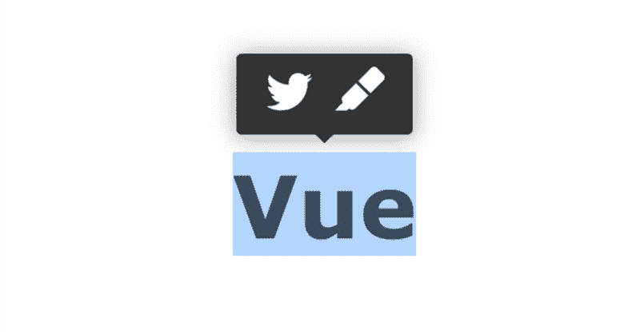
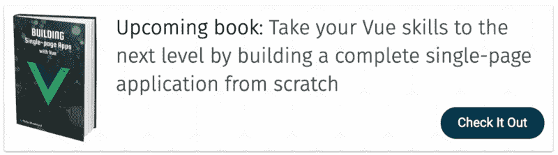

# 如何在 Vue 中创建一个类似媒体的高亮菜单

> 原文：<https://www.freecodecamp.org/news/how-to-create-a-medium-like-highlight-menu-in-vue-dc515f2dddef/>

作者:塔哈·沙斯塔里

# 如何在 Vue 中创建一个类似媒体的高亮菜单



在 [Medium](https://medium.com/) 中一个很酷的功能是当你选择一些文本时弹出的高亮菜单。此菜单包含允许您对所选文本执行某些操作的按钮，如高亮显示和共享。

如果您喜欢这个特性，并且希望在您的站点中拥有它，我将向您展示如何创建一个可重用的组件，在它包含的文本上实现这个行为。

您可以在 CodePen 上尝试现场演示:

*点击查看密码本[。](https://codepen.io/tahazsh/pen/WYywXW)*

### 使用 Vue CLI 3 创建新项目

有了 Vue CLI 3 [即时原型](https://cli.vuejs.org/guide/prototyping.html#vue-serve)，我们只需一个`*.vue`文件就能快速运行 Vue 应用。

请注意，这仅用于创建原型，不用于生产。

首先，确保您已经在全局范围内安装了该软件:

`npm install -g @vue/cli-service-global`

在这个应用中，我们只需要两个文件: *App.vue* 和 *Highlightable.vue* 。

*Highlightable.vue* 是我们可重复使用的高亮菜单组件。而 *App.vue* 是主页面组件。

在您想要的任何目录中创建这两个文件；然后，在 *App.vue* 上运行`vue serve`。

```
vue serve App.vue
```

### 实现 App.vue

在 *App.vue* 中，我们会添加两段。一个能突出，一个不能。

我们还将在创建之前导入并使用 *Highlightable.vue* 。(这有助于了解我们将如何使用它。)

最终应该是这样的:

```
<template>  <div class="app">    <highlightable      @share="onShare"      @highlight="onHighlight"    >      <p>        Lorem ipsum dolor sit amet, consectetur adipisicing elit. Eveniet at debitis deserunt, optio rem eaque obcaecati non possimus nisi assumenda architecto exercitationem dolore quo praesentium, deleniti reiciendis sed ab nihil!      </p>    </highlightable>    <p>      <strong>This paragraph can't be highlighted.</strong> Lorem ipsum dolor sit amet, consectetur adipisicing elit. Labore ipsam repellat, fugiat aut ex incidunt ut quisquam quasi consequatur ducimus quo in, cum soluta eos dolores tempore unde voluptate modi.    <;/p&gt;  </div></template&gt;<script>import Highlightable from './Highlightable'export default {  components: { Highlightable },  methods: {    onShare (text) {      console.log('share:', text)    },    onHighlight (text) {      console.log('highlight:', text)    }  }}</script><style scoped>* {  box-sizing: border-box;}.app {  width: 800px;  margin: 40px auto;  padding: 10px;  font-family: Verdana;  color: #333;  width: 100%;}p {  line-height: 1.5;}</style>
```

正如你在上面看到的，我们正在处理来自 *Highlightable* 的两个事件。这两个事件是高亮菜单中按钮的动作。这些只是例子。你可以把它们改成任何你想要的。

### 实现 Highlightable.vue

模板部分由两部分组成:带有按钮的菜单元素和显示文本的`<slo` t/ >。

让我们从*模板*中的这段代码开始:

```
<template>  <div>    <div      v-show="showMenu"      class="menu"    >      <span class="item">        Share      </span>      <span class="item">        Highlight      </span>      <!-- You can add more buttons here -->    </div>    <!-- The insterted text should be displayed here -->    <slot/>  </div></template>
```

请注意，我们正在使用尚未创建的`showMenu`来确定是否应该显示菜单。

现在让我们转到造型部分。

将以下 CSS 添加到`<sty` le >部分:

```
&lt;style scoped>.menu {  height: 30px;  padding: 5px 10px;  background: #333;  border-radius: 3px;  position: absolute;  top: 0;  left: 0;  transform: translate(-50%, -100%);  transition: 0.2s all;  display: flex;  justify-content: center;  align-items: center;}.menu:after {  content: '';  position: absolute;  left: 50%;  bottom: -5px;  transform: translateX(-50%);  width: 0;  height: 0;  border-left: 6px solid transparent;  border-right: 6px solid transparent;  border-top: 6px solid #333;}.item {  color: #FFF;  cursor: pointer;}.item:hover {  color: #1199ff;}.item + .item {  margin-left: 10px;}&lt;/style>
```

这里没有什么太复杂的。`.menu`用于高亮菜单。`menu:after`是菜单底部中间的小三角形(箭头)。

这里需要注意的一点是`.menu`有一个`absolute`位置。我们需要将它放置在所选文本的上方。

最后，我们转到`<scri` pt >部分。

让我们从*数据*开始。

```
export default {  data () {    return {      x: 0,      y: 0,      showMenu: false,      selectedText: ''    }  }}
```

*   `x`和`y`用于定位菜单。
*   `showMenu`显示/隐藏菜单。
*   `selectedText`将包含所选文本的实际内容。

现在，让我们移动到*计算的*。

```
computed: {  highlightableEl () {    return this.$slots.default[0].elm  }}
```

我们只有一个计算属性，它返回在*高亮*的 slot 部分使用的元素。在我们的例子中，它是`<`；p >标签被`tween <highlightable><`/高亮>。

然后，我们来添加`mounted`和`beforeDestroy`钩子函数。

```
mounted () {  window.addEventListener('mouseup', this.onMouseup)},beforeDestroy () {  window.removeEventListener('mouseup', this.onMouseup)}
```

我们使用这些来监听在`onMouseup`方法中处理的`mouseup`事件。

现在，让我们创建`onMouseup`方法。

```
methods: {  onMouseup () {    const selection = window.getSelection()    const selectionRange = selection.getRangeAt(0)    // startNode is the element that the selection starts in    const startNode = selectionRange.startContainer.parentNode    // endNode is the element that the selection ends in    const endNode = selectionRange.endContainer.parentNode    // if the selected text is not part of the highlightableEl (i.e. <p>)    // OR    // if startNode !== endNode (i.e. the user selected multiple paragraphs)    // Then    // Don't show the menu (this selection is invalid)    if (!startNode.isSameNode(this.highlightableEl) || !startNode.isSameNode(endNode)) {      this.showMenu = false      return    }    // Get the x, y, and width of the selection    const { x, y, width } = selectionRange.getBoundingClientRect()    // If width === 0 (i.e. no selection)    // Then, hide the menu    if (!width) {      this.showMenu = false      return    }    // Finally, if the selection is valid,    // set the position of the menu element,    // set selectedText to content of the selection    // then, show the menu    this.x = x + (width / 2)    this.y = y + window.scrollY - 10    this.selectedText = selection.toString()    this.showMenu = true  }}
```

现在让我们更新 *Highlightable.vue* 的模板，以反映新的变化。

```
<template>  <div>    <div      v-show="showMenu"      class="menu"      :style="{        left: `${x}px`,        top: `${y}px`      }"      @mousedown.prevent=""    >      <span        class="item"        @mousedown.prevent="handleAction('share')"      >        Share      </span>      <span        class="item"        @mousedown.prevent="handleAction('highlight')"      >        Highlight      </span>      <!-- You can add more buttons here -->    </div>    <!-- The insterted text should be displayed here -->    <slot/>  </div></template>
```

这些变化是:

*   将位置应用于菜单元素。
*   在菜单元素中添加了`@mousedown.prevent=""`以防止在菜单中点击时关闭菜单。
*   在分享按钮上增加了`@mousedown.prevent="handleAction('share')"`来处理点击的动作。高亮动作也是如此。

注意，我们使用`mousedown`事件而不是`click`来防止文本被取消选择——这将导致菜单关闭。

我们要做的最后一件事是添加`handleAction`方法。

```
handleAction (action) {  this.$emit(action, this.selectedText)}
```

这个方法发出`action`事件并传递选中的文本。(我们在 *App.vue* 中用过这个事件，记得吗？)

就这样，我们结束了！现在您有了一个可重用的组件，可以用来显示选中文本的高亮菜单，就像 Medium 一样。

*感谢阅读！顺便说一下，我正在写一本关于如何使用 Vue 从头开始构建一个完整的单页应用程序的书。如果你有兴趣了解更多关于这本书的内容，请查看这本书的登陆页面:*

