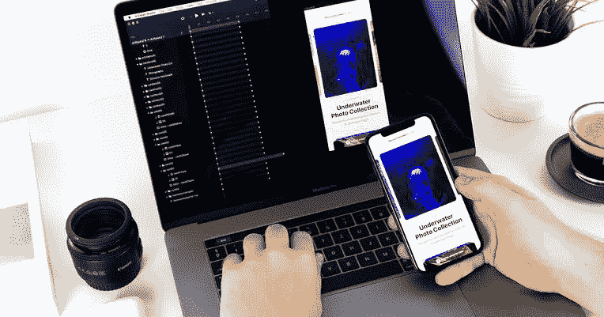

# 如何创建一个比竞争对手更聪明的移动应用

> 原文：<https://www.freecodecamp.org/news/how-to-create-a-mobile-app-that-outsmarts-the-competitors/>

这些年来，人们花在手机上的时间增加了，使用移动设备的人数也增加了。

可以肯定的说[移动](https://www.freecodecamp.org/news/the-best-linux-tutorials/)几乎已经完全接管了桌面。随着越来越多的用户转向移动设备，创建能够提供无缝和引人入胜的移动体验的应用变得至关重要。

对于一个企业来说，一个应用程序可以在很多方面有所帮助。其中包括:

*   提高销售额和创收。
*   通过向受众提供资源来建立社区并增加参与度。
*   利用内部业务应用改善员工沟通。
*   改善移动营销策略，提高品牌知名度。

尽管它有许多积极的方面，创建一个应用程序可能是乏味和令人生畏的。这也可能是昂贵的，有风险的，而且可能要花很多时间。

但如果你把应用程序做得足够好，它最终会物有所值。要创建一个在竞争中胜出的智能手机应用程序，这里有一些提示。

## 定义应用目标

在你开始创建一个移动应用程序之前，第一步就是定义你的理由，清楚地陈述应用程序的目标。

如果你对这样的小细节没有清晰的认识，会影响你的规划和 app 搭建。最后，你不太可能得到你想要的。

你的应用程序必须满足两件事。一是用户的理想目标，二是你做生意的目的。

为了确定这些，你必须问自己一些具体的问题:

*   你的业务的哪些部分需要改进？
*   应用程序如何帮助解决问题？
*   你可能会得到什么样的结果？

你还必须考虑的其他业务领域包括预算、时间表、市场调研等等。

## 陈述应用程序的功能和特点

在清楚地陈述你的应用程序的目的和目标后，你的下一步将是定义你的移动应用程序的[范围。在这一点上，你开始决定应用程序将会是什么样子，它将会有什么功能。](https://mindsea.com/how-to-build-a-mobile-app/)

你需要有创造力，列出必要的功能和特性来达到你想要的结果。

您的应用程序中可能包含的一些功能有:

*   电子商务集成
*   社交分享
*   闲谈
*   推送通知
*   形式
*   联系方式

写下所有有价值的特性，并让它指导你完成应用程序开发过程。

## 研究应用竞赛

尽管你已经确定了你在构建什么，你的应用需要什么，你可能还是想看看你最成功的竞争对手。考虑他们正在用他们的应用做什么，以及它如何帮助他们达到类似的目标。

一定不要只看你当地的竞争对手。研究同行业中的一些大公司，它们在你的国家或世界其他地方拥有相似的受众。有了这个，你就可以得到灵感，获得可以在市场上使用的新想法。

你必须考虑的一些事情是应用程序的布局、特性和功能。留意其他突出的东西或你可能遗漏的东西。

## 规划移动应用的 UX 和用户之旅

UX of an App

[移动应用](https://buildfire.com/how-to-create-a-mobile-app/)的成功很大程度上取决于应用的用户体验。你必须确保你的应用程序的功能符合用户的需求和期望。你必须提前计划你的用户体验。

如果你不规划应用程序的用户体验，你就不会知道这个应用程序有多复杂。你也不会意识到你需要投入多少时间来开发应用程序。最终，在用户测试期间，你不会有任何有形的东西来呈现。

确保用户对应用程序有较低的 UX 阻力。这里的主要目标是确保他们以最有效和最直观的方式找到解决方案。

如果您在开始正确构建之前没有花时间规划 UX，您的用户可能会在使用应用程序时遇到困难。那么你将需要花费更多的资源和时间来解决问题。

一个成功的应用和一个不成功的应用的显著区别是用户体验。糟糕的用户体验可能源于在构建应用程序时犯了一些可以避免的错误。为了获得良好的用户体验，需要避免的一些错误有:

### 不了解用户的需求

构建一个好的应用程序的基础是理解用户需要什么。了解你的受众是至关重要的。你要考虑用户的痛点，你的 app 如何优于你的竞争对手，还有界面。

### 添加太多功能

如果这是你第一次[开发手机应用](https://www.google.com/url?sa=t&source=web&rct=j&url=https://brainiuminfotech.com/blog/mobile-app-development-small-business-get-right/&ved=2ahUKEwjw4MC04c3qAhWJSsAKHehNDVoQFjAKegQIAhAB&usg=AOvVaw0nk8eCEnSAMUERPZjXcsu7)，你可能会被诱惑添加许多你认为很酷的功能。

但这实际上与大多数时候用户体验不佳有关。这些功能会让用户不知所措，让他们放弃你的应用。

### 创建糟糕和混乱的导航

无论入职体验有多好，如果用户不能轻松找到他们想要的东西，那么你的应用就没什么用。

你的应用程序应该有清晰的导航，即使是第一次使用的用户也可以很容易地做他们想做的事情。导航有不同的类型，所以你必须选择你认为对你的应用最直观的。

其他可能导致用户体验不佳的错误有:

*   忽略了初次用户的体验。
*   用户界面过度拥挤
*   使用用户不理解的行话和术语。

## 启动应用程序

创建移动应用程序的最后一步是启动应用程序。发布后，你应该接受用户的反馈，并根据用户体验定期更新应用程序。

## 结论

创建一个移动应用程序需要大量的时间、精力和资源。因此，如果你想创造一个比竞争对手更聪明的产品，你必须做得更多。这需要付出很多努力，我们在本文中强调了一些你应该做的关键事情。

无论如何，一定要把用户体验放在第一位。专注于让他们满意，用应用解决他们的问题，你已经成功了一半。