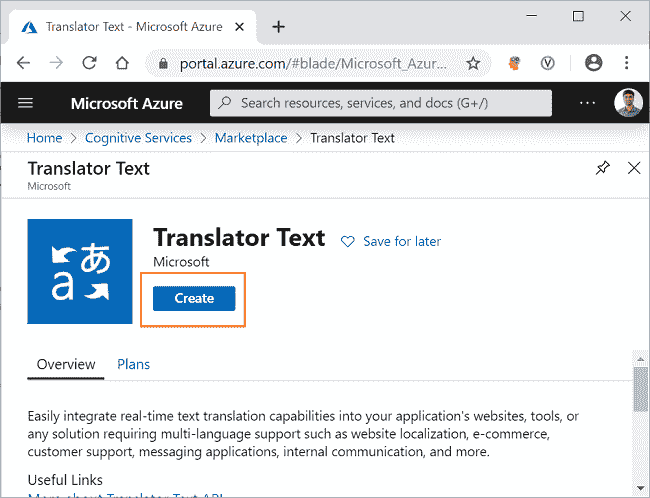
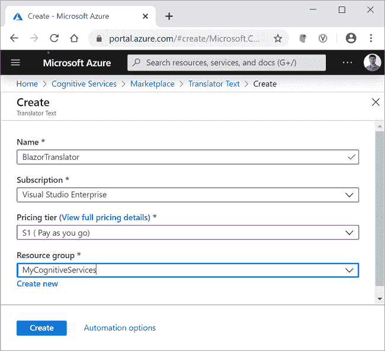
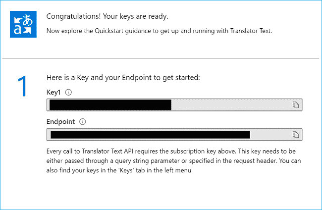
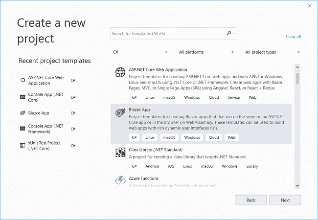
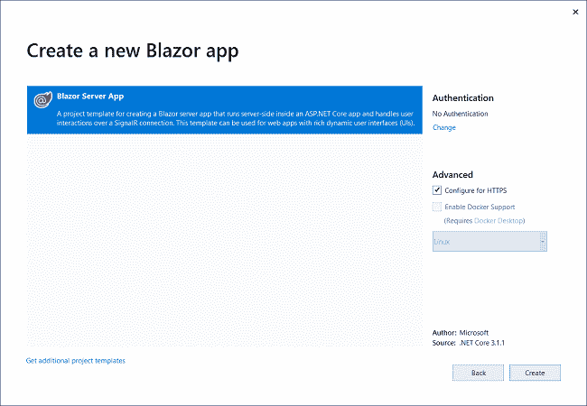
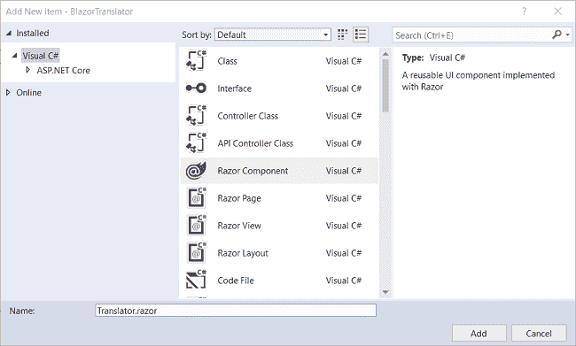
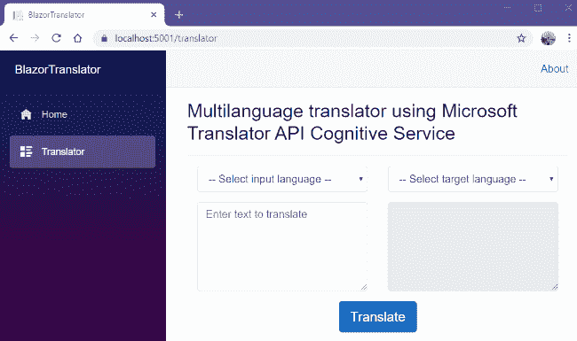

# 如何使用 Blazor 和 Azure 认知服务创建多语言翻译器

> 原文：<https://www.freecodecamp.org/news/how-to-create-a-multi-language-translator-using-blazor-and-azure-cognitive-services/>

## 介绍

在本文中，我们将使用 Blazor 和 Translate Text Azure 认知服务创建一个多语言翻译器。

这个翻译器将能够在翻译文本 API 支持的所有语言之间进行翻译。目前，翻译文本 API 支持 60 多种语言的翻译。

应用程序将接受要翻译的文本和目标语言作为输入，并将翻译后的文本和检测到的输入文本语言作为输出返回。

看看下面显示的输出。


## 先决条件

*   安装最新版本。来自[https://dotnet.microsoft.com/download/dotnet-core/3.1](https://dotnet.microsoft.com/download/dotnet-core/3.1)的 NET Core 3.1 SDK
*   从[https://visualstudio.microsoft.com/downloads/](https://visualstudio.microsoft.com/downloads/)安装最新版本的 Visual Studio 2019
*   Azure 订阅帐户。您可以在[https://azure.microsoft.com/en-in/free/](https://azure.microsoft.com/en-in/free/)创建一个免费的 Azure 账户

## 源代码

可以从 [GitHub](https://github.com/AnkitSharma-007/Blazor-Translator-Azure-Cognitive-Services) 获取源代码。

## 创建 Azure 翻译文本认知服务资源

登录 Azure 门户，在搜索栏中搜索认知服务，然后点击结果。请参考下图。


在下一个屏幕上，点击`Add`按钮。这将打开认知服务市场页面。在搜索栏中搜索`Translator Text`并点击搜索结果。它将打开翻译器文本 API 页面。点击`Create`按钮创建一个新的翻译文本资源。请参考下图。



在`Create`页面上，填写如下所示的详细信息。

*   名称:为您的资源指定一个唯一的名称。
*   订阅:从下拉列表中选择订阅类型。
*   定价等级:根据您的选择选择定价等级。
*   资源组:选择现有的资源组或创建新的资源组。

点击`Create`按钮。请参考下图。



成功部署资源后，单击“转到资源”按钮。您可以看到新创建的 Translator 文本资源的键和端点。请参考下图。



记下这个键，因为我们将在本文的后半部分使用它从 Translator Text API 请求翻译。为了保密，这里的值被屏蔽了。

## 创建一个服务器端 Blazor 应用程序

打开 Visual Studio 2019，点击“新建项目”。选择“Blazor App”并点击“下一步”按钮。请参考下图。



在下一个窗口中，将项目名称设为`BlazorTranslator`,然后单击“创建”按钮。下一个窗口将要求您选择 Blazor 应用程序的类型。选择`Blazor Server App`并点击 Create 按钮来创建一个新的服务器端 Blazor 应用程序。请参考下图。



## 创建模型

右键点击`BlazorTranslator`项目并选择添加> >新文件夹。将文件夹命名为 Models。同样，右击 Models 文件夹并选择 Add > > Class 来添加一个新的类文件。将您的类命名为`LanguageDetails.cs`,然后单击 Add。

打开`[LanguageDetails.cs](https://github.com/AnkitSharma-007/Blazor-Translator-Azure-Cognitive-Services/blob/master/BlazorTranslator/Models/LanguageDetails.cs)`，把下面的代码放进去。

```
namespace BlazorTranslator.Models
{
    public class LanguageDetails
    {
        public string Name { get; set; }
        public string NativeName { get; set; }
        public string Dir { get; set; }
    }
}
```

类似地，添加一个新的类文件`[TextResult.cs](https://github.com/AnkitSharma-007/Blazor-Translator-Azure-Cognitive-Services/blob/master/BlazorTranslator/Models/TextResult.cs)`，并将下面的代码放入其中。

```
using System;
namespace BlazorTranslator.Models
{
    public class TextResult
    {
        public string Text { get; set; }
        public string Script { get; set; }
    }
}
```

添加一个新的类文件`[Translation.cs](https://github.com/AnkitSharma-007/Blazor-Translator-Azure-Cognitive-Services/blob/master/BlazorTranslator/Models/Translation.cs)`，并将下面的代码放入其中。

```
namespace BlazorTranslator.Models
{
    public class Translation
    {
        public string Text { get; set; }
        public TextResult Transliteration { get; set; }
        public string To { get; set; }
    }
}
```

创建一个类文件`[DetectedLanguage.cs](https://github.com/AnkitSharma-007/Blazor-Translator-Azure-Cognitive-Services/blob/master/BlazorTranslator/Models/DetectedLanguage.cs)`并将下面的代码放入其中。

```
namespace BlazorTranslator.Models
{
    public class DetectedLanguage
    {
        public string Language { get; set; }
        public float Score { get; set; }
    }
}
```

创建一个类文件`[TranslationResult.cs](https://github.com/AnkitSharma-007/Blazor-Translator-Azure-Cognitive-Services/blob/master/BlazorTranslator/Models/TranslationResult.cs)`并将下面的代码放入其中。

```
namespace BlazorTranslator.Models
{
    public class TranslationResult
    {
        public DetectedLanguage DetectedLanguage { get; set; }
        public TextResult SourceText { get; set; }
        public Translation[] Translations { get; set; }
    }
}
```

最后，创建类文件`[AvailableLanguage.cs](https://github.com/AnkitSharma-007/Blazor-Translator-Azure-Cognitive-Services/blob/master/BlazorTranslator/Models/AvailableLanguage.cs)`，并将下面的代码放入其中。

```
using System.Collections.Generic;

namespace BlazorTranslator.Models
{
    public class AvailableLanguage
    {
      public Dictionary<string, LanguageDetails> Translation { get; set; }
    }
}
```

## 创建翻译服务

右键单击`BlazorTranslator/Data`文件夹并选择添加> >类来添加一个新的类文件。将文件名设为`TranslationService.cs`,然后点击 Add。打开`[TranslationService.cs](https://github.com/AnkitSharma-007/Blazor-Translator-Azure-Cognitive-Services/blob/master/BlazorTranslator/Data/TranslationService.cs)`文件，将下面的代码放入其中。

```
using BlazorTranslator.Models;
using Newtonsoft.Json;
using System;
using System.Net.Http;
using System.Text;
using System.Threading.Tasks;

namespace BlazorTranslator.Data
{
    public class TranslationService
    {
        public async Task<TranslationResult[]> GetTranslatation(string textToTranslate, string targetLanguage)
        {
            string subscriptionKey = "af19d996a3cb4a70a808567aad5bc41a";
            string apiEndpoint = "https://api.cognitive.microsofttranslator.com/";
            string route = $"/translate?api-version=3.0&to={targetLanguage}";
            string requestUri = apiEndpoint + route;
            TranslationResult[] translationResult = await TranslateText(subscriptionKey, requestUri, textToTranslate);
            return translationResult;
        }

        async Task<TranslationResult[]> TranslateText(string subscriptionKey, string requestUri, string inputText)
        {
            object[] body = new object[] { new { Text = inputText } };
            var requestBody = JsonConvert.SerializeObject(body);

            using (var client = new HttpClient())
            using (var request = new HttpRequestMessage())
            {
                request.Method = HttpMethod.Post;
                request.RequestUri = new Uri(requestUri);
                request.Content = new StringContent(requestBody, Encoding.UTF8, "application/json");
                request.Headers.Add("Ocp-Apim-Subscription-Key", subscriptionKey);

                HttpResponseMessage response = await client.SendAsync(request).ConfigureAwait(false);
                string result = await response.Content.ReadAsStringAsync();
                TranslationResult[] deserializedOutput = JsonConvert.DeserializeObject<TranslationResult[]>(result);

                return deserializedOutput;
            }
        }

        public async Task<AvailableLanguage> GetAvailableLanguages()
        {
            string endpoint = "https://api.cognitive.microsofttranslator.com/languages?api-version=3.0&scope=translation";
            var client = new HttpClient();
            using (var request = new HttpRequestMessage())
            {
                request.Method = HttpMethod.Get;
                request.RequestUri = new Uri(endpoint);
                var response = await client.SendAsync(request).ConfigureAwait(false);
                string result = await response.Content.ReadAsStringAsync();

                AvailableLanguage deserializedOutput = JsonConvert.DeserializeObject<AvailableLanguage>(result);

                return deserializedOutput;
            }
        }
    }
}
```

我们已经定义了一个`GetTranslatation`方法，它将接受两个参数——要翻译的文本和目标语言。我们将为 Azure Translator 文本认知服务设置订阅密钥，并为 Translator 文本的全局端点定义一个变量。请求 URL 包含 API 端点和目标语言。

在`TranslateText`方法中，我们将创建一个新的`HttpRequestMessage`。这个 HTTP 请求是一个 Post 请求。我们将在请求的头部传递订阅密钥。翻译器文本 API 返回一个 JSON 对象，该对象将被反序列化为一个类型为`TranslationResult`的数组。输出包含翻译后的文本以及为输入文本检测到的语言。

方法将返回翻译文本 API 支持的所有语言的列表。我们将设置请求 URI 并创建一个`HttpRequestMessage`,这将是一个 Get 请求。这个请求 URL 将返回一个 JSON 对象，该对象将被反序列化为一个类型为`AvailableLanguage`的对象。

## 配置服务

为了使服务对组件可用，我们需要在服务器端应用程序上配置它。打开`Startup.cs`文件。在 Startup 类的`[ConfigureServices](https://github.com/AnkitSharma-007/Blazor-Translator-Azure-Cognitive-Services/blob/master/BlazorTranslator/Startup.cs#L28)`方法中添加下面一行。

```
services.AddSingleton<TranslationService>();
```

## 创建 Blazor UI 组件

我们将在`BlazorTranslator/Pages`文件夹中添加 Razor 页面。默认情况下，我们在应用程序中提供了“计数器”和“获取数据”页面。这些默认页面不会影响我们的应用程序，但是出于本教程的考虑，我们将从`BlazorTranslator/Pages`文件夹中删除 fetchdata 和 counter 页面。

右击`BlazorTranslator/Pages`文件夹，然后选择添加> >新项目。将会打开一个“添加新项目”对话框，从左侧面板中选择“Visual C#”，然后从模板面板中选择“Razor Component”，将名称设为`Translator.razor`。点击`Add`。请参考下图。



打开`[Translator.razor](https://github.com/AnkitSharma-007/Blazor-Translator-Azure-Cognitive-Services/blob/master/BlazorTranslator/Pages/Translator.razor)`文件，在顶部添加以下代码。

```
@page "/translator"
@using BlazorTranslator.Models
@using BlazorTranslator.Data
@inject TranslationService translationService
```

我们已经为该组件定义了路线。我们还在这个组件中注入了`TranslationService`。

现在，我们将在该文件中添加以下 HTML 代码。

```
<h3>Multilanguage translator using Microsoft Translator API Cognitive Service</h3>
<hr />

<div class="container">
    <div class="row">
        <div class="col-md-6">
            <select class="form-control" @bind="inputLanguage">
                <option value="">-- Select input language --</option>
                @foreach (KeyValuePair<string, LanguageDetails> lang in LanguageList)
                {
                    <option value="@lang.Key">@lang.Value.Name</option>
                }
            </select>
            <textarea placeholder="Enter text to translate" class="form-control translation-box" rows="5" @bind="@inputText"></textarea>
        </div>
        <div class="col-md-6">
            <select class="form-control" @onchange="SelectLanguage">
                <option value="">-- Select target language --</option>
                @foreach (KeyValuePair<string, LanguageDetails> lang in LanguageList)
                {
                    <option value="@lang.Key">@lang.Value.Name</option>
                }
            </select>
            <textarea disabled class="form-control translation-box" rows="5">@outputText</textarea>
        </div>
    </div>
    <div class="text-center">
        <button class="btn btn-primary btn-lg" @onclick="Translate">Translate</button>
    </div>
</div>
```

我们定义了两个下拉列表，分别用于输入语言和目标语言。Azure Translate Text API 将检测输入语言，我们将使用该值填充输入语言的下拉列表。我们还为输入和翻译的文本定义了两个文本区域。

最后，在页面的`@code`部分添加以下代码。

```
@code {
    private TranslationResult[] translations;
    private AvailableLanguage availableLanguages;

    private string outputLanguage { get; set; }
    private string inputLanguage { get; set; }

    string inputText { get; set; }
    string outputText { get; set; }

    private Dictionary<string, LanguageDetails> LanguageList = new Dictionary<string, LanguageDetails>();

    protected override async Task OnInitializedAsync()
    {
        availableLanguages = await translationService.GetAvailableLanguages();
        LanguageList = availableLanguages.Translation;
    }

    private void SelectLanguage(ChangeEventArgs langEvent)
    {
        this.outputLanguage = langEvent.Value.ToString();
    }

    private async Task Translate()
    {
        if (!string.IsNullOrEmpty(outputLanguage))
        {
            translations = await translationService.GetTranslatation(this.inputText, this.outputLanguage);
            outputText = translations[0].Translations[0].Text;
            inputLanguage = translations[0].DetectedLanguage.Language;
        }
    }
}
```

我们从`OnInitializedAsync`内部的服务中调用`GetAvailableLanguages`方法。这个`OnInitializedAsync`是一个生命周期方法，将在组件初始化时被调用。这将确保语言下拉列表在页面加载时被填充。

`SelectLanguage`方法将为翻译设置`outputLanguage`。翻译方法将从服务中调用`GetTranslatation`方法。我们将设置从服务返回的`inputLanguage`的`outputText`和检测到的语言。

## 为转换器组件添加样式

导航到`[BlazorTranslator\wwwroot\css\site.css](https://github.com/AnkitSharma-007/Blazor-Translator-Azure-Cognitive-Services/blob/master/BlazorTranslator/wwwroot/css/site.css#L185-L187)`文件，并将以下样式定义放入其中。

```
.translation-box {
    margin: 15px 0px;
} 
```

## 向导航菜单添加链接

最后一步是在导航菜单中添加我们的翻译组件的链接。打开`[BlazorTranslator/Shared/NavMenu.razor](https://github.com/AnkitSharma-007/Blazor-Translator-Azure-Cognitive-Services/blob/master/BlazorTranslator/Shared/NavMenu.razor#L15-L19)`文件，添加以下代码。

```
<li class="nav-item px-3">
	<NavLink class="nav-link" href="translator">
		<span class="oi oi-list-rich" aria-hidden="true"></span> Translator
	</NavLink>
</li>
```

删除计数器和提取数据组件的导航链接，因为此应用程序不需要它们。

## 执行演示

按 F5 启动应用程序。点击左边导航菜单上的翻译按钮。您可以执行多语言翻译，如下图所示。



## 摘要

我们在 Azure 上创建了一个翻译文本认知服务资源。我们已经使用翻译文本 API 创建了一个使用 Blazor 的多语言翻译程序。这个翻译器支持 60 多种语言的翻译。我们从翻译文本的全局 API 端点获取了支持翻译的语言列表。

从 [GitHub](https://github.com/AnkitSharma-007/Blazor-Translator-Azure-Cognitive-Services) 中获取源代码，并进行试验，以便更好地理解。

## 请参见

*   [使用 Blazor 和计算机视觉的光学字符阅读器](https://ankitsharmablogs.com/optical-character-reader-using-blazor-and-computer-vision/)
*   [服务器端 Blazor 应用中的脸书认证和授权](https://ankitsharmablogs.com/facebook-authentication-and-authorization-in-server-side-blazor-app/)
*   [服务器端 Blazor 应用中的谷歌认证和授权](https://ankitsharmablogs.com/google-authentication-and-authorization-in-server-side-blazor-app/)
*   [使用谷歌云 Firestore 的 Blazor CRUD】](https://ankitsharmablogs.com/blazor-crud-using-google-cloud-firestore/)
*   [在 Firebase 上托管 Blazor 应用](https://ankitsharmablogs.com/hosting-a-blazor-application-on-firebase/)
*   [使用 i18n 工具进行角度定位](https://ankitsharmablogs.com/localization-in-angular-using-i18n-tools/)