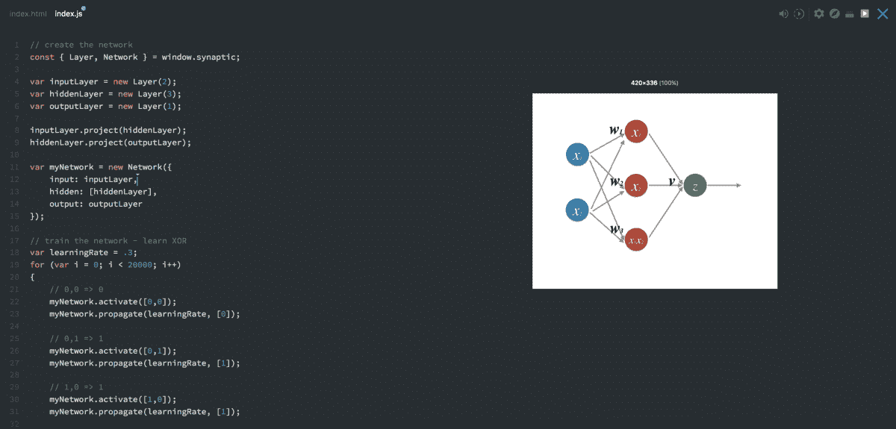
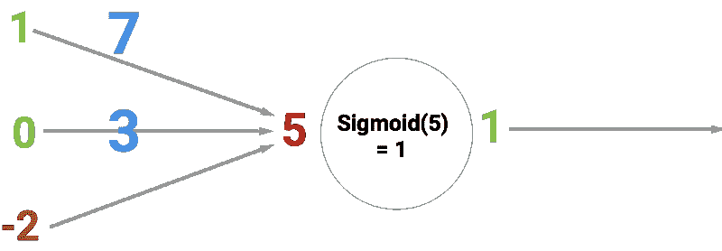
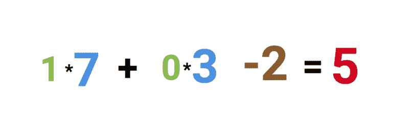
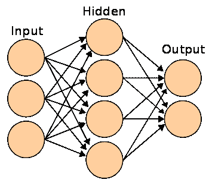
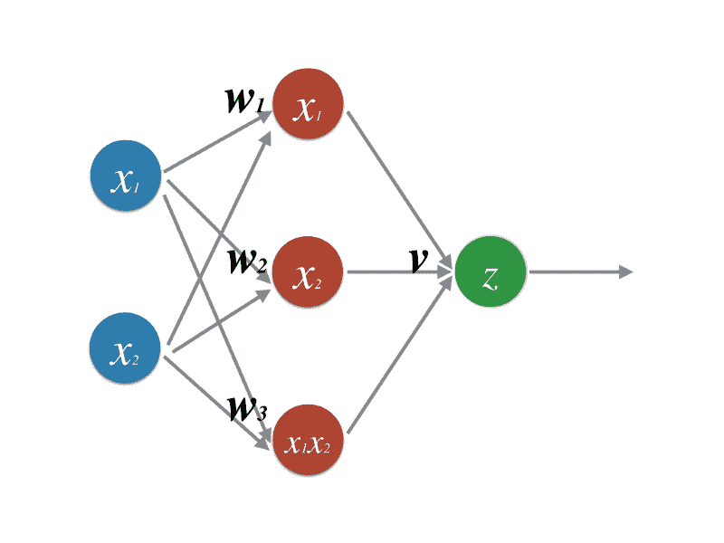

# 如何只用 30 行代码用 JavaScript 创建一个神经网络

> 原文：<https://www.freecodecamp.org/news/how-to-create-a-neural-network-in-javascript-in-only-30-lines-of-code-343dafc50d49/>

在本文中，我将向您展示如何使用 [Synaptic.js](https://synaptic.juancazala.com/#/) 创建和训练一个神经网络，它允许您在 Node.js 和浏览器中进行深度学习。

我们将创建可能的最简单的神经网络:一个设法解决 [XOR 方程的网络。](https://en.wikipedia.org/wiki/Exclusive_or)

我还为这个例子创建了一个交互式 Scrimba 教程，所以也来看看吧:



[In the Scrimba tutorial, you’ll be able to play around with the code whenever you want.](https://scrimba.com/casts/cast-1980?utm_source=freecodecamp.org&utm_medium=referral&utm_campaign=gneuralnetworks_create_neural_network)

或者，如果你对 JavaScript 神经网络的完整课程感兴趣，请查看 Scrimba 的 Brain.js 免费课程。


*[*Click* here *to get to the course*](https://scrimba.com/g/gneuralnetworks?utm_source=freecodecamp.org&utm_medium=referral&utm_campaign=gneuralnetworks_create_neural_network)*

但是在我们看代码之前，让我们先看一下神经网络的基础知识。

### 神经元和突触

神经网络的第一个构建模块是[神经元](https://medium.com/learning-new-stuff/how-to-learn-neural-networks-758b78f2736e)。

神经元就像一个函数，它接受一些输入，然后返回一个输出。

有许多不同类型的神经元。我们的网络将使用[乙状结肠神经元，](https://en.wikipedia.org/wiki/Sigmoid_function)，它接受任何给定的数量，并将其压缩到介于`0`和`1`之间的值。

下面的圆圈说明了一个乙状结肠神经元。其输入为`5`，输出为`1`。箭头被称为突触，它将神经元连接到网络中的其他层。



那么**为什么**是红色的数字`5`？因为它是连接到神经元的三个突触的总和，如左边的三个箭头所示。让我们打开它。

在最左边，我们看到两个值加上一个所谓的**偏差**值。数值为绿色数字`1`和`0`。偏差值是布朗数`-2`。

首先，将两个输入乘以它们的**权重**，即蓝色数字所示的`7`和`3`。

最后，我们加上偏差，最后得到`5`或红色数字。这是我们人工神经元的输入。



由于这是一个将任何值压缩到 0 和 1 之间的 sigmoid 神经元，输出被压缩到`1`。

如果你把这些神经元的网络连接在一起，你就有了一个神经网络。这通过神经元从输入到输出向前传播，神经元通过突触相互连接。如下图所示:



神经网络的目标是训练它进行归纳，例如识别手写数字或垃圾电子邮件。善于归纳就是在整个网络中拥有正确的**权重**和**偏差**值。就像上面例子中的蓝色和棕色数字一样。

当训练网络时，你只是向它展示大量的例子，如手写数字，并让网络预测正确的答案。

每次预测后，你将计算**预测有多错误**，并调整权重和偏差值，这样网络下次会猜测得更正确一点。这个学习过程被称为反向传播。这样做上千次，你的网络很快就会变得善于归纳。

反向传播在技术上是如何工作的超出了本教程的范围，但这里是我找到的理解它的三个最佳来源:

*   [一个逐步反向传播的例子](http://mattmazur.com/2015/03/17/a-step-by-step-backpropagation-example/)—[马特·马祖尔](https://medium.com/u/f481b80ce964)
*   [神经网络黑客指南](http://karpathy.github.io/neuralnets/)—[安德烈·卡帕西](https://medium.com/u/ac9d9a35533e)
*   [神经网络和深度学习](http://neuralnetworksanddeeplearning.com/chap1.html)—[迈克尔·尼尔森](https://twitter.com/michael_nielsen)

### 代码

现在你已经有了一个基本的介绍，让我们进入代码。我们需要做的第一件事是创建层。我们用 synaptic 中的`new Layer()`函数来做这件事。传递给函数的数字决定了每层应该有多少个神经元。

如果你对什么是层 T1 感到困惑，看看上面的 T2 截图。

const { Layer，Network } = window.synaptic

var input Layer = new Layer(2)；
var hiddenLayer =新图层(3)；
var output Layer = new Layer(1)；

接下来，我们将把这些层连接在一起，并实例化一个新网络，如下所示:

input layer . project(hidden layer)；
hidden layer . project(output layer)；

var my Network = new Network({
input:input layer，
hidden: [hiddenLayer]，
output:output layer
})；

这是一个 2–3–1 网络，可以这样想象:



现在让我们训练网络:

```
// train the network - learn XOR

var learningRate = .3;

for (var i = 0; i < 20000; i++) {  
  // 0,0 => 0  
  myNetwork.activate([0,0]);  
  myNetwork.propagate(learningRate, [0]);

  // 0,1 => 1  
  myNetwork.activate([0,1]);  
  myNetwork.propagate(learningRate, [1]);

  // 1,0 => 1  
  myNetwork.activate([1,0]);  
  myNetwork.propagate(learningRate, [1]);

  // 1,1 => 0  
  myNetwork.activate([1,1]);  
  myNetwork.propagate(learningRate, [0]);  
} 
```

这里我们运行网络 20，000 次。每次我们向前和向后传播四次，为这个网络传递四个可能的输入:`[0,0] [0,1] [1,0] [1,1]`。

我们从做`myNetwork.activate([0,0])`开始，其中`[0,0]`是我们发送到网络中的数据点。这就是前向传播，也称为**激活**网络。在每次正向传播之后，我们需要做一次反向传播，其中网络更新它自己的权重和偏差。

反向传播是通过下面这行代码完成的:`myNetwork.propagate(learningRate, [0])`，其中`learningRate`是一个常数，它告诉网络每次应该调整多少权重。第二个参数`0`代表给定输入`[0,0]`的正确输出。

然后，网络将自己的预测与正确的标签进行比较。这告诉它它是对的还是错的。

它使用该比较作为校正它自己的权重和偏差值的基础，以便它下次会猜测得更正确一点。

在它完成这个过程 20，000 次后，我们可以通过用所有四种可能的输入激活网络来检查我们的网络学习得有多好:

```
console.log(myNetwork.activate([0,0]));   
// -> [0.015020775950893527]

console.log(myNetwork.activate([0,1]));  
// -> [0.9815816381088985]

console.log(myNetwork.activate([1,0]));  
// ->  [0.9871822457132193]

console.log(myNetwork.activate([1,1]));  
// -> [0.012950087641929467] 
```

如果我们将这些值四舍五入到最接近的整数，我们将得到 XOR 方程的正确答案。万岁！

大概就是这样。尽管我们只是触及了神经网络的表面，但这应该足以让你开始自己玩 Synaptic，并继续自己学习。他们的维基包含了很多好的教程。

最后，当你学到新东西的时候，一定要分享你的知识，创建一个 [Scrimba](http://scrimba.com?utm_source=freecodecamp.org&utm_medium=referral&utm_campaign=gneuralnetworks_create_neural_network) 截屏或者写一篇文章！:)

## PS:我们有更多免费课程给你！

如果你正在寻找你的下一个挑战，你可以在[Scrimba.com 查看我们的其他几个免费课程。](https://scrimba.com/?utm_source=freecodecamp.org&utm_medium=referral&utm_campaign=gneuralnetworks_create_neural_network)这里有三个可能与你相关:

*   [JavaScript 中的神经网络](https://scrimba.com/g/gneuralnetworks?utm_source=freecodecamp.org&utm_medium=referral&utm_campaign=gneuralnetworks_create_neural_network)
*   [ES6+](https://scrimba.com/g/gintrotoes6?utm_source=freecodecamp.org&utm_medium=referral&utm_campaign=gneuralnetworks_create_neural_network)简介
*   [学习 D3 JS](https://scrimba.com/g/gd3js?utm_source=freecodecamp.org&utm_medium=referral&utm_campaign=gneuralnetworks_create_neural_network)

编码快乐！