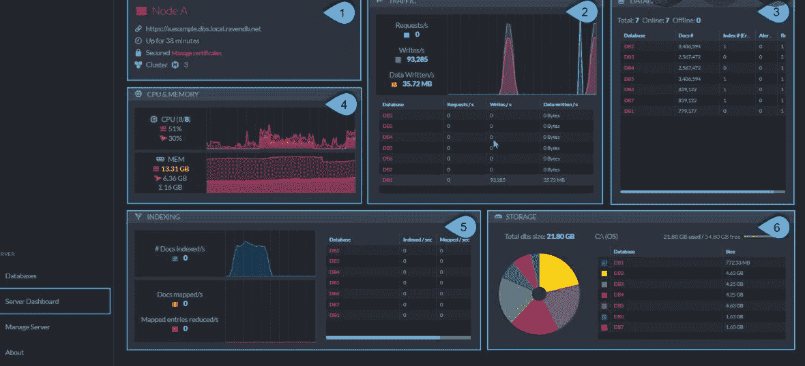
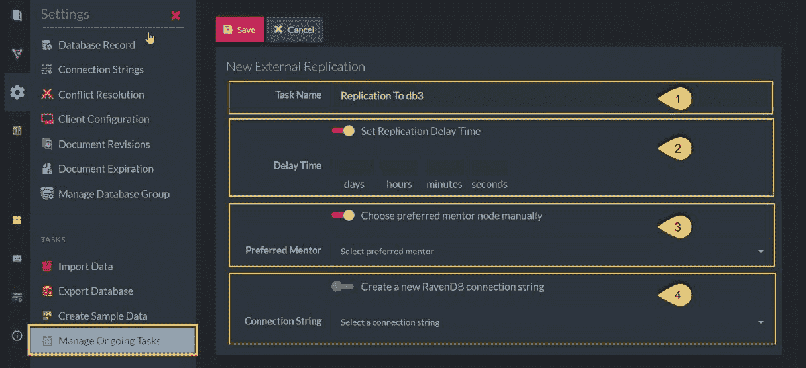

# 如何用 RavenDB 创建 NoSQL 数据库

> 原文：<https://www.freecodecamp.org/news/how-to-create-a-nosql-database-with-ravendb/>

如果你看看今天的任何网站或应用程序，在引擎盖下的某个地方都有一个数据库。毕竟，我们生活在大数据的世界里。数据量呈指数级增长。

手头有这么多数据，我们需要更复杂的方法来存储和处理它。

因此，对于大多数在家远程工作的计算机专业人士来说，就业市场依然强劲，包括数据库架构师和数据库管理员。

数据科学和分析领域的机会甚至更多。但是，要利用这些机会，您需要有扎实的数据库编程基础。

在本文中，我将向您介绍 RavenDB 数据库管理系统。我们将回顾一些基本的 RavenDB 特性，然后我将带您建立您的第一个 RavenDB 数据库。

## 什么是 RavenDB？

RavenDB 是一个跨平台、分布式、符合 ACID、基于文档的 NoSQL 数据库，它提供了高性能，同时保持了相当的易用性。

数据编程知识对于网络和软件开发也至关重要，这已经成为当今美国最赚钱的远程工作之一。

## RavenDB 功能

为了有效地使用 RavenDB，您应该了解它的每个特性是如何工作的，以及它们为什么重要。

### 跨平台

RavenDB 可用于 Windows、Linux 和 Raspberry Pi。Mac 用户可以在 Docker 容器系统内运行 RavenDB。

这为开发人员在开发数据库和相关应用程序时提供了极大的灵活性。

### 分布式数据库

一般来说，分布式数据库将数据存放在多个物理位置(例如，不同的站点或计算机)。

虽然 RavenDB 分布式体系结构的细节超出了本文的范围，但是您应该理解它的两个基本元素:集群和节点。

**集群**是奇数台机器的集合，最少三台。集群中的每台机器都是一个**节点**。数据库可以分布在集群中的一个或多个节点上。在某些情况下，整个数据库可能存在于集群中的每个节点上。

除了数据分发之外，集群还可以自我管理工作的分发，以及故障和恢复工作。

分布式数据库体系结构允许高事务吞吐量，即高性能。RavenDB 每秒可以处理多达 150，000 次写入和 100 万次读取。

与传统的关系数据库相比，分布式体系结构在发生故障时也更有弹性。

NoSQL 数据库的分布式体系结构(见下文)使它们对于开发移动应用程序非常有用。尽管如此，您仍应保持对移动安全风险的警惕，因为 89%的移动设备漏洞不需要物理接触移动设备。

### 耐酸的

ACID 是一组数据库属性的缩写，这些属性有助于确保数据库事务的可靠处理:

*   ******原子性****** 确保每个数据库事务都被视为一个单元，无论该事务包含多少条语句。原子性防止有问题的部分更新。在处理过程中，事务作为一个整体要么成功，要么失败。如果事务中的单个语句失败，则整个事务都会失败。其他数据库客户机永远不会察觉到事务被部分解决。
*   **一致性**确保事务符合数据库中的所有数据验证规则。如果某个事务生成了不兼容的数据，数据库将回滚到以前的有效版本。
*   ******隔离****** 确保当多个事务同时发生时，这些事务不会相互影响，也不会试图使用正在进行的事务中的数据。一组并发事务的最终数据库更新与每个事务被串行处理的情况相同。
*   **耐久性**防止已完成的交易数据丢失，即使在后处理系统出现故障的情况下。完成的事务数据永久保存在数据库系统中，通常保存在非易失性存储器中。

大多数 NoSQL 数据库不符合 ACID 标准。RavenDB 是一个例外，[使用 ACID 原理来驱动高性能](https://www.ibm.com/docs/en/cics-ts/5.4?topic=processing-acid-properties-transactions)，同时还确保数据完整性和可靠性。

### NoSQL

NoSQL 和 SQL 的价值经常被争论。出于我们的目的，我们可以简化差异。

在传统的关系数据库中，SQL 编程占主导地位。在非关系的分布式数据库中，NoSQL 占据了主导地位。

SQL 数据库依赖于表。NoSQL 数据库可以使用其他库，包括文档(如 RavenDB)、动态表、键值对等等。

NoSQL 数据库依靠分布式体系结构进行水平扩展。随着数据库大小的增加，它被分散在集群中的几个不同节点上。SQL 数据库纵向扩展—更多的数据需要更大的服务器。

NoSQL 数据库的搜索速度也更快。SQL 数据库查询依赖于将多个表中的数据连接或组合到一个新表中，而 NoSQL 查询通常不需要连接。

由于许多 NoSQL 的实现都是基于云的，所以出于安全考虑，开发人员必须始终将数据库和应用程序的加密放在第一位。

### 基于文档的

基于文档并不意味着 Raven 只存储 pdf 或文字处理文档。对于 NoSQL 数据库来说，文档是结构化(实际上是半结构化)[自包含数据](https://ravendb.net/articles/nosql-document-oriented-databases-detailed-overview)的集合。

您可以使用几种语言中的一种来编写最终将驻留在 NoSQL 数据库中的文档，包括可扩展标记语言(XML)和 JavaScript 对象符号(JSON)。RavenDB 主要使用 JSON 文档。

基于文档的数据库通常比关系数据库更有效，因为它们将关于对象的所有信息存储在单个文档实例中，而不是分散在多个表中。这种结构提高了数据库效率，因为它不需要对象关系映射。

## 如何创建新的 RavenDB 数据库

创建新的 RavenDB 数据库相对简单。但是在创建数据库之前，首先需要安装 RavenDB 系统。

根据你选择的操作系统(Windows、Linux 或 [Raspberry Pi](https://www.raspberrypi.org/software/) )，你可以[在其网站](https://ravendb.net/)上下载 RavenDB，还有一个面向 Mac 用户的 Docker 版本。

安装快速简单。您必须选择是使用安全版本还是非安全版本。

安全版本要求您拥有或获得一个安全证书，但是通过 RavenDB 获得一个证书也很容易。RavenDB 的入门级版本提供免费的证书许可证。

一旦安装了 RavenDB，在使用第一个数据库之前只剩下几个步骤:

1.  登录到您的 RavenDB 应用程序并转到您的仪表板。
2.  您将在仪表板上看到一个数据库菜单项，单击它可以启动该过程。

3.打开的窗口包括一个用于搜索现有数据库的下拉列表、一个搜索框和一个新数据库按钮。点击它。

4.打开新数据库后，必须为其命名。名称最长可达 128 个字符，包括字母、数字和有限选择的特殊字符("-"、" _ "、")。).

5.命名数据库后，必须分配一个复制因子，该因子指定数据在节点间的分布。复制系数为 1 意味着所有数据都在单个节点中。对于高于 1 的设置，您可以在动态分发或手动复制节点设置之间进行选择(使用适当的许可证)。

6.完成这些步骤后，您将返回到主数据库窗口。剩下要做的就是单击数据库名称，这样就可以开始创建文档了。

对于真正的初学者，RavenDB 为用户提供了用样本数据填充空数据库的选项，这样您就可以更好地了解如何使用数据库。

## 总结

RavenDB 是一个强大、健壮、易用且易学的 NoSQL 数据库系统。

对于希望提高数据库设计和管理技能的用户来说，RavenDB 是一个用户友好的培训平台。