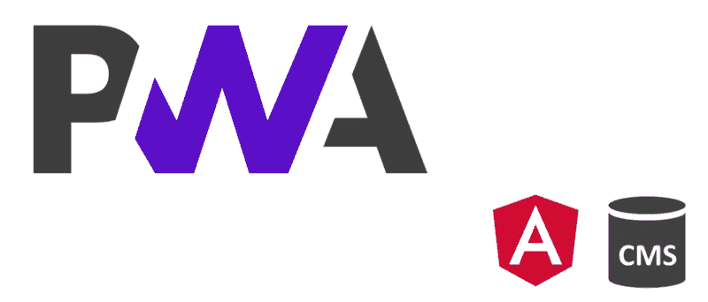
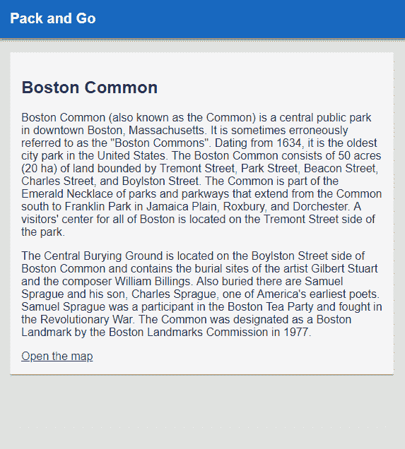
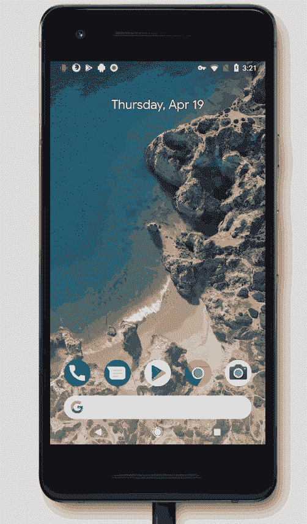

# 如何创建一个具有棱角和无头 CMS 的渐进式 web 应用程序

> 原文：<https://www.freecodecamp.org/news/how-to-create-a-progressive-web-app-featuring-angular-and-headless-cms-b8ee4f7a5ea3/>

by Ondrej Chrastina

# 如何创建一个具有棱角和无头 CMS 的渐进式 web 应用程序



你有没有想过一个无头的内容管理系统如何适应进步的网络应用？

最近，我读了我的同事布莱恩的关于渐进式网络应用的故事。这篇文章讲述了一个[渐进式 Web 应用](https://developers.google.com/web/progressive-web-apps) (PWA)的实现，它列出了存储在 headless CMS 中的有趣的地方。

你可以在你的设备上安装这个应用程序。它使用一个服务工作者来缓存应用程序和关于兴趣点的数据。这个应用程序是用普通的 JavaScript 编写的。

写了很多 JavaScript 代码后，我想使用更复杂的框架来扩展这个概念。

我把选择范围缩小到三个大玩家——React、Vue 和 Angular。我选择使用 Angular，因为它已经支持服务工作者，我想使用 [TypeScript](https://www.typescriptlang.org/) 。

本教程的每一步都会有一个 GitHub 提交的链接。这样，您将总是能够看到代码的样子。

要运行应用程序，只需下载或克隆提交并运行`npm install`和`ng serve -o`。整个代码存储在[的一个分支](https://github.com/Kentico/cloud-sample-angular-pwa-app/commits/v1-introduction)中。

我们开始吧！

#### 先决条件

*   [node.js](https://nodejs.org/en/download) v8+
*   通过 npm 软件包管理器作为全局依赖项安装的 Angular CLIv . 1 . 7 . 4:`npm install -g @angular/cli`

#### 入门指南

首先，生成一个新项目。您可以使用出色的 Angular CLI 工具轻松生成所有样板代码。只需导航到一个文件夹并生成一个现成的运行代码:

```
ng new cloud-sample-angular-pwa-aps
```

#### 样板配置


[Configured boilerplate commit](https://github.com/Kentico/cloud-sample-angular-pwa-app/commit/1857f253955e4abf0685222fa958d199648dd6ba)

配置样板文件有几个步骤。

默认情况下，生成的代码使用普通 CSS。但是，你可能想让你的生活更容易与 SCSS 在一起。为此，请执行以下步骤:

1.  在`/.angular-cli.json`配置文件中从`css`到`scss`设置`defaults.styleExt`值
2.  将`styles.css`重命名为`styles.scss`
3.  将`/src/app.component.css`重命名为`/src/app.component.scss`，并在组件声明属性的`styleUrls`属性值中的`app.component.ts`中反映此重命名。

#### **为 app** 创建一些初始内容

*   **全局样式: [/src/styles.scss](https://github.com/Kentico/cloud-sample-angular-pwa-app/commit/1857f253955e4abf0685222fa958d199648dd6ba#diff-6a2256f44598ec970b4bd034962e011e)**
*   **组件:[/src/app/app . component . html](https://github.com/Kentico/cloud-sample-angular-pwa-app/commit/1857f253955e4abf0685222fa958d199648dd6ba#diff-465e9f13ce23ec4a1e366935273fdbb6)和[/src/app/app . component . scss](https://github.com/Kentico/cloud-sample-angular-pwa-app/commit/1857f253955e4abf0685222fa958d199648dd6ba#diff-f4c58ad626d121a4d36442d6696213eb)**

**让我们看一看！**

**

*Voila,* first run of the app.** 

**只需运行以下命令:**

```
`ng serve -o`
```

#### **加载数据**

**

[Data loading commit.](https://github.com/Kentico/cloud-sample-angular-pwa-app/commit/00072d54eda9023f6f9176fc6de3ed49b339b602)** 

**让我们最终使用角的力量。在本节中，我们将定义一个[可注入的](https://angular.io/guide/dependency-injection)客户端，它允许应用程序获取 [Kentico Cloud](https://kenticocloud.com/) 数据。我将使用 Bryan 在文章中使用的相同数据源。**

**首先，通过以下命令安装 [Kentico Cloud Delivery SDK](https://github.com/Enngage/KenticoCloudDeliveryTypeScriptSDK) :**

```
`npm install -P kentico-cloud-delivery-typescript-sdk`
```

**然后，创建一个将在依赖注入中使用的客户端提供程序。**

**在`/src/app` 文件夹中创建一个新文件，并将其命名为`delivery-client.provider.ts`。这个[提供者](https://angular.io/guide/dependency-injection#factory-providers)模块需要导出一个对象，该对象定义了用于创建我们的客户端的工厂。在下面的代码中，您可以看到存储数据的 Kentico Cloud 中项目的 ID。**

```
`import { DeliveryClient, DeliveryClientConfig } from 'kentico-cloud-delivery-typescript-sdk';

export const DeliveryClientFactory = (): DeliveryClient => {
    const projectId = '975bf280-fd91-488c-994c-2f04416e5ee3';

    return new DeliveryClient(
        new DeliveryClientConfig(projectId, [])
    );
};

export const DeliveryClientProvider = {
    provide: DeliveryClient,
    useFactory: DeliveryClientFactory,
    deps: []
};`
```

**接下来，编辑`app.module.ts`。这是您指定加载哪些模块的地方。**

```
`... 
import { DeliveryClientProvider } from './delivery-client.provider';
...

@NgModule({
...
providers: [DeliveryClientProvider]
...
})`
```

**现在，我们准备在应用程序组件中使用客户端。**

**我们将设置`app.component.ts`来使用作为构造函数的参数自动注入的`DeliverClient`。我们还将为客户端的可观察对象订阅组件，并定义相应的观察者动作。**

```
`import { Component, OnInit, OnDestroy } from '@angular/core';
import { DeliveryClient, ContentItem } from 'kentico-cloud-delivery-typescript-sdk';
import { Subscription } from 'rxjs/Subscription';

@Component({
  selector: 'app-root',
  templateUrl: './app.component.html',
  styleUrls: ['./app.component.scss']
})

export class AppComponent implements OnInit, OnDestroy {
  dataSubscription: Subscription;
  pointsOfInterest: ContentItem[];

constructor(private deliveryClient: DeliveryClient) { }

ngOnInit() {
    this.dataSubscription = this.deliveryClient
      .items<ContentItem>()
      .type('point_of_interest')
      .get()
      .subscribe(response => {
        this.pointsOfInterest = response.items;
      });
  }

ngOnDestroy(): void {
    this.dataSubscription.unsubscribe();
  }
}`
```

**最后一步是显示来自 CMS 的数据，使用 Angular `ngFor`指令遍历项目并呈现它们。**

```
`<header>
    <h2>Pack and Go</h2>
</header>
<main class="main">
    <div class="card" *ngFor="let poi of pointsOfInterest">
        <h2 class="title">{{poi.title.value}}</h2>
        <div class="content" innerHTML="{{poi.description.value}}"></div>
        <a class="map-link" target="_blank" href="http://maps.google.com/?ie=UTF8&amp;hq=&amp;ll={{poi.latitude__decimal_degrees_.value}},{{poi.longitude__decimal_degrees_.value}}&amp;z=16">
           Open the map
        </a>
    </div>
</main>`
```

#### **允许添加快捷图标**

**现在，我们将使应用程序能够将其图标添加到设备的桌面或开始屏幕上。**

****

**这一步相当容易。它要求我们创建一个 JSON 文件，包含关于应用程序的元数据，并从`head`标签链接它。清单文件应该指向不同大小的图标的多个 URL。**

**我们还应该在`.angular-cli.json`配置文件的资产声明中列出`manifest.json`文件。**

```
`{
    ...
    apps: {
        assets : [
            ...,
            "manifest.json"
        ],
        ...
    },
    ...
}`
```

**但是，更重要的是，从`index.html`链接到`manifest.json`文件。**

```
`<link rel="manifest" href="manifest.json" />`
```

**最后，我们将创建清单本身，以及所有的图标翻译。看看下面的链接，看看结果。**

**

[Commit link with the data.](https://github.com/Kentico/cloud-sample-angular-pwa-app/commit/abb80401d8775c608b5e554e17da2f7ef1437a42)** 

#### **设置服务人员**

**服务人员的概念使 PWA 应用程序具有革命性。**

**服务人员充当客户端和互联网之间的代理。根据实际配置，服务人员可以在首次加载时预缓存应用程序框架(称为“应用程序外壳”)。这意味着后续请求非常快。服务人员还可以静默缓存所有其他应用程序数据。**

**首先，需要将服务工作者模块安装到应用程序中。**

```
`npm install -P @angular/service-worker`
```

**现在在`.angular-cli.json`配置文件中启用 Angular 中的维修工人。**

```
`{
    ...
    apps: {
        "serviceWorker": true,
        ...
    },
    ...
}`
```

**现在，让我们使用`app.module.ts`文件将 service worker 模块导入我们的应用程序。**

```
`...
import { ServiceWorkerModule } from '@angular/service-worker';
...
@NgModule({
  ...
  imports: [
    ...
    ServiceWorkerModule.register('/ngsw-worker.js', { enabled: environment.production })
  ],
  ...
})
˛...`
```

**最后一件事是为应用程序外壳和数据配置缓存策略。首先我们需要在`/src`文件夹下创建`ngsw-config.json`配置文件。**

**对于应用程序外壳，我们将使用在[文档](https://angular.io/guide/service-worker-getting-started#step-4-create-the-configuration-file-ngsw-configjson)中描述的默认设置。这个配置将预取`index.html`、`favicon.ico`和应用程序外壳，包括链接的 CSS 和 JavaScript 包。`/assets`文件夹中的文件是惰性加载的。**

**来自 Kentico Cloud 的数据请求将使用另一种缓存策略。我们将定义一个 API 端点作为新的[数据组](https://angular.io/guide/service-worker-config#datagroups)，并设置缓存使用[新鲜度](https://angular.io/guide/service-worker-config#strategy)策略。在下面的提交链接中，您可以看到配置文件的全部内容。**

**

[Commit link](https://github.com/Kentico/cloud-sample-angular-pwa-app/commit/6a5f2b3230f04901c51573124bafce4bd31672e4)** 

**现在我们准备在设备上安装应用程序。例如，在 Android 的 Chrome 中，你可以通过点击省略号图标并选择“添加到主屏幕”来实现。**

****

**好了，我们结束了。尽管实现快速简单，但该应用程序非常强大和快速。我们可以自由地以各种方式扩展它，比如导入材料设计或字体图标。**

**PWA APIs 还允许我们使用很酷的本机功能，例如:**

*   **读取设备的传感器**
*   **显示推送通知**
*   **并使用设备的摄像头。**

**我们的应用程序还可以感应设备何时从在线转为离线，反之亦然**。**我们还可以使用来自 CMS 的[自动生成的强类型内容项目模型](https://www.npmjs.com/package/kentico-cloud-model-generator-utility)。**

**如你所见，在 Angular 中创建一个 PWA 很容易，但允许我们进一步扩展应用程序。**