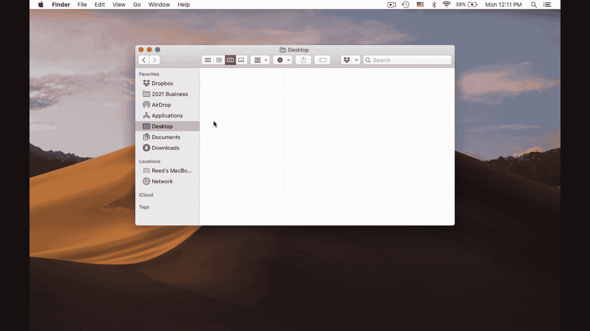
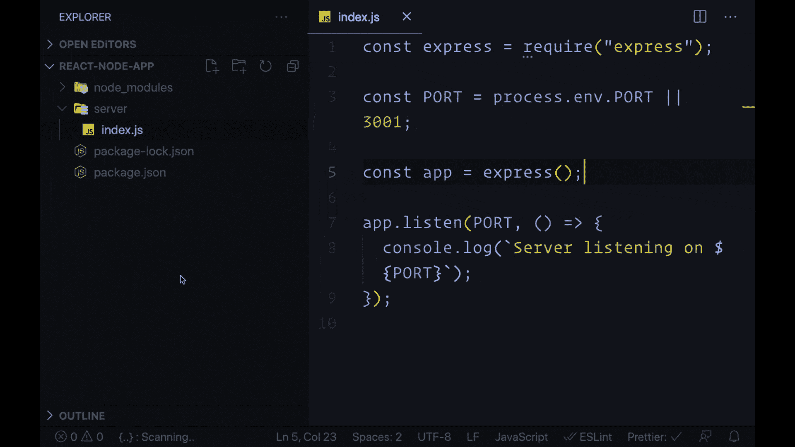
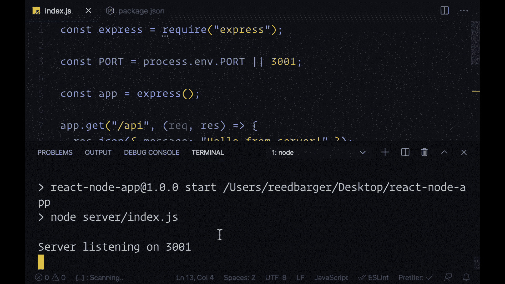
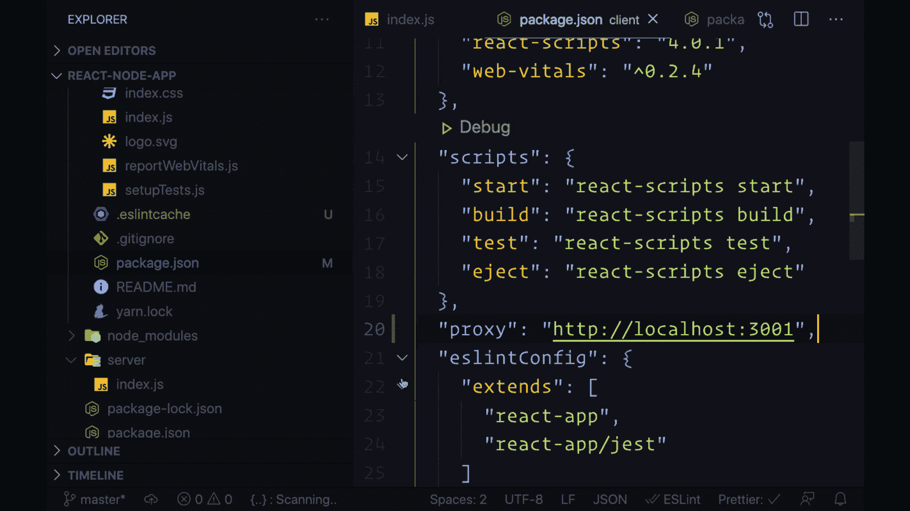
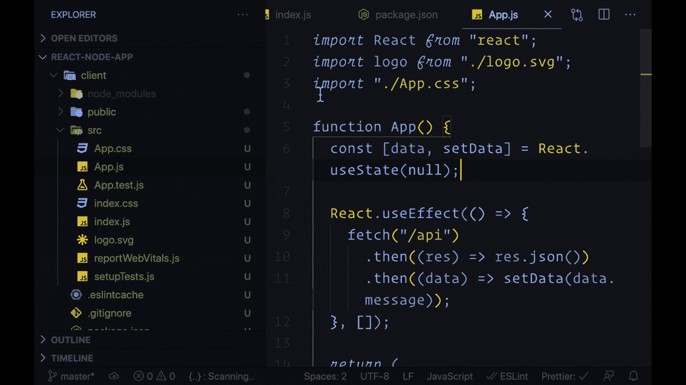

# 如何创建带有节点后端的 React 应用程序:完整指南

> 原文：<https://www.freecodecamp.org/news/how-to-create-a-react-app-with-a-node-backend-the-complete-guide/>

连接到节点后端的 React 前端对于您想要构建的任何应用程序来说都是一个坚如磐石的组合。

本指南旨在帮助您尽可能轻松地使用 React 创建全栈项目。

让我们看看如何使用 React 和 Node 从头开始设置整个项目，并将其部署到 web 上。

> 想要构建和部署自己的 React 和 Node 应用程序吗？[查看我的课程系列](http://bit.ly/12-react-projects)，它将向您展示如何构建自己的全栈 React 项目，就像这个项目一样。

## 您将需要的工具

1.  确保您的计算机上安装了节点和 NPM。你可以在[nodejs.org](https://nodejs.org)下载两者(NPM 包含在你的节点安装中)
2.  使用您选择的代码编辑器。我正在使用并且个人建议使用 VSCode。你可以在 code.visualstudio.com 下载 VSCode。
3.  确保您的计算机上安装了 Git。这是用 Heroku 部署我们的应用程序所必需的。你可以在 git-scm.com 买到
4.  在 heroku.com 的账户。我们将使用 Heroku 将我们的应用程序完全免费发布到网络上。

## 步骤 1:创建您的节点(快速)后端

首先为您的项目创建一个文件夹，名为`react-node-app`(例如)。

然后，将该文件夹拖到代码编辑器中。

要创建我们的节点项目，请在终端中运行以下命令:

```
npm init -y
```

这将创建一个 package.json 文件，它将允许我们跟踪所有的应用程序脚本，并管理我们的节点应用程序需要的任何依赖关系。

我们的服务器代码将保存在一个同名的文件夹中:`server`。让我们创建该文件夹。

在其中，我们将放置一个单独的文件，从这个文件中我们将运行我们的服务器:`index.js`。

我们将使用 Express 为我们创建一个简单的 web 服务器，如果没有给环境变量`PORT`赋值，它将运行在端口 3001 上(Heroku 将在我们部署应用程序时设置这个值)。

```
// server/index.js

const express = require("express");

const PORT = process.env.PORT || 3001;

const app = express();

app.listen(PORT, () => {
  console.log(`Server listening on ${PORT}`);
});
```

然后在我们的终端中，我们将安装 Express 作为依赖项来使用它:

```
npm i express
```

之后，我们将在 package.json 中创建一个脚本，当我们用`npm start`运行它时，它将启动我们的 web 服务器:

```
// server/package.json

...
"scripts": {
  "start": "node server/index.js"
},
...
```

最后，我们可以通过在终端中运行 npm start 来使用该脚本运行我们的应用程序，我们应该看到它正在端口 3001 上运行:

```
npm start

> node server/index.js

Server listening on 3001
```



## 步骤 2:创建一个 API 端点

我们希望使用我们的节点和 Express 服务器作为 API，这样它就可以为我们的 React 应用程序提供数据，更改数据，或者做一些只有服务器才能做的其他操作。

在我们的例子中，我们将简单地向 React 应用程序发送一条消息，说“Hello from server！”在 JSON 对象中。

下面的代码为路线`/api`创建了一个端点。

如果我们的 React 应用程序向该路由发出 GET 请求，我们会用我们的 JSON 数据进行响应(使用`res`，它代表响应):

```
// server/index.js
...

app.get("/api", (req, res) => {
  res.json({ message: "Hello from server!" });
});

app.listen(PORT, () => {
  console.log(`Server listening on ${PORT}`);
});
```

*注意:确保将其置于`app.listen`功能之上。*

因为我们已经对节点代码进行了更改，所以需要重启服务器。

为此，在终端中按 Command/Ctrl + C 结束您的启动脚本。然后通过再次运行`npm start`重新启动它。

为了测试这一点，我们只需在浏览器中访问`http://localhost:3001/api`,并查看我们的消息:



## 步骤 3:创建你的 React 前端

创建后端之后，让我们移动到前端。

打开另一个终端选项卡，使用 create-react-app 创建一个名为`client`的新 react 项目:

```
npx create-react-app client
```

之后，我们将拥有一个安装了所有依赖项的 React 应用程序。

我们必须做的唯一更改是向 package.json 文件添加一个名为`proxy`的属性。

这将允许我们向节点服务器发出请求，而不必在每次向它发出网络请求时提供它运行的源(http://localhost:3001):

```
// client/package.json

...
"proxy": "http://localhost:3001",
...
```

然后，我们可以通过运行 React 应用程序的启动脚本来启动它，这与我们的节点服务器相同。首先确保`cd`进入新创建的客户端文件夹。

此后，将于`localhost:3000`启动:

```
cd client
npm start

Compiled successfully!

You can now view client in the browser.

Local:            http://localhost:3000
```



## 步骤 4:从 React 向节点发出 HTTP 请求

现在我们有了一个工作的 React 应用程序，我们想用它来与我们的 API 进行交互。

让我们看看如何从我们之前创建的`/api`端点获取数据。

为此，我们可以转到我们的`src`文件夹中的`App.js`组件，并使用 useEffect 发出一个 HTTP 请求。

我们将使用 Fetch API 向后端发出一个简单的 GET 请求，然后将我们的数据作为 JSON 返回。

一旦数据返回给我们，我们将获得消息属性(获取我们从服务器发送的问候)，然后将它放入一个名为`data`的状态变量中。

这将允许我们在页面中显示消息(如果有的话)。我们在 JSX 中使用了一个条件来表示如果我们的数据还没有出现，就显示文本“正在加载…”。

```
// client/src/App.js

import React from "react";
import logo from "./logo.svg";
import "./App.css";

function App() {
  const [data, setData] = React.useState(null);

  React.useEffect(() => {
    fetch("/api")
      .then((res) => res.json())
      .then((data) => setData(data.message));
  }, []);

  return (
    <div className="App">
      <header className="App-header">
        
        <p>{!data ? "Loading..." : data}</p>
      </header>
    </div>
  );
}

export default App;
```



## 步骤 5:用 Heroku 将你的应用程序部署到网络上

最后，让我们将应用程序部署到 web 上。

首先，在我们的客户端文件夹中，确保删除由 create-react-app 自动初始化的 Git repo。

这对于部署我们的应用程序至关重要，因为我们将在项目的根文件夹(`react-node-app`)中设置 Git repo，而不是在`client`:

```
cd client
rm -rf .git
```

当我们部署时，我们的节点后端和 React 前端都将在同一个域(即 mycoolapp.herokuapp.com)上提供服务。

我们看到我们的请求是如何被我们的节点 API 处理的，所以我们需要编写一些代码，当用户请求时(例如，当我们转到应用程序的主页时)，这些代码将显示我们的 React 应用程序。

我们可以在`server/index.js`中通过添加以下代码来做到这一点:

```
// server/index.js
const path = require('path');
const express = require('express');

...

// Have Node serve the files for our built React app
app.use(express.static(path.resolve(__dirname, '../client/build')));

// Handle GET requests to /api route
app.get("/api", (req, res) => {
  res.json({ message: "Hello from server!" });
});

// All other GET requests not handled before will return our React app
app.get('*', (req, res) => {
  res.sendFile(path.resolve(__dirname, '../client/build', 'index.html'));
});
```

这段代码将首先允许 Node 使用静态文件的`express.static`函数来访问我们构建的 React 项目。

如果 GET 请求不是由我们的`/api`路由处理的，我们的服务器将使用 React 应用程序进行响应。

这段代码允许我们的 React 和 Node 应用一起部署在同一个域中。

然后，我们可以通过将一个`build`脚本添加到我们的 server package.json 文件来告诉我们的节点应用程序如何完成这项工作，该文件用于为生产构建 React 应用程序:

```
// server/package.json

...
"scripts": {
    "start": "node server/index.js",
    "build": "cd client && npm install && npm run build"
  },
...
```

我还建议提供一个名为“引擎”的字段，您可以在其中指定用于构建项目的节点版本。这将用于部署。

您可以通过运行`node -v`获得您的节点版本，并可以将结果放入“引擎”(即 14.15.4):

```
// server/package.json

"engines": {
  "node": "your-node-version"
}
```

在此之后，我们准备使用 Heroku 进行部署，所以请确保您在[Heroku.com](https://heroku.com)有一个帐户。

登录并查看仪表板后，您将选择“新建”>“创建新应用”,并提供一个唯一的应用名称。

之后，您需要在您的计算机上安装 Heroku CLI，这样您就可以在使用 Git 进行任何更改时部署您的应用程序。我们可以通过运行以下命令来安装 CLI:

```
sudo npm i -g heroku
```

安装完成后，您将使用`heroku login`命令通过 CLI 登录 Heroku:

```
heroku login

Press any key to login to Heroku
```

登录后，只需按照“部署”选项卡中我们创建的应用程序的部署说明进行操作。

以下四个命令将为我们的项目初始化一个新的 Git repo，向其中添加我们的文件，提交它们，并为 Heroku 添加一个 Git remote。

```
git init
heroku git:remote -a insert-your-app-name-here
git add .
git commit -am "Deploy app to Heroku"
```

最后一步是发布我们的应用程序，方法是使用我们刚刚添加的 Heroku Git 遥控器:

```
git push heroku master
```

恭喜你！我们的全栈 React 和 Node 应用已经上线！🎉



当你想对你的应用程序进行修改(并部署它们)时，你只需使用 Git 添加你的文件，提交它们，然后推送到我们的 Heroku remote:

```
git add .
git commit -m "my commit message"
git push heroku master
```

## 想用 React 构建像 YouTube、Instagram 和 Twitter 这样的真实应用吗？以下是方法。

每个月底，我都会发布一门独家课程，从头到尾向你展示如何用 React 构建一个完整的应用克隆。

想在下一门课程结束时收到通知吗？ **[在这里加入](http://bit.ly/12-react-projects)的等候名单。**