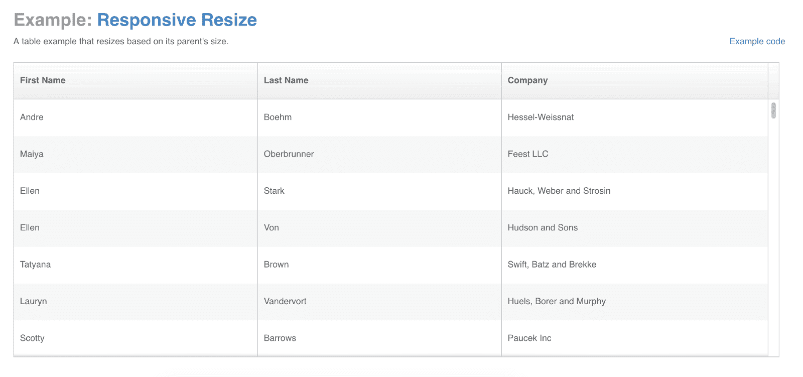
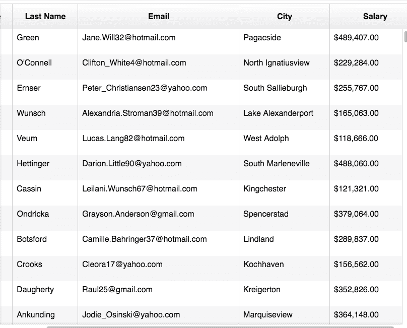
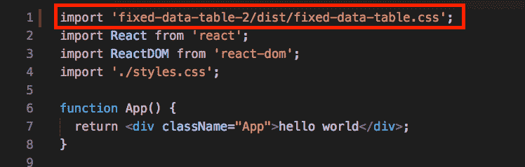
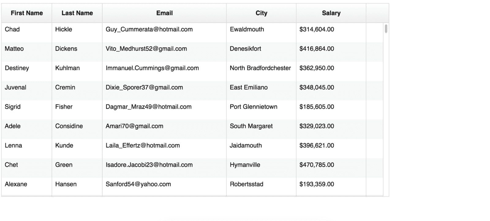
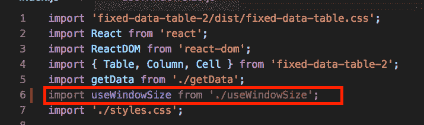
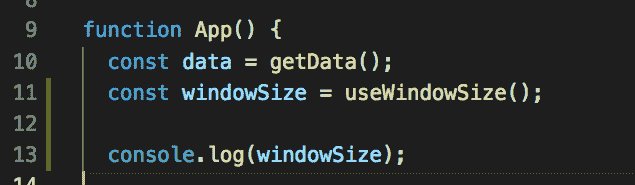
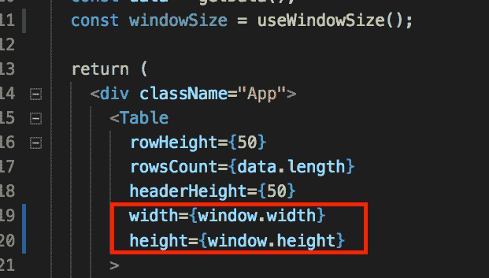
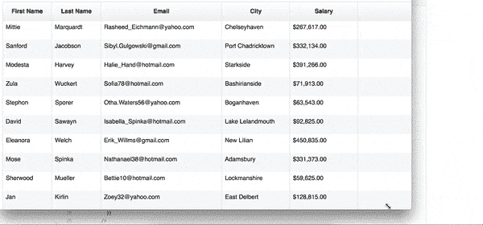

# 如何用 React 钩子创建一个响应性的固定数据表

> 原文：<https://www.freecodecamp.org/news/how-to-create-a-responsive-fixed-data-table-with-react-hooks-8eae2fff9a52/>

我的一个项目使用了一个名为 [Fixed-Data-Table-2](https://schrodinger.github.io/fixed-data-table-2/) (FDT2)的库，它非常适合高效地呈现大量的数据行。

他们的文档[展示了一个响应表](https://schrodinger.github.io/fixed-data-table-2/example-responsive.html)，它根据浏览器的宽度和高度调整大小。



我觉得用 React Hooks 分享这个例子会很酷。

### 什么是 React 钩子？

它们是给你反应特性的函数，比如没有 ES6 类的状态和生命周期挂钩。

一些好处是

*   隔离有状态逻辑，使其更容易测试
*   共享有状态逻辑，无需渲染道具或高阶组件
*   基于逻辑而不是生命周期挂钩来分离应用的关注点
*   避免 ES6 类，因为它们很古怪，**不是真正的类**，甚至会绊倒有经验的 JavaScript 开发人员

更多细节见 [React 的官方钩子介绍](https://reactjs.org/docs/hooks-intro.html)。

#### 警告:不要在生产中使用！

在撰写本文时， **Hooks 处于 alpha。他们的 API 可以随时更改。**

我建议你尝试，享受乐趣，在你的副业项目中使用钩子，但是不要在产品代码中使用，直到它们稳定下来。

### 目标



我们将构建一个响应性的固定数据表。对于我们的页面来说，它不会太窄也不会太宽，刚好合适！

### 设置

这里有 [GitHub](https://github.com/yazeedb/Responsive-FDT2-Hooks/) 和 [CodeSandbox](https://codesandbox.io/s/1vpm1z193j) 链接。

```
git clone https://github.com/yazeedb/Responsive-FDT2-Hooks/
cd Responsive-FDT2-Hooks
npm install 
```

`master`分支已经完成了项目，所以如果你想继续的话，检查一下`start`分支。

`git checkout start`

并运行该项目。

`npm start`

该应用程序应在`localhost:3000`运行。开始编码吧。

#### 导入表格样式

首先，您需要在`index.js`中导入 FDT2 的样式表，这样您的表看起来不会很奇怪。



#### 生成虚假数据

我们的表需要数据，对吗？在`src`文件夹中创建一个名为`getData.js`的文件。

我们将使用令人敬畏的 [faker.js](https://www.npmjs.com/package/faker) 库来生成我们的数据。它已经和你的`npm install`一起出现了。

如果你想复制/粘贴，这里有源代码。

```
import faker from 'faker';

const createFakeRowData = () => ({
  firstName: faker.name.firstName(),
  lastName: faker.name.lastName(),
  email: faker.internet.email(),
  city: faker.address.city(),
  salary: faker.random
    .number({
      min: 50000,
      max: 500000
    })
    .toLocaleString('en-US', {
      style: 'currency',
      currency: 'USD'
    })
});

export default () => Array.from({ length: 2000 }, createFakeRowData); 
```

`createFakeRowData`返回一个带有全名、电子邮件、城市和薪水(美元)的对象。

我们导出的函数返回其中的 2000 个。

### 没有响应的表

我们已经有了数据，现在让我们编表吧。

在`index.js`的顶部，导入我们的数据和 FDT2 组件。

```
import { Table, Column, Cell } from 'fixed-data-table-2';
import getData from './getData'; 
```

像这样使用它们。

```
function App() {
  const data = getData();

  return (
    <div className="App">
      <Table
        rowHeight={50}
        rowsCount={data.length}
        headerHeight={50}
        width={1000}
        height={500}
      >
        <Column
          columnKey="firstName"
          header={<Cell>First Name</Cell>}
          width={130}
          cell={({ rowIndex, columnKey }) => {
            return <Cell>{data[rowIndex][columnKey]}</Cell>;
          }}
        />
        <Column
          columnKey="lastName"
          header={<Cell>Last Name</Cell>}
          width={130}
          cell={({ rowIndex, columnKey }) => {
            return <Cell>{data[rowIndex][columnKey]}</Cell>;
          }}
        />
        <Column
          columnKey="email"
          header={<Cell>Email</Cell>}
          width={320}
          cell={({ rowIndex, columnKey }) => {
            return <Cell>{data[rowIndex][columnKey]}</Cell>;
          }}
        />
        <Column
          columnKey="city"
          header={<Cell>City</Cell>}
          width={180}
          cell={({ rowIndex, columnKey }) => {
            return <Cell>{data[rowIndex][columnKey]}</Cell>;
          }}
        />
        <Column
          columnKey="salary"
          header={<Cell>Salary</Cell>}
          width={180}
          cell={({ rowIndex, columnKey }) => {
            return <Cell>{data[rowIndex][columnKey]}</Cell>;
          }}
        />
      </Table>
    </div>
  );
} 
```

我们用我们的数据配置表格，并为我们想要显示的每个字段创建一个`Column`。

对象包含名/姓、电子邮件、城市和薪水，所以我们需要为每一个列。

我们的 UI 现在看起来是这样的。



试着调整你的浏览器窗口，你会发现它根本没有反应。对于您的视口来说，它不是太大就是太小，会留下多余的空间。

### 逃到不纯洁的地方

正如我们所了解的，React 的声明性本质允许您使用纯粹的、确定性的、易于测试的函数来编写 UI。

相同的输入应该总是返回相同的输出。

然而，我们有时需要访问“不纯”的世界，进行 DOM 操作，添加事件，如侦听器、订阅和计时器。

#### HOCS 和渲染道具

渲染道具和高阶组件(HOCS)是标准的解决方案，但是钩子正在尝试解决一些折衷。

### 使用挂钩

钩子是使用命令式代码的新出口。在我们的例子中，获得窗口大小是我们追求的效果。

创建一个名为`useWindowSize.js`的新文件。

要实现这一点，我们需要两样东西:

1.  监听窗口的`resize`事件，这样当它改变时我们会得到通知
2.  保存宽度/高度，与我们的表格共享

两个挂钩会有所帮助:

1.  `useEffect`
2.  `useState`

#### 使用效果

一旦稳定下来，这将很可能取代你的`componentDidMount`、`componentDidUpdate`和`componentWillUnmount`生命周期挂钩。

对于大多数初始化逻辑和读取 DOM 来说是完美的。

这是我们设置窗口事件监听器的地方。

更多详情，请参见[官方文件](https://reactjs.org/docs/hooks-reference.html#useeffect)。

#### `useState`

超级简单，这个钩子返回一个有状态值和一个更新它的函数。一旦我们捕获了窗口的宽度/高度，我们将让`useState`跟踪它。

### 编写我们的自定义*钩子*

根据[官方文件](https://reactjs.org/docs/hooks-custom.html#extracting-a-custom-hook):

> 自定义钩子是一个 JavaScript 函数，它的名字以“use”开头，可能会调用其他钩子。

我们的定制钩子将被称为`useWindowSize`，它将被称为`useState`和`useEffect`钩子。

这个钩子主要来自[useHooks.com](https://medium.com/@gabe_ragland)上[加布·拉格兰](https://medium.com/@gabe_ragland)的`useWindowSize`。

```
// `useWindowSize.js`

import { useState, useEffect } from 'react';

export default () => {
  const getSize = () => {
    return {
      width: window.innerWidth,
      height: window.innerHeight
    };
  };

  const [windowSize, setWindowSize] = useState(getSize);

  useEffect(() => {
    const handleResize = () => {
      setWindowSize(getSize());
    };

    window.addEventListener('resize', handleResize);

    return () => {
      window.removeEventListener('resize', handleResize);
    };
  }, []);

  return windowSize;
}; 
```

我们来分析一下。

#### 获取窗口大小

```
const getSize = () => {
  return {
    width: window.innerWidth,
    height: window.innerHeight
  };
}; 
```

简单地返回窗口的`innerWidth`和`innerHeight`。

#### 正在初始化使用状态

```
const [windowSize, setWindowSize] = useState(getSize); 
```

`useState`可以取初始值或返回值的函数。

在这种情况下，我们希望窗口的尺寸开始，所以`getSize`是完美的初始化。

`useState`然后返回一个数组，第一个索引是值，第二个索引是更新函数。

#### 配置 useEffect

```
useEffect(() => {
  const handleResize = () => {
    setWindowSize(getSize());
  };

  window.addEventListener('resize', handleResize);

  return () => {
    window.removeEventListener('resize', handleResize);
  };
}, []); 
```

`useEffect`执行一个函数，运行你想要的效果。

每当窗口尺寸改变时，`handleResize`通过给`setWindowSize`最新的宽度/高度来设置状态。

**清除逻辑**

我们的效果函数然后返回一个新函数**，它被`useEffect`识别为清理逻辑。**

```
return () => {
  window.removeEventListener('resize', handleResize);
}; 
```

当我们离开页面或者卸载组件时，这个清理函数会运行并删除`resize`事件监听器。这有助于防止内存泄漏。

**useEffect 的第二个参数**

`useEffect`的第一个参数是处理我们逻辑的函数，但是我们也给了它第二个参数:一个空数组。

```
useEffect(() => { ... }, []); // empty array 
```

**为什么是空数组？**

`useEffect`的第二个参数是要监视的一组值。如果这些值中的任何一个发生变化，`useEffect`将再次运行。

我们只是设置/移除事件侦听器，这只需要发生一次。

空数组是我们向`useEffect`传达“只运行一次”的方式。

> 空数组=没有值改变=只运行一次

#### 返回窗口大小

现在我们的效果已经设置好了，只需返回`windowSize`。随着浏览器大小的调整，`windowSize`将被更新。


### 使用我们的定制挂钩

是时候把我们的钩子扔到固定数据表 2 上了！

回到`index.js`，继续导入`useWindowSize`。



像这样使用它。



为了好玩，你可以`console.log(windowSize)`实时观看它的更新。


酷，我们得到了窗口的`width`和`height`的一个对象！

我们可以使用钩子的暴露状态，而不是硬编码表的宽度和高度。



现在你的桌子应该调整到窗口的尺寸。



我希望你喜欢这个教程！