# 如何在 15 分钟内创建无服务器服务

> 原文：<https://www.freecodecamp.org/news/how-to-create-a-serverless-service-in-15-minutes-b63af8c892e5/>

作者查尔斯·李

# 如何在 15 分钟内创建无服务器服务


“无服务器”这个词已经流行了一段时间。当亚马逊在 2015 年发布 AWS Lambda 服务时，许多工具应运而生，帮助人们只需几个命令就可以构建无服务器服务。与传统的永不停机服务相比，无服务器服务非常容易开发、部署和维护。它们也非常划算，尤其是对于那些没有太多流量的简单服务。

### 那么什么是无服务器呢？

顾名思义，“无服务器”的意思是你运行一个服务没有服务器。从技术上讲，仍然有一个服务器在运行服务，但是作为服务所有者，您不需要担心这个服务器。

例如，AWS Lambda 允许您部署一个“函数”来处理请求。AWS 有一个服务器在需要时运行所有的功能。但是你不需要担心这个服务器是如何工作的，或者如何让你的代码在这个服务器上工作。你只需要知道你写一个函数，然后把它推给 Lambda 服务。

最甜蜜的是它非常便宜。亚马逊 Lambda 每月提供 1M 的免费请求和 40 万 GB 秒的免费计算时间(这意味着你的计算可以使用 1GB 内存 40 万秒)，这对于大多数小型服务来说已经足够了。与 EC2 相比，一个 nano 实例每小时花费 0.0058 美元(每天 0.14 美元)，Lambda 要便宜得多。

### 我们在这里要做什么

在这篇文章中，我将向你展示如何使用 AWS 构建一个小型的无服务器个人网站。该网站具有以下特点:

*   包括前端和后端
*   大部分是静态的，或前端沉重
*   API 请求——这些请求很少，但很有必要
*   后端不需要太多内存或 CPU(例如，一个简单的 web 计数器只需要一次数据库访问)

我们的服务将部署在以下领域(我在这篇文章中使用了假的领域):

*   API 服务:`[https://myservice-api.example.com](https://myservice-api.example.com)`
*   前端:`[https://myfrontend.example.com](https://myfrontend.example.com)`

无服务器解决方案在技术上和成本上都是完美的。我们将使用以下 AWS 服务:

*   λ+API 网关+ S3，用于 API 服务器
*   DynamoDB，用于数据存储
*   S3，静态虚拟主机
*   Cloudfront，用于分布式 CDN
*   AWS 证书管理器(ACM)，用于为我们的 https 网站生成证书

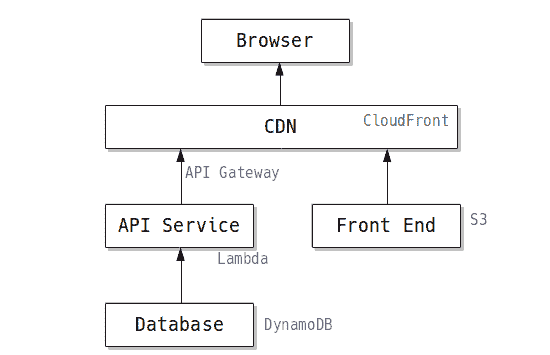

对于 API 服务器，我们将使用 Python + Flask 组合，Zappa 作为无服务器工具包。

### 设置 AWS 环境

首先我们需要设置 AWS 环境，这样我们就可以从我们的代码和 [zappa](https://github.com/Miserlou/Zappa) 中访问 AWS。这需要两步:

1.  我们需要创建一个 AWS 用户来进行编程访问
2.  我们需要为该用户设置一个本地 AWS 环境

#### 创建 AWS 用户

登录 AWS，选择“IAM”服务来管理用户凭证。

创建一个名为“myservice-admin”的用户(或者您想使用的任何其他用户名)，不要忘记检查“**编程访问**选项。

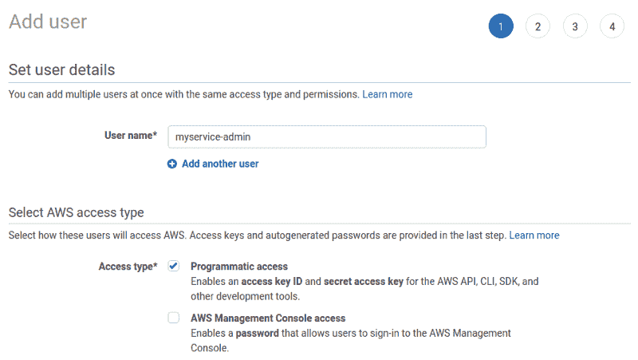

在下一个屏幕中，单击“**直接附加现有策略**按钮，然后为用户添加“**管理员访问权限**”。

> 注意:从安全角度来看，这不是最佳做法。但是出于演示的目的，这篇文章将不涉及缩小权限的细节。

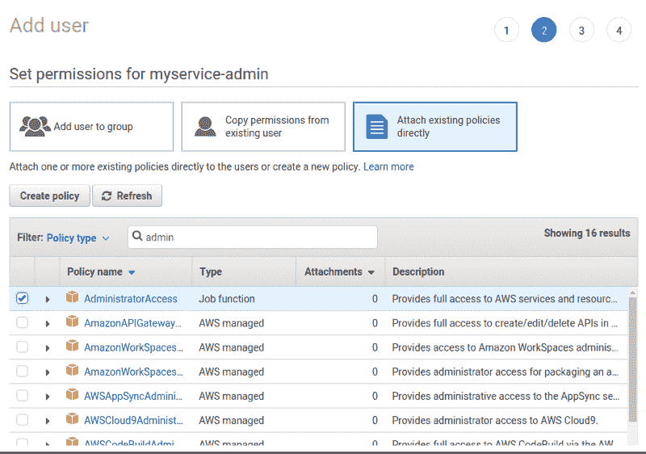

点击“下一步”按钮，然后点击“创建用户”按钮，用户`myservice-admin`将被创建。在最后一个屏幕上，显示了**访问密钥 ID** 和**秘密访问密钥**。确保将它们复制并粘贴到本地文件中。这些是我们将在下一步中使用的 API 凭证。

> 注意:**这是你唯一可以查看秘密访问密钥**的地方！如果您未能复制它们，您必须转到用户详细信息屏幕，并生成一对新的访问密钥和密码。

#### 设置您的本地 AWS 环境

为了在本地使用 AWS，我们需要创建一个本地环境。

首先，让我们安装`awscli`工具，它将帮助我们配置环境:

```
$ sudo apt install awscli
```

安装后，我们将使用`aws configure`命令设置 AWS:

```
$ aws configureAWS Access Key ID [None]: ******AWS Secret Access Key [None]: ******Default region name [None]: us-east-1Default output format [None]: json
```

这里我们需要输入从上一步中得到的**访问密钥 ID** 和**秘密访问密钥**。默认区域方面，我用了`us-east-1`。你可以选择任何你喜欢的地区，但是其他地区在设置 CloudFront 时可能会造成一些麻烦。

### 在 DynamoDB 中创建一个表

为了在 DynamoDB 中存储网站访问者计数器值，我们需要一个持久性存储。因此，我们需要创建一个表，并在其中填充一个初始值。

在 AWS 控制台中，选择 DynamoDB 服务。然后点击**创建表格**按钮。在“创建 DynamoDB 表”屏幕中，用`myservice-dev`填充**表名**，用`id`填充**主键**字段，然后点击**创建表**按钮。

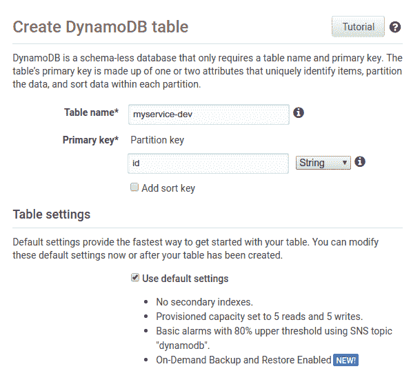

几秒钟后，表就应该创建好了。选择新创建的表，从右窗格中选择**项**页签，然后点击**创建项**按钮，创建一个带有`id='counter'`和`counter_value=0`的项。

> 注意:需要点击左侧的加号来添加`*counter_value*`属性，不要忘记将`*counter_value*`的类型设置为**号**。

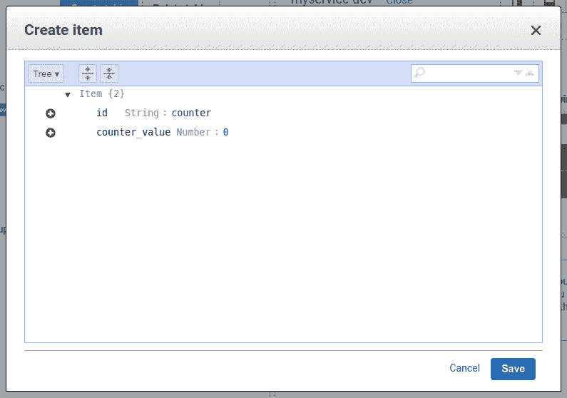

### 创建 API 服务

接下来，我们将创建 API 服务。出于演示的目的，这个 API 服务将提供一个计数器 API，单击它将增加一个计数器值。计数器值将存储在 DynamoDB 中。API 端点是:

*   `POST /counter/increase`增加计数器并返回计数器值
*   `GET /counter`返回当前计数器值

#### 用 Python 和 Flask 编写 API 服务

我们将从创建 Python 虚拟环境开始，并安装必要的包:

```
$ mkdir myservice && cd myservice$ python3 -m venv .env$ source .env/bin/activate(.env)$ pip install flask boto3 simplejson
```

`flask`是 web 框架，访问 DynamoDB 需要`boto3`包。`simplejson`可以帮助我们处理一些 JSON 转换问题。让我们通过创建包含以下内容的文件`myservice.py`来创建服务:

```
import boto3from flask import Flask, jsonify
```

```
app = Flask(__name__)
```

```
# Initialize dynamodb accessdynamodb = boto3.resource('dynamodb')db = dynamodb.Table('myservice-dev')
```

```
@app.route('/counter', methods=['GET'])def counter_get():  res = db.get_item(Key={'id': 'counter'})  return jsonify({'counter': res['Item']['counter_value']})
```

```
@app.route('/counter/increase', methods=['POST'])def counter_increase():  res = db.get_item(Key={'id': 'counter'})  value = res['Item']['counter_value'] + 1  res = db.update_item(    Key={'id': 'counter'},    UpdateExpression='set counter_value=:value',    ExpressionAttributeValues={':value': value},  )  return jsonify({'counter': value})
```

创建一个`run.py`文件来本地测试这个 API 服务:

```
from myservice import appif __name__ == '__main__':  app.run(debug=True, host='127.0.0.1', port=8000)
```

现在运行服务:

```
(.env)$ python run.py
```

我们可以使用以下命令测试该服务(打开另一个终端键入这些命令):

```
$ curl localhost:8000/counter{  "counter": 0}$ curl -X POST localhost:8000/counter/increase{  "counter": 1}$ curl -X POST localhost:8000/counter/increase{  "counter": 2}$ curl localhost:8000/counter{  "counter": 2}
```

我们可以看到我们的代码正在工作，它成功地增加了计数器！

#### 用 Zappa 把我们的代码部署到 Lambda

使用 zappa 将我们的 API 部署到 Lambda 非常容易。首先，我们需要安装 zappa:

```
(.env)$ pip install zappa
```

然后用`zappa init`初始化 zappa 环境。它会问你一些问题，但通常你可以对所有问题使用默认答案:

```
(.env)$ zappa init...What do you want to call this environment (default 'dev'): ...What do you want to call your bucket? (default 'zappa-ab7dd70x5'):
```

```
It looks like this is a Flask application.What's the modular path to your app's function?This will likely be something like 'your_module.app'.We discovered: myservice.appWhere is your app's function? (default 'myservice.app'): ...
```

```
Would you like to deploy this application globally? (default 'n') [y/n/(p)rimary]:
```

```
Okay, here's your zappa_settings.json:
```

```
{    "dev": {        "app_function": "myservice.app",        "aws_region": "us-east-1",        "profile_name": "default",        "project_name": "myservice",        "runtime": "python3.6",        "s3_bucket": "zappa-ab7dd70x5"    }}
```

```
Does this look okay? (default 'y') [y/n]: ...
```

初始化后，我们可以看到生成的`zappa_settings.json`文件。然后，我们可以开始部署我们的服务:

```
(.env)$ zappa deploy devCalling deploy for stage dev.....Deployment complete!: https://2ks1n5nrxh.execute-api.us-east-1.amazonaws.com/dev
```

太好了！我们的服务是在线的。您也可以用 curl 测试这个服务:

```
(.env)$ curl https://2ks1n5nrxh.execute-api.us-east-1.amazonaws.com/dev/counter{"counter":2}(.env)$ curl -X POST https://2ks1n5nrxh.execute-api.us-east-1.amazonaws.com/dev/counter/increase{"counter":3}(.env)$ curl https://2ks1n5nrxh.execute-api.us-east-1.amazonaws.com/dev/counter{"counter":3}
```

### 为 API 服务设置自定义域

然而，API 服务有一个问题。自动生成的 API 端点`2ks1n5nrxh.execute-api.us-east-1.amazonaws.com`很难阅读或供人使用。幸运的是，我们可以将自定义域名绑定到这个 API 端点。

我们将为这个 API 服务使用定制域`https://myservice-api.example.com`。既然要用 https 来服务，就需要先拿到证书。AWS 提供了一个带有“证书管理器”服务的免费证书，并且非常容易使用。

生成证书后，我们可以使用它在 AWS API 网关服务中为我们的服务设置一个自定义域。

#### 申请证书

在 AWS 管理控制台中切换到 ACM 服务(该服务实际上称为证书管理器，但您可以键入“ACM”来搜索它)。点击**请求证书**按钮，然后在下一个屏幕中选择**请求公共证书**选项。证书是免费的，只要你在这里选择一个公共证书。

在下一个屏幕中，输入您想要申请证书的域名，然后点击**下一个**。在这里我申请了`*.example.com`，这意味着证书可以被`example.com`下的所有子域使用。这样，我们可以在`myfrontend.example.com`使用相同的前端证书，而不必申请新的证书。

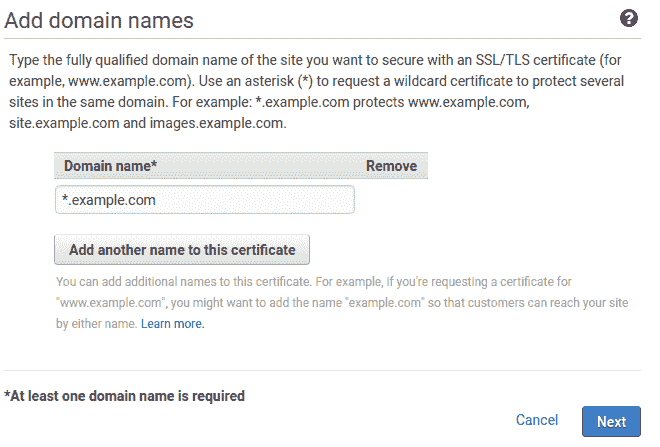

下一步，我们需要证明我们拥有这个域名。由于我是从 Google Domains 申请的这个域名，所以我会选择 **DNS 验证**。点击**审核**按钮，然后点击**确认请求**。

将创建证书请求，并将显示验证画面。这些说明显示了如何验证该域名:

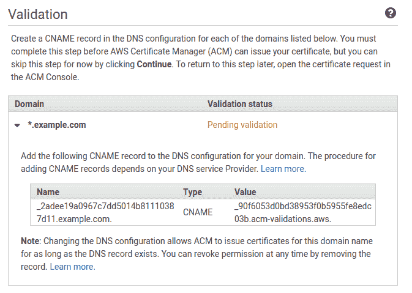

根据指令，我们需要添加一个`CNAME`记录，并给它赋值。在我的例子中，我将打开 Google Domains，找到我的域名`example.com`，并添加指定的 CNAME 记录:

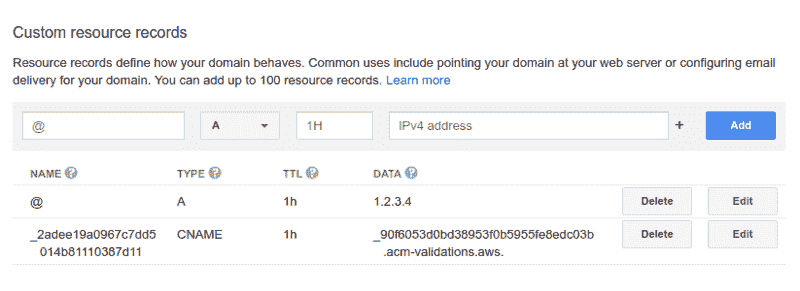

注意:我只在 Name 字段中添加了随机字符串`_2adee19a0967c7dd5014b81110387d11`，没有输入`.example.com`部分。这是为了避免后缀`.example.com`部分重复。

现在，我们需要等待大约 10 分钟，直到 AWS 证书管理器验证这个域名。验证后，证书中的“状态”栏将以绿色显示“已颁发”。


现在我们已经准备好了证书，我们可以开始将我们的自定义域名绑定到我们的 API。

#### 为我们的 API 服务设置自定义域

转到“API 网关”服务。从左窗格的“API”中，我们可以看到我们的 API `myservice-dev`已经被 zappa 创建了。

点击左侧窗格中的“**自定义域名**”，然后点击右侧窗格中的**创建自定义域名**按钮，并填写必要的字段。

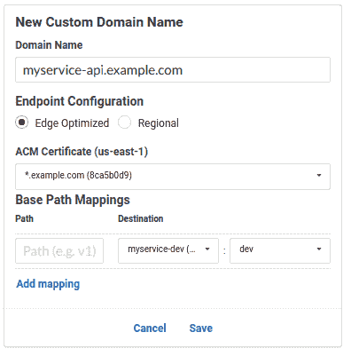

在这里，我希望我的 API 服务通过 CloudFront 公开，这样就可以在世界各地以最佳速度访问它。所以我选择了 **Edge 优化**这个配置。不需要 CloudFront 可以选择**大区**。

点击下面的“**添加映射**链接，然后选择我们的 API `myservice-dev`作为**目的地**，并为最右边的框选择 **dev** 。这样，我们的 API 就不会在 URL 中暴露环境名`dev`。将**路径**字段留空。

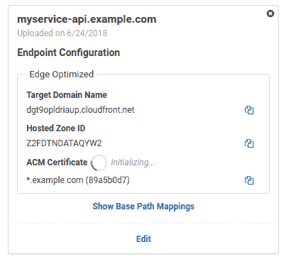

点击**保存**按钮后，我们的自定义域绑定将被创建。实际的域绑定需要 40 分钟来初始化，但是我们现在可以配置 DNS 设置。

从上面的截图我们可以看到，实际的域名是`dgt9opldriaup.cloudfront.net`。我们需要在 DNS 中设置一个`CNAME`，将`myservice-api.example.com`指向 CloudFront 子域`dgt9opldriaup.cloudfront.net`。

转到 Google 域，将 CNAME 添加到 DNS 设置中:


完成此步骤后，等待大约 40 分钟，直到 API 网关服务中的“正在初始化…”消失。

现在试试我们新的 API 服务吧！

```
(.env)$ curl https://myservice-api.example.com/counter{"counter":3}(.env)$ curl -X POST https://myservice-api.example.com/counter/increase{"counter":4}(.env)$ curl https://myservice-api.example.com/counter{"counter":4}
```

### 前端静态网站

对于下一个任务，我们将为我们全新的 API 服务创建一个前端。出于演示的目的，我们将创建一个简单的页面，带有一个触发`/counter/increase` API 调用的按钮。

#### 前端编码

让我们创建一个名为`myfrontend`的新目录:

```
$ mkdir myfrontend && cd myfrontend
```

然后制作一个简单的 HTML 文件`index.html`:

```
<html><body>  <h1>Welcome to my homepage!</h1>  <p>Counter: <span id="counter"></span></p>  <button id="increase">Increase Counter</button>  <script>    const setCounter = (counter_value) => {      document.querySelector('#counter').innerHTML = counter_value;    };
```

```
 const api = 'https://myservice-api.example.com';    fetch(api + '/counter')      .then(res => res.json())      .then(result => setCounter(result.counter));
```

```
document.querySelector('#increase')      .addEventListener('click', () => {        fetch(api + '/counter/increase', { method: 'POST' })          .then(res => res.json())          .then(result => setCounter(result.counter));        }      );  </script></body></html>
```

#### 将前端发布到 AWS S3

为了用 S3 创建一个静态网站，我们需要创建一个与我们的域名同名的 bucket。

> 注:如果您一直在学习本教程，则时段名称 myfrontend.example.com 可能不可用，因为时段名称是全局唯一的。此外，您需要基于您的公共域创建一个 bucket 名称。例如，`*myfrontend.**[yourdomain]**.com*`

在 AWS 管理控制台中切换到 S3 服务。因为我们想在`myfrontend.example.com`上托管静态网站，所以我们将创建一个同名的 bucket。点击**创建桶**按钮，填写桶名，然后继续点击**下一个**，直到桶被创建。

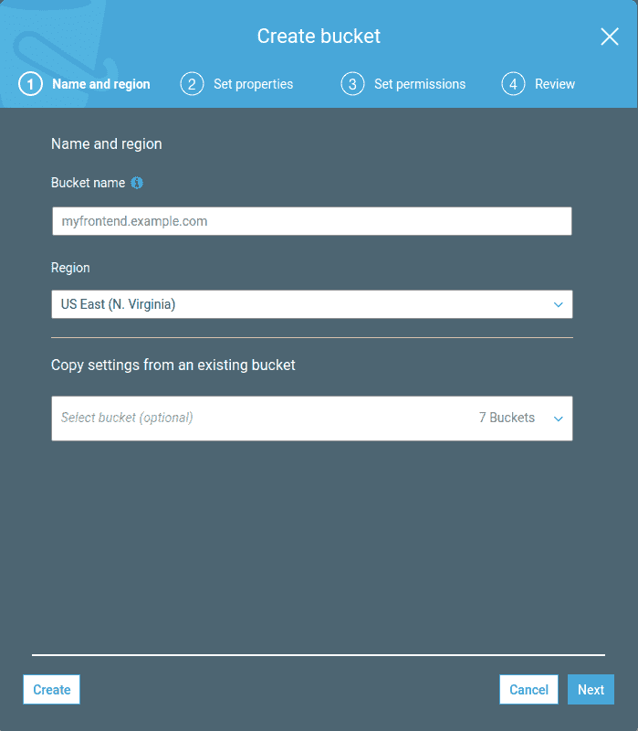

接下来，我们需要从这个桶中启用静态 web 托管。打开这个木桶，然后选择**属性**标签，选择**静态虚拟主机**。在对话框中，选择**使用此桶托管网站**，然后在“索引文档”字段中键入`index.html`。完成后点击**保存**。

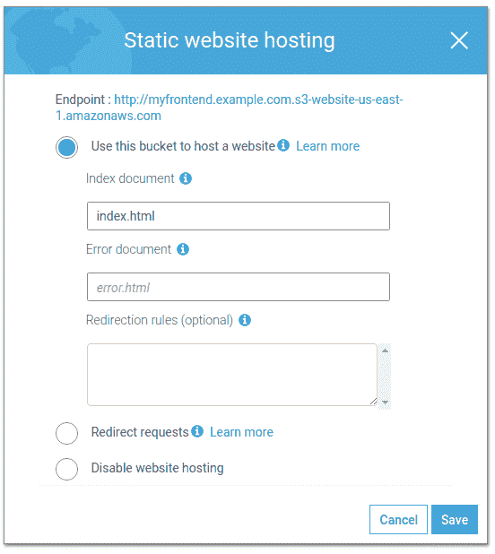

> 注意:上面对话框中显示的“端点”链接。稍后我们将用这个 URL 测试我们的静态网站。

我们需要做的最后一件事是在桶上启用公共访问。这可以通过添加存储桶策略来实现。打开这个木桶，选择**权限**选项卡，然后点击**木桶策略**按钮。

键入以下内容作为策略，然后单击**保存**按钮(不要忘记用您的域名替换`myservice.example.com`)。

```
{    "Version": "2012-10-17",    "Statement": [        {            "Sid": "PublicReadGetObject",            "Effect": "Allow",            "Principal": "*",            "Action": "s3:GetObject",            "Resource": "arn:aws:s3:::myfrontend.example.com/*"        }    ]}
```

保存之后，我们应该能够在 **Bucket Policy** 按钮和 **Permissions** 选项卡上看到一个橙色的“public”标志，这表明我们的 Bucket 是可以公开访问的。

现在存储桶已经创建，但仍然是空的。我们需要上传我们的前端代码文件到这个桶。确保我们在新创建的`myfrontend`目录中，并键入以下命令:

```
# Make sure you are in the `myfrontend` directory...$ aws s3 sync . s3://myfrontend.example.com
```

上述命令将当前`.`目录中的所有文件复制到 S3。

全部完成！现在我们可以用前面显示的 URL 测试这个静态网站。用任何浏览器打开那个 URL(在我的例子中是[http://my front end . example . com . S3-website-us-east-1 . Amazon AWS . com/)](http://myfrontend.example.com.s3-website-us-east-1.amazonaws.com/).)并查看结果！

哎呀！计数器根本不显示。？

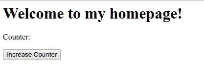

看起来我们有一些 JavaScript 错误。我们可以在控制台中看到以下错误:

```
Failed to load https://myservice-api.example.com/counter: No 'Access-Control-Allow-Origin' header is present on the requested resource. Origin 'http://myfrontend.example.com.s3-website-us-east-1.amazonaws.com' is therefore not allowed access. If an opaque response serves your needs, set the request's mode to 'no-cors' to fetch the resource with CORS disabled.
```

显然我们需要设置 [CORS 头](https://developer.mozilla.org/en-US/docs/Web/HTTP/CORS)来让这个脚本工作，因为后端 API 位于另一个域上。但是因为我们要为前端设置一个自定义域，URL 会改变，所以我们稍后会担心 CORS。

#### 为我们的静态网站设置 CloudFront

最后一步是为我们的前端设置 CloudFront。由于我们已经为`*.example.com`创建了一个证书，这一步将非常容易。

在 AWS 管理控制台中切换到 CloudFront 服务。点击**创建分发**按钮，然后点击“Web”部分的**开始**按钮。

在“创建分销”屏幕中，我们需要进行五项更改:

*   点击**原产地域名**输入框，选择我们的 S3 桶`myfrontend.example.com.s3.amazonaws.com`。
*   然后将**查看器协议策略**更改为“将 HTTP 重定向到 HTTPS ”,以强制 https 访问。
*   在**备用域名**框中，输入我们的自定义域名。在这种情况下，我们输入`myfrontend.example.com`。
*   向下滚动到 **SSL 证书**部分，选择“自定义 SSL 证书”，然后选择我们的`*.example.com`证书。
*   将**默认根对象**更改为`index.html`。

创建分发版后，我们可以在分发版列表中看到 CloudFront 域。

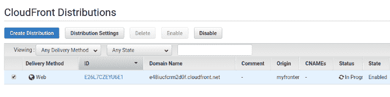

虽然状态仍然是“进行中”，我们现在可以设置我们的 DNS 记录。转到 Google 域并为此域添加一个 CNAME:

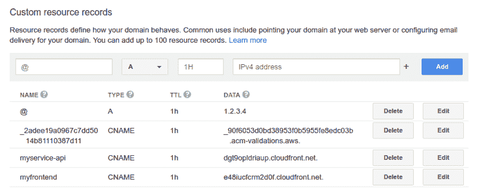

然后等待，直到分发状态变为“已部署”。现在打开浏览器，尝试访问`myfrontend.example.com`。我们可以看到完全相同的静态网站！

### 解决 CORS 问题

现在唯一剩下的问题是 CORS。由于我们在后端和前端使用不同的域名，我们需要添加 CORS 支持。

> 跨源资源共享(CORS)是一种机制，它允许从提供第一资源的域之外的另一个域请求网页上的受限资源(例如字体)。— [维基百科](https://en.wikipedia.org/wiki/Cross-origin_resource_sharing)

回到我们的 API 目录(`myservice`)并激活 Python 环境。然后安装`flask_cors`包。

```
$ cd myservice$ source .env/bin/activate(.env)$ pip install flask_cors
```

然后编辑`myservice.py`并添加以下行(粗体):

```
import boto3from flask import Flask, jsonifyfrom flask_cors import CORS
```

```
app = Flask(__name__)CORS(app, origins=['https://myfrontend.example.com'])
```

将更新的服务推送到 AWS Lambda:

```
(.env)$ zappa update dev
```

现在尝试刷新我们的浏览器。我们可以看到计数器显示正确。点击“增加计数器”按钮也可以增加计数器。

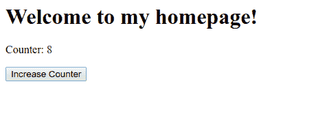

### 结论

在这篇文章中，我们探讨了创建简单的无服务器服务所需的各种 AWS 服务。如果你不熟悉 AWS，你可能会觉得有太多的 AWS 服务，但我们这里使用的大多数 AWS 服务都是一次性使用的。一旦它们被设置好，我们在进一步的开发中根本不需要接触它们。你需要做的就是运行`zappa update`和`aws s3 sync`。

此外，这比设置私有 VPS、安装 web 服务器和编写用于持续部署的 Jenkins 作业要容易得多。

作为总结，以下是这篇文章的要点:

*   Lambda 可以运行一个简单的服务。该服务可以由 API 网关公开。
*   如果你想用 Python 写无服务器服务，zappa 是一个很好的工具。
*   S3 桶可用于静态托管。
*   如果您想使用 https，请向 AWS ACM 申请证书。
*   API Gateway 和 CloudFront 都支持自定义域名。

希望你喜欢这个帖子，并毫不犹豫地鼓掌？对我来说，如果你做了！如果你想了解更多关于 web 开发的内容，请关注我。