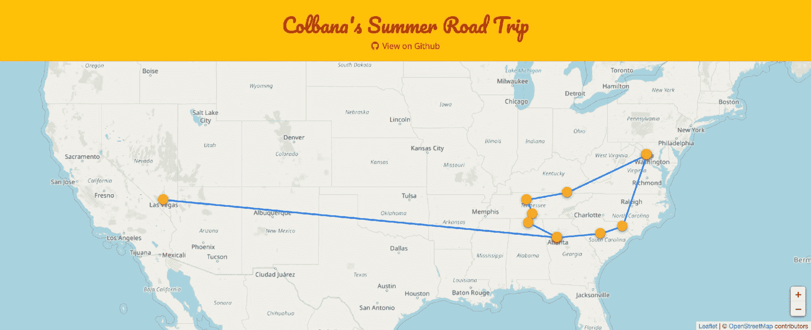
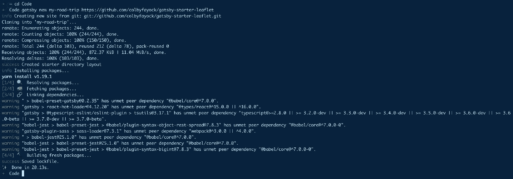
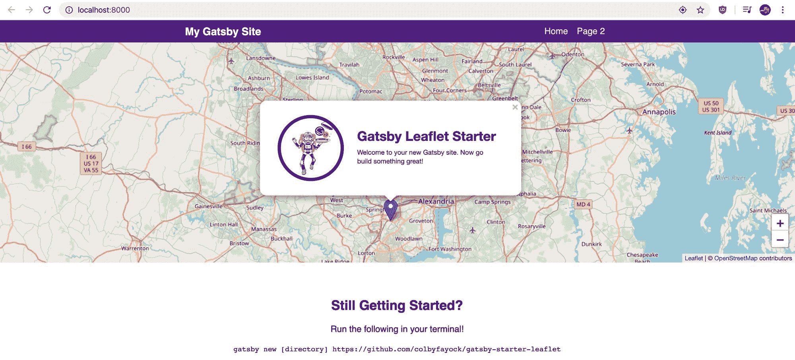
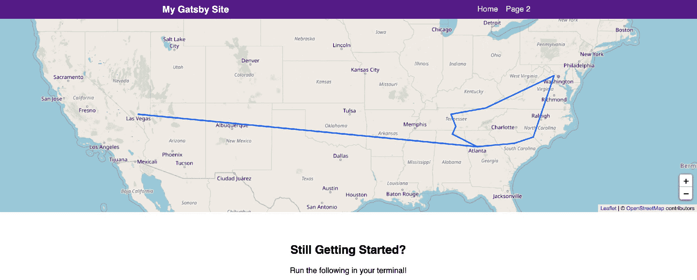
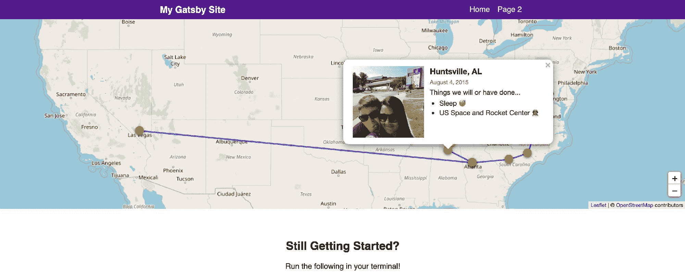
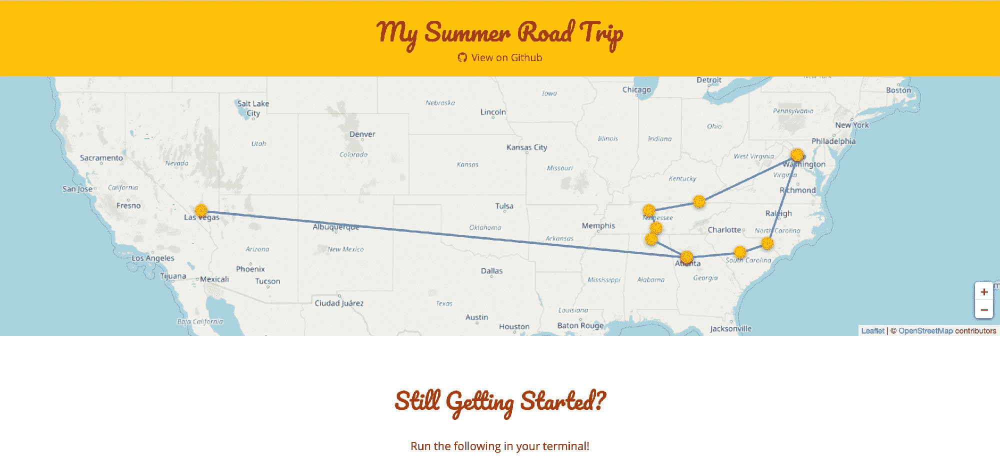

# 如何用盖茨比和传单创建一个夏季公路旅行地图应用程序

> 原文：<https://www.freecodecamp.org/news/how-to-create-a-summer-road-trip-mapping-app-with-gatsby-and-leaflet/>

通过这个循序渐进的指南，构建您自己的公路旅行地图应用程序，为这个夏天做好准备！

*   我们要建造什么？
*   开始之前我们需要什么？
*   [第一步:清理一些不需要的代码](#id="step-1-cleaning-up-some-unneeded-code")
*   [第二步:创建我们的公路旅行地点](#step-2-create-our-road-trip-locations)
*   [第三步:为我们的应用准备一些功能](#step-3-prepare-our-app-with-some-functions)
*   [第四步:建立我们的旅行路线](#step-4-building-our-trip-path)
*   [步骤 5:设计我们的地图组件](#step-5-styling-our-map-components)
*   [想了解更多关于地图的知识？](#want-to-learn-more-about-maps)

作者注:尽管我们正在经历一些具有挑战性的时刻，但我们仍然可以乐观地认为，我们会一起度过难关，并能够享受我们的夏天。注意安全，洗手。❤️

[https://www.youtube.com/embed/FkO8uggDEXY?feature=oembed](https://www.youtube.com/embed/FkO8uggDEXY?feature=oembed)

## 我们要建造什么？

我们将构建一个新的地图应用程序，显示代表旅行的路线。每个位置都会有一张小卡片，我们可以在上面添加图片和一些我们做过的事情。



[Colbana's Summer Road Trip](https://summer-road-trip.netlify.com/)

首先，我们将使用我制作的这个[传单 Gatsby Starter](https://github.com/colbyfayock/gatsby-starter-leaflet) 来使初始设置更加流畅。随着我们的应用程序启动，我们将创建我们的位置列表，并使用传单的 API 在地图上绘制我们的路线。

## 哇，一个地图应用？

没错。如果你之前没有玩过地图，也不要气馁！这并不像你想象的那么糟糕。如果你更愿意从映射基础开始，你可以先[阅读更多关于映射如何工作的信息](https://www.freecodecamp.org/news/easily-spin-up-a-mapping-app-in-react-with-leaflet/)。

## 开始之前我们需要什么？

如果你遵循了我上一篇关于[制作圣诞老人追踪器](https://www.freecodecamp.org/news/create-your-own-santa-tracker-with-gatsby-and-react-leaflet/)的教程，你可以遵循同样的步骤开始。如果没有，我们需要确保设置了以下内容:

*   [节点](https://nodejs.org/en/)或[纱线](https://yarnpkg.com/en/) -我将使用纱线，但你可以在适当的时候用 npm 代替
*   [盖茨比的 CLI](https://www.gatsbyjs.org/docs/gatsby-cli/) - `yarn global add gatsby-cli`

如果你对以上某一项不确定，你可以试着看看[我之前的教程](https://www.freecodecamp.org/news/create-your-own-santa-tracker-with-gatsby-and-react-leaflet/)的开头。

我们还想为我们的地图建立一个基础。我们可以通过利用我整理的小册子 Gatsby Starter 来做到这一点，它为我们提供了一个基本的设置，包括[小册子](https://leafletjs.com/)和[反应小册子](https://react-leaflet.js.org/)。

```
gatsby new my-road-trip https://github.com/colbyfayock/gatsby-starter-leaflet
```



Creating a new Leaflet Gatsby app in the terminal

运行完成后，您可以导航到新创建的项目目录并启动您的本地开发服务器:

```
cd my-road-trip
yarn develop
```


Starting your Gatsby app in the terminal

如果一切按计划进行，您的服务器应该启动，现在您应该能够在浏览器中看到您的基本地图应用程序！



New Leaflet Gatsby app in the browser

## 步骤 1:清理一些不需要的代码

我们用来启动这个应用程序的 Gatsby Starter 附带了一些我们在这里不需要的演示代码。我们希望在下面的文件`src/pages/index.js`中进行所有的更改，这是我们应用程序的主页。

首先，让我们删除`mapEffect`函数中的所有内容。该函数用于运行在地图渲染时触发的代码。

```
// In src/pages/index.js

async function mapEffect({ leafletElement } = {}) {
  // Get rid of everything in here
}
```

接下来，我们这次不需要标记，所以让我们从`<Map`组件中移除`<Marker`组件:

```
<Map {…mapSettings} />
```

现在我们已经清除了这些部分，我们可以从文件顶部删除以下所有导入和变量:

*   useRef
*   标记
*   承诺飞翔
*   getCurrentLocation
*   盖茨比 _ 宇航员
*   时间工作室
*   timeToOpenPopupAfterZoom
*   timeToUpdatePopupAfterZoom
*   嗡嗡声
*   popupContentHello
*   popupContentGatsby
*   马克里夫

之后，我们的地图应该仍然工作，但不做任何事情。


New mapping app with nothing going on

[跟随提交](https://github.com/colbyfayock/my-road-trip/commit/c92e8f970c8a2f2436f65ea0890680a88b747c49)

## 步骤 2:创建我们的公路旅行地点

这一步将包括准备我们的位置数据，这些数据将填充我们的公路旅行应用程序。我们的位置将包括属性，如名称、日期、我们做过的事情，如果我们需要，还可以包括图片。

首先，在`src/data`目录中创建一个名为`locations.js`的新文件。在该文件中，我们希望创建并导出一个新数组。

```
export const locations = [
  {
    placename: ‘Herndon, VA’,
    date: ‘August 1, 2015’,
    location: {
      lat: 38.958988,
      lng: -77.417320
    },
    todo: [
      ‘Where we start! ?’
    ]
  },
  {
    placename: ‘Middlesboro, KY',
    date: ‘August 1, 2015’,
    location: {
      lat: 36.627517,
      lng: -83.621635
    },
    todo: [
      ‘Cumberland Gap ?’
    ]
  }
]; 
```

您可以使用上面的内容开始，但是您最终会想要根据您的选择更改细节。

如果您想要将图像添加到您的位置，您可以通过将一个`image`属性包含到对象中来实现。您可以使用 URL 字符串，也可以导入本地文件(如果有的话)，就像我在本例中所做的那样:

```
import imgHerndonStart from 'assets/images/herndon-start.jpg’;

export const locations = [
  {
    placename: ‘Herndon, VA’,
    date: ‘August 1, 2015’,
    image: imgHerndonStart,
    location: {
      lat: 38.958988,
      lng: -77.417320
    },
    todo: [
      ‘Where we start! ?’
    ]
  }
] 
```

一旦创建了该文件，我们现在可以将我们的位置导入到我们的`src/pages/index.js`文件中，这样我们就可以在下一步中使用它:

```
import { locations } from 'data/locations’; 
```

如果您在页面中添加了一个`console.log(locations)`,现在您应该可以在一个数组中看到所有的位置数据！

[跟随提交](https://github.com/colbyfayock/my-road-trip/commit/55f4eb32d402364a20ad0342ebfde995081c521e)

## 第三步:为我们的应用程序准备一些功能

为了保持事情简单和集中，我将创建地图的 3 个重要部分组合到一起。虽然它可以复制和粘贴，但我们将遍历每个函数中发生的事情。

您可以将这些函数放在`src/pages/index.js`文件的底部，以便在下一步中使用。

### createTripPointsGeoJson

我们的第一个函数将获取我们的位置数组，并返回一个 [GeoJSON 文档](https://geojson.org/)，其中我们的位置被映射到一个单独的特征中。我们将使用这个函数在地图上创建单独的点。

什么是 GeoJSON 文档？它本质上是一个 JavaScript 对象或 JSON 文档，具有与地理数据一致的特定结构。

```
function createTripPointsGeoJson({ locations } = {}) {
  return {
    “type”: “FeatureCollection”,
    “features”: locations.map(({ placename, location = {}, image, date, todo = [] } = {}) => {
      const { lat, lng } = location;
      return {
        “type”: “Feature”,
        “properties”: {
          placename,
          todo,
          date,
          image
        },
        “geometry”: {
          “type”: “Point”,
          “coordinates”: [ lng, lat ]
        }
      }
    })
  }
} 
```

那么上面发生了什么呢？

*   我们接受一个位置参数，这将是我们的目的地数组
*   我们返回一个带有一些动态属性的对象
*   在对象中，我们将自己的位置映射到各个`Feature`对象
*   使用我们的坐标，每个对象都包含一个`Point`形状
*   它还包括存储元数据的属性

当调用这个函数时，我们将有一个新创建的 JavaScript 对象，它包括一个点数组，表示我们在公路旅行中要停留的位置。

### createTripLinesGeoJson

我们将创建另一个与前一个类似的函数。然而这一次，我们想要创建代表从一个点到下一个点的线，而不是点。

```
function createTripLinesGeoJson({ locations } = {}) {
  return {
    “type”: “FeatureCollection”,
    “features”: locations.map((stop = {}, index) => {
      const prevStop = locations[index - 1];

      if ( !prevStop ) return [];

      const { placename, location = {}, date, todo = [] } = stop;
      const { lat, lng } = location;
      const properties = {
        placename,
        todo,
        date
      };

      const { location: prevLocation = {} } = prevStop;
      const { lat: prevLat, lng: prevLng } = prevLocation;

      return {
        type: ‘Feature’,
        properties,
        geometry: {
          type: ‘LineString’,
          coordinates: [
            [ prevLng, prevLat ],
            [ lng, lat ]
          ]
        }
      }
    })
  }
} 
```

所以你会立刻注意到这和我们的最后一个函数非常相似。我们正在返回一个对象，并在一系列特征上设置我们的元数据属性。

然而，最大的不同是，我们正在创建一条线。为了做到这一点，我们正在查找并参考将是前一站的`prevStop`。我们将使用前一个停靠点和当前停靠点，以便有 2 个点可以用来画线。

如果我们没有前一站，我们返回一个空数组，这基本上意味着我们在旅程的开始，前面没有线。

利用前一个停靠点和当前停靠点，我们用我们的 2 个点创建一个`LineString`类型的特征。

### tripStopPointToLayer

我们的最后一个功能是允许我们为将要添加到地图中的每个点创建自定义内容。我们实际上将在活页属性中使用这个函数，所以我们将使我们的参数符合那个规范。

```
function tripStopPointToLayer( feature = {}, latlng ) {
  const { properties = {} } = feature;
  const { placename, todo = [], image, date } = properties;

  const list = todo.map(what => `<li>${ what }</li>`);
  let listString = ‘’;
  let imageString = ‘’;

  if ( Array.isArray(list) && list.length > 0 ) {
    listString = list.join(‘’);
    listString = `
      <p>Things we will or have done…</p>
      <ul>${listString}</ul>
    `
  }

  if ( image ) {
    imageString = `
      <span class=“trip-stop-image” style=“background-image: url(${image})”>${placename}</span>
    `;
  }

  const text = `
    <div class=“trip-stop”>
      ${ imageString }
      <div class=“trip-stop-content”>
        <h2>${placename}</h2>
        <p class=“trip-stop-date”>${date}</p>
        ${ listString }
      </div>
    </div>
  `;

  const popup = L.popup({
    maxWidth: 400
  }).setContent(text);

  const layer = L.marker( latlng, {
    icon: L.divIcon({
      className: ‘icon’,
      html: `<span class=“icon-trip-stop”></span>`,
      iconSize: 20
    }),
    riseOnHover: true
  }).bindPopup(popup);

  return layer;
} 
```

当我们使用这个函数时，您会注意到我们创建了 HTML 文本字符串。鉴于我们为此使用的传单 API 不直接与 React 接口，我们必须手动构建 HTML 以将其传递给我们的函数。

从顶部开始:

*   我们接受两个参数，`feature`和`latlng`。传单传入这两个值供我们在函数中使用。
*   我们析构了我们的特征，允许我们将元数据赋给变量
*   初始化了 2 个字符串变量，我们将在 HTML 中使用它们
*   如果我们以数组的形式包含一个`todo`属性，我们将添加一个新的列表，其中包含每一项。
*   如果我们包含一个图像，我们创建一个图像标签。
*   使用我们新创建的 HTML 字符串，我们为每个 strop 构建了完整的弹出卡
*   使用我们的弹出 HTML，我们创建了一个传单`popup`实例
*   利用这个参数和我们的弹出窗口，我们创建了一个新的传单实例。这将代表地图上的点。
*   在创建标记的过程中，我们创建了一个基本的 HTML 标签，用来设置标记的样式
*   然后，我们将弹出窗口绑定到这个新的标记实例。这将允许弹出窗口与该单独的标记相关联
*   最后，我们返回新创建的层

记得确保将上面所有的功能放在你的`src/pages/index.js`页面的底部。

一旦添加了所有这些功能，我们的地图应该还是一样的，基本上什么也没发生。

[跟随提交](https://github.com/colbyfayock/my-road-trip/commit/b27b644b32a11e4372963b9d16e0f7ec0ee74b65)

## 步骤 4:建立我们的旅行路线

这就是事情变得有趣的地方。我们现在将利用我们创建的函数来构建我们的公路旅行路径。我们在这里的所有工作都将在`src/pages/index.js`文件中的`mapEffect`函数内进行。

对于上下文，我们的`mapEffect`函数包含一个名为`leafletElement`的参数。这个值指的是小叶识别的地图实例。这个地图实例包括我们的地图状态以及许多使用地图的实用函数。

首先，在函数的顶部，我们要确保我们有一个地图。如果没有，我们可以返回到保释功能。

```
if ( !leafletElement ) return; 
```

接下来，我们想使用`eachLayer`实用函数并从地图元素中移除每个`layer`。我们这样做是为了确保我们始终拥有正确的地图图层状态。

```
leafletElement.eachLayer((layer) => leafletElement.removeLayer(layer));
```

使用清理后的地图，我们可以利用我们创建的两个函数来创建新的 GeoJSON 对象。

```
const tripPoints = createTripPointsGeoJson({ locations });
const tripLines = createTripLinesGeoJson({ locations }); 
```

对于我们的 GeoJSON 对象，我们需要将它们转换为传单 GeoJSON 实例，我们将使用这些实例添加到地图中。

```
const tripPointsGeoJsonLayers = new L.geoJson(tripPoints, {
  pointToLayer: tripStopPointToLayer
});

const tripLinesGeoJsonLayers = new L.geoJson(tripLines); 
```

如果你在上面注意到了，我们正在使用我们的`tripStopPointToLayer`函数。正如我之前提到的，我们正在创建的`geoJson`实例包含一个属性，允许我们传入一个函数，让我们能够操纵层的创建。这就是我们如何创建我们的点和弹出内容。

我们可以使用`addTo`将这两个新图层添加到我们的地图中。

```
tripPointsGeoJsonLayers.addTo(leafletElement);
tripLinesGeoJsonLayers.addTo(leafletElement); 
```

接下来，为了确保我们缩放并集中在正确的位置，我们希望使用 GeoJSON 图层实例上的`getBounds`函数来获取地图的边界。

```
const bounds = tripPointsGeoJsonLayers.getBounds(); 
```

最后，我们使用 map 实例上的`fitBounds`函数使我们的地图视图符合这些边界。

```
leafletElement.fitBounds(bounds); 
```

保存并重新加载页面后，您现在应该会看到一条蓝色路径，代表从地图上的每个位置开始的跳转！



Mapping app with road trip path

不过有一个问题。如果你注意到，我们只看到路径。这是因为我们需要添加一些 CSS，我们将在下一步进行。

[跟随提交](https://github.com/colbyfayock/my-road-trip/commit/6b3f079bebdd60bf012c0886fc33547c98ea50f5)

## 步骤 5:设置地图组件的样式

我们的最后一步将是添加一些样式，让我们的标记显示和弹出窗口看起来恰到好处。

在这一步，我们将在`_home.scss`文件中工作，你可以在`src/assets/stylesheets/pages`中找到它。

我们可以从复制并粘贴这些样式到文件底部开始。完成后，我们可以了解正在发生的事情。

```
.trip-stop {

  width: 400px;
  overflow: hidden;

  h2 {
    font-size: 1.4em;
    margin-top: 0;
    margin-bottom: .2em;
  }

  p,
  ul,
  h3 {
    font-size: 1.2em;
    font-weight: normal;
  }

  p {
    margin: .2em 0;
  }

  .trip-stop-date {
    color: $grey-600;
    font-size: 1em;
  }

  ul {
    padding: 0 0 0 1.4em;
    margin: 0;
  }

}

.trip-stop-image {
  display: block;
  float: left;
  overflow: hidden;
  width: 150px;
  height: 150px;
  text-indent: 100%;
  color: transparent;
  background-position: center;
  background-size: cover;
}

.trip-stop-content {
  float: left;
  width: 250px;
  padding-left: 1em;
}

.icon-trip-stop {

  display: block;
  width: 1.5em;
  height: 1.5em;
  background-color: $orange-500;
  border-radius: 100%;
  box-shadow: 0 2px 5px rgba(0,0,0,.5);

  &:hover {
    background-color: $deep-orange-400;
  }

} 
```

我们的上述风格由三部分组成:

*   `.trip-stop-images`:在标记弹出窗口中，我们可以选择包含一个图像。这些样式设置大小，使文本透明，(它的存在是为了便于访问)，并将其向左浮动，以便我们的弹出内容可以并排正确对齐。
*   `.trip-stop-content`:这是指我们弹出内容的另一半。我们在这里需要做的就是确保我们的尺寸是合适的，并且它在我们的图片旁边浮动。
*   我们用作图标名称的 HTML 标签在这里被设计。我们估算它的大小，使用预先确定的 Scss 变量设置颜色，然后就可以开始了。

保存这些样式后，您现在应该可以在地图上看到代表每个位置的点。此外，您应该能够单击这些点中的每一个来打开一个弹出窗口，其中包含有关停靠点的信息。



Road trip mapping app with popups

[跟随提交](https://github.com/colbyfayock/my-road-trip/commit/d2bac5c1b04a32837366de6f15f14d5342134d38)

## 可选的最后一步:样式调整

最后一件完全可选的事情是做一些风格调整，给你的网站一点个性。我不打算详细讨论这个，但是如果你想继续下去，稍微修饰一下，你可以跟着[这个 commit](https://github.com/colbyfayock/my-road-trip/commit/c2c667da6e34595bc6d8dd0ee66e55d4155feed2) 走，它显示了我所做的每个代码更改。



Final version of the road trip mapping app

[跟随提交](https://github.com/colbyfayock/my-road-trip/commit/c2c667da6e34595bc6d8dd0ee66e55d4155feed2)

## 耶，我们做到了！

如果你跟着我，或者直接跳到开始，你现在应该有一个地图应用程序，你可以在你的下一次公路旅行中使用。

好消息是这个项目可以应用于任何东西！想在地图上标出你最喜欢的 DC 餐馆吗？添加您的位置并删除线。想要在地图上创建线条画吗？这当然是一个选择。

无论它是什么，如果你喜欢让这个地图旋转起来，发挥创意，并将其应用到你的下一个项目！

## 想了解更多关于地图的知识？

您可以查看我的一些其他资源来开始:

*   [如何创建冠状病毒(新冠肺炎)仪表盘&地图 App in React with Gatsby 和传单](https://www.colbyfayock.com/2020/03/how-to-create-a-coronavirus-covid-19-dashboard-map-app-with-gatsby-and-leaflet)
*   [如何使用 React 传单和传单 Gatsby Starter 设置自定义地图框底图样式](https://www.colbyfayock.com/2020/04/how-to-set-up-a-custom-mapbox-basemap-style-with-react-leaflet-and-leaflet-gatsby-starter/)
*   [谁都会地图！灵感和对地图世界的介绍](https://www.colbyfayock.com/2020/03/anyone-can-map-inspiration-and-an-introduction-to-the-world-of-mapping)
*   [如何用盖茨比和 React 传单创建自己的圣诞老人追踪器](https://www.colbyfayock.com/2019/12/create-your-own-santa-tracker-with-gatsby-and-react-leaflet/)
*   [如何使用传单以简单的方式创建地图应用](https://www.freecodecamp.org/news/easily-spin-up-a-mapping-app-in-react-with-leaflet/)

[](https://twitter.com/colbyfayock)

*   [？在 Twitter 上关注我](https://twitter.com/colbyfayock)
*   [？️订阅我的 Youtube](https://youtube.com/colbyfayock)
*   [✉️注册我的简讯](https://www.colbyfayock.com/newsletter/)