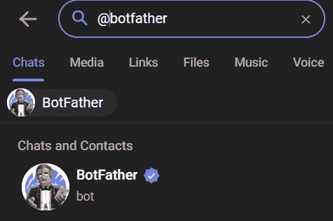
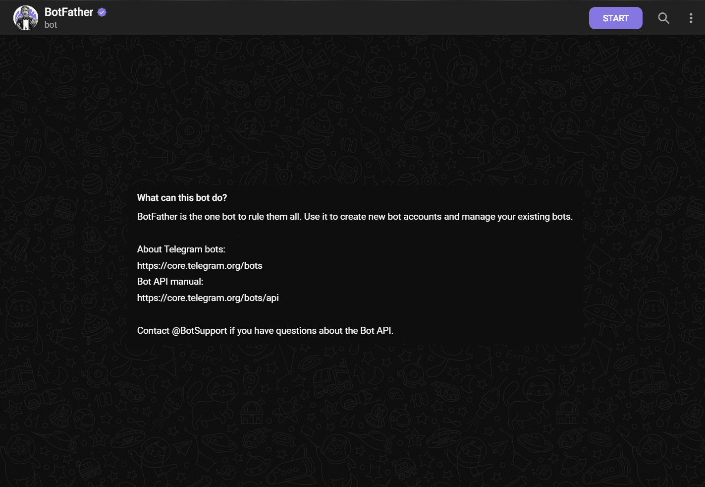
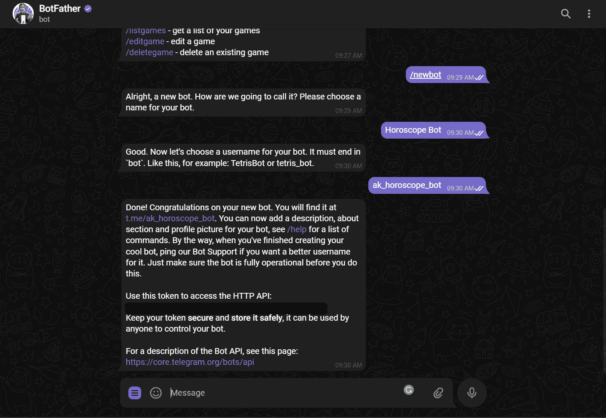
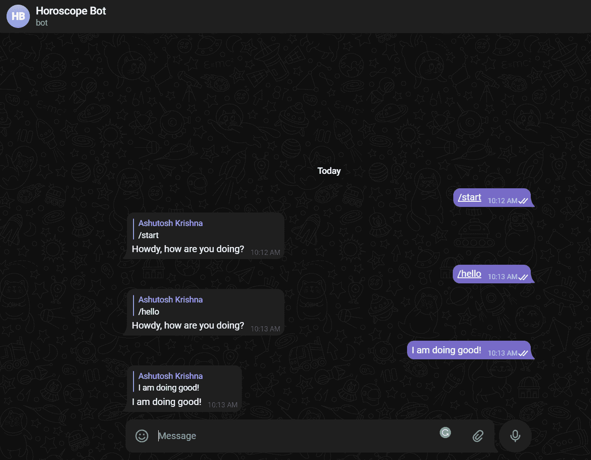

# 如何使用 Python 创建电报机器人

> 原文：<https://www.freecodecamp.org/news/how-to-create-a-telegram-bot-using-python/>

自动化聊天机器人对于刺激互动非常有用。我们可以为 Slack、Discord 和其他平台创建聊天机器人。

在这篇文章中，我将教你如何建立一个电报聊天机器人，它会告诉你你的星座。所以，让我们开始吧！

## 如何获得你的机器人令牌

要设置一个新的机器人，你需要与机器人父亲交谈。不，他不是一个人——他也是一个机器人，他是所有电报机器人的老板。

1.  在 Telegram 中搜索@botfather。



BotFather Telegram Bot

2.通过点击开始按钮开始与机器人父亲的对话。



Click on Start Button

3.键入`/newbot`，按照提示设置一个新的 bot。机器人父亲会给你一个令牌，你将使用它来验证你的机器人，并授权它访问电报 API。



Getting access token

**注意:**确保您安全地存储令牌。任何拥有您的令牌访问权限的人都可以轻松操纵您的机器人。

## 如何设置您的编码环境

让我们设置编码环境。虽然有各种库可用于创建电报机器人，但我们将使用 [pyTelegramBotAPI](https://pypi.org/project/pyTelegramBotAPI/) 库。这是一个简单但可扩展的 Python 实现，用于 Telegram Bot API，具有同步和异步功能。

使用 pip 安装 pyTelegramBotAPI 库:

```
pip install pyTelegramBotAPI 
```

接下来，打开您喜欢的代码编辑器并创建一个`.env`文件来存储您的令牌，如下所示:

```
export BOT_TOKEN=your-bot-token-here
```

之后，运行`source .env`命令从`.env`文件中读取环境变量。

## 如何创建你的第一个机器人

所有的 API 实现都存储在一个名为`TeleBot`的类中。它提供了许多方式来监听传入的消息，以及像`send_message()`、`send_document()`和其他发送消息的功能。

创建一个新的`bot.py`文件，并将下面的代码粘贴到那里:

```
import os

import telebot

BOT_TOKEN = os.environ.get('BOT_TOKEN')

bot = telebot.TeleBot(BOT_TOKEN) 
```

在上面的代码中，我们使用了`os`库来读取存储在我们系统中的环境变量。

如果您还记得，我们在上一步中导出了一个名为`BOT_TOKEN`的环境变量。`BOT_TOKEN`的值被读入一个名为`BOT_TOKEN`的变量。此外，我们使用`TeleBot`类创建一个 bot 实例，并将`BOT_TOKEN`传递给它。

然后我们需要注册消息处理程序。这些消息处理程序包含消息必须通过的过滤器。如果消息通过了过滤器，则调用修饰函数，并将传入的消息作为参数提供。

让我们定义一个消息处理器来处理传入的`/start`和`/hello`命令。

```
@bot.message_handler(commands=['start', 'hello'])
def send_welcome(message):
    bot.reply_to(message, "Howdy, how are you doing?") 
```

对于由消息处理程序修饰的函数，任何名称都是可以接受的，但它只能有一个参数(消息)。

让我们添加另一个处理程序，将所有传入的文本消息回显给发送者。

```
@bot.message_handler(func=lambda msg: True)
def echo_all(message):
    bot.reply_to(message, message.text) 
```

上面的代码使用了一个`lambda`表达式来测试一条消息。因为我们需要回显所有的消息，所以我们总是从`lambda`函数返回`True`。

现在有了一个简单的机器人，它用静态消息响应`/start`和`/hello`命令，并回显所有其他发送的消息。将以下内容添加到文件末尾以启动 bot:

```
bot.infinity_polling() 
```

就是这样！我们准备了一个电报机器人。让我们运行 Python 文件，然后去 Telegram 测试 bot。

如果找不到，请使用其用户名搜索该机器人。您可以通过发送类似于`/hello`和`/start`的命令和其他随机文本来测试它。



Testing the bot

注意:所有消息处理程序都按照它们在源文件中声明的顺序进行测试。

关于使用 pyTelegramBotAPI 库的更多信息，可以参考他们的 **[文档](https://github.com/eternnoir/pyTelegramBotAPI)** 。

## 星座机器人如何编码

现在让我们把注意力转移到构建我们的星座机器人上来。我们将在机器人中使用消息链。该机器人将首先询问你的星座，然后是日期，然后它将回复特定日期的星座。

在引擎盖下，该机器人与一个 API 进行交互，以获取星座数据。

我们将使用我在另一个教程中构建的[星座 API](https://horoscope-app-api.vercel.app/) 。如果你想学习如何建造一个，你可以通过[这个教程](https://ashutoshkrris.hashnode.dev/how-to-create-a-horoscope-api-with-beautiful-soup-and-flask)。在开始之前，请务必在这里探索 API[。](https://horoscope-app-api.vercel.app/)

### 如何获取星座数据

让我们创建一个实用函数来获取某一天的星座数据。

```
import requests

def get_daily_horoscope(sign: str, day: str) -> dict:
    """Get daily horoscope for a zodiac sign.
    Keyword arguments:
    sign:str - Zodiac sign
    day:str - Date in format (YYYY-MM-DD) OR TODAY OR TOMORROW OR YESTERDAY
    Return:dict - JSON data
    """
    url = "https://horoscope-app-api.vercel.app/api/v1/get-horoscope/daily"
    params = {"sign": sign, "day": day}
    response = requests.get(url, params)

    return response.json() 
```

在上面的 Python 代码中，我们创建了一个函数，它接受两个字符串参数——`sign`和`day`——并返回 JSON 数据。我们在 API URL 上发送一个 GET 请求，并将`sign`和`day`作为查询参数传递。

如果您测试该函数，您将得到类似下面的输出:

```
{
   "data":{
      "date": "Dec 15, 2022",
      "horoscope_data": "Lie low during the day and try not to get caught up in the frivolous verbiage that dominates the waking hours. After sundown, feel free to speak your mind. You may notice that there is a sober tone and restrictive sensation today that leaves you feeling like you will never be able to break free from your current situation. Don't get caught in this negative mindset."
   },
   "status": 200,
   "success": true
} 
```

注意:你可以在本教程的[中探索更多关于 Python 中的`requests`库。](https://ashutoshkrris.hashnode.dev/how-to-interact-with-web-services-using-python)

### 如何添加消息处理程序

现在我们有了一个返回星座数据的函数，让我们在我们的 bot 中创建一个消息处理程序，请求用户的星座。

```
@bot.message_handler(commands=['horoscope'])
def sign_handler(message):
    text = "What's your zodiac sign?\nChoose one: *Aries*, *Taurus*, *Gemini*, *Cancer,* *Leo*, *Virgo*, *Libra*, *Scorpio*, *Sagittarius*, *Capricorn*, *Aquarius*, and *Pisces*."
    sent_msg = bot.send_message(message.chat.id, text, parse_mode="Markdown")
    bot.register_next_step_handler(sent_msg, day_handler)
```

上面的函数和我们之前定义的其他函数有点不同。机器人的星座功能将由`/horoscope`命令调用。我们正在向用户发送文本消息，但是请注意，在发送消息时，我们已经将`parse_mode`设置为**降价**。

因为我们将使用消息链，所以我们使用了`register_next_step_handler()`方法。这个方法接受两个参数:**用户发送的消息**和**消息后应该调用的回调函数**。因此，我们传递了`sent_msg`变量和一个新的`day_handler`函数，接下来我们将定义这个函数。

让我们定义接受消息的`day_handler()`函数。

```
def day_handler(message):
    sign = message.text
    text = "What day do you want to know?\nChoose one: *TODAY*, *TOMORROW*, *YESTERDAY*, or a date in format YYYY-MM-DD."
    sent_msg = bot.send_message(
        message.chat.id, text, parse_mode="Markdown")
    bot.register_next_step_handler(
        sent_msg, fetch_horoscope, sign.capitalize()) 
```

我们从`message.text`属性中获取黄道十二宫。与前面的函数类似，它也询问您想知道的星座是哪一天。

最后，我们使用相同的`register_next_step_handler()`方法，传递`sent_msg`、`fetch_horoscope`回调函数和`sign`。

现在让我们定义接受消息和符号的`fetch_horoscope()`函数。

```
def fetch_horoscope(message, sign):
    day = message.text
    horoscope = get_daily_horoscope(sign, day)
    data = horoscope["data"]
    horoscope_message = f'*Horoscope:* {data["horoscope_data"]}\\n*Sign:* {sign}\\n*Day:* {data["date"]}'
    bot.send_message(message.chat.id, "Here's your horoscope!")
    bot.send_message(message.chat.id, horoscope_message, parse_mode="Markdown") 
```

这是最后一个函数，我们从函数参数中获取符号，从`message.text`属性中获取日期。

接下来，我们使用`get_daily_horoscope()`函数获取星座，并构造我们的消息。最后，我们发送带有星座数据的消息。

## 机器人演示

一旦运行 Python 文件，就可以测试这个功能。这是演示:

[https://www.youtube.com/embed/nTHI2rPV_RE?feature=oembed](https://www.youtube.com/embed/nTHI2rPV_RE?feature=oembed)

Horoscope Bot Demo

## 建议的后续步骤

到目前为止，只要我们停止 Python 应用程序，bot 就会停止工作。为了让它一直运行，您可以在 Heroku、Render 等平台上部署 bot。

这里有这个项目的 [GitHub 回购的链接——请随意查看。](https://github.com/ashutoshkrris/Telegram-Horoscope-Bot)

您还可以通过探索[电报 API](https://core.telegram.org/)为机器人添加更多功能。

感谢阅读！你可以在[推特](https://twitter.com/ashutoshkrris) [上关注我。](https://ireadblog.com/)