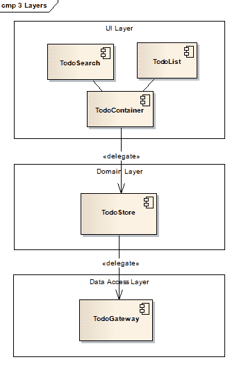
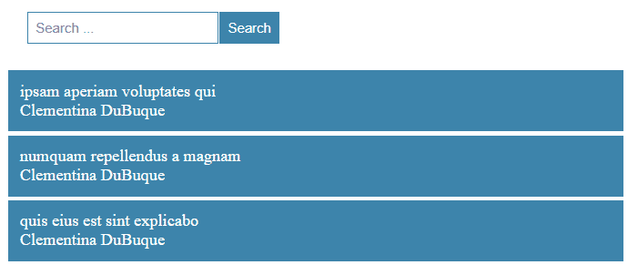
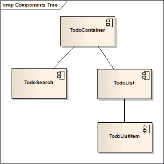

# 如何用 React 创建一个三层应用程序

> 原文：<https://www.freecodecamp.org/news/how-to-create-a-three-layer-application-with-react-8621741baca0/>

[****发现函数式 JavaScript****](https://read.amazon.com/kp/embed?asin=B07PBQJYYG&preview=newtab&linkCode=kpe&ref_=cm_sw_r_kb_dp_cm5KCbE5BDJGE) 被 book authority****评为 [****最佳函数式编程新书之一！****](https://bookauthority.org/books/new-functional-programming-books?t=7p46zt&s=award&book=1095338781)****

将单个页面应用程序拆分为多个层有一系列优点:

*   更好的关注点分离
*   层实现可以被替换
*   UI 层可能很难测试。通过将逻辑转移到其他层，测试变得更加容易。

在下图中，我们可以看到应用程序分为三个主要层:

*   用户界面(又名演示、视图)
*   领域(又名业务)
*   数据存取



Application Layers

### 橱窗

我将以管理待办事项列表的应用程序为例。用户能够看到和搜索待办事项。

#### 检查 git-hub 上的完整[实现。](https://github.com/cristi-salcescu/todo-search-react)



### 用户界面层

UI 层负责在页面上显示数据，并负责处理用户交互。UI 层由组件组成。

我将页面分为以下几个部分:

*   `TodoContainer`管理`TodoSearch`、`TodoList`与其他外部对象之间的通信
*   `TodoSearchForm`是用于搜索待办事项的表单
*   `TodoList`显示待办事项列表
*   `TodoListItem:`在列表中显示单个待办事项



Components Tree

#### TodoSearch

该组件使用`handleChange` 处理程序来读取任何变化的输入值。`TodoSearch`曝光新属性:`onSearch`。父组件可以使用它来处理搜索点击。

该组件不与任何其他外部对象通信，除了其父对象。`TodoSearch`是一个演示组件。

```
export default class TodoSearch extends React.Component { 
  constructor(props){
    super(props);
    this.search = this.search.bind(this);
    this.handleChange = this.handleChange.bind(this);

    this.state = { text: "" };
  }

  search(){
    const query = Object.freeze({ text: this.state.text });
    if(this.props.onSearch)
      this.props.onSearch(query);
  }

  handleChange(event) {
    this.setState({text: event.target.value});
  }

  render() {
    return <form>
      <input onChange={this.handleChange} value={this.state.text} />
      <button onClick={this.search} type="button">Search</button>
    </form>;
  }
}
```

#### 你会的

`TodoList`使用属性获取要呈现的`todos`列表。它将`todos`一个接一个地发送给`TodoListItem`。

`TodoList`是一个无状态的功能组件。

```
export default function TodoList(props) {
  function renderTodoItem(todo){
    return <TodoListItem todo={todo} key={todo.id}></TodoListItem>;
  }

  return <div className="todo-list">
      <ul>
        { props.todos.map(renderTodoItem) }
      </ul>
    </div>;
}
```

#### TodoListItem

`TodoListItem`显示作为参数接收的`todo`。它被实现为一个无状态的功能组件。

```
export default function TodoListItem(props){
  return       <li>
    <div>{ props.todo.title}</div>
    <div>{ props.todo.userName }</div>
  </li>;
}
```

用 React 和 Redux 阅读 [****功能架构，学习如何以功能风格构建应用。****](https://read.amazon.com/kp/embed?asin=B0846NRJYR&preview=newtab&linkCode=kpe&ref_=cm_sw_r_kb_dp_o.hlEbDD02JB2)

[****发现函数式 JavaScript****](https://read.amazon.com/kp/embed?asin=B07PBQJYYG&preview=newtab&linkCode=kpe&ref_=cm_sw_r_kb_dp_cm5KCbE5BDJGE&source=post_page---------------------------) 被 book authority****评为[****最佳函数式编程新书之一！****](https://bookauthority.org/books/new-functional-programming-books?t=7p46zt&s=award&book=1095338781&source=post_page---------------------------)****

****关于在 React 中应用函数式编程技术的更多信息，请看一下**** [****函数式 React****](https://read.amazon.com/kp/embed?asin=B07S1NLFTS&preview=newtab&linkCode=kpe&ref_=cm_sw_r_kb_dp_Pko5CbA30383Y&source=post_page---------------------------) ****。****

你可以在[媒体](https://medium.com/@cristiansalcescu)和[推特](https://twitter.com/cristi_salcescu)上找到我。