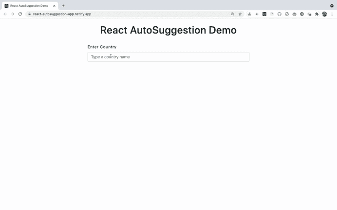
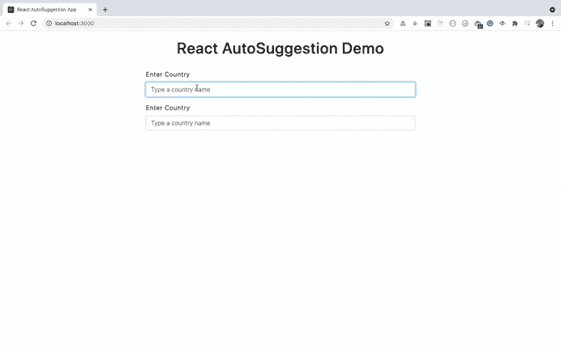

# 如何从头开始创建真正可重用的 React 组件

> 原文：<https://www.freecodecamp.org/news/how-to-create-a-truly-reusable-react-component-from-scratch/>

在本教程中，您将使用 React 构建一个应用程序。您将学习如何从头开始创建一个真正可重用的自动建议组件。

这个应用程序将允许用户在国家列表中搜索一个国家。它将在用户输入的国家的输入字段下方显示匹配的建议。

通过构建此应用程序，您将了解到:

*   如何创建可重用的组件
*   如何使用`useRef`钩子来管理自动建议
*   如何创建自定义的可重用钩子
*   如何有效地执行搜索

还有更多。

你可以在这里找到最终应用[的现场演示。](https://react-autosuggestion-app.netlify.app/)

下面是自动建议功能的工作演示。



因此，让我们开始构建应用程序。

## 设置项目

我们将使用 create-react-app 来初始化项目。

我们将使用 React Hooks 语法来创建组件。所以如果你不熟悉它，在这里查看我的关于钩子的文章。

通过执行以下命令创建一个新的 React 项目:

```
npx create-react-app react-autosuggestion-app
```

创建项目后，删除`src`文件夹中的所有文件，并在`src`文件夹中创建`index.js`、`App.js`、`styles.css`文件。

在`src`文件夹中创建`components`和`custom-hooks`文件夹。

通过从终端或命令提示符运行以下命令来安装所需的依赖项:

```
yarn add axios@0.21.1 lodash@4.17.21 react-bootstrap@1.6.1 bootstrap@5.1.0
```

一旦安装完毕，打开`src/styles.css`文件，将[文件](https://github.com/myogeshchavan97/react-autosuggestion-app/blob/master/src/styles.css)中的内容添加进去。

## 如何构建初始页面

在`public`文件夹中创建一个新的`countries.json`文件，并将来自[这个文件](https://github.com/myogeshchavan97/react-autosuggestion-app/blob/master/public/countries.json)的内容添加到其中。

使用以下代码在`components`文件夹中创建一个`AutoComplete.js`文件:

```
import React from 'react';

function AutoComplete({ isVisible, suggestions, handleSuggestionClick }) {
  return (
    <div className={`${isVisible ? 'show suggestion-box' : 'suggestion-box'}`}>
      <ul>
        {suggestions.map((country, index) => (
          <li key={index} onClick={() => handleSuggestionClick(country)}>
            {country}
          </li>
        ))}
      </ul>
    </div>
  );
}

export default AutoComplete;
```

在这个文件中，一旦用户在输入框中输入内容，我们就向用户显示建议。

使用以下代码在`custom-hooks`文件夹中创建一个`useOutsideClick.js`文件:

```
import { useState, useRef, useEffect } from 'react';

const useOutsideClick = () => {
  const [isVisible, setIsVisible] = useState(false);
  const ref = useRef();

  const handleOutsideClick = () => {
    if (ref.current) {
      setIsVisible(false);
    }
  };

  useEffect(() => {
    document.addEventListener('click', handleOutsideClick);
    return () => {
      document.removeEventListener('click', handleOutsideClick);
    };
  }, []);

  return [ref, isVisible, setIsVisible];
};

export default useOutsideClick;
```

在这里，我们创建了一个自定义钩子来显示/隐藏建议框。

最初，我们通过将值设置为`false`来声明隐藏建议框的状态:

```
const [isVisible, setIsVisible] = useState(false);
```

然后我们声明了一个 ref:

```
const ref = useRef();
```

我们将这个`ref`连同`isVisible`和`setIsVisible`一起从我们的定制钩子中返回，如下所示:

```
return [ref, isVisible, setIsVisible];
```

因此，在组件内部，无论我们在哪里使用`useOutsideClick`钩子，我们都可以使用这个引用将它分配给建议框。因此，如果有多个输入字段，那么每个输入字段都有自己的建议框以及隐藏和显示功能。

在`handleOutsideClick`函数中，我们有以下代码:

```
const handleOutsideClick = () => {
  if (ref.current) {
    setIsVisible(false);
  }
};
```

在这里，我们检查`ref.current`，因为我们希望仅当建议框的引用可用时才调用`setIsVisible`函数，而不是每次单击页面时都调用。

然后我们添加了事件处理程序来调用`handleOutsideClick`函数:

```
useEffect(() => {
  document.addEventListener('click', handleOutsideClick);
  return () => {
    document.removeEventListener('click', handleOutsideClick);
  };
}, []);
```

一旦组件被卸载，我们还通过从`useEffect`钩子返回一个函数来移除事件处理程序。

## 如何创建可重用的 React 组件

现在，用下面的代码在`components`文件夹中创建一个`InputControl.js`文件:

```
/* eslint-disable react-hooks/exhaustive-deps */
import React, { useState, useEffect, useRef } from 'react';
import axios from 'axios';
import _ from 'lodash';
import { Form } from 'react-bootstrap';
import AutoComplete from './AutoComplete';
import useOutsideClick from '../custom-hooks/useOutsideClick';

const InputControl = ({ name, label, placeholder }) => {
  const [documentRef, isVisible, setIsVisible] = useOutsideClick();
  const [suggestions, setSuggestions] = useState([]);
  const [selectedCountry, setSelectedCountry] = useState('');
  const [searchTerm, setSearchTerm] = useState('');
  const [errorMsg, setErrorMsg] = useState('');
  const ref = useRef();

  useEffect(() => {
    ref.current = _.debounce(processRequest, 300);
  }, []);

  function processRequest(searchValue) {
    axios
      .get('/countries.json')
      .then((response) => {
        const countries = response.data;
        const result = countries.filter((country) =>
          country.toLowerCase().includes(searchValue.toLowerCase())
        );
        setSuggestions(result);
        if (result.length > 0) {
          setIsVisible(true);
        } else {
          setIsVisible(false);
        }
        setErrorMsg('');
      })
      .catch(() => setErrorMsg('Something went wrong. Try again later'));
  }

  function handleSearch(event) {
    event.preventDefault();
    const { value } = event.target;
    setSearchTerm(value);
    ref.current(value);
  }

  function handleSuggestionClick(countryValue) {
    setSelectedCountry(countryValue);
    setIsVisible(false);
  }

  return (
    <Form.Group controlId="searchTerm">
      <Form.Label>{label}</Form.Label>
      <Form.Control
        className="input-control"
        type="text"
        value={searchTerm}
        name={name}
        onChange={handleSearch}
        autoComplete="off"
        placeholder={placeholder}
      />
      <div ref={documentRef}>
        {isVisible && (
          <AutoComplete
            isVisible={isVisible}
            suggestions={suggestions}
            handleSuggestionClick={handleSuggestionClick}
          />
        )}
      </div>
      {selectedCountry && (
        <div className="selected-country">
          Your selected country: {selectedCountry}
        </div>
      )}
      {errorMsg && <p className="errorMsg">{errorMsg}</p>}
    </Form.Group>
  );
};

export default InputControl;
```

在这个文件中，我们创建了一个可重用的组件，组件中提供了搜索和建议。

最初，我们引用了`useOutsideClick`钩子:

```
const [documentRef, isVisible, setIsVisible] = useOutsideClick();
```

我们将从钩子返回的 ref 存储在`documentRef`变量中。
每当用户在文本框中输入内容时，我们都会调用 API 来获取符合搜索条件的国家列表。

但是为了避免对文本框中输入的每个字符进行不必要的 API 调用，我们将使用 [lodash](https://lodash.com/) 库的反跳方法。它让我们仅在用户停止使用以下代码输入 300 毫秒后才调用 API:

```
ref.current = _.debounce(processRequest, 300);
```

`_.debounce`函数调用返回一个我们存储在`ref.current`变量中的函数。一旦过了 300 毫秒，我们将调用存储在那里的函数。

我们使用 ref 而不是普通变量，因为我们只需要在组件挂载时进行一次初始化。当一些状态或属性改变时，法线变量的值将在每次重新渲染组件时丢失。

我们通过传递用户输入的值，从`handleSearch`函数调用存储在`ref.current`中的函数。

所以一旦我们调用存储在`ref.current`中的函数，就会在后台调用`processRequest`函数。

`processRequest`函数将自动接收传递给`ref.current`函数的值。

在`processRequest`函数中，我们调用一个 API 来获取国家列表。

```
function processRequest(searchValue) {
  axios
    .get('/countries.json')
    .then((response) => {
      const countries = response.data;
      const result = countries.filter((country) =>
        country.toLowerCase().includes(searchValue.toLowerCase())
      );
      setSuggestions(result);
      if (result.length > 0) {
        setIsVisible(true);
      } else {
        setIsVisible(false);
      }
      setErrorMsg('');
    })
    .catch(() => setErrorMsg('Something went wrong. Try again later'));
}
```

在这里，一旦我们从 API 得到响应，我们就使用数组过滤方法只过滤出与提供的搜索词相匹配的国家。

然后我们使用`setSuggestions(result)`列出建议状态中的国家列表。

接下来，我们检查结果数组的长度，以显示或隐藏建议框。

如果您检查从组件返回的 JSX，它看起来像这样:

```
return (
  <Form.Group controlId="searchTerm">
    <Form.Label>{label}</Form.Label>
    <Form.Control
      className="input-control"
      type="text"
      value={searchTerm}
      name={name}
      onChange={handleSearch}
      autoComplete="off"
      placeholder={placeholder}
    />
    <div ref={documentRef}>
      {isVisible && (
        <AutoComplete
          isVisible={isVisible}
          suggestions={suggestions}
          handleSuggestionClick={handleSuggestionClick}
        />
      )}
    </div>
    {selectedCountry && (
      <div className="selected-country">
        Your selected country: {selectedCountry}
      </div>
    )}
    {errorMsg && <p className="errorMsg">{errorMsg}</p>}
  </Form.Group>
);
```

这里，我们为输入框添加了一个`handleSearch` onChange 处理程序，如下所示:

```
function handleSearch(event) {
  event.preventDefault();
  const { value } = event.target;
  setSearchTerm(value);
  ref.current(value);
}
```

我们用用户输入的值更新`searchTerm`状态。然后我们通过传递用户输入的值来调用存储在`ref.current`中的函数。

内部调用`ref.current`会调用`processRequest`函数，而我们实际上是在调用 API。

然后在输入文本框之后，我们添加了一个带有 ref 的 div 来显示建议:

```
<div ref={documentRef}>
  {isVisible && (
    <AutoComplete
      isVisible={isVisible}
      suggestions={suggestions}
      handleSuggestionClick={handleSuggestionClick}
    />
  )}
</div>
```

只有当`isVisible`为真时，我们才显示建议，这发生在我们从`processRequest`函数内的 API 获得结果时。

这里，我们传递显示在`AutoComplete`组件中的建议。
一旦我们点击任何建议，就会执行`handleSuggestionClick`功能，更新`selectedCountry`并隐藏建议:

```
function handleSuggestionClick(countryValue) {
  setSelectedCountry(countryValue);
  setIsVisible(false);
}
```

## 如何使用可重用组件

现在，打开`App.js`文件并在其中添加以下代码:

```
import React from 'react';
import { Form } from 'react-bootstrap';
import InputControl from './components/InputControl';

const App = () => {
  return (
    <div className="main">
      <h1>React AutoSuggestion Demo</h1>
      <div className="search-form">
        <Form>
          <InputControl
            name="country"
            label="Enter Country"
            placeholder="Type a country name"
          />
        </Form>
      </div>
    </div>
  );
};

export default App;
```

现在，通过在终端或命令提示符下运行以下命令来启动应用程序:

```
yarn start
```


正如您所看到的，一旦您从建议中选择了任何值，所选择的值就会显示在文本框的下方。

**注意:**我们已经创建了一个单独的`InputControl`组件来显示输入框及其建议框。

因此，我们可以再次重用同一个`InputControl`组件，在另一个输入框中显示建议，如下所示:

```
import React from 'react';
import { Form } from 'react-bootstrap';
import InputControl from './components/InputControl';

const App = () => {
  return (
    <div className="main">
      <h1>React AutoSuggestion Demo</h1>
      <div className="search-form">
        <Form>
          <InputControl
            name="country"
            label="Enter Country"
            placeholder="Type a country name"
          />
          <InputControl
            name="country"
            label="Enter Country"
            placeholder="Type a country name"
          />
        </Form>
      </div>
    </div>
  );
};

export default App;
```



正如你所看到的，我们为国家添加了另一个`InputControl`组件，这样我们就能够分别处理每个输入框的建议。

因此，如果你想为另一个文本框显示不同的建议，你可以向`InputControl`组件传递一个额外的属性，并基于该属性在建议框中显示不同的结果。

## 结论

正如我们在本教程中看到的，通过创建一个可重用的`InputControl`组件并使用`ref`分别管理每个输入框的建议，我们能够创建一个真正可重用的组件来显示自动完成建议。

**你可以在[这个资源库](https://github.com/myogeshchavan97/react-autosuggestion-app)找到本教程的完整源代码，在这里可以找到现场演示[。](https://react-autosuggestion-app.netlify.app/)**

## **感谢阅读！**

如果你想从头开始详细学习 Redux，并与[完整的点餐应用](https://www.youtube.com/watch?v=2zaPDfCKAvM)一起构建 3 个应用，请查看[掌握 Redux](https://master-redux.yogeshchavan.dev/) 课程。

在本课程中，您将学到:

*   基本和高级冗余
*   如何管理数组和对象的复杂状态
*   如何使用多个减速器管理复杂的冗余状态
*   如何调试 Redux 应用程序
*   如何在 React 中使用 Redux 使用 react-redux 库让你的 app 反应性。
*   如何使用 redux-thunk 库处理异步 API 调用
*   使用 Redux 构建 3 个不同的应用程序

还有更多。

最后，我们将从头开始构建一个完整的[订餐应用](https://www.youtube.com/watch?v=2zaPDfCKAvM)，集成 stripe 以接受支付，并将其部署到生产中。

想要了解关于 JavaScript、React、Node.js 的最新常规内容吗？[在领英上关注我](https://www.linkedin.com/in/yogesh-chavan97/)。