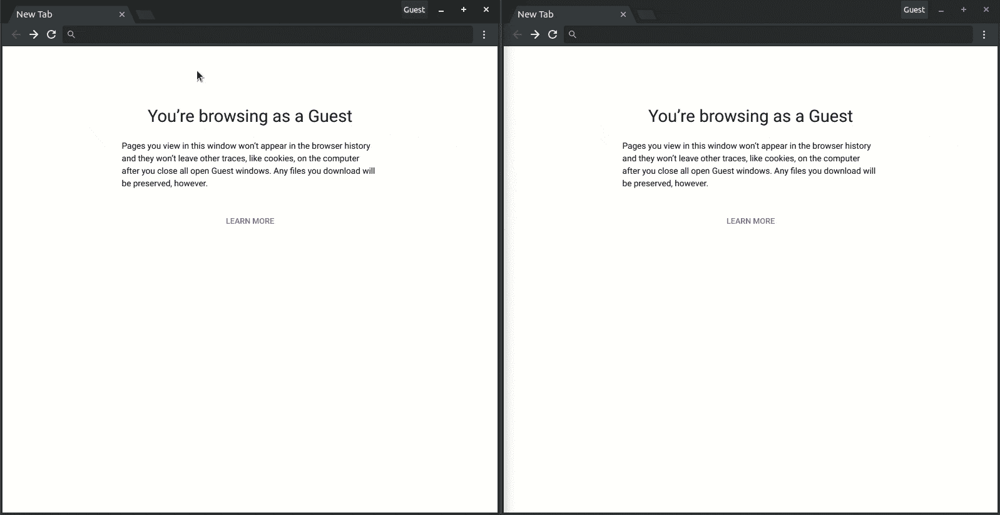

# 如何用 Python 和 Vue 创建双人游戏

> 原文：<https://www.freecodecamp.org/news/how-to-create-a-two-player-game-with-python-and-vue-4220c5592d53/>

作者:尼奥·伊戈达罗

# 如何用 Python 和 Vue 创建双人游戏

在本教程中，我们将使用 Python 和 Pusher 通道创建一个实时井字游戏。这是一个游戏创建后的外观和行为的演示:


您需要在您的机器上安装 Python 3+、virtualenv 和 Flask。个人电脑和互联网的出现重新定义了“娱乐”一词以及获得娱乐的方式。虽然在过去玩游戏需要一台游戏机或一些特殊的硬件，但在当今的科技世界中，游戏只需点击一下鼠标。

这种多人游戏将允许玩家使用他们首选的用户名连接(或者在玩家没有使用用户名连接的情况下生成随机用户名)，并从其他在线玩家列表中选择与另一个玩家一起玩。

游戏本身遵循了流行的井字游戏的常规原则。“在线玩家”功能由[推送器存在通道](https://pusher.com/docs/client_api_guide/client_presence_channels)提供支持，玩家跨多个窗口移动的实时更新由[推送器私人通道提供支持。](https://pusher.com/docs/client_api_guide/client_private_channels)本教程的源代码可以在这里找到 [GitHub](https://github.com/neoighodaro/python-pusher-multiplayer-game) 。

让我们开始吧。

### 先决条件

为了跟上，需要 Python、Flask、JavaScript (ES6 语法)和 Vue 的基础知识。您还需要在计算机上安装以下软件:

1.  [Python (v3.x)](https://www.python.org/)
2.  [虚拟人](https://virtualenv.pypa.io/en/stable/)
3.  [烧瓶](http://flask.pocoo.org/)

Virtualenv 非常适合创建隔离的 Python 环境，因此我们可以在隔离的环境中安装依赖项，而不会污染我们的全局包目录。

### 设置环境

我们将创建项目文件夹并在其中激活一个虚拟环境:

```
$ mkdir python-pusher-mutiplayer-game
    $ cd python-pusher-mutiplayer-game
    $ virtualenv .venv
    $ source .venv/bin/activate # Linux based systems
    $ \path\to\env\Scripts\activate # Windows users
```

我们将使用以下命令安装[烧瓶](http://flask.pocoo.org/):

```
$ pip install flask
```

### 设置推动器

为了将 Pusher 集成到多人游戏中，我们需要从 Pusher 仪表盘创建一个 Pusher channels 应用程序。如果你还没有一个推销者帐户，请到[推销者网站](https://pusher.com/)创建一个。

创建帐户后，创建一个新的 channels 应用程序，并从应用程序仪表板中启用客户端事件。要启用客户端事件，点击**应用设置**并滚动到页面底部，然后选择选项**启用客户端事件，**并更新**应用设置。**

### 构建后端服务器

回到项目目录，让我们用这个命令安装 [Python Pusher 库](https://github.com/pusher/pusher-http-python):

```
$ pip install pusher
```

我们将创建一个新文件，并将其命名为`app.py`，这是我们将为 Flask 后端服务器编写所有代码的地方。我们还将创建一个文件夹，并将其命名为`templates`，该文件夹将保存该应用程序的标记文件。

让我们编写一些代码来注册游戏的端点并为视图提供服务，打开`app.py`文件并粘贴以下代码:

```
// File: ./app.py
    from flask import Flask, render_template, request, jsonify, make_response, json
    from pusher import pusher
    app = Flask(__name__)
    pusher = pusher_client = pusher.Pusher(
      app_id='PUSHER_APP_ID',
      key='PUSHER_APP_KEY',
      secret='PUSHER_APP_SECRET',
      cluster='PUSHER_APP_CLUSTER',
      ssl=True
    )
    name = ''
    @app.route('/')
    def index():
      return render_template('index.html')
    @app.route('/play')
    def play():
      global name
      name = request.args.get('username')
      return render_template('play.html')
    @app.route("/pusher/auth", methods=['POST'])
    def pusher_authentication():
      auth = pusher.authenticate(
        channel=request.form['channel_name'],
        socket_id=request.form['socket_id'],
        custom_data={
          u'user_id': name,
          u'user_info': {
            u'role': u'player'
          }
        }
      )
      return json.dumps(auth)
    if __name__ == '__main__':
        app.run(host='0.0.0.0', port=5000, debug=True)
    name = ''
```

> *用推动器仪表盘上的值替换`PUSHER_APP_*`键。*

在上面的代码中，我们定义了三个端点，它们的作用如下:

*   呈现要求玩家用用户名连接的首页。
*   `/play` -渲染游戏视图。
*   `/pusher/auth` -为连接的玩家验证出牌者的存在和私人通道。

### 构建前端

在`templates`文件夹中，我们将创建两个文件:

1.  `index.html`
2.  `play.html`

`index.html`文件将呈现连接页面，因此打开`templates/index.html`文件并粘贴以下代码:

```
<!-- File: ./templates/index.html -->
    <!DOCTYPE html>
    <html lang="en">
        <head>
            <meta charset="utf-8">
            <meta name="viewport" content="width=device-width, initial-scale=1, shrink-to-fit=no">
            <meta name="description" content="">
            <meta name="author" content="Neo Ighodaro">
            <title>TIC-TAC-TOE</title>
            <link rel="stylesheet" href="https://stackpath.bootstrapcdn.com/bootstrap/4.1.3/css/bootstrap.min.css">
            <style>
                  :root {
                    --input-padding-x: .75rem;
                    --input-padding-y: .75rem;
                  }
                  html,
                  body, body > div {
                    height: 100%;
                  }
                  body > div {
                    display: -ms-flexbox;
                    display: flex;
                    -ms-flex-align: center;
                    align-items: center;
                    padding-top: 40px;
                    padding-bottom: 40px;
                    background-color: #f5f5f5;
                  }
                  .form-signin {
                    width: 100%;
                    max-width: 420px;
                    padding: 15px;
                    margin: auto;
                  }
                  .form-label-group {
                    position: relative;
                    margin-bottom: 1rem;
                  }
                  .form-label-group > input,
                  .form-label-group > label {
                    padding: var(--input-padding-y) var(--input-padding-x);
                  }
                  .form-label-group > label {
                    position: absolute;
                    top: 0;
                    left: 0;
                    display: block;
                    width: 100%;
                    margin-bottom: 0; /* Override default `<label>` margin */
                    line-height: 1.5;
                    color: #495057;
                    cursor: text; /* Match the input under the label */
                    border: 1px solid transparent;
                    border-radius: .25rem;
                    transition: all .1s ease-in-out;
                  }
                  .form-label-group input::-webkit-input-placeholder {
                    color: transparent;
                  }
                  .form-label-group input:-ms-input-placeholder {
                    color: transparent;
                  }
                  .form-label-group input::-ms-input-placeholder {
                    color: transparent;
                  }
                  .form-label-group input::-moz-placeholder {
                    color: transparent;
                  }
                  .form-label-group input::placeholder {
                    color: transparent;
                  }
                  .form-label-group input:not(:placeholder-shown) {
                    padding-top: calc(var(--input-padding-y) + var(--input-padding-y) * (2 / 3));
                    padding-bottom: calc(var(--input-padding-y) / 3);
                  }
                  .form-label-group input:not(:placeholder-shown) ~ label {
                    padding-top: calc(var(--input-padding-y) / 3);
                    padding-bottom: calc(var(--input-padding-y) / 3);
                    font-size: 12px;
                    color: #777;
                  }
            </style>
          </head>
          <body>
            <div id="app">
              <form class="form-signin">
                <div class="text-center mb-4">
                  
                  <h1 class="h3 mb-3 font-weight-normal">TIC-TAC-TOE</h1>
                  <p>PUT IN YOUR DETAILS TO PLAY</p>
                </div>
                <div class="form-label-group">
                    <input type="name" id="inputUsername" ref="username" class="form-control" placeholder="Username" required="" autofocus="">
                      <label for="inputUsername">Username</label>
                </div>
                <div class="form-label-group">
                  <input type="email" id="inputEmail" ref="email" class="form-control" placeholder="Email address" autofocus="" required>
                    <label for="inputEmail">Email address</label>
                </div>
                <button class="btn btn-lg btn-primary btn-block" type="submit" @click.prevent="login">Connect</button>
                <p class="mt-5 mb-3 text-muted text-center">© 2017-2018</p>
              </form>
            </div>
            <script src="https://cdn.jsdelivr.net/npm/vue/dist/vue.js"></script>
            <script>
            var app = new Vue({
              el: '#app',
              methods: {
                login: function () {
                  let username = this.$refs.username.value
                  let email = this.$refs.email.value
                  window.location.replace(`/play?username=${username}&email=${email}`);
                }
              }
            })
            </script>
        </body>
    </html>
```

当玩家访问连接页面并输入用户名和电子邮件时，浏览器窗口将被重定向到游戏视图。

让我们为游戏视图编写标记。打开`play.html`文件并粘贴以下代码:

```
<!-- file: ./templates/play.html -->
    <!DOCTYPE html>
    <html lang="en">
    <head>
      <meta charset="utf-8">
      <meta name="viewport" content="width=device-width, initial-scale=1, shrink-to-fit=no">
      <link rel="stylesheet" href="https://stackpath.bootstrapcdn.com/bootstrap/4.1.3/css/bootstrap.min.css">
      <title>TIC-TAC-TOE</title>
    </head>
    <body>
      <div id="app" class="container-fluid">
        <div class="container-fluid clearfix mb-3 shadow">
          
          <div class="float-right w-25 py-3">
            
            <p class="d-inline">  {{ username }}  </p>
          </div>
        </div>
        <div class="row mx-5" style="height: 50vh">
          <div class="col-8 h-50 align-self-center">
            <div class="row border rounded invisible h-50 w-75 m-auto" style="font-size: 3.6rem" ref="gameboard" @click="playerAction">
              <div class="h-100 pr-2 col border border-dark" data-id="1" ref="1"></div>
              <div class="col pr-2 border border-dark" data-id="2" ref="2"></div>
              <div class="col pr-2 border border-dark" data-id="3" ref="3"></div>
              <div class="w-100"></div>
              <div class="h-100 pr-2 col border border-dark" data-id="4" ref="4"></div>
              <div class="col pr-2 border border-dark" data-id="5" ref="5"></div>
              <div class="col pr-2 border border-dark" data-id="6" ref="6"></div>
              <div class="w-100"></div>
              <div class="h-100 pr-2 col border border-dark" data-id="7" ref="7"></div>
              <div class="col pr-2 border border-dark" data-id="8" ref="8"></div>
              <div class="col pr-2 border border-dark" data-id="9" ref="9"></div>
            </div>
          </div>
          <div class="col-4 pl-3">
            <div class="row h-100">
              <div class="col border h-75 text-center" style="background: rgb(114, 230, 147);">
                <p class="my-3">  {{ players }}  online player(s) </p>
                <hr/>
                <li class="m-auto py-3 text-dark" style="cursor: pointer;" v-for="member in connectedPlayers" @click="choosePlayer">
                   {{ member }} 
                </li>
              </div>
              <div class="w-100"></div>
              <div class="col text-center py-3 border h-25" style="background: #b6c0ca; font-size: 1em; font-weight: bold">
                 {{ status }} 
              </div>
            </div>
          </div>
        </div>
      </div>
      <script src="https://cdn.jsdelivr.net/npm/vue/dist/vue.js"></script>
      <script src="https://js.pusher.com/4.2/pusher.min.js"></script>
      <script>
      </script>
    </body>
    </html>
```

上面的代码定义了游戏视图的布局，但不包含任何交互性或实时特性。在脚本部分，在结束的`body`标签之前，我们包含了 Vue 和 Pusher 库，因为它们是游戏运行所必需的。

让我们包括驱动整个游戏过程并定义其逻辑的 JavaScript 代码。

在同一个文件中，将下面的代码添加到位于结束的`body`标记之前的`script`标记之间:

```
var app = new Vue({
      el: '#app',
      data: {
        username: '',
        players: 0,
        connectedPlayers: [],
        status: '',
        pusher: new Pusher('PUSHER_APP_KEY', {
          authEndpoint: '/pusher/auth',
          cluster: 'PUSHER_APP_CLUSTER',
          encrypted: true
        }),
        otherPlayerName: '',
        mychannel: {},
        otherPlayerChannel: {},
        firstPlayer: 0,
        turn: 0,
        boxes: [0, 0, 0, 0, 0, 0, 0, 0, 0]
      },
      created () {
        let url = new URL(window.location.href);
        let name = url.searchParams.get("username");
        if (name) {
          this.username = name
          this.subscribe();
          this.listeners();
        } else {
          this.username = this.generateRandomName();
          location.assign("/play?username=" + this.username);
        }
      },
      methods: {
        // We will add methods here
      }
    });
```

> *将`PUSHER_APP_*`键替换为推杆仪表板上的键。*

在上面，我们创建了一个新的 Vue 实例，并以`#app`选择器为目标。我们在`data`对象中定义了所有的默认值，然后在创建 Vue 组件时自动调用的`create()`函数中，我们检查一个用户，如果提供了用户名，就将该用户分配给用户名。

我们还调用了`subscribe`和`listeners`方法。让我们在`methods`对象中定义这些。在`methods`对象内部，粘贴以下函数:

```
// [...]
    subscribe: function () {
      let channel = this.pusher.subscribe('presence-channel');
      this.myChannel = this.pusher.subscribe('private-' + this.username)
      channel.bind('pusher:subscription_succeeded', (player) => {
        this.players = player.count - 1
        player.each((player) => {
          if (player.id != this.username)
            this.connectedPlayers.push(player.id)
        });
      });
      channel.bind('pusher:member_added', (player) => {
        this.players++;
        this.connectedPlayers.push(player.id)
      });
      channel.bind('pusher:member_removed', (player) => {
        this.players--;
        var index = this.connectedPlayers.indexOf(player.id);
        if (index > -1) {
          this.connectedPlayers.splice(index, 1)
        }
      });
    },
    listeners: function () {
      this.pusher.bind('client-' + this.username, (message) => {
        if (confirm('Do you want to start a game of Tic Tac Toe with ' + message)) {
          this.otherPlayerName = message
          this.otherPlayerChannel = this.pusher.subscribe('private-' + this.otherPlayerName)
          this.otherPlayerChannel.bind('pusher:subscription_succeeded', () => {
            this.otherPlayerChannel.trigger('client-game-started', this.username)
          })
          this.startGame(message)
        } else {
          this.otherPlayerChannel = this.pusher.subscribe('private-' + message)
          this.otherPlayerChannel.bind('pusher:subscription_succeeded', () => {
            this.otherPlayerChannel.trigger('client-game-declined', "")
          })
          this.gameDeclined()
        }
      }),
      this.myChannel.bind('client-game-started', (message) => {
        this.status = "Game started with " + message
        this.$refs.gameboard.classList.remove('invisible');
        this.firstPlayer = 1;
        this.turn = 1;
      })
      this.myChannel.bind('client-game-declined', () => {
        this.status = "Game declined"
      })
      this.myChannel.bind('client-new-move', (position) => {
        this.$refs[position].innerText = this.firstPlayer ? 'O' : 'X'
      })
      this.myChannel.bind('client-your-turn', () => {
        this.turn = 1;
      })
      this.myChannel.bind('client-box-update', (update) => {
        this.boxes = update;
      })
      this.myChannel.bind('client-you-lost', () => {
        this.gameLost();
      })
    },
    // [...]
```

在`subscribe`方法中，我们订阅我们的推送器存在通道，然后为当前用户订阅私有通道。在`listeners`方法中，我们注册了所有事件的监听器，这些事件将在我们订阅的私有通道上被触发。

接下来，我们将在我们的方法类中添加其他帮助方法。在 methods 类中，将以下函数添加到底部的`listeners`方法之后:

```
// Generates a random string we use as a name for a guest user
    generateRandomName: function () {
      let text = '';
      let possible = 'ABCDEFGHIJKLMNOPQRSTUVWXYZabcdefghijklmnopqrstuvwxyz0123456789';
      for (var i = 0; i < 6; i++) {
        text += possible.charAt(Math.floor(Math.random() * possible.length));
      }
      return text;
    },
    // Lets you choose a player to play as.
    choosePlayer: function (e) {
      this.otherPlayerName = e.target.innerText
      this.otherPlayerChannel = this.pusher.subscribe('private-' + this.otherPlayerName)
      this.otherPlayerChannel.bind('pusher:subscription_succeeded', () => {
        this.otherPlayerChannel.trigger('client-' + this.otherPlayerName, this.username)
      });
    },
    // Begins the game
    startGame: function (name) {
      this.status = "Game started with " + name
      this.$refs.gameboard.classList.remove('invisible');
    },
    // User declined to play
    gameDeclined: function () {
      this.status = "Game declined"
    },
    // Game has ended with current user winning
    gameWon: function () {
      this.status = "You WON!"
      this.$refs.gameboard.classList.add('invisible');
      this.restartGame()
    },
    // Game has ended with current user losing
    gameLost: function () {
      this.turn = 1;
      this.boxes = [0, 0, 0, 0, 0, 0, 0, 0, 0]
      this.status = "You LOST!"
      this.$refs.gameboard.classList.add('invisible');
      this.restartGame()
    },
    // Restarts a game
    restartGame: function () {
      for (i = 1; i < 10; i++) {
        this.$refs[i].innerText = ""
      }
      this.$refs.gameboard.classList.remove('invisible');
    },
    // Checks tiles to see if the tiles passed are a match
    compare: function () {
      for (var i = 1; i < arguments.length; i++) {
        if (arguments[i] === 0 || arguments[i] !== arguments[i - 1]) {
          return false
        }
      }
      return true;
    },
    // Checks the tiles and returns true if theres a winning play
    theresAMatch: function () {
      return this.compare(this.boxes[0], this.boxes[1], this.boxes[2]) ||
        this.compare(this.boxes[3], this.boxes[4], this.boxes[5]) ||
        this.compare(this.boxes[6], this.boxes[7], this.boxes[8]) ||
        this.compare(this.boxes[0], this.boxes[3], this.boxes[6]) ||
        this.compare(this.boxes[1], this.boxes[4], this.boxes[7]) ||
        this.compare(this.boxes[2], this.boxes[5], this.boxes[8]) ||
        this.compare(this.boxes[2], this.boxes[4], this.boxes[6]) ||
        this.compare(this.boxes[0], this.boxes[4], this.boxes[8])
    },
    // Checks to see if the play was a winning play
    playerAction: function (e) {
      let index = e.target.dataset.id - 1
      let tile = this.firstPlayer ? 'X' : 'O'
      if (this.turn && this.boxes[index] == 0) {
        this.turn = 0
        this.boxes[index] = tile
        e.target.innerText = tile
        this.otherPlayerChannel.trigger('client-your-turn', "")
        this.otherPlayerChannel.trigger('client-box-update', this.boxes)
        this.otherPlayerChannel.trigger('client-new-move', e.target.dataset.id)
        if (this.theresAMatch()) {
          this.gameWon()
          this.boxes = [0, 0, 0, 0, 0, 0, 0, 0, 0]
          this.otherPlayerChannel.trigger('client-you-lost', '')
        }
      }
    },
```

上面，我们添加了几个游戏正常运行所需要的辅助方法，在每个方法之前，我们都添加了一个注释来显示这个方法的作用。

现在让我们测试一下这个游戏。

### 测试游戏

我们可以通过运行以下命令来测试游戏:

```
$ flask run
```

现在，如果我们访问 [localhost:5000](http://localhost:5000/) ，我们应该会看到连接页面并测试游戏:



### 结论

在本教程中，我们学习了如何利用 Pusher SDK 创建一个由 Python 后端服务器支持的在线多人游戏。

本教程的源代码可以在 [GitHub](https://github.com/neoighodaro/python-pusher-multiplayer-game) 上找到

这篇文章最初出现在[推手博客](https://pusher.com/tutorials/game-python-vue)上