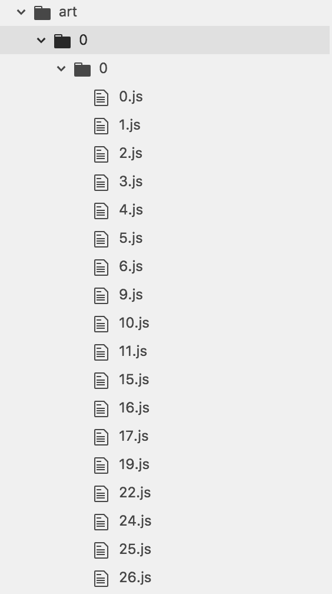
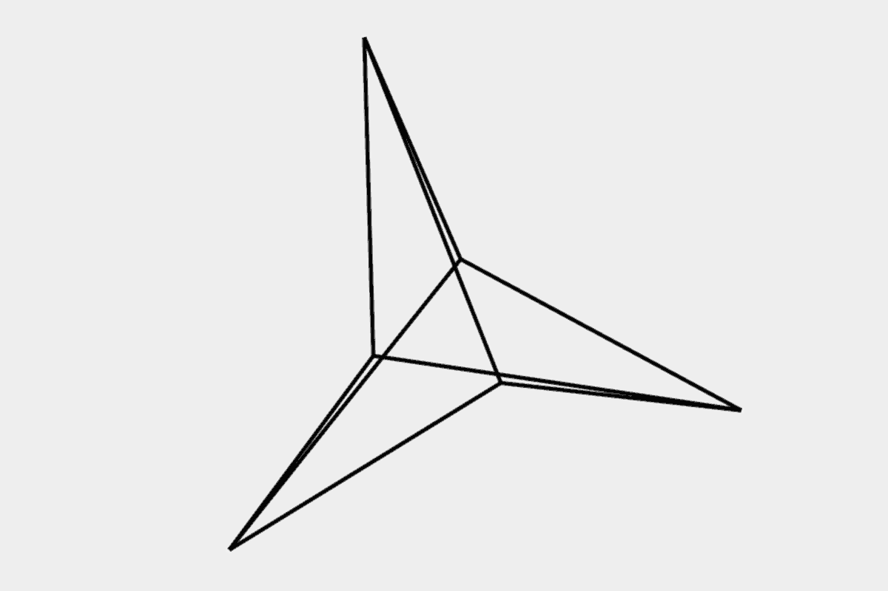

# 创造性编码——如何用 JavaScript 创建 VJ 引擎

> 原文：<https://www.freecodecamp.org/news/how-to-create-a-vj-engine-in-javascript-b63b7fb1c87b/>

乔治·加里

#### 了解如何将 JavaScript 动态注入网页

多年来，我一直使用浏览器进行我的表演和安装，使用我自己简单的自制 VJ 引擎。现在，在你学会一些简单的技巧后，你也可以…

### 快速介绍

首先，什么是 VJ 引擎？你可能会问。甚至可能:什么是 VJ？下面是 VJing 特征的[基本定义](https://en.wikipedia.org/wiki/VJing):

> 与音乐同步，通过技术媒介为观众实时创造或操纵意象。

VJ 引擎就是用于 VJing 的软件。

但是，既然有这么多 VJ 引擎，我为什么要自己造呢？

我从来没有真正喜欢过 VJ 软件——他们总是觉得臃肿，让每个人的东西看起来都差不多。这有点像你第一次接触 Photoshop 时，只是将一堆东西混合在一起，添加一些滤镜，这很酷(因为那是 90 年代)。但最重要的是，我希望在开发内容和声音输入频率之间有更紧密、更好的整合。

这些天我很少 VJ，但它仍然驱动着我的大多数装置和表演——在我需要多重可视化的任何地方，我都使用*RBVJ*(*RB*是给*Radarboy*——就是我)作为包装器/播放器。

这些年来，RBVJ 经历了多次迭代，我从 Flash 到 Processing，最后到现在的 JavaScript，都使用同一个简单的系统。

我之前已经开源了它和我的内容(在 Git 出现之前，我并不知道有一种东西叫做开源)。它赢得了很多奖项，我看到我的内容在很多地方被使用[，这很好](https://www.youtube.com/watch?v=XOhZgAPn_CU&ab_channel=CalumRodger)。所以我认为是时候让其他人也能看到它了，同时还有一堆内容来展示我是如何进行创造性编码的。


from [radarboy3000 on Instagram](https://www.instagram.com/radarboy3000/)

好了，介绍够长了。你说，给我钱！

### 1.构建内容

本质上，VJ 引擎只是一个花哨的内容浏览器和播放器。因此，我们真正需要的是一种检索和播放内容的方法。

你可以把你所有的内容都放在一个文件夹里，但是这个系统对我来说是最好的，它允许一个简单的键盘控制结构:

*   **移动 0–9 以改变设置**
*   **按键 0-9 来改变银行**
*   **键 a-z 选择银行内的内容**。

这为您提供了 2700 个文件。如果你真的(真的！？)想要更多，还可以通过用 shift A-Z 访问每个存储体的另外 26 个文件来加倍。

像大多数 HTML 项目一样，我有一个简单的顶层结构，并将 VJ 内容保存在一个编号结构中的 **art** 文件夹中，如下所示:

```
index.html/css/js/art <- content goes here
```

我的内容文件夹(/art)包含 10 个带编号的文件夹，我称之为**集**。在每组里面还有另外 10 个编号的文件夹，代表**银行**。每一个库内有 27 个单独编号的内容文件，如下所示:



Inside /art are 10 sets of folders. Each set contains 10 banks, inside each bank are 27 javascript files. Banks and sets are accessed by the number keys and the content through keys a-z

### 2.检索和播放内容

现在，我们只需要一种方法来访问我们的文件，这是通过将内容注入我们的索引页面来完成的。

做到这一点非常简单。

神奇之处在于一个名为 I ve**load js()的函数。**它在页面头部创建一个脚本标签，然后向其中注入一些 JavaScript(这将是我们的内容)。我们通过按键(但也可以是 midi 或 OSC 信号)触发这个函数，并将我们想要的内容的文件名传递给它。那么该脚本在页面上是可用的。

```
// INJECT JS ONTO PAGE
```

```
var my_script;
```

```
function loadJS(filename) {
```

```
 // delete injected JavaScript if there’s been some loaded in before if (my_script != undefined)   document.getElementsByTagName("head")[0].removeChild(my_script); 
```

```
 // create a script element my_script = document.createElement(’script’); my_script.setAttribute("type", "text/javascript");
```

```
 // Load the file in and insert it into the page’s head tag my_script.setAttribute("src", filename); document.getElementsByTagName("head")[0].appendChild(my_script);
```

```
}
```

我们用事件监听器监听按键，它调用一个名为 **onKeyDown()** *，*的函数，如下所示:

```
window.addEventListener( ’keydown’, function( event ) {   onKeyDown( event ); });
```

侦听器将事件对象传递给函数，该函数包含一堆有用的东西。我们感兴趣的是:**事件。按“a”键给我们一个 65 的**键码**，按“z”给我们一个 90 的**键码**。因此，我们只需从**键码** 中减去 65，即可得到所需的文件号，并将该值传递给一个 **changeFile()** 函数，稍后我将展示该函数。**

类似地，我们希望键 0–9(键码 48 到 57，所以减去 48)来改变银行。我们还想测试是否按下了 shift 键来加载集合。事件对象为此有一个方便的 **event.shiftKey** 变量，所以我们的 **onKeyDown** 函数看起来像这样:

```
// KeyPress Stuff
```

```
function onKeyDown( event ) {
```

```
 var keyCode = event.keyCode;
```

```
 // CHANGE FILE // keys a-z   if ( keyCode >= 65 && keyCode <= 90 ) {      changeFile(keyCode - 65);
```

```
 // CHANGE SET AND BANK // keys 0-9   } else if ( keyCode >= 48 && keyCode <= 57 ) {
```

```
 // Test whether the shift key is also being pressed      if( event.shiftKey ) {       changeBank( keyCode-48 );      } else {       changeSet( keyCode-48 );      }
```

```
 }
```

```
}
```

**changeFile()** 函数基本上只是获取按键并将其转换成 URL。它调用我们的 **loadJS()** 函数将内容注入页面，然后我们就离开了...


from [radarboy3000 on Instagram](https://www.instagram.com/radarboy3000/)

因此，我们的 **changeFile()** 函数将如下所示:

```
var current_file = 0;var current_set = 0;var current_bank = 0;
```

```
var art_location = "art/";
```

```
// FILE LOADER FUNCTIONS
```

```
function changeFile(file) {
```

```
 current_file = file;  var loc = current_set + '/' + current_bank + '/' + current_file;  var filename = contentLocation + loc + '.js';  loadJS(filename);  document.location.hash = loc; //console.log("File: " + loc);
```

```
}
```

我还有一个 **art_location** 变量，以防我想要不同的视觉效果集合(这样我就可以为不同的展览和装置准备不同的文件夹)。我还将文件名作为哈希(https://127 . 0 . 0 . 1/# set/bank/file)添加到浏览器的 URL 中，以便于查看我的位置。

我们的 **changeBank()** 和**changeSet()** 函数设置了 **current_bank** 和 **current_set** 变量。然后他们只需调用 **changeFile()** 函数就可以调出正确的文件。

为了日常管理，我还重置了所有计数器——当我改变存储库时，将 **current_file** 设置回 0，当我改变集合时，将 **current_bank** 设置回 0。这使我知道当我改变**银行**时，播放的文件将是银行中的第一个文件。同样，当我更改**组时，**播放的文件将重置为当前组第一个库的第一个文件( **current_set/0/0.js** )。

有点拗口，但功能其实超级简单:

```
function changeSet(set) {
```

```
 current_set = set;  console.log("changeSet: " + current_set);
```

```
 // reset bank number  changeBank(0);
```

```
}
```

```
function changeBank(bank) {
```

```
current_bank = bank;  console.log("changeBank: " + current_bank);
```

```
 // reset file number and load new file  changeFile(0);
```

```
}
```

因此，基本 VJ 引擎的完整代码如下所示:

```
// FILE LOADER FUNCTIONS
```

```
var art_location = "/art";
```

```
var fileref;var current_file = 0;var current_set = 0;var current_bank = 0;
```

```
function changeFile( file ) {  reset()  current_file = file;  var loc = current_set + '/' + current_bank + '/' + current_file;  var filename = 'art/' + loc + '.js';  loadJS( filename );  document.location.hash = loc;  //console.log("File: " + loc);}
```

```
function changeSet( set ) {  current_set = set;  current_bank = 0;  console.log( "changeSet: " + current_bank );  // reset  changeFile( 0 );}
```

```
function changeBank( bank ) {  current_bank = bank;  console.log( "changeBank: " + current_bank );  changeFile( 0 );}
```

```
function reset(){  ctx.clearRect( 0, 0, w, h );  ctx2.clearRect( 0, 0, w, h );  ctx3.clearRect( 0, 0, w, h );  ctx.lineCap = "butt";}
```

```
// INJECT JS ONTO PAGE
```

```
function loadJS( filename ) {
```

```
if ( fileref != undefined ) document.getElementsByTagName( "head" )[ 0 ].removeChild( fileref );  fileref = document.createElement( 'script' );  fileref.setAttribute( "type", "text/javascript" );  fileref.setAttribute( "src", filename );  document.getElementsByTagName( "head" )[ 0 ].appendChild( fileref );
```

```
}
```



from [radarboy3000 on Instagram](https://www.instagram.com/radarboy3000/)

剩下要向您展示的是我如何构建实际的内容文件，它使用了如下封装的函数:

```
// RBVJ art
```

```
rbvj = function() {
```

```
 draw = function() {     // do some creative coding here  }
```

```
}();
```

函数 **rbvj()** 是注入页面的内容。它被重用，所以每当一个新文件被插入我的页面时，内存中所有以前的内容都会被清空。

通过封装代码(见函数后的'()')，当文件注入页面时， **rbvj()** 函数内的任何代码都会自动运行。

你会注意到在内容里面，我有一个 **draw()** 函数(这个来自我自己的 **creative_coding.js** 实用程序脚本)。这只是一个简单的循环，使用 JavaScript 的**requestAnimationFrame()***并能够改变帧速率。*

```
*`var frame_number = 0;var frame_rate = 60;var last_update = Date.now();`*
```

```
*`function loop() {`*
```

```
*`var now = Date.now();  var elapsed_mils = now - last_update;`*
```

```
*`if ((typeof window.draw == 'function') && (elapsed_mils >= (1000 / window.frame_rate))) {    window.draw();    frame_number++;    last_update = now - elapsed_mils % (1000 / window.frame_rate);  }  requestAnimationFrame(loop);`*
```

```
*`};`*
```

*差不多就是这样。你现在在 bowser 里有一个工作的 VJ 引擎。*

### *3.其他一些需要知道的事情可能会有所帮助*

*我通常只是将我的计算机的声音输入直接插入来自会场的混音器或放大器的输入(我使用我的标准麦克风输入版本 **mic.js** 文件，你可以在这里阅读更多关于[的内容](https://hackernoon.com/creative-coding-using-the-microphone-to-make-sound-reactive-art-part1-164fd3d972f3))。我有键设置(在我的例子中，是**加**和**减**键)来调高或调低输入电平，所以我不必一直访问混音器。*

*还要注意，对于声音输入，你需要一个安全的 HTTPS 连接——或者如果你使用 Atom 的 Live Server 之类的东西，那么这是内置的。*

*我还为简单的音频和视觉过滤器设置了一堆其他键(参见如何制作像素化过滤器[这里](https://hackernoon.com/creating-a-pixelation-filter-for-creative-coding-fc6dc1d728b2))。*

*我通常不使用预览界面，但是创建一个很容易。只需创建一个新的 HTML 页面，并让页面通过套接字相互通信。*

*最后，最后一个提示:在开发内容时，只需创建一个函数来读入浏览器的当前哈希值，并在页面加载时调用 **loadFile()** 函数。这样，当您处理文件并重新加载页面时，该文件会自动显示。*

*差不多就是这样。希望这能帮助你走出去，展示更多你的内容。正如我之前提到的，我已经包含了一大堆内容供你试验和测试，这样你就能感受到我是如何创作我的作品的。如果你使用或修改了其中的任何内容，我很想知道你是如何、在哪里、用它做了什么。所以请给我写信。*

****快乐编码。感谢您的阅读！****

*像往常一样，Github 上的[提供了完整的代码。](https://github.com/GeorgeGally/rbvj)*

*这篇文章是正在进行的学习纯 JavaScript 创造性编码系列教程的一部分。是的，我应该在 ES6 中这样做，但是希望尽可能简单易懂。*

*你可以在这里看到我之前所有的创意编码教程[。](https://medium.com/@radarboy3000)*

***关注我这里的更新、技术和视觉享受:***

*[**@radarboy3000 * Instagram 照片和视频**](https://www.instagram.com/radarboy3000/)
[*3960 名关注者，843 名关注者，1082 条帖子——参见 Instagram 照片和视频来自@ radarboy 3000*www.instagram.com](https://www.instagram.com/radarboy3000/)[**乔治加里(@radarboy_japan) |推特**](https://twitter.com/radarboy_japan)
[*乔治加里的最新推文(@radarboy_japan)。媒体艺术家，技术专家，修补匠，梦想家。动作反应…*twitter.com](https://twitter.com/radarboy_japan)[**雷达波依**](https://www.facebook.com/radarboy3000)
[*雷达波依。130 喜欢 7 谈论这个。艺术、设计可视化、黑客*www.facebook.com](https://www.facebook.com/radarboy3000)*