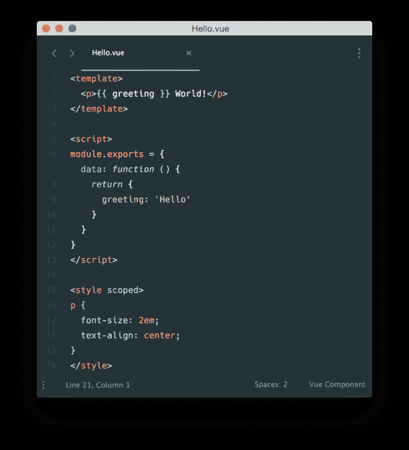
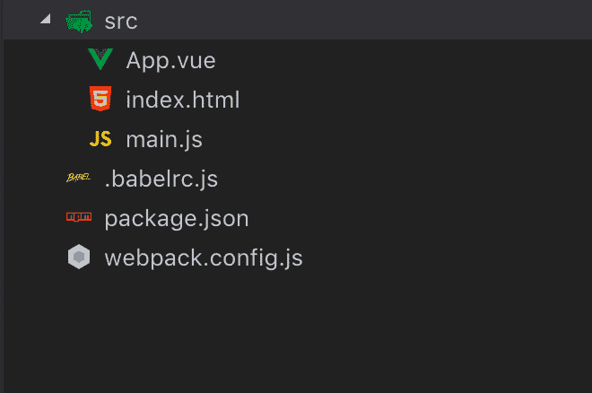
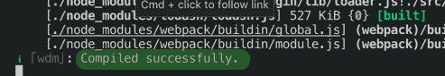
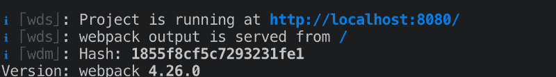
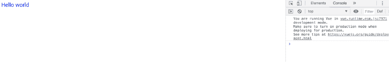
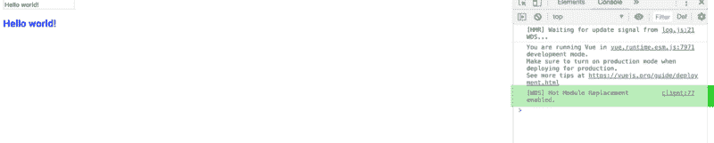
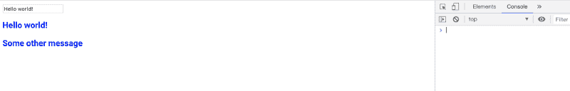

# 如何在没有 CLI 的情况下使用单文件组件创建 Vue.js 应用程序。

> 原文：<https://www.freecodecamp.org/news/how-to-create-a-vue-js-app-using-single-file-components-without-the-cli-7e73e5b8244f/>

对 Vue 的单文件组件(sfc)和节点包管理器(NPM)的理解将对本文有所帮助。

框架的命令行界面(CLI)是搭建项目的首选方法。它提供了文件、文件夹和配置的起点。这种搭建还提供了一个开发和构建过程。开发过程提供了一种在编辑项目时查看更新的方式。构建过程创建将在生产中使用的文件的最终版本。

安装和运行 Vue . js(“Vue”)可以通过一个指向 Vue 内容交付网络(CDN)的脚本标签来完成。不需要构建或开发过程。但是，如果您使用 Vue 单文件组件(sfc ),您需要将这些文件转换成浏览器可以理解的内容。这些文件需要转换成超文本标记语言(HTML)、层叠样式表(CSS)和 JavaScript (JS)。在这种情况下，必须使用开发和构建过程。

我们将从头开始构建项目，而不是依赖 Vue CLI 来搭建我们的项目并为我们提供开发和构建流程。我们将使用 Webpack 创建我们自己的开发和构建流程。

#### 什么是 Webpack？

Webpack 是一个模块捆绑器。它将多个文件中的代码合并成一个文件。在 Webpack 之前，用户为每个 JavaScript 文件包含一个脚本标签。尽管浏览器支持 ES6 模块的速度很慢，但 Webpack 仍然是构建模块化代码的首选方式。

除了作为一个模块捆绑器，Webpack 还可以转换代码。例如，Webpack 可以将现代 JavaScript (ECMAScript 6+)转换为 ECMAScript 5。当 Webpack *捆绑*代码本身时，它用加载器和插件转换代码。可以把加载器和插件看作是 Webpack 的附加组件。

#### web 包和视图

单文件组件允许我们在一个文件中构建整个组件(结构、风格和功能)。并且，大多数代码编辑器为这些 sfc 提供了语法高亮和林挺。



[Vue Single File Component](https://vuejs.org/v2/guide/single-file-components.html): notice the *.vue* extension.

注意文件以. vue 结尾。浏览器不知道如何处理这个扩展名。Webpack 通过使用加载器和插件，将这个文件转换成浏览器可以使用的 HTML、CSS 和 JS。

### 项目:使用单文件组件构建 Hello World Vue 应用程序。

#### 步骤 1:创建项目结构

最基本的 Vue 项目将包括一个 HTML、JavaScript 和一个 Vue 文件(该文件以*结尾)。vue* 。我们将这些文件放在名为 `src` **的**文件夹中。源文件夹将帮助我们从 Webpack 最终构建的代码中分离出我们正在编写的代码。****

因为我们将使用 Webpack，所以我们需要一个 Webpack 配置文件。

此外，我们将使用名为 Babel 的编译器。Babel 允许我们编写 ES6 代码，然后编译成 ES5。Babel 是 Webpack 的“附加功能”之一。 **Babel 也需要一个配置文件。**

最后，由于我们使用的是 NPM，我们也将有**一个 node_modules 文件夹**和**一个 package.json 文件。**当我们将项目初始化为 NPM 项目并开始安装我们的依赖项时，这些将会自动创建。

首先，创建一个名为`hello-world`的文件夹。从命令行，切换到该目录并运行`npm init`。按照屏幕上的提示创建项目。然后，如上所述创建其余的文件夹(除了`node_modules` *)* 。您的项目结构应该如下所示:



The simplest Vue SFC project structure.

#### 步骤 2:安装依赖项

下面是我们正在使用的依赖项的简要概述:

vue:JavaScript 框架

**vue-loader 和 vue-template-compiler** :用于将我们的 vue 文件转换成 JavaScript。

webpack:这个工具将允许我们通过一些转换来传递我们的代码，并将它打包成一个文件。

webpack-cli: 需要运行 webpack 命令。

**webpack-dev-server** :尽管我们的小项目不需要它(因为我们不会发出任何 HTTP 请求)，我们仍然会从开发服务器“服务”我们的项目。

babel-loader :将我们的 ES6 代码转换成 ES5。(它需要下两个依赖的帮助。)

@babel/core 和@babel/preset-env : Babel 本身不会对你的代码做任何事情。这两个“附件”将允许我们将 ES6 代码转换成 ES5 代码。

**css-loader:** 获取我们在`.vue` 文件中编写的 css 或者我们可能导入到任何 JavaScript 文件中的任何 CSS，并解析这些文件的路径。换句话说，找出 CSS 在哪里。这是另一个加载器，它本身不会做很多事情。我们需要下一个加载器对 CSS 做一些实际的事情。

**vue-style-loader** :获取我们从`css-loader`得到的 CSS，并将其注入到我们的 HTML 文件中。这将在 HTML 文档的头部创建并注入一个样式标签。

**html-webpack-plugin** :取我们的*index.html*，在头部注入我们捆绑的 JavaScript 文件。然后，将这个文件复制到`dist` 文件夹中。

允许我们从命令行删除文件。当我们多次构建我们的项目时，这将派上用场。我们将使用它来删除任何旧的构建。

现在让我们安装这些依赖项。从命令行运行:

```
npm install vue vue-loader vue-template-compiler webpack webpack-cli webpack-dev-server babel-loader @babel/core @babel/preset-env css-loader vue-style-loader html-webpack-plugin rimraf -D
```

***注意:*** *结尾的“-D”在我们的 package.json 中将每个依赖项标记为开发依赖项，我们将所有依赖项捆绑在一个文件中，因此，对于我们的小项目，我们没有生产依赖项。*

#### 步骤 3:创建文件(除了我们的 Webpack 配置文件)。

```
<template>
  <div id="app">
    {{ message }}
  </div>
</template>

<script>
export default {
  data() {
    return {
      message: 'Hello World',
    };
  },
};
</script>

<style>
#app {
  font-size: 18px;
  font-family: 'Roboto', sans-serif;
  color: blue;
}
</style>
```

a1-App.vue

```
<html>
  <head>
    <title>Vue Hello World</title>
  </head>
  <body>
    <div id="app"></div>
  </body>
</html>
```

a1-index.html

```
import Vue from 'vue';
import App from './App.vue';

new Vue({
  el: '#app',
  render: h => h(App),
});
```

a1-main.js

```
module.exports = {
  presets: ['@babel/preset-env'],
}
```

a1-babelrc.js

到目前为止，任何东西都不应该看起来太陌生。我把每个文件都保存得非常简单。我只添加了最少的 CSS 和 JS 来查看我们的工作流程。

#### 步骤 4:指导 Webpack 做什么

Webpack 需要访问的所有配置现在都已存在。我们需要做最后两件事:告诉 Webpack 做什么和运行 Webpack。

下面是 Webpack 配置文件(`webpack.config.js`)。在项目根目录下创建这个文件。我们将逐行讨论正在发生的事情。

```
const HtmlWebpackPlugin = require('html-webpack-plugin');
const VueLoaderPlugin = require('vue-loader/lib/plugin');

module.exports = {
  entry: './src/main.js',
  module: {
    rules: [
      { test: /\.js$/, use: 'babel-loader' },
      { test: /\.vue$/, use: 'vue-loader' },
      { test: /\.css$/, use: ['vue-style-loader', 'css-loader']},
    ]
  },
  plugins: [
    new HtmlWebpackPlugin({
      template: './src/index.html',
    }),
    new VueLoaderPlugin(),
  ]
};
```

a1-webpack.config.js

**第 1 行和第 2 行:**我们正在导入下面使用的两个插件。注意，我们的加载器通常不需要导入，只需要导入我们的插件。在我们的例子中，`vue-loader`(我们在第 9 行使用的)也需要一个插件来工作(然而，例如，Babel 就不需要)。

**第 4 行:**我们将配置导出为一个对象。这使我们在运行 Webpack 命令时可以访问它。

**第 5 行:**这是我们的入门模块。Webpack 需要一个起点。它查看我们的`main.js`文件，然后从那一点开始梳理我们的代码。

**第 6 行和第 7 行:**这是模块对象。在这里，我们主要传入一组规则。每个规则告诉 Webpack 如何处理某些文件。因此，当 Webpack 使用入口点`main.js`开始梳理我们的代码时，它使用规则来转换我们的代码。

**第 8 行(规则):**该规则指示 Webpack 对任何以`.js` *结尾的文件使用`babel-loader`。*记住，巴别塔会把 ES6+转化成 ES5。

**第 9 行(规则):**该规则指示 Webpack 使用`vue-loader` (别忘了第 17 行的关联插件)将我们的`.vue`文件转换成 JavaScript。

**第 10 行(规则):**有时我们想通过两个加载器传递一个文件。与直觉相反，Webpack 将从右向左传递文件，而不是从左向右。这里我们使用两个加载器，并对 Webpack 说:“从我的 Vue 文件或任何 JavaScript 文件中获取我的 CSS(`css-loader`)，并将其作为样式标签(`vue-style-loader`)注入到我的 HTML 中。

第 11 行和第 12 行:关闭我们的规则数组和模块对象。

**第 13 行:**创建一个插件数组。这里我们将添加我们需要的两个插件。

**行:14 -16(插件):`HtmlWebpackPlugin`**获取我们的*index.html*文件的位置，并通过一个脚本标签将我们捆绑的 JavaScript 文件添加到其中。当我们构建项目时，这个插件还会将 HTML 文件复制到我们的分发文件夹中。

**第 17 行(插件):**`VueLoaderPlugin`与我们的`vue-loader`一起解析我们的`.vue`文件。

**第 18 行:**关闭插件数组。

**第 19 行:**关闭我们正在导出的 Webpack 对象。

#### 步骤 5:设置我们的 package.json 文件，这样我们就可以运行 Webpack

我们的配置已经完成，现在我们想看看我们的应用程序。理想情况下，当我们修改应用程序时，浏览器会自动更新。这可以通过`webpack-dev-server`实现。

删除我们的`package.json`文件中的`test`脚本，并用一个脚本替换它以服务于我们的应用程序:

```
 {
  "name": "hello-world",
  "version": "1.0.0",
  "description": "",
  "main": "main.js",
  "scripts": {
    "serve": "webpack-dev-server --mode development"
  },
  "author": "",
  "license": "ISC",
  "devDependencies": {
    "@babel/core": "^7.1.6",
    "@babel/preset-env": "^7.1.6",
    "babel-loader": "^8.0.4",
    "css-loader": "^1.0.1",
    "html-webpack-plugin": "^3.2.0",
    "rimraf": "^2.6.2",
    "vue": "^2.5.17",
    "vue-loader": "^15.4.2",
    "vue-style-loader": "^4.1.2",
    "vue-template-compiler": "^2.5.17",
    "webpack": "^4.26.0",
    "webpack-cli": "^3.1.2",
    "webpack-dev-server": "^3.1.10"
  },
  "dependencies": {}
}
```

a1-package.json

该命令的名称由您选择。我选择称我的为`serve`，因为我们将由*为*服务我们的应用程序。

从我们的终端或命令行，我们可以运行`npm run serve`，然后它将运行`webpack-dev-server --mode development`。

*`--mode development`就是所谓的标志或选项。我们还没有谈到这一点，但它本质上是指示 Webpack 您正处于开发模式。我们也可以传入`--mode production`，这将在我们构建项目时进行。这些并不是 Webpack 工作所必需的。如果没有这些，您将收到一条警告消息，告诉您在运行 Webpack 时提供一个模式。*

我说“必然需要”是因为 Webpack 会在生产模式下而不是开发模式下最小化我们的代码。因此，不要认为这些命令什么都不做，它们会做。

让我们运行`npm run serve`看看会发生什么。

当我们运行`npm run serve`时，我们在终端中得到一些输出。如果一切顺利的话:



如果我们向上滚动一点:



将浏览器指向`http://localhost:8080`。你将会看到你的蓝色 Hello World 信息以 Roboto 字体显示。



现在，让我们更新项目并将消息更改为`Hello Universe`。请注意，网页会自动刷新。太棒了，对吧？你能想到不利的一面吗？

让我们稍微改变一下应用程序，加入一个输入，我们将把一个变量绑定到这个输入上(用`v-model`)。我们将在输入下面的一个`<h2>`标签中输出变量。我还更新了样式部分来设计消息的样式。我们的`App.vue` 文件应该是这样的:

```
<template>
  <div id="app">
    <input
      v-model="message"
      type="text">
      <h2 class="message">{{ message }}</h2>
  </div>
</template>

<script>
export default {
  data() {
    return {
      message: 'Hello world!',
    };
  },
};
</script>

<style>
.message {
  font-size: 18px;
  font-family: 'Roboto', sans-serif;
  color: blue;
}
</style>
```

a11-App.vue

当我们为应用程序提供服务时，我们会有一个输入，下面有一条消息`Hello World`。输入被绑定到`message`变量，所以当我们输入时，我们改变了`<h2>`的内容。继续，键入输入来更改`<h2>`内容。

现在回到您的编辑器，在`<h2>`标签下面，添加以下内容:

`<h3>Some Other Message</h3>`

保存你的`App.vue`，看看会发生什么。

我们刚刚通过键入我们的输入更新的`h2`回复到`Hello World`。这是因为浏览器实际上刷新了，脚本标签和页面被再次加载。换句话说，我们无法维护应用程序的状态。这看起来没什么大不了的，但是当你在测试你的应用程序并向其添加数据时，如果你的应用程序每次都“重置”的话，那将会令人沮丧。幸运的是，Webpack 为我们提供了一个叫做热模块替换的解决方案。

热模块替换是 Webpack 自己提供的插件。到目前为止，我们还没有在配置文件中使用 Webpack 对象本身。但是，我们现在将导入 Webpack，这样我们就可以访问插件了。

除了插件之外，我们将向 Webpack 传递一个额外的选项，即`devServer`选项。在那个选项中，我们将把`hot`设置为`true`。此外，我们将对我们的构建工作流进行(可选的)更新:当我们运行`npm run serve`时，我们将自动打开浏览器窗口。我们通过将`open`设置为`true`来做到这一点，T5 也在`devServer`选项内。

```
const HtmlWebpackPlugin = require('html-webpack-plugin');
const VueLoaderPlugin = require('vue-loader/lib/plugin');
const webpack = require('webpack');

module.exports = {
  entry: './src/main.js',
  module: {
    rules: [
      { test: /\.js$/, use: 'babel-loader' },
      { test: /\.vue$/, use: 'vue-loader' },
      { test: /\.css$/, use: ['vue-style-loader', 'css-loader']},
    ]
  },
  devServer: {
    open: true,
    hot: true,
  },
  plugins: [
    new HtmlWebpackPlugin({
      template: './src/index.html',
    }),
    new VueLoaderPlugin(),
    new webpack.HotModuleReplacementPlugin(),
  ]
};
```

a11-webpack.config.js

注意，我们已经导入了 Webpack，因此我们可以访问`hotModuleReplacementPlugin`。我们已经将它添加到了`plugins`数组中，然后告诉 Webpack 将它与`hot: true`一起使用。我们用`open: true`服务应用程序时会自动打开浏览器窗口。

运行`npm run serve`:



浏览器窗口应该会打开，如果您打开您的开发工具，您应该会注意到输出中的微小变化。它现在告诉我们热模块更换已启用。让我们键入我们的输入来更改`<h2>`内容。然后，将`h3`标签改为:`One More Message`。

保存您的文件，并注意发生了什么。

浏览器不刷新，但是我们的`<h3>`变化体现出来了！我们在输入中输入的消息仍然存在，但是`h3`更新了。这允许我们的应用程序在我们编辑它的时候保持它的状态。

#### 步骤 7:构建我们的项目

到目前为止，我们已经送达了我们的申请。但是，如果我们想要构建我们的应用程序，以便我们可以分发它呢？

如果你注意到，当我们服务我们的应用程序时，没有文件被创建。Webpack 会创建这些文件的一个版本，该版本只存在于临时内存中。如果我们想把 Hello World 应用程序分发给我们的客户，我们需要*构建*项目。

这个很简单。就像之前一样，我们将在 package.json 文件中创建一个脚本来告诉 Webpack 构建我们的项目。我们将用`webpack`代替`webpack-dev-server`作为命令。我们也将传入`--mode production`旗帜。

我们还将首先使用`rimraf`包来删除我们可能有的任何以前的构建。我们简单地通过`rimraf dist`来做到这一点。

`*dist*` *是 Webpack 在构建我们的项目时会自动创建的文件夹。“Dist”是 distribution 的缩写，即我们正在“分发”我们的应用程序代码。*

`rimraf dist`命令是告诉`rimraf`包删除`dist`目录。**确保不要** `rimraf src` **误！**

*Webpack 还提供了一个名为`clean-webpack-plugin`的插件来完成这个清理过程。我选择了`dist`展示一种另类的方式。*

我们的 package.json 文件应该如下所示:

```
{
  "name": "hello-world",
  "version": "1.0.0",
  "description": "",
  "main": "main.js",
  "scripts": {
    "clean": "rimraf dist",
    "build": "npm run clean && webpack --mode production",
    "serve": "webpack-dev-server --mode development"
  },
  "author": "",
  "license": "ISC",
  "devDependencies": {
    "@babel/core": "^7.1.6",
    "@babel/preset-env": "^7.1.6",
    "babel-loader": "^8.0.4",
    "css-loader": "^1.0.1",
    "html-webpack-plugin": "^3.2.0",
    "rimraf": "^2.6.2",
    "vue": "^2.5.17",
    "vue-loader": "^15.4.2",
    "vue-style-loader": "^4.1.2",
    "vue-template-compiler": "^2.5.17",
    "webpack": "^4.26.0",
    "webpack-cli": "^3.1.2",
    "webpack-dev-server": "^3.1.10"
  },
  "dependencies": {}
}
```

a11-package.json

有三件事需要注意:

1.  我创建了一个单独的`clean`脚本，这样我们就可以独立于构建脚本运行它。
2.  `npm run build`将调用我们创建的独立`clean`脚本。
3.  我在`npm run clean`和`webpack`之间有`&&`。这个指令说:“先运行`npm run clean`，再运行*，然后运行*【T4”。

让我们建立这个项目。

`npm run build`

Webpack 创建一个`dist`目录，我们的代码在里面。由于我们的代码没有发出 HTTP 请求，我们可以简单地在浏览器中打开我们的`index.html`文件，它会像预期的那样工作。

如果我们有发出 HTTP 请求的代码，我们会在发出这些请求时遇到一些跨来源的错误。我们需要从一个服务器上运行这个项目。

让我们检查一下 Webpack 在浏览器和代码编辑器中创建的`index.html`。



R

如果我们在编辑器中打开它，或者在开发工具中查看源代码，您会看到 Webpack 注入了脚本标签。但是在我们的编辑器中，您看不到样式，因为样式标签是在运行时用 JavaScript 动态注入的！

另外，请注意，我们的开发控制台信息不再存在。这是因为我们将`--production`标志传递给了 Webpack。

### 结论

理解您使用的框架背后的构建过程将有助于您更好地理解框架本身。花些时间尝试构建 Angular、React 或另一个 Vue 项目，而不使用各自的 CLI。或者，只构建一个基本的三文件站点(index.html、styles.css 和 app.js)，但是使用 Webpack 来服务和构建一个生产版本。

感谢阅读！

沃兹