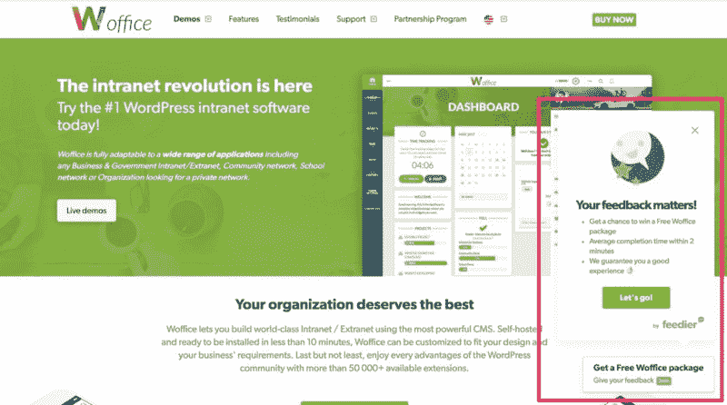
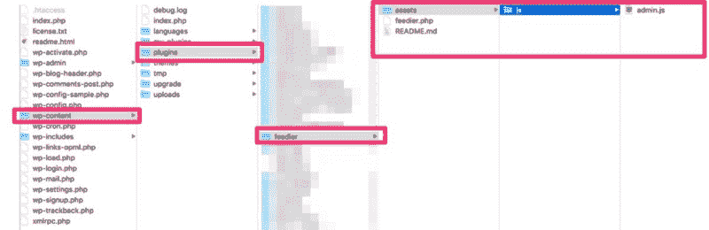
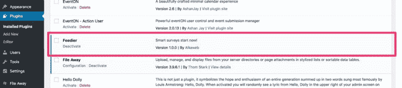
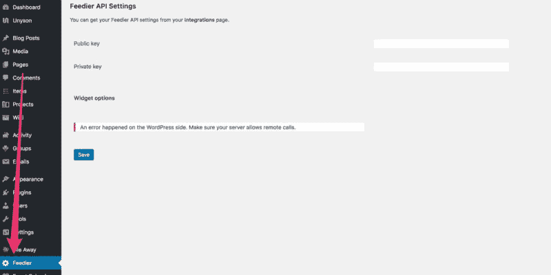
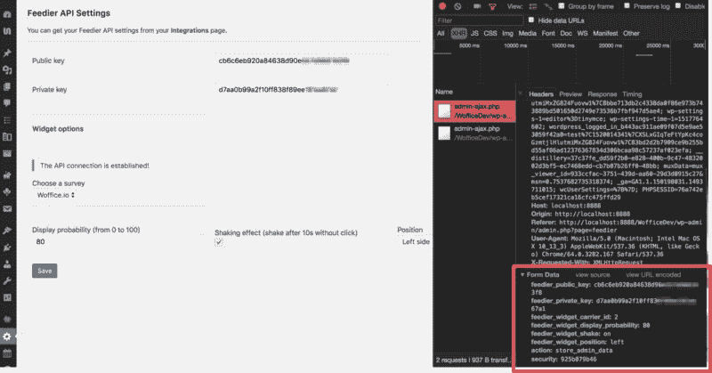

# 如何为你的网络应用创建一个 WordPress 插件

> 原文：<https://www.freecodecamp.org/news/how-to-create-a-wordpress-plugin-for-your-web-app-5c31733f3a9d/>

由 alkalay 的进料器提供

# 如何为你的网络应用创建一个 WordPress 插件

今天，我们将看到如何为任何需要在你的网站上插入一段代码的 web 应用程序创建一个非常简单的 WordPress 插件。


Credits: [https://unsplash.com/photos/I8OhOu-wLO4](https://unsplash.com/photos/I8OhOu-wLO4)

要学习本教程，您需要了解以下基础知识:

*   PHP 和 OOP
*   JavaScript (我们将使用 jQuery 和 Ajax)
*   **WordPress 开发**(因为大部分功能来自 WordPress 核心)。

你可以在[这个 Github 库](http://pxlme.me/611bFPFB)上找到本教程的一个工作成果。

这些网络应用可以是任何东西，比如 [CrazyEgg](http://crazyegg.com/) 、 [Freshbook](https://freshdesk.com/) 、 [Google Analytics](https://analytics.google.com/analytics/web/) 、[脸书 Pixel](https://www.facebook.com/business/a/facebook-pixel) 或 [Feedier](https://feedier.com/) 。为什么？出于各种目的，它们都需要向您的站点注入一些 HTML / JavaScript 代码。

这种“代码”总是用变量来参数化，这通常是网站所有者的痛苦。这是因为您需要编辑主题的模板。那么，我们创建一个插件来帮我们做这件事怎么样？好吧，我们开始吧！

### 第一步:找到你的网络应用

本教程的目标是创建一个添加 WordPress 管理页面的插件。此外，我们还将添加一些设置来配置应用程序的站点内小部件，并自动在我们的网页中注入 HTML / JS 代码。没什么特别的，只是一些好用的东西。

**请注意:我们确实需要一个本教程的网络应用程序。**在这个例子中，我们将使用[送料器](https://feedier.com/?utm_medium=article&utm_source=medium&utm_campaign=medium-wordpress-awareness-2018-05-21&utm_content=how-to-create-a-wordpress-plugin-for-your-web-app)。但是，如果您有其他 web 应用程序想在本教程中使用，请使用。只需用你的应用程序的名称重命名任何名为“feedier”的东西，并根据该应用程序的需要调整设置。他们中的大多数会给你一个片段添加到你的网站，以使其工作。

如果你从未听说过，这里有一个关于 [Feedier](https://feedier.com/?utm_medium=article&utm_source=medium&utm_campaign=medium-wordpress-awareness-2018-05-21&utm_content=how-to-create-a-wordpress-plugin-for-your-web-app) 的简短介绍:

*   这是一个反馈收集工具，通过调查来了解你的用户
*   它非常灵活
*   *免费的！*
*   **有一个好的 API** (这里非常重要)
*   **有一个内建部件**(这里非常重要)
*   让您奖励您的客户
*   允许您创建条件问题
*   拥有完整的分析报告仪表板
*   允许您单独管理反馈

下面是我们想要自动添加的小部件:



Preview of the widget on woffice.io

如果您注册了 Feedier，那么您只需在调查的“分享”选项卡中找到代码:


Grab the snippet from [feedier.com](https://feedier.com/?utm_medium=article&utm_source=medium&utm_campaign=medium-wordpress-awareness-2018-05-21&utm_content=how-to-create-a-wordpress-plugin-for-your-web-app)

### 步骤 2:设置我们的插件及其架构

WordPress 插件在设计上非常简单。我们的插件将只需要两个文件。

*   **feedier.php**:主插件的 PHP 文件。
*   **assets/js/admin.js** :使用 Ajax 保存选项的 JavaScript 脚本。

你可以在你的 **wp-content/plugins/** 文件夹中创建一个新的“feedier”目录(或者你的 web 应用的名称)。



最重要的文件将是插件的**feedier.php**类。下面是它的结构:

我们正在做几件事:

*   使用标题注释声明我们的插件
*   定义一些方便的常量，以便能够容易地找到插件的 URL 和路径
*   声明我们的插件类，它将包含我们在这个插件中需要的一切。我们现在只需要一个构造函数方法。

您应该已经在您的插件页面中看到该插件，尽管它还没有做任何事情:



Activate the plugin from WordPress admin panel

### 步骤 3:创建我们的管理页面

对于这一部分，我们将在 WordPress 站点上添加一个新的 Feedier 管理页面，并从 Feedier 的 API 中动态获取我们的调查。

在我们类的构造函数中，让我们注册三个新的动作，这是在 WordPress 上添加一个管理页面所需要的:

*   addAdminMenu 将在 WordPress 左侧菜单中添加一个新页面。还会有对包含页面内容的另一个方法的回调。
*   **每当用户点击“保存设置”按钮时，将调用 storeAdminData** 。
*   addAdminScripts 将向我们的 WordPress admin 注册一个新的 JavaScript 文件，以便保存表单的数据。但是它也在 PHP 端和 JavaScript 端交换一些变量。

第一步非常容易。我们只是注册页面，就像这样:

如你所见，我们使用 [WordPress 本地化函数](https://codex.wordpress.org/I18n_for_WordPress_Developers)用于*所有的*字符串。请注意

```
array($this, ‘adminLayout’)
```

是我们调用包含页面内容的另一个方法的地方。该表单需要适应您的 web 应用程序。

这里，我们首先需要获得公共和私有 Feedier API 密钥。保存后，我们将使用私钥动态检索我们的调查。每当我们得到调查而不是一个 API 错误，我们显示一些新的选项来配置小部件。

在此方法的开始，您可以看到我们首先使用以下方法获取保存的数据:

```
$data = $this->getData();
```

从 Feedier API 获取调查结果:

```
$surveys = $this->getSurveys($data[‘private_key’]);
```

所以我们来声明第一个:

这个函数只是读取插件的选项，并返回一个数组，这样我们就可以在同一个选项中保存多个值。

为了让第二种方法起作用，我们需要 Feedier 私钥。这取决于第一个访问保存在选项:

Feedier API 记录在这里的，所以您可以看到您将在响应中得到什么。

现在，我们有了一个全新的管理页面。但是当我们点击 save 按钮时，什么也没有发生，因为还没有保存机制。



很好，让我们保存我们的数据！

如前所述，我们将使用 AJAX 保存数据。因此，我们需要注册一个新的 JavaScript 文件，并使用 [wp_localize_script()](https://codex.wordpress.org/Function_Reference/wp_localize_script) 函数来交换数据:

我们还需要添加一个新文件 **/assets/js/admin.js** 。这将简单地进行一个 Ajax 调用，WordPress 将自动将请求正确地路由到正确的方法(已经在构造函数中完成)。你可以在这里阅读更多关于 WordPress 如何巧妙处理 AJAX 请求的信息。

此时，我们可以点击保存按钮，上面的脚本将向 WordPress 发出 HTTP POST 请求。我们还附加了一个动作参数，包含: **store_admin_data** (我们在构造函数的这一部分开始时声明了它):

```
add_action( ‘wp_ajax_store_admin_data’, array( $this, ‘storeAdminData’ ) );
```

方法 **storeAdminData** 将接收 POST 请求，并将我们需要的值保存在我们的 WordPress 选项中。

关于上述方法的几点注意事项:

*   我们使用一个“WordPress nonce”来处理安全性，并确保这是来自网站，而不是黑客伪造的请求。
*   我们使用“feedier_”前缀来标识需要保存的字段。一旦收到，我们循环遍历所有$_POST 数据，只保存那些字段。我们还在保存每个字段之前删除了前缀。

拯救过程到此为止。当我们单击 save 时，我们可以看到 POST 请求和我们的数据被保存在数据库的 **wp_options** 表中。



太好了，我们已经完成了管理页面。

### 步骤 4:将动态代码自动插入我们的页面

现在我们已经保存了我们的选项，我们可以创建一个动态部件，它将取决于用户通过我们的管理页面设置的选项。我们已经知道 web 应用程序对我们的期望。

类似于:

```
<div class=”feedier-widget” data-type=”engager” data-position=”right” data-carrier-id=”x” data-key=”xxxxxxxxxxxxxxxxx”></div>
```

```
<! — Include this line only one time, also if you have multiple widgets on the current page →
```

```
<script src=”https://feedier.com/js/widgets/widgets.min.js" type=”text/javascript” async></script>
```

因此，我们要做的第一件事是为插件创建一个新方法，它将根据用户设置的变量打印代码。因此，使用我们在上一部分已经建立的架构:

现在，我们只需要在每次页面加载时调用这个函数，将它添加到页面的底部。为此，我们将把我们的方法挂接到 **wp_footer** 动作。通过在类的构造函数中注册一个新动作:

就是这样！

有任何问题、反馈或想法吗？请在评论中告诉我！

你可以在 Github 库上找到本教程的工作版本。

[**2Fwebd/feedier-wordpress-plugin**](http://pxlme.me/611bFPFB)
[*通过在 GitHub 上创建账号，为 feedier-WordPress-plugin 开发做贡献。* pxlme.me](http://pxlme.me/611bFPFB)

请注意，这是插件的第一个版本，许多东西都可以改进。我乐于接受建议和改进。？

我们正在建造饲料厂。收集反馈并与您的客户建立关系变得轻而易举！

[**Feedier -下一代反馈**](https://feedier.com/?utm_medium=article&utm_source=medium&utm_campaign=medium-wordpress-awareness-2018-05-21&utm_content=how-to-create-a-wordpress-plugin-for-your-web-app)
[*遇见 Feedier，下一代客户反馈软件，让你收集有价值的反馈。奖励，参与…*feedier.com](https://feedier.com/?utm_medium=article&utm_source=medium&utm_campaign=medium-wordpress-awareness-2018-05-21&utm_content=how-to-create-a-wordpress-plugin-for-your-web-app)

深信不疑？在 feedier.com[报名**免费**？](https://feedier.com/?utm_medium=article&utm_source=medium&utm_campaign=medium-wordpress-awareness-2018-05-21&utm_content=how-to-create-a-wordpress-plugin-for-your-web-app)


[Feedier.com](https://feedier.com/?utm_medium=article&utm_source=medium&utm_campaign=medium-wordpress-awareness-2018-05-21&utm_content=how-to-create-a-wordpress-plugin-for-your-web-app), the next generation **feedback** application. **Start for free now!**

别忘了拍拍我们的文章，订阅获得更多精彩文章，如果你喜欢？。你也可以在 T [维特上找到我们。](http://pxlme.me/_dw36YLw)

*这篇文章最初发表在我们的[博客上。](https://alkalab.com/blog/tutorial-wordpress-plugin-web-app/)*