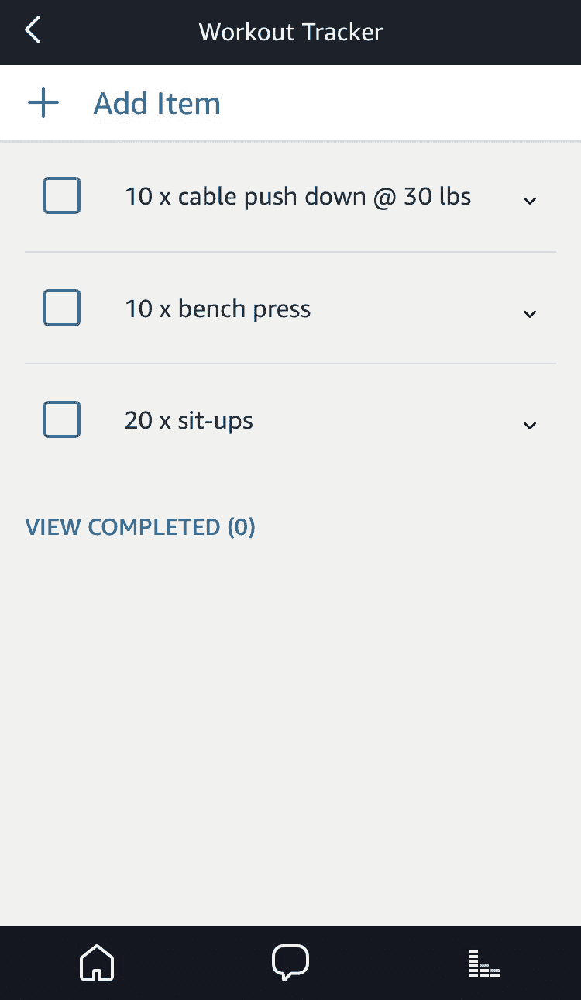
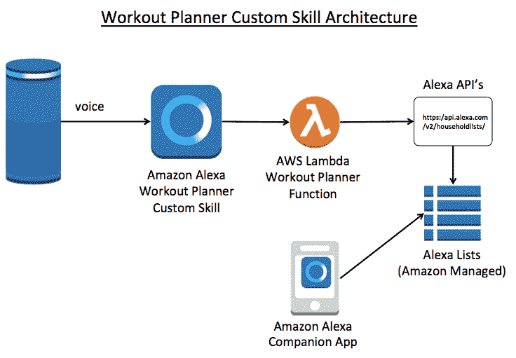
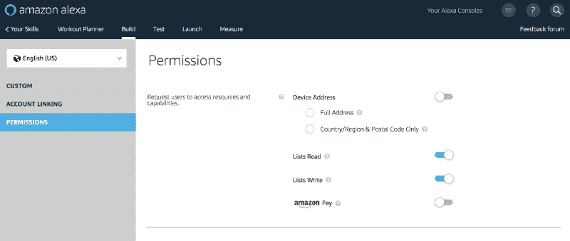
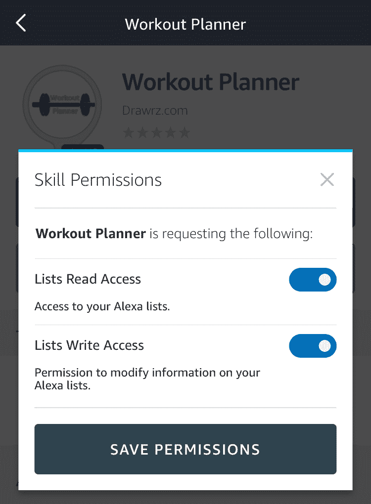

# 如何创建一个管理待办事项列表的 Alexa 技能

> 原文：<https://www.freecodecamp.org/news/how-to-create-an-alexa-skill-that-manages-to-do-lists-11c4bab29ea5/>

特伦·彼得森

# 如何创建一个管理待办事项列表的 Alexa 技能


Courtesy of [RitaE on Pixabay](https://pixabay.com/en/paper-block-leave-note-expression-3406864/)

我被公认为亚马逊 [Alexa 冠军](https://developer.amazon.com/alexa/champions/terren-peterson)，并在平台上发布了二十多个自定义技能。我继续寻找扩展这项技术的新方法，最近我一直在探索的一个领域是使用 Alexa 来帮助组织日常任务。该平台上一个未被充分利用的特性是创建自定义列表的能力。[这里的](https://www.amazon.com/gp/help/customer/display.html/ref=cssoc_TW_HP_201549900?nodeId=201549900)是关于你如何利用这一功能的简要回顾，请随意测试一下[锻炼计划技巧](https://www.amazon.com/Drawrz-com-Workout-Planner/dp/B07CLY496R/)——这是免费的！


Alexa Workout Planner Skill

### 背景

像 Alexa 这样的免提设备为构建便捷的数字助理开辟了可能性。本地设备支持的第一个功能是创建购物清单的能力。鉴于亚马逊的零售传统，这一点来得早并不奇怪。说出“将洗发水添加到我的购物清单中”这样的短语会将它添加到用户的亚马逊账户中。它还在用户登录的其他应用程序上呈现数据。

### 别带 Alexa 去健身房，带个单子

在使用购物清单功能一段时间后，我开始考虑可以创建其他类型的清单。该设备能够创建自定义列表，我认为它可能有助于组织我的锻炼。我可以用我的声音做一份锻炼清单，而不是带一份手写的锻炼清单。

我写了一个自定义的 Alexa 技能，称为锻炼计划，询问关于做什么类型的练习的问题。然后它创建了一个列表供我跟踪。这是技能在我手机上创造的截图。



### 使用 Alexa 列表的架构

围绕列表的核心功能是通过管理 Alexa 配套应用程序上呈现的实体的 Alexa API 实现的。

在典型的 Alexa 技能架构中，API 从包含技能功能的 Lambda 函数中调用。传递到 API 调用中的数据指示是否应该创建一个新列表，应该添加什么项目，是否可以从列表中删除一个项目，等等。配套的应用程序处理所有用户与列表上的数据的交互，不需要技能开发人员做额外的工作。然后，用户可以通过配套的应用程序管理这个列表，包括将项目标记为完成。



语音界面和任何 Alexa 技能一样。创作自定义技能包括根据提供给用户的功能设置示例话语、意图等。

### 启用使用列表的权限

创建这样的高级技能时，该技能需要请求额外的权限。有多种级别的权限和安全性，所有这些都需要到位，技能才能充分发挥作用。

首先，技能开发者需要向 Alexa 平台确认技能将利用列表。您可以在开发人员控制台的技能设置中完成此操作。下面的截图来自控制台中的“权限”选项卡。必须设置这两种列表属性的滑块。



Identifying additional permissions needed by this custom skill in the Alexa Developer console

当技能通过认证时，Amazon 验证技能工作所需的权限。这有助于管理对开发人员将获得的用户数据的访问。

第二，当用户在其设备上启用该技能时，他们需要同意该技能，以便能够为其帐户读写数据。这是通过配套应用程序实现的，并遵循“选择加入”模式来访问升级的权限。下面是设置中需要调整的滑块截图。



Each user will need to grant permissions to access their list data.

最后，在运行时，为使用该技能的每个会话创建一个同意令牌。这个令牌需要由 Lambda 函数保存，然后在 API 调用的头中传递给 Alexa。

### API 调用示例

如架构中所强调的，家用 API 包含管理列表所需的核心功能。API 中有多种操作可用，这里是来自 Amazon 的文档。使用 Node.js，下面是使用 POST 操作调用 API 的代码，该操作创建一个名为“锻炼跟踪器”的新列表。

```
var path = "/v2/householdlists/";     var postData = {        "name": "Workout Tracker", //item value, with a string description up to 256 characters         "state": "active" // item status (Enum: "active" only)    };            var consent_token = session.user.permissions.consentToken;
```

```
var options = {        host: api_url,        port: api_port,        path: path,        method: 'POST',        headers: {            'Authorization': 'Bearer ' + consent_token,            'Content-Type': 'application/json'        }    };
```

```
var req = https.request(options, (res) => {    console.log('statusCode:', res.statusCode);    console.log('headers:', res.headers);    var data = "";
```

```
 res.on('data', (d) => {         console.log("data received:" + d);         data += d;    });    res.on('error', (e) => {         console.log("error received");         console.error(e);    });    res.on('end', function() {         console.log("ending post request");        if (res.statusCode === 201) {             var responseMsg = eval('(' + data + ')');             console.log("new list id:" + responseMsg.listId);             callback(res.statusCode, responseMsg.listId);        } else {             callback(res.statusCode, 0);        }    });});    req.end(JSON.stringify(postData));
```

API 返回一个 JSON 对象，该对象包含在后续调用中使用的 ListIdentifier，以便向列表中添加项目。

### 结论

这是一种利用 Alexa 的语音用户界面和无处不在的 Alexa 配套应用程序的简单方法。[这里有一个链接](https://github.com/terrenjpeterson/workout-planner)指向技能的完整回购，如果你有任何关于如何改进的想法，请告诉我！