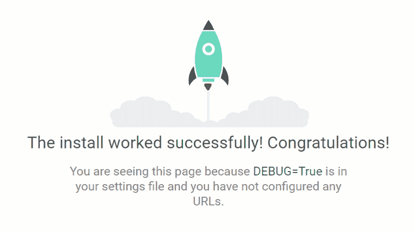
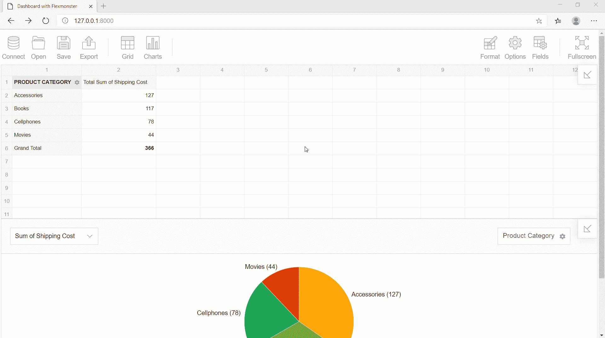

# 如何在 Django 应用中创建分析仪表板

> 原文：<https://www.freecodecamp.org/news/how-to-create-an-analytics-dashboard-in-django-app/>

嗨伙计们！

**Python** 、**数据可视化**、**编程**是我深深投入的话题。这就是为什么我想与你分享我的想法，以及我对发现以有意义的方式呈现数据的新方法的热情。

我将要讨论的情况很常见:您在应用程序的后端有数据，并希望在前端对其进行整形。如果这样的情况你听起来很熟悉，那么这个教程可能会派上用场。

完成之后，你就有了一个基于 Django 的应用程序，带有交互式的**数据透视表** & **图表**。

## 先决条件

要自信地完成这些步骤，您需要 Django 框架的基础知识和一点创造力。✨

要继续学习，您可以下载 [GitHub 示例](https://github.com/veronikaro/django-dashboard-app)。

以下是我们将要使用的工具的简要列表:

*   **[Python 3 . 7 . 4](https://www.python.org/downloads/release/python-374/)**
*   **[姜戈](https://www.djangoproject.com/?r=fr5)**
*   **[Virtualenv](https://virtualenv.pypa.io/en/latest/)**
*   **[Flexmonster 透视表&图表](https://www.flexmonster.com/?r=fr5)** (JavaScript 库)
*   **[SQLite](https://www.sqlite.org/index.html)**

如果您已经建立了一个 Django 项目，并且对创建应用程序的基本流程充满信心，那么您可以直接跳到**将数据连接到 Flexmonster** 部分，该部分解释了如何向其中添加数据可视化组件。

开始吧！

## Django 入门

首先，让我们确保你已经在你的机器上安装了 Django。经验法则是将它安装在您先前设置的虚拟环境中——这是一个将您的项目相互隔离的强大工具。

此外，确保您已经在新创建的目录中激活。打开控制台，使用以下命令引导 Django 项目:

`django-admin startproject analytics_project`

现在有了一个名为`analytics_project`的新目录。让我们检查一下我们是否做对了一切。转到`analytics_project`并使用控制台命令启动服务器:

`python manage.py runserver`

在浏览器中打开 [`http://127.0.0.1:8000/`](http://127.0.0.1:8000/) 。如果你看到这个令人敬畏的火箭，那么一切都很好:



接下来，在项目中创建一个新的应用程序。我们把它命名为`dashboard`:

`python manage.py startapp dashboard`

> *这里有一个提示*:如果你不确定 Django 中应用和项目概念之间的[差异，花些时间去了解它，以便对 Django 项目是如何组织的有一个清晰的了解。](https://wsvincent.com/django-projects-vs-apps/)

开始了。现在我们在项目中看到了一个新的目录。它包含以下文件:

`__init__.py`让 Python 把它当成一个包

`admin.py`-Django 管理页面的设置

`apps.py` -应用程序配置的设置

`models.py` -将被 Django 的 ORM 转换成数据库表的类

`tests.py` -测试类别

`views.py` -定义数据如何在模板中显示的函数&类

之后，需要在项目中注册应用程序。
转到`analytics_project/settings.py`，将应用程序的名称添加到`INSTALLED_APPS`列表中:

```
INSTALLED_APPS = [
	'django.contrib.admin',
    'django.contrib.auth',
    'django.contrib.contenttypes',
    'django.contrib.sessions',
    'django.contrib.messages',
    'django.contrib.staticfiles',
    'dashboard',
]
```

现在我们的项目意识到了这个应用的存在。

## 视图

在`dashboard/views.py`中，我们将创建一个函数，将用户指引到`dashboard/templates`文件夹中定义的特定模板。视图也可以包含类。

我们是这样定义的:

```
from django.http import JsonResponse
from django.shortcuts import render
from dashboard.models import Order
from django.core import serializers

def dashboard_with_pivot(request):
    return render(request, 'dashboard_with_pivot.html', {})
```

一旦被调用，这个函数将呈现`dashboard_with_pivot.html`——一个我们将很快定义的模板。它将包含数据透视表和数据透视表组件。

关于这个函数再多说几句。它的`request`参数是`HttpRequestObject`的一个实例，包含关于请求的信息，例如所使用的 HTTP 方法(GET 或 POST)。方法`render`在位于应用程序目录内的`templates`目录中搜索 HTML 模板。

我们还需要创建一个辅助方法，将带有数据的响应发送到应用程序前端的数据透视表。姑且称之为`pivot_data`:

```
def pivot_data(request):
    dataset = Order.objects.all()
    data = serializers.serialize('json', dataset)
    return JsonResponse(data, safe=False)
```

很可能，你的 IDE 告诉你它在`models.py`中找不到引用`Order`。没问题——我们以后再处理。

## 模板

现在，我们将利用 Django 模板系统。

让我们在`dashboard`中创建一个新目录`templates`，并创建第一个名为 **`dashboard_with_pivot.html`** 的 HTML 模板。它将根据请求显示给用户。在这里，我们还为数据可视化组件添加了脚本和容器:

```
<head>
  <meta charset="UTF-8">
  <title>Dashboard with Flexmonster</title>
  <script src="https://cdn.flexmonster.com/flexmonster.js"></script>
  <script src="https://code.jquery.com/jquery-3.3.1.min.js"></script>
  <link rel="stylesheet" href="https://cdn.flexmonster.com/demo.css">
</head>
<body>
<div id="pivot-table-container" data-url=""></div>
<div id="pivot-chart-container"></div>
</body>
```

## 将视图功能映射到 URL

为了调用视图并向用户显示呈现的 HTML 模板，我们需要将视图映射到相应的 URL。

> 这里有一个提示:[Django 的 URL 设计原则之一是关于松耦合的](https://docs.djangoproject.com/en/2.1/misc/design-philosophies/#id8)，我们不应该让 URL 与 Python 函数同名。

转到`analytics_app/urls.py`并在项目级别为`dashboard`应用程序添加相关配置。

```
from django.contrib import admin
from django.urls import path, include

urlpatterns = [
    path('admin/', admin.site.urls),
    path('dashboard/', include('dashboard.urls')),
] 
```

现在可以访问来自`dashboard`应用程序的 URL，但前提是它们带有前缀`dashboard`。

之后，转到`dashboard/urls.py`(如果该文件不存在，则创建该文件)并添加映射到视图功能的 URL 模式列表:

```
from django.urls import path
from . import views

urlpatterns = [
    path('', views.dashboard_with_pivot, name='dashboard_with_pivot'),
    path('data', views.pivot_data, name='pivot_data'),
]
```

## 模型

最后，我们到了**数据建模**。这是我最喜欢的部分。

您可能知道，数据模型是存储在数据库中的数据的概念性表示。

因为本教程的目的是展示如何在应用程序中构建交互式数据可视化，所以我们不会太担心数据库的选择。我们将使用**SQLite**——Django web 开发服务器附带的轻量级数据库。

但是请记住，这个数据库并不是产品开发的合适选择。通过 Django ORM，您可以使用其他使用 SQL 语言的数据库，比如 PostgreSQL 或 MySQL。

为了简单起见，我们的模型将由一个类组成。您可以创建更多的类并定义它们之间的关系，无论是复杂的还是简单的。

想象我们正在为销售部门设计一个**仪表板。因此，让我们创建一个**订单**类，并在`dashboard/models.py`中定义它的属性:**

```
from django.db import models

class Order(models.Model):
    product_category = models.CharField(max_length=20)
    payment_method = models.CharField(max_length=50)
    shipping_cost = models.CharField(max_length=50)
    unit_price = models.DecimalField(max_digits=5, decimal_places=2)
```

## 使用数据库

现在我们需要创建一个数据库，并用记录填充它。

但是我们如何将模型类转换成数据库表呢？

这就是**迁移**的概念派上用场的地方。**迁移**是一个简单的文件，描述了哪些更改必须应用于数据库。每次我们需要基于 Python 类描述的模型创建数据库时，都会用到迁移。

数据可能以 Python 对象、字典或列表的形式出现。这次我们将使用位于`models`目录中的 Python 类来表示数据库中的实体。

使用一个命令为应用程序创建迁移:

`python manage.py makemigrations dashboard`

在这里，我们指定应用程序应该告诉 Django 为`dashboard`应用程序的模型应用迁移。

创建迁移文件后，应用文件中描述的迁移并创建数据库:

`python manage.py migrate dashboard`

如果您在项目目录中看到一个新文件`db.sqlite3`，我们就准备好使用数据库了。

让我们创建订单类的实例。为此，我们将使用 Django shell——它类似于 Python shell，但允许访问数据库和创建新条目。

因此，启动 Django shell:

`python manage.py shell`

并在交互式控制台中编写以下代码:

```
from dashboard.models import Order

>>> o1 = Order(
... product_category='Books',
... payment_method='Credit Card',
... shipping_cost=39,
... unit_price=59
... )
>>> o1.save()
```

同样，您可以根据需要创建和保存任意数量的对象。

## 将数据连接到 Flexmonster

这是我答应解释的。

让我们弄清楚如何将数据从您的模型传递到前端的数据可视化工具。

为了使后端和 Flexmonster 进行通信，我们可以遵循两种不同的方法:

*   *使用请求-响应循环。*我们可以使用 Python 和 Django 模板引擎直接在模板中编写 JavaScript 代码。
*   *使用异步请求(AJAX)* 返回 JSON 中的数据。

在我看来，第二个是最方便的，原因有很多。首先，Flexmonster 了解 JSON。准确地说，它可以接受一组 JSON 对象作为输入数据。使用异步请求的另一个好处是更好的页面加载速度和更易维护的代码。

让我们看看它是如何工作的。

转到`templates/dashboard_pivot.html`。

在这里，我们创建了两个`div`容器，透视网格和透视图表将在其中呈现。

在 ajax 调用中，我们基于包含在`data-URL`属性中的 URL 发出请求。然后我们告诉 ajax 请求，我们期望返回一个 JSON 对象(由`dataType`定义)。

一旦请求完成，我们的服务器返回的 JSON 响应被设置为`data`参数，填充了该数据的数据透视表被呈现。

查询结果(`JSONResponse`的实例)返回一个字符串，该字符串包含一个具有额外元信息的数组对象，所以我们应该在前端添加一个微小的函数进行数据处理。它将只提取我们需要的嵌套对象，并将它们放入一个数组中。这是因为 Flexmonster 接受没有嵌套级别的 JSON 对象数组。

```
function processData(dataset) {
    var result = []
    dataset = JSON.parse(dataset);
    dataset.forEach(item => result.push(item.fields));
    return result;
}
```

处理完数据后，组件以正确的格式接收数据，并执行数据可视化的所有艰苦工作。一个巨大的好处是，不需要手动分组或聚集对象的值。

模板中的整个脚本如下所示:

```
function processData(dataset) {
    var result = []
    dataset = JSON.parse(dataset);
    dataset.forEach(item => result.push(item.fields));
    return result;
}
$.ajax({
    url: $("#pivot-table-container").attr("data-url"),
    dataType: 'json',
    success: function(data) {
        new Flexmonster({
            container: "#pivot-table-container",
            componentFolder: "https://cdn.flexmonster.com/",
            width: "100%",
            height: 430,
            toolbar: true,
            report: {
                dataSource: {
                    type: "json",
                    data: processData(data)
                },
                slice: {}
            }
        });
        new Flexmonster({
            container: "#pivot-chart-container",
            componentFolder: "https://cdn.flexmonster.com/",
            width: "100%",
            height: 430,
            //toolbar: true,
            report: {
                dataSource: {
                    type: "json",
                    data: processData(data)
                },
                slice: {},
                "options": {
                    "viewType": "charts",
                    "chart": {
                        "type": "pie"
                    }
                }
            }
        });
    }
});
```

不要忘记将这段 JavaScript 代码放在`<script>`标签中。

唷！有了这个应用程序，我们就快成功了。

## 字段定制

Flexmonster 提供了数据源的特殊属性，允许设置字段数据类型、自定义标题和定义多级层次结构。

这是一个很好的特性——我们可以在报告的配置中优雅地分离数据和它的表示。

将其添加到报告的`dataSource`属性中:

```
mapping: {
    "product_category": {
        "caption": "Product Category",
        "type": "string"
    },
    "payment_method": {
        "caption": "Payment Method",
        "type": "string"
    },
    "shipping_cost": {
        "caption": "Shipping Cost",
        "type": "number"
    },
    "unit_price": {
        "caption": "Unit Price",
        "type": "number"
    }
}
```

## 仪表板设计

为了制作仪表板，我们渲染了 Flexmonster 的两个实例(您可以根据想要达到的数据可视化目标创建任意多个实例)。一个用于包含汇总数据的数据透视表，另一个用于数据透视表图表。

这两个实例共享我们模型中的相同数据源。我鼓励您尝试让它们同步工作:通过`[reportchange](https://www.flexmonster.com/api/reportchange/?r=fr5)`事件，您可以让一个实例对另一个实例的变化做出反应。

您还可以重新定义工具栏上“导出”按钮的功能，使其将您的报告保存到服务器。

## 结果

让我们启动 Django 开发服务器，并打开 [`http://127.0.0.1:8000/dashboard/`](http://127.0.0.1:8000/dashboard/) 来查看生成的仪表板:



看起来不错，不是吗？

## 反馈

这次我们学习了**如何创建一个简单的 Django 应用**并在客户端以**分析仪表板的形式显示数据**。

我真的希望你喜欢这个教程！

请在下面留下您的评论——非常感谢您对代码改进的任何反馈。

## 参考文献

教程的源代码可以在 [GitHub](https://github.com/veronikaro/django-dashboard-app) 上找到。

这是 flex monster&Django integration 的项目，它激发了我写这篇教程的灵感。

此外，我建议浏览文档中的重要概念以掌握 Django:

*   [Django 的移民](https://docs.djangoproject.com/en/3.0/topics/migrations/)
*   [查询设置](https://docs.djangoproject.com/en/3.0/ref/models/querysets/)
*   [序列化 Django 对象](https://docs.djangoproject.com/en/3.0/topics/serialization/)