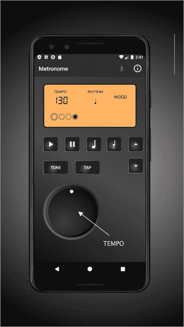
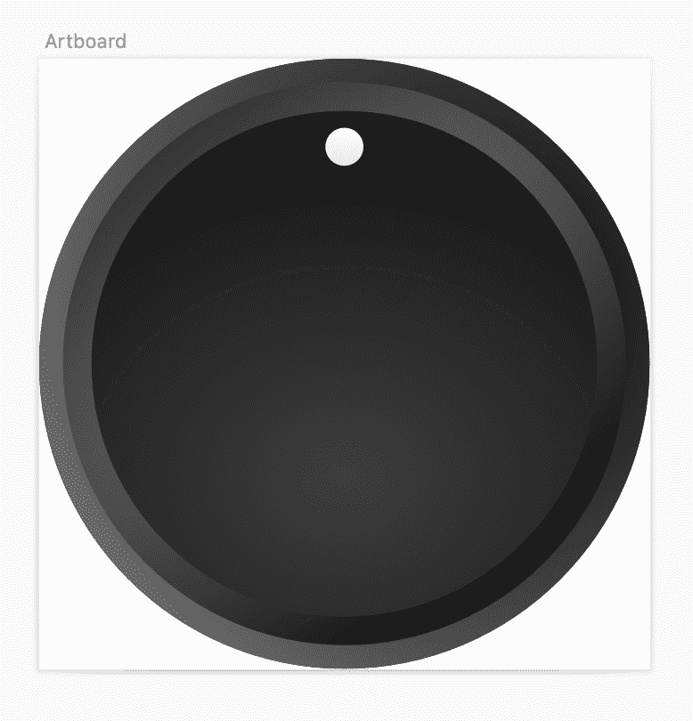
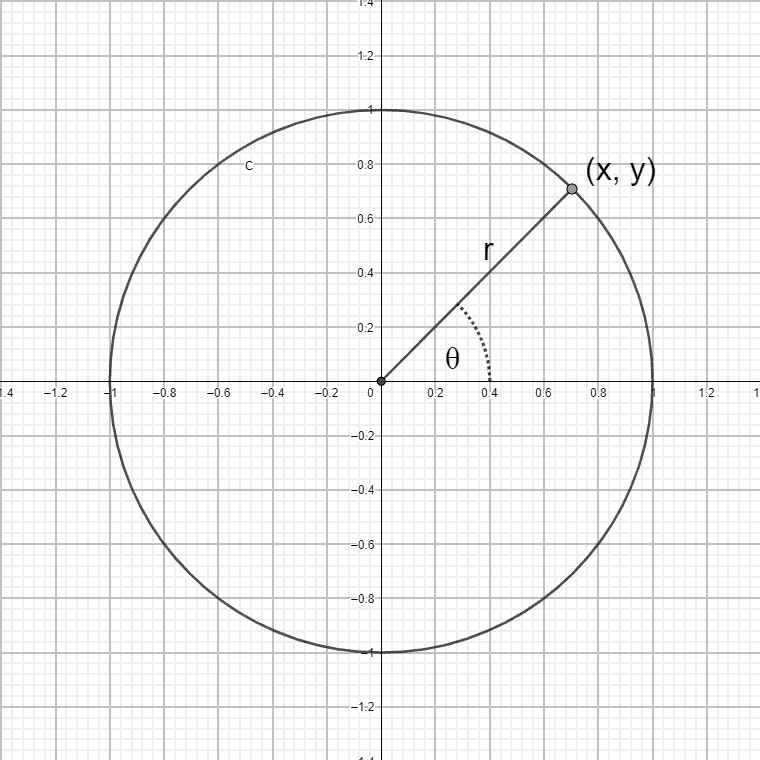
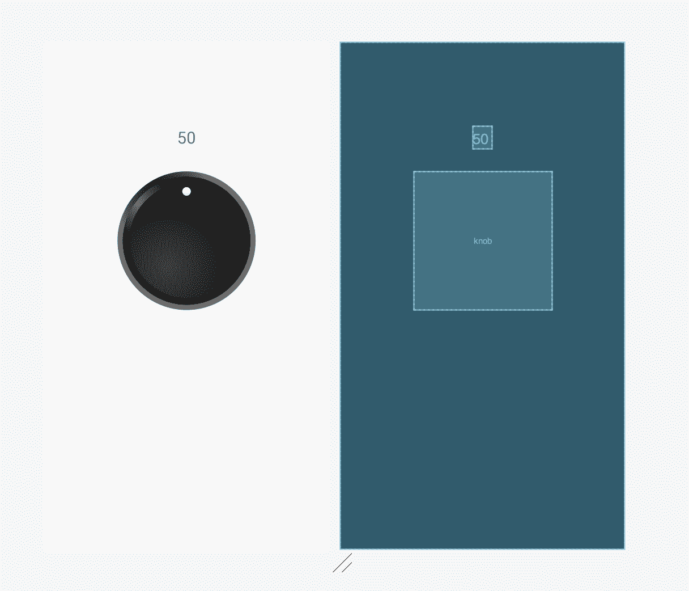

# 我如何用 Kotlin 制作了一个机器人旋钮来帮助我的儿子练习钢琴

> 原文：<https://www.freecodecamp.org/news/how-to-create-an-android-rotary-knob-using-kotlin/>

当我儿子的钢琴老师告诉他应该用节拍器练习计时时，我把它当成了学习科特林的机会。我决定学习这门语言和 Android 的生态系统，这样我就可以创建一个节拍器应用程序。

我最初的实现使用 SeekBar 来控制 BPM(每分钟节拍数)——节拍器滴答的速率。

然而，随着项目的进展，我想让它看起来像一个物理的数字单元，就像现实世界中许多音乐家使用的一样。

物理单位没有“搜索栏视图”，我想模仿一个实际单位可能有的旋钮。

旋钮是非常有用的 UI 控件。它们很像滑块或 SeekBar，在许多情况下都是可用的。以下是它们的一些优势:

*   它们在你的应用中消耗很少的空间
*   它们可用于控制连续或离散的数值范围
*   用户可以从现实世界的应用程序中立即识别出它们
*   它们不是标准的 Android 控件，因此给你的应用带来独特的“定制”感觉

虽然存在一些 Android 的开源旋钮库，但我没有在它们中找到我想要的。

对于我的适度需求来说，许多都是多余的，比如设置背景图像或处理两个或更多模式操作的点击等功能。有些没有我想要的适合我的项目的可定制性，并且带有他们自己的旋钮图像。

还有一些假设值或位置的离散范围。其中许多看起来比需要的要复杂得多。

所以我决定自己设计一个——这本身就变成了一个有趣的小项目。

在这篇文章中，我将讨论我是如何构建它的。



The resulting metronome app and it’s rotary knob

让我们来看看如何创造一个旋钮。

# 设计旋钮

第一步是为旋钮本身创建图形。我绝不是设计师，但我认为在旋钮控件中创造“深度”和运动感的关键是使用偏心径向渐变。这将允许我创建一个凹陷的表面和光反射的幻觉。

我用 Sketch 画出旋钮，然后导出到 svg。然后我把它作为一个可画的东西导入到 Android studio 中。

你可以在本文底部的 GitHub 项目链接中找到这个旋钮 drawable。



# 用 xml 创建视图

创建视图的第一步是在 res/layout 文件夹中创建一个布局 xml 文件。

视图可以完全用代码创建，但是 Android 中良好的可重用视图应该用 xml 创建。

注意<merge>标签——我们将使用它，因为我们将扩展一个现有的 Android 布局类，这个布局将是那个布局的内部结构。</merge>

我们将为旋钮使用一个 ImageView，当用户移动它时，我们将旋转它。

```
<?xml version="1.0" encoding="utf-8"?>
<merge xmlns:android="http://schemas.android.com/apk/res/android"
    android:layout_width="wrap_content"
    android:layout_height="wrap_content">

    <ImageView
        android:id="@+id/knobImageView"
        android:layout_width="wrap_content"
        android:layout_height="wrap_content"
        />
</merge>
```

[rotary_knob_view.xml](https://gist.github.com/o4oren/5d2d3794dabfe22d318c3f7e1cbd3db9#file-rotary_knob_view-xml)

为了使旋钮可由 xml 配置，我们将为旋钮将返回的值的范围以及它将用于视觉效果的可绘制性创建属性。

我们将在 res/values 下创建一个 attrs.xml 文件。

```
<?xml version="1.0" encoding="utf-8"?>
<resources>
    <declare-styleable name="RotaryKnobView">
        <attr name="minValue" format="integer" />
        <attr name="maxValue" format="integer" />
        <attr name="initialValue" format="integer" />
        <attr name="knobDrawable" format="reference" />
    </declare-styleable>
</resources>
```

[attrs.xml](https://gist.github.com/o4oren/aef7062098a4bd6bfc6b50b46a75e4db#file-attrs-xml)

接下来，创建一个新的 Kotlin 类文件 RotaryKnobView，它扩展了 RelativeLayout 并实现了接口 gesturedetector . ongesturelistener。

我们将使用 RelativeLayout 作为控件的父容器，并实现 OnGestureListener 来处理旋钮的移动手势。

[@JvmOverloads](https://kotlinlang.org/api/latest/jvm/stdlib/kotlin.jvm/-jvm-overloads/) 只是覆盖视图构造函数所有三种风格的一个快捷方式。

接下来我们将初始化一些默认值并定义类成员。

```
class RotaryKnobView @JvmOverloads constructor(
    context: Context, attrs: AttributeSet? = null, defStyleAttr: Int = 0
) : RelativeLayout(context, attrs, defStyleAttr), GestureDetector.OnGestureListener {
    private val gestureDetector: GestureDetectorCompat
    private var maxValue = 99
    private var minValue = 0
    var listener: RotaryKnobListener? = null
    var value = 50
    private var knobDrawable: Drawable? = null
    private var divider = 300f / (maxValue - minValue)
```

[RotaryKnobView.kt](https://gist.github.com/o4oren/50628e00d04f57029ad3377794e4e154#file-rotaryknobview-kt)

关于分割器变量的注意事项—我希望旋钮有开始和结束位置，而不是能够无限旋转，就像立体声系统上的音量旋钮一样。我将起点和终点分别设置在-150 度和 150 度。所以旋钮的有效运动只有 300 度。

我们将使用分割器来分配我们希望旋钮在这些可用的 300 度上返回的值的范围，以便我们可以根据旋钮的位置角度来计算实际值。

接下来，我们初始化组件:

*   放大布局。
*   将属性读入变量。
*   更新除法器(以支持传入的最小值和最大值。
*   设置图像。

```
 init {
        this.maxValue = maxValue + 1

        LayoutInflater.from(context)
            .inflate(R.layout.rotary_knob_view, this, true)

        context.theme.obtainStyledAttributes(
            attrs,
            R.styleable.RotaryKnobView,
            0,
            0
        ).apply {
            try {
                minValue = getInt(R.styleable.RotaryKnobView_minValue, 0)
                maxValue = getInt(R.styleable.RotaryKnobView_maxValue, 100) + 1
                divider = 300f / (maxValue - minValue)
                value = getInt(R.styleable.RotaryKnobView_initialValue, 50)
                knobDrawable = getDrawable(R.styleable.RotaryKnobView_knobDrawable)
                knobImageView.setImageDrawable(knobDrawable)
            } finally {
                recycle()
            }
        }
        gestureDetector = GestureDetectorCompat(context, this)
    }
```

[RotaryKnobView.kt](https://gist.github.com/o4oren/2411e674d3023c0b87600a442bbf4ac9#file-rotaryknobview-kt)

该类还不会编译，因为我们需要实现 OnGestureListener 的函数。让我们现在处理它。

# 检测用户手势

OnGestureListener 接口要求我们实现六个函数:
onScroll，onTouchEvent，onDown，onSingleTapUp，onFling，onLongPress，onShowPress。

其中，我们需要在 onDown 和 onTouchEvent 上消费(返回 true)，并在 onScroll 中实现运动登录。

```
 override fun onTouchEvent(event: MotionEvent): Boolean {
        return if (gestureDetector.onTouchEvent(event))
            true
        else
            super.onTouchEvent(event)
    }

    override fun onDown(event: MotionEvent): Boolean {
        return true
    }

    override fun onSingleTapUp(e: MotionEvent): Boolean {
        return false
    }

    override fun onFling(arg0: MotionEvent, arg1: MotionEvent, arg2: Float, arg3: Float)
            : Boolean {
        return false
    }

    override fun onLongPress(e: MotionEvent) {}

    override fun onShowPress(e: MotionEvent) {}
```

[RotaryKnobView.kt](https://gist.github.com/o4oren/2411e674d3023c0b87600a442bbf4ac9#file-rotaryknobview-kt)

下面是 onScroll 的实现。我们将在下一段中填补缺失的部分。

```
 override fun onScroll(e1: MotionEvent, e2: MotionEvent, distanceX: Float, distanceY: Float)
            : Boolean {

        val rotationDegrees = calculateAngle(e2.x, e2.y)
        // use only -150 to 150 range (knob min/max points
        if (rotationDegrees >= -150 && rotationDegrees <= 150) {
            setKnobPosition(rotationDegrees)

            // Calculate rotary value
            // The range is the 300 degrees between -150 and 150, so we'll add 150 to adjust the
            // range to 0 - 300
            val valueRangeDegrees = rotationDegrees + 150
                value = ((valueRangeDegrees / divider) + minValue).toInt()
                if (listener != null) listener!!.onRotate(value)
        }
        return true
    }
```

[RotaryKnobView.kt](https://gist.github.com/o4oren/2411e674d3023c0b87600a442bbf4ac9#file-rotaryknobview-kt)

onScroll 接收两个坐标集 e1 和 e2，表示触发事件的滚动的开始和结束移动。

我们只对 e2 感兴趣——旋钮的新位置——所以我们可以制作它的动画来定位和计算值。

我正在使用一个函数来计算旋转的角度，我们将在下一节回顾这个函数。

如前所述，我们从旋钮的起点到终点只使用了 300 度，所以这里我们也使用分割线计算旋钮的位置应该代表什么值。

# 计算旋转角度

现在让我们编写 calculateAngle 函数。

```
 private fun calculateAngle(x: Float, y: Float): Float {
        val px = (x / width.toFloat()) - 0.5
        val py = ( 1 - y / height.toFloat()) - 0.5
        var angle = -(Math.toDegrees(atan2(py, px)))
            .toFloat() + 90
        if (angle > 180) angle -= 360
        return angle
    }
```

[RotaryKnobView](https://gist.github.com/o4oren/2411e674d3023c0b87600a442bbf4ac9#file-rotaryknobview-kt).kt

这个函数需要一点解释和一些八年级的数学知识。

该函数的目的是根据传递的坐标计算旋钮的角度位置。

我选择将旋钮的 12 点钟位置视为 0，然后顺时针旋转时将其位置增加到正度数，从 12 点钟逆时针旋转时减少到负度数。



我们从 onScroll 函数中获得 x，y 坐标，表示视图中移动结束的位置(对于该事件)。

x 和 y 代表笛卡尔坐标系中的一个点。我们可以将该点表示转换为极坐标系统，用 x 轴上方或下方的角度以及该点到极点的距离来表示该点。

两个坐标系之间的转换可以通过 [atan2 函数](https://en.wikipedia.org/wiki/Polar_coordinate_system#Converting_between_polar_and_Cartesian_coordinates)完成。幸运的是，Kotlin 数学库和大多数数学库一样，为我们提供了 atan2 的实现。

然而，我们确实需要考虑我们的旋钮模型和简单的数学实现之间的一些差异。

1.  (0，0)坐标表示视图的右上角，而不是中间。当 x 坐标向右移动时——随着我们向右移动而增加——y 坐标向后移动——0 是视图的顶部，而视图的高度值是视图中最低的像素行。
    为了适应这种情况，我们将 x 和 y 分别除以视图的宽度和高度，得到 0-1 的标准化比例。
    然后我们从两者中减去 0.5，将 0，0 点移到中间。
    最后，我们从 1 中减去 y 的值来反转它的方向。
2.  极坐标系统与我们需要的方向相反。当我们逆时针转动时，度数值上升。所以我们加一个负号来反转 atan2 函数的结果。
3.  我们希望 0 度值指向北方，否则经过 9 点时，该值将从 0 跳到 359。
    所以我们在结果上加 90 °,注意一旦角度大于 180 °,就把值减少 360 °(所以我们得到-180°<角度<180°范围，而不是 0°<x<360°范围)

下一步是制作旋钮旋转的动画。我们将使用[矩阵](https://developer.android.com/reference/kotlin/android/graphics/Matrix)来转换 ImageView 的坐标。

我们只需要注意将视图的高度和宽度除以 2，这样旋转轴就在旋钮的中间。

```
 private fun setKnobPosition(angle: Float) {
        val matrix = Matrix()
        knobImageView.scaleType = ScaleType.MATRIX
        matrix.postRotate(angle, width.toFloat() / 2, height.toFloat() / 2)
        knobImageView.imageMatrix = matrix
    }
```

[RotaryKnobView](https://gist.github.com/o4oren/2411e674d3023c0b87600a442bbf4ac9#file-rotaryknobview-kt).kt

最后但同样重要的是，让我们为消费活动或片段公开一个接口来监听旋转事件:

```
 interface RotaryKnobListener {
        fun onRotate(value: Int)
    }
```

[RotaryKnobView](https://gist.github.com/o4oren/2411e674d3023c0b87600a442bbf4ac9#file-rotaryknobview-kt).kt

# 使用旋钮

现在，让我们创建一个简单的实现来测试我们的旋钮。

在主活动中，让我们创建一个 TextView 并从容器列表中拖动一个视图。当显示视图选择时，选择 RotaryKnobView。



编辑活动的布局 xml 文件，并设置最小值、最大值、初始值以及要使用的 drawable。

```
 <geva.oren.rotaryknobdemo.RotaryKnobView
        android:id="@+id/knob"
        class="geva.oren.rotaryknobdemo.RotaryKnobView"
        android:layout_width="@dimen/knob_width"
        android:layout_height="@dimen/knob_height"
        android:layout_marginBottom="312dp"
        app:layout_constraintBottom_toBottomOf="parent"
        app:layout_constraintEnd_toEndOf="parent"
        app:layout_constraintStart_toStartOf="parent"
        app:layout_constraintTop_toBottomOf="@+id/textView"
        app:knobDrawable="@drawable/ic_rotary_knob"
        app:initialValue="50"
        app:maxValue="100"
        app:minValue="0" />
```

最后，在我们的 MainActivity 类中，展开布局并实现 RotaryKnobListener 接口来更新 TextField 的值。

```
package geva.oren.rotaryknobdemo

import androidx.appcompat.app.AppCompatActivity
import android.os.Bundle
import kotlinx.android.synthetic.main.activity_main.*

class MainActivity : AppCompatActivity(), RotaryKnobView.RotaryKnobListener {

    override fun onCreate(savedInstanceState: Bundle?) {
        super.onCreate(savedInstanceState)
        setContentView(R.layout.activity_main)
        knob.listener = this
        textView.text = knob.value.toString()
    }

    override fun onRotate(value: Int) {
        textView.text = value.toString()
    }
}
```

MainActivity.kt

我们完事了。这个示例项目可以在 [github](https://github.com/o4oren/kotlin-rotary-knob) 以及原始的 [metronome 项目](https://github.com/o4oren/android-kotlin-metronome)上获得。

Android Metronome 应用程序也可以在谷歌的 play store 上获得。