# 如何使用 Blazor 和实体框架核心创建应用程序

> 原文：<https://www.freecodecamp.org/news/how-to-create-an-application-using-blazor-and-entity-framework-core-1c1679d87c7e/>

微软最近宣布发布一款新的。NET web 框架称为 Blazor。在本文中，我们将在实体框架核心的帮助下使用 Blazor 创建一个 web 应用程序。我们将创建一个样本员工记录管理系统，并在其上执行 CRUD 操作。

### 先决条件

*   安装。NET Core 2.1 预览版 2 SDK 从[这里](https://www.microsoft.com/net/download/dotnet-core/sdk-2.1.300-preview2)
*   从[这里](https://www.visualstudio.com/vs/preview/)安装 Visual Studio 2017 v15.7 的预览版
*   从[这里](https://marketplace.visualstudio.com/items?itemName=aspnet.blazor)安装 ASP.NET 核心 Blazor 语言服务扩展
*   SQL Server 2012 或更高版本

低于 Visual Studio 2017 v15.7 的版本不支持 Blazor 框架。

在继续之前，我建议你阅读我之前的一篇关于 Blazor 入门的文章。

### 源代码

另外，我建议您在开始之前从 [Github](https://github.com/AnkitSharma-007/ASPCore.BlazorCrud) 获取源代码。

### 创建表

我们将使用一个 DB 表来存储所有员工的记录。

打开 SQL Server 并使用以下脚本创建 **tblEmployee** 表:

```
Create table tblEmployee(            EmployeeId int IDENTITY(1,1) NOT NULL,            Name varchar(20) NOT NULL,            City varchar(20) NOT NULL,            Department varchar(20) NOT NULL,            Gender varchar(6) NOT NULL        )
```

现在，让我们继续创建我们的 web 应用程序。

### 创建 Blazor web 应用程序

打开 Visual Studio 并选择文件>>新建>>项目。

选择项目后，将会打开一个“新项目”对话框。选择。NET Core 里面的 Visual C#菜单从左侧面板。

然后，选择“ASP。NET Core Web Application”从可用的项目类型。将项目名称设为 **BlazorCrud** 并按 OK。

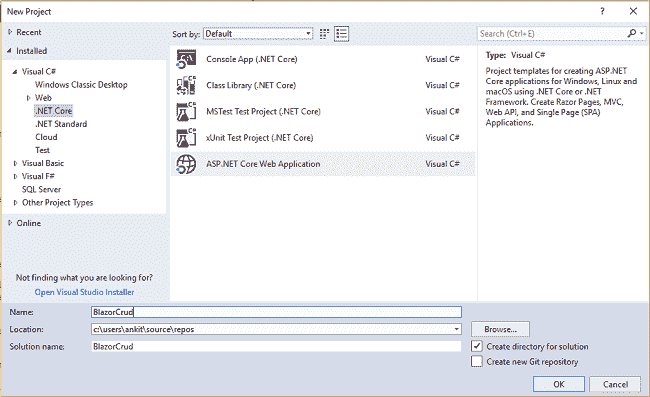

单击 OK 后，将打开一个新对话框，要求您选择项目模板。您将在模板窗口的左上角看到两个下拉菜单。选择”。NET Core”和“ASP。NET Core 2.0”。然后，选择“Blazor (ASP。NET Core hosted)”模板，然后按确定。

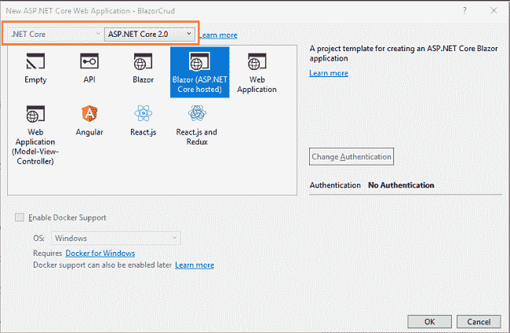

现在，我们的 Blazor 解决方案将被创建。您可以在解决方案资源管理器中观察文件夹结构，如下图所示。

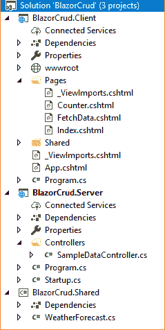

您将看到我们在此解决方案中创建了 3 个项目文件:

1.  布拉佐克鲁德。客户端—它具有客户端代码，并包含将在浏览器上呈现的页面。
2.  布拉佐克鲁德。服务器—它有服务器端代码，比如数据库相关的操作和 web API。
3.  布拉佐克鲁德。共享—它包含客户端和服务器都可以访问的共享代码。

执行程序。它将打开浏览器，您将看到一个类似如下所示的页面。

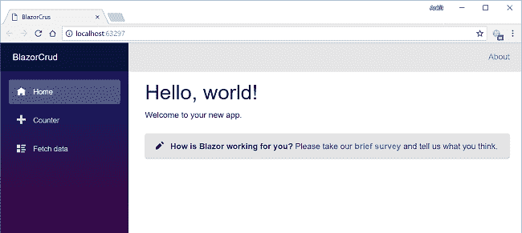

在这里，您可以在左侧看到一个导航菜单，其中包含应用程序页面的导航。默认情况下，我们在应用程序中提供了“计数器”和“获取数据”页面。这些默认页面不会影响我们的应用程序，但是为了本教程，我们将从**BlazorCrud.Client/Pages***文件夹中删除 **fetchdata** 和 **counter** 页面。*

### *将模型添加到应用程序中*

*右键单击 BlazorCrud。共享项目，然后选择添加>>新文件夹，并将 f **命名为旧的**型号。我们将只在这个文件夹中添加模型类。*

*右键单击 Models 文件夹并选择 Add >> Class。将您的**类命名为 Emplo** *ye* e.cs。该类将包含我们的雇员模型属性。没有**我们的废话。**共享项目具有以下结构:*

*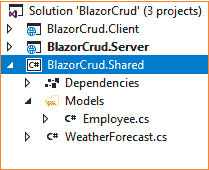*

*打开 **Employee.cs** 并将以下代码放入其中:*

```
*`using System;  using System.Collections.Generic;  using System.ComponentModel.DataAnnotations;  using System.Text;    namespace BlazorCrud.Shared.Models  {      public class Employee      {          public int EmployeeId { get; set; }          [Required]          public string Name { get; set; }          [Required]          public string Gender { get; set; }          [Required]          public string Department { get; set; }          [Required]          public string City { get; set; }      }  }`*
```

*所以我们的模型已经被创造出来了。现在我们将创建我们的数据访问层。*

### *为应用程序创建数据访问层*

*右键单击 BlazorCrud。服务器项目，然后选择 Add >> New Folder 并命名为 f **older Data** Access。我们将添加我们的类来处理这个文件夹中与数据库相关的操作。*

*右键单击**数据访问**文件夹，选择添加> >类。将您的**类命名为 EmployeeCont** *ex* t.cs。这是我们的实体框架 DB 上下文类，它允许我们与数据库进行交互。**打开 EmployeeCont** *e* xt.cs，将以下代码放入其中:*

```
*`using BlazorCrud.Shared.Models;  using Microsoft.EntityFrameworkCore;  using System;  using System.Collections.Generic;  using System.Linq;  using System.Threading.Tasks;    namespace BlazorCrud.Server.DataAccess  {      public class EmployeeContext : DbContext      {          public virtual DbSet<Employee> tblEmployee { get; set; }            protected override void OnConfiguring(DbContextOptionsBuilder optionsBuilder)          {              if (!optionsBuilder.IsConfigured)              {                  optionsBuilder.UseSqlServer(@"Put Your Connection string here");              }          }      }  }`*
```

*不要忘记输入您自己的连接字符串。*

*在 **DataAccess** 文件夹中再添加一个类，命名为**employeedataaccesslayer . cs***。这个类将处理我们的 CRUD 相关的数据库操作。打开**employeedataaccesslayer . cs***并将以下代码放入其中:***

```
**`using BlazorCrud.Shared.Models;  using Microsoft.EntityFrameworkCore;  using System;  using System.Collections.Generic;  using System.Linq;  using System.Threading.Tasks;    namespace BlazorCrud.Server.DataAccess  {      public class EmployeeDataAccessLayer      {          EmployeeContext db = new EmployeeContext();            //To Get all employees details           public IEnumerable<Employee> GetAllEmployees()          {              try              {                  return db.tblEmployee.ToList();              }              catch              {                  throw;              }          }            //To Add new employee record             public void AddEmployee(Employee employee)          {              try              {                  db.tblEmployee.Add(employee);                  db.SaveChanges();              }              catch              {                  throw;              }          }            //To Update the records of a particluar employee            public void UpdateEmployee(Employee employee)          {              try              {                  db.Entry(employee).State = EntityState.Modified;                  db.SaveChanges();              }              catch              {                  throw;              }          }            //Get the details of a particular employee            public Employee GetEmployeeData(int id)          {              try              {                  Employee employee = db.tblEmployee.Find(id);                  return employee;              }              catch              {                  throw;              }          }            //To Delete the record of a particular employee            public void DeleteEmployee(int id)          {              try              {                  Employee emp = db.tblEmployee.Find(id);                  db.tblEmployee.Remove(emp);                  db.SaveChanges();              }              catch              {                  throw;              }          }      }  }`**
```

**现在我们的数据访问层完成了。接下来，我们将继续创建我们的 web API 控制器。**

### **向应用程序添加 web API 控制器**

**右击**BlazorCrud.Server/Controllers**文件夹，选择添加> >新项目。将会打开“添加新项目”对话框。从左侧面板中选择一个 SP.NET，然后从模板面板中选择“API 控制器类”,然后点击“确定”。**

**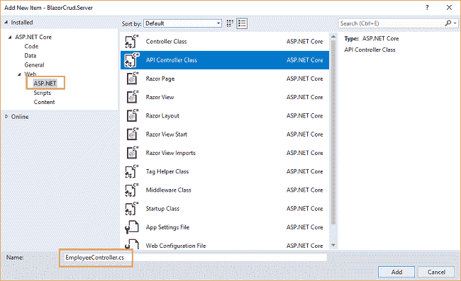**

**这将创建我们的 API**employee controller***类。***

***我们将调用**EmployeeDataAccessLayer***类的方法来获取数据并将数据传递给客户端。****

***打开**employee controller . cs***文件，将以下代码放入其中:****

```
***`using System;  using System.Collections.Generic;  using System.Linq;  using System.Threading.Tasks;  using BlazorCrud.Server.DataAccess;  using BlazorCrud.Shared.Models;  using Microsoft.AspNetCore.Mvc;    namespace BlazorCrud.Server.Controllers  {      public class EmployeeController : Controller      {          EmployeeDataAccessLayer objemployee = new EmployeeDataAccessLayer();            [HttpGet]          [Route("api/Employee/Index")]          public IEnumerable<Employee> Index()          {              return objemployee.GetAllEmployees();          }            [HttpPost]          [Route("api/Employee/Create")]          public void Create([FromBody] Employee employee)          {              if (ModelState.IsValid)                  objemployee.AddEmployee(employee);          }            [HttpGet]          [Route("api/Employee/Details/{id}")]          public Employee Details(int id)          {                return objemployee.GetEmployeeData(id);          }            [HttpPut]          [Route("api/Employee/Edit")]          public void Edit([FromBody]Employee employee)          {              if (ModelState.IsValid)                  objemployee.UpdateEmployee(employee);          }            [HttpDelete]          [Route("api/Employee/Delete/{id}")]          public void Delete(int id)          {              objemployee.DeleteEmployee(id);          }      }  }`***
```

***至此，我们的 **BlazorCrud。服务器**项目具有以下结构:***

***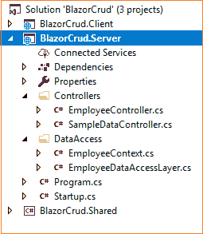***

***我们已经完成了后端逻辑。所以我们现在开始编写客户端代码。***

### ***向应用程序添加 Razor 视图***

***右击**BlazorCrud.Client/Pages**文件夹，然后选择>添加>新项目。一个“添加新项目”对话框将会打开，从左边的面板中选择 Web，然后从模板面板中选择“Razor 视图”,然后用**命名它。** *c* shtml。***

**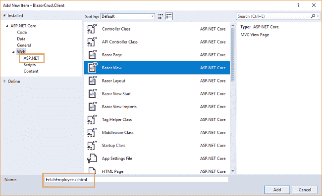**

**这将添加一个**fetchemployee . cshtml***页面到我们的【BlazorCrud.Client/Pages】文件夹**中。同样，再添加 3 个页面: **AddEmployee.cshtml** *，* **EditEmployee.cshtml，**和**delete employee . cs html***。******

**现在我们的 BlazorCrud。客户项目的结构如下:**

**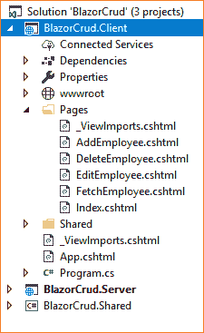**

**让我们向这些页面添加代码。**

### **FetchEmployee.cshtml**

**该页面将显示数据库中的所有员工记录。此外，我们还将提供每条记录的动作方法**编辑**和**删除**。**

**打开 **FetchEmployee.cshtml** 并将以下代码放入其中:**

```
**`@using BlazorCrud.Shared.Models@page "/fetchemployee"@inject HttpClient Http<h1>Employee Data</h1><p>This component demonstrates fetching Employee data from the server.</p><p>    <a href="/addemployee">Create New</a></p>@if (empList == null){    <p><em>Loading...</em></p>}else{    <table class='table'>        <thead>            <tr>                <th>ID</th>                <th>Name</th>                <th>Gender</th>                <th>Department</th>                <th>City</th>            </tr>        </thead>        <tbody>            @foreach (var emp in empList)            {                <tr>                    <td>@emp.EmployeeId</td>                    <td>@emp.Name</td>                    <td>@emp.Gender</td>                    <td>@emp.Department</td>                    <td>@emp.City</td>                    <td>                        <a href='/editemployee/@emp.EmployeeId'>Edit</a>  |                        <a href='/delete/@emp.EmployeeId'>Delete</a>                    </td>                </tr>            }        </tbody>    </table>}@functions {Employee[] empList;protected override async Task OnInitAsync(){    empList = await Http.GetJsonAsync<Employee[]>    ("/api/Employee/Index");}}`**
```

**让我们来理解这个代码。在顶部，我们包括了**blazore app。Shared.Models** 命名空间，这样我们就可以在这个页面中使用我们的 Employee 模型类。**

**我们使用@page 指令来定义这个页面的路径。因此，在这个应用程序中，如果我们将“/fetchemployee”附加到基本 URL，我们将被重定向到这个页面。我们还注入了 HttpClient 服务来支持 web API 调用。**

**然后，我们定义了 HTML 部件，以表格方式显示所有的雇员记录。我们还为**编辑**和**删除**添加了两个动作链接，它们将分别导航到**编辑 Employee.cshtml** 和**删除 Employee.cshtml** 页面。**

**在页面的底部，我们有一个包含业务逻辑的@functions 部分。我们已经创建了一个 Employee 类型的数组变量 **empList** ，并通过调用我们的 web API 在 **OnInitAsync** 方法中填充它。这会在页面加载时绑定到我们的 HTML 表。**

### **AddEmployee.cshtml**

**此页面用于创建新的员工记录。**

**打开 **AddEmployee.cshtml** 并将以下代码放入其中:**

```
**`@using BlazorCrud.Shared.Models@page "/addemployee"@inject HttpClient Http@inject Microsoft.AspNetCore.Blazor.Services.IUriHelper UriHelper<h1>Create</h1><h3>Employee</h3><hr /><div class="row">    <div class="col-md-4">        <form>            <div class="form-group">                <label for="Name" class="control-label">Name</label>                <input for="Name" class="form-control" bind="@emp.Name" />            </div>            <div class="form-group">                <label asp-for="Gender" class="control-label">Gender</label>                <select asp-for="Gender" class="form-control" bind="@emp.Gender">                    <option value="">-- Select Gender --</option>                    <option value="Male">Male</option>                    <option value="Female">Female</option>                </select>            </div>            <div class="form-group">                <label asp-for="Department" class="control-label">Department</label>                <input asp-for="Department" class="form-control" bind="@emp.Department" />            </div>            <div class="form-group">                <label asp-for="City" class="control-label">City</label>                <input asp-for="City" class="form-control" bind="@emp.City" />            </div>            <div class="form-group">                <button type="submit" class="btn btn-default" onclick="@(async () => await CreateEmployee())">Save</button>                <button class="btn" onclick="@cancel">Cancel</button>            </div>        </form>    </div></div>@functions {Employee emp = new Employee();protected async Task CreateEmployee(){    await Http.SendJsonAsync(HttpMethod.Post, "/api/Employee/Create", emp);    UriHelper.NavigateTo("/fetchemployee");}void cancel(){    UriHelper.NavigateTo("/fetchemployee");}}`**
```

**在此页面中，路径是“/添加员工”。**

**我们也在注入“微软。AspNetCore . blazor . services . iuri helper "服务来启用 URL 重定向。HTML 部分将生成一个表单来获取用户的输入。属性“bind”用于将文本框中输入的值绑定到 Employee 对象的属性。**

**在@functions 部分，我们定义了两个方法。方法 **CreateEmployee** 将在单击“提交”按钮时被调用，并将向我们的 API 发送 POST 请求以及 Employee 对象 emp。**

**点击取消按钮将调用**取消** 方法，并将用户重定向回 **FetchEmployee** 页面。**

### **编辑员工. cshtml**

**此页面用于编辑员工的详细信息。**

**打开 **EditEmployee.cshtml** 并将以下代码放入其中:**

```
**`@using BlazorCrud.Shared.Models@page "/editemployee/{empID}"@inject HttpClient Http@inject Microsoft.AspNetCore.Blazor.Services.IUriHelper UriHelper<h2>Edit</h2><h4>Employees</h4><hr /><div class="row">    <div class="col-md-4">        <form>            <div class="form-group">                <label for="Name" class="control-label">Name</label>                <input for="Name" class="form-control" bind="@emp.Name" />            </div>            <div class="form-group">                <label asp-for="Gender" class="control-label">Gender</label>                <select asp-for="Gender" class="form-control" bind="@emp.Gender">                    <option value="">-- Select Gender --</option>                    <option value="Male">Male</option>                    <option value="Female">Female</option>                </select>            </div>            <div class="form-group">                <label asp-for="Department" class="control-label">Department</label>                <input asp-for="Department" class="form-control" bind="@emp.Department" />            </div>            <div class=" form-group">                <label asp-for="City" class="control-label">City</label>                <input asp-for="City" class="form-control" bind="@emp.City" />            </div>            <div class="form-group">                <input type="submit" value="Save" onclick="@(async () => await UpdateEmployee())" class="btn btn-default" />                <input type="submit" value="Cancel" onclick="@cancel" class="btn" />            </div>        </form>    </div></div>@functions {[Parameter]string empID { get; set; }Employee emp = new Employee();protected override async Task OnInitAsync(){    emp = await Http.GetJsonAsync<Employee>("/api/Employee/Details/" + Convert.ToInt32(empID));}protected async Task UpdateEmployee(){    await Http.SendJsonAsync(HttpMethod.Put, "api/Employee/Edit", emp);    UriHelper.NavigateTo("/fetchemployee");}void cancel(){    UriHelper.NavigateTo("/fetchemployee");}}`**
```

**在此页面中，我们将路线定义为“/editemployee/{empID}”。 **empID** 是在@functions 部分声明的字符串类型的 URL 参数。我们将使用[Parameter]属性将变量标记为参数。为了导航到这个页面，我们需要在 URL 中传递雇员 ID，该 id 将在**empID***变量中被捕获。***

**如果我们没有用[Parameter]属性标记变量，我们将得到以下错误:“类型为‘BlazorCrud’的对象。“Client.Pages.EditEmployee”具有与名称“empID”匹配的属性，但它没有应用[ParameterAttribute]，”这将不允许 **empID** 绑定到参数中传递的雇员 ID 值。**

**HTML 部分类似于 **AddEmployee.cshtml** 页面。属性“bind”用于双向绑定，即将 textbox 值绑定到 employee 对象属性，反之亦然。**

**在@functions 部分中，我们根据参数中传递的 employeeID 在 **OnInitAsync** 方法中获取雇员记录。这将绑定到页面加载本身的表单中的字段。**

****UpdateEmployee** 方法将向我们的 API 发送一个 PUT 请求以及 Employee 对象 emp。单击取消按钮将调用**取消**方法，并将用户重定向回 **FetchEmployee** 页面。**

### **DeleteEmployee.cshtml**

**此页面将用于删除员工记录。**

**打开 **DeleteEmployee.cshtml** 并将以下代码放入其中:**

```
**`@using BlazorCrud.Shared.Models@page "/delete/{empID}"@inject HttpClient Http@inject Microsoft.AspNetCore.Blazor.Services.IUriHelper UriHelper<h2>Delete</h2><h3>Are you sure you want to delete employee with id : @empID</h3><br /><div class="col-md-4">    <table class="table">        <tr>            <td>Name</td>            <td>@emp.Name</td>        </tr>        <tr>            <td>Gender</td>            <td>@emp.Gender</td>        </tr>        <tr>            <td>Department</td>            <td>@emp.Department</td>        </tr>        <tr>            <td>City</td>            <td>@emp.City</td>        </tr>    </table>    <div class="form-group">        <input type="submit" value="Delete" onclick="@(async () => await Delete())" class="btn btn-default" />        <input type="submit" value="Cancel" onclick="@cancel" class="btn" />    </div></div>@functions {[Parameter]string empID { get; set; }Employee emp = new Employee();protected override async Task OnInitAsync(){    emp = await Http.GetJsonAsync<Employee>    ("/api/Employee/Details/" + Convert.ToInt32(empID));}protected async Task Delete(){    await Http.DeleteAsync("api/Employee/Delete/" + Convert.ToInt32(empID));    UriHelper.NavigateTo("/fetchemployee");}void cancel(){    UriHelper.NavigateTo("/fetchemployee");}}`**
```

**这个页面的路由也是参数化的，因为我们在页面加载时获取雇员的记录。**

**HTML 部件将显示雇员数据，并要求用户确认删除雇员记录。**

**在@functions 部分中，我们根据参数中传递的 employeeID，在 InitAsync 方法中获取雇员记录。这将在页面加载时显示员工记录。**

**单击“Delete”按钮将调用 **Delete** 方法，这将向我们的 API 发送一个删除请求以及要删除的员工的员工 ID。成功删除后，用户将被导航回 **FetchEmployee** 页面。**

### **向导航菜单添加链接**

**最后一步是为我们的应用程序定义导航菜单。打开**BlazorCrud.Client/Shared/ nav menu . cs html**文件，将以下代码放入其中:**

```
**`<div class="top-row pl-4 navbar navbar-dark">    <a class="navbar-brand" href="/">BlazorCrud</a>    <button class="navbar-toggler" onclick=@ToggleNavMenu>        <span class="navbar-toggler-icon"></span>    </button></div><div class=@(collapseNavMenu ? "collapse" : null) onclick=@ToggleNavMenu>    <ul class="nav flex-column">        <li class="nav-item px-3">            <NavLink class="nav-link" href="/" Match=NavLinkMatch.All>                <span class="oi oi-home" aria-hidden="true"></span> Home            </NavLink>        </li>        <li class="nav-item px-3">            <NavLink class="nav-link" href="/fetchemployee">                <span class="oi oi-list-rich" aria-hidden="true"></span> Fetch employee            </NavLink>        </li>    </ul></div>@functions {bool collapseNavMenu = true;void ToggleNavMenu(){    collapseNavMenu = !collapseNavMenu;}}`**
```

**仅此而已。我们已经使用 Blazor 和实体框架核心创建了我们的第一个**ASP.NET**核心应用。**

### **执行演示**

**启动应用程序。**

**将打开一个网页，如下图所示。左侧的导航菜单将显示主页和提取员工页面的导航链接。**

****

**点击导航菜单中的**获取员工**。它将重定向到 **FetchEmployee** 视图，并在页面上显示所有员工数据。请注意，URL 后面附加了“/fetchemployee”，这是我们使用@page 指令定义的。**

**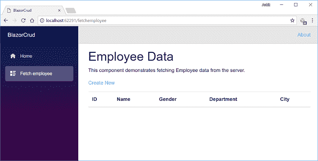**

**因为我们没有添加任何数据，所以它是空的。**

**点击**创建新的**导航到**添加员工**视图。请注意，URL 后面附加了“/addemployee ”,这是我们使用@page 指令定义的。如下图所示，添加新的员工记录:**

**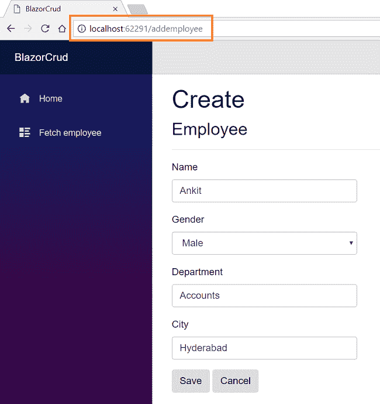**

**在所有字段中插入数据后，点击“保存”按钮。新的雇员记录将被创建，您将被重定向到 **FetchEmployee** 视图，该视图将显示所有雇员的记录。在这里，我们还可以看到每条记录对应的动作方法**编辑**和**删除**。**

**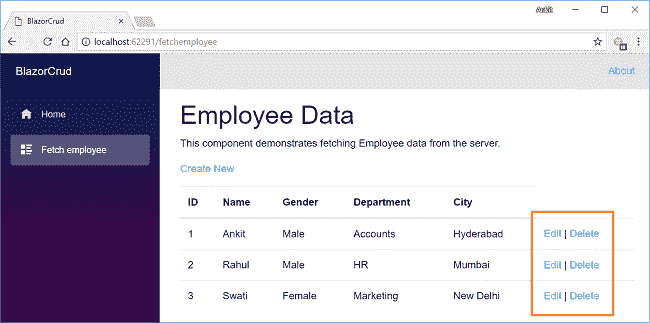**

**如果我们想编辑现有的员工记录，我们只需点击**编辑**操作链接。它将打开如下所示的**编辑**视图。在这里，我们可以更改员工数据。请注意，我们已经在 URL 参数中传递了雇员 id。**

**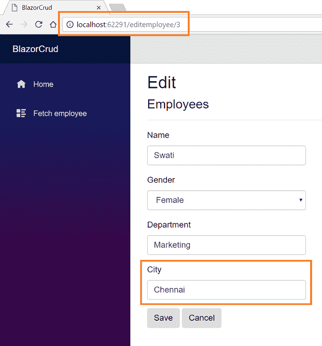**

**在这里，我们将员工 Swati 的城市从新德里更改为 Chennai。单击“保存”返回 FetchEmployee 视图，查看下图中突出显示的更新后的更改:**

**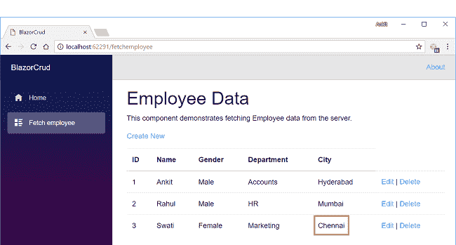**

**现在，我们将对名为 Rahul 的雇员执行删除操作。点击**删除**操作链接，将打开**删除**视图，要求确认删除。请注意，我们已经在 URL 参数中传递了雇员 id。**

**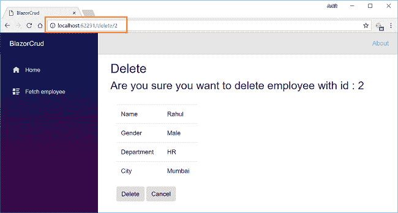**

**一旦我们单击删除按钮，它将删除员工记录，我们将被重定向到 **FetchEmployee** 视图。在这里，我们可以看到名为 Rahul 的雇员已经从我们的记录中删除。**

**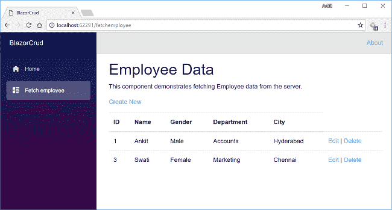**

### **托管应用程序**

**要了解如何使用 IIS 托管 Blazor 应用程序，请参考[在 IIS 上部署 Blazor 应用程序](http://ankitsharmablogs.com/deploying-a-blazor-application-on-iis/)。**

### **请参见**

*   **[ASP.NET 核心—使用 Angular 5 和实体框架核心的 CRUD】](http://ankitsharmablogs.com/asp-net-core-crud-using-angular-5-and-entity-framework-core/)**
*   **[使用角度 5°和 ADO.NET 的 ASP.NET 堆芯的积垢操作](http://ankitsharmablogs.com/crud-operations-asp-net-core-using-angular-5-ado-net/)**
*   **[使用 Visual Studio 代码开始使用 Angular 5](http://ankitsharmablogs.com/getting-started-with-angular-5-using-visual-studio-code/)**
*   **[使用 Visual Studio 代码和 EF 的 ASP.NET 核心 MVC 的 CRUD 操作](http://ankitsharmablogs.com/crud-operation-asp-net-core-mvc-using-visual-studio-code-ef/)**
*   **[使用 ADO.NET 和 Visual Studio 2017 的 ASP.NET 核心 MVC 的 CRUD 操作](http://ankitsharmablogs.com/crud-operation-with-asp-net-core-mvc-using-ado-net/)**
*   **[使用 Visual Studio 代码和 ADO.NET 的 ASP.NET 核心 MVC 的 CRUD 操作](http://ankitsharmablogs.com/crud-operation-with-asp-net-core-mvc-using-visual-studio-code-and-ado-net/)**

### **结论**

**在 Visual Studio 2017 和 SQL Server 2012 的帮助下，我们使用新的 web 框架 Blazor 和实体框架核心创建了一个 ASP.NET 核心应用程序。我们还在应用程序上执行了 CRUD 操作。**

**也可以在 [Github](https://github.com/AnkitSharma-007/ASPCore.BlazorCrud) 上 fork 这个应用。尝试这个新的框架，并在下面的评论区告诉我你的想法。**

**获取我的书 [Blazor 快速入门指南](https://www.amazon.com/Blazor-Quick-Start-Guide-applications/dp/178934414X/ref=sr_1_1?ie=UTF8&qid=1542438251&sr=8-1&keywords=Blazor-Quick-Start-Guide)以了解更多关于 Blazor 的信息。**

**你也可以在 [C#角](https://www.c-sharpcorner.com/article/asp-net-core-crud-using-blazor-and-entity-framework-core/)找到这篇文章。**

**你可以看看我在 ASP 上的其他文章。网芯[这里](http://ankitsharmablogs.com/category/asp-net-core/)**

**最初发表于[https://ankitsharmablogs.com/](https://ankitsharmablogs.com/)**