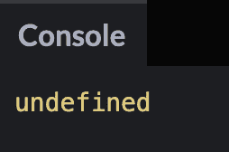
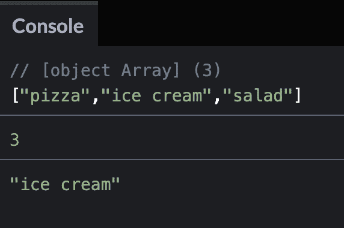
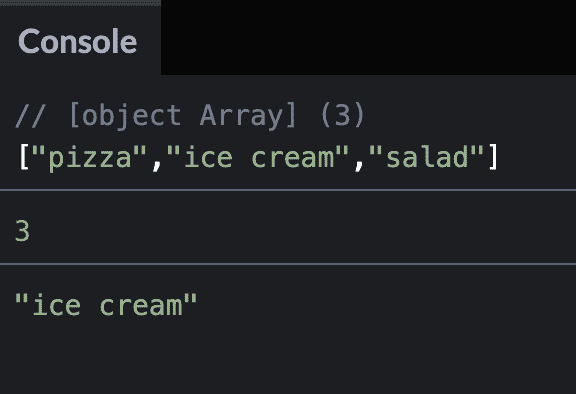
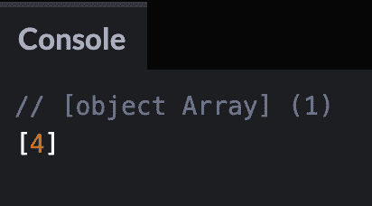
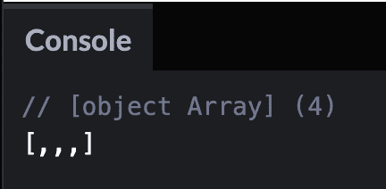
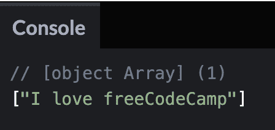
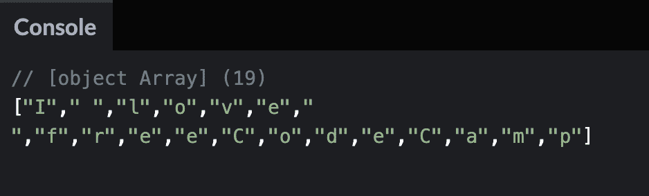
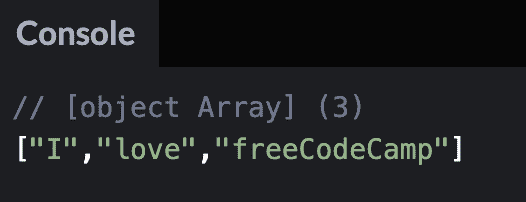

# JavaScript 数组——如何用 JavaScript 创建数组

> 原文：<https://www.freecodecamp.org/news/how-to-create-an-array-in-javascript/>

数组是一种数据结构，您可以在其中存储元素的有序列表。

在本文中，我将向您展示使用 JavaScript 创建数组的 3 种方法。我还将展示如何使用`split()`方法从一个字符串创建一个数组。

## 如何使用赋值操作符在 JavaScript 中创建数组

在 JavaScript 中创建数组最常见的方法是将数组赋给一个变量，如下所示:

```
const books = ["The Great Gatsby", "War and Peace", "Hamlet", "Moby Dick"];
```

如果我们`console.log`数组，那么它将显示数组中列出的所有 4 个元素。

```
const books = ["The Great Gatsby", "War and Peace", "Hamlet", "Moby Dick"];

console.log(books);
```


## 如何使用 new 运算符和数组构造函数在 JavaScript 中创建数组

创建数组的另一种方法是使用关键字`new`和`Array`构造函数。

下面是基本语法:

```
new Array();
```

如果将一个数字参数传递到括号中，这将设置新数组的长度。

在本例中，我们创建了一个长度为 3 个空槽的数组。

```
new Array(3)
```


如果我们在新数组上使用 length 属性，那么它将返回数字 3。

```
new Array(3).length
```

但是，如果我们试图访问数组的任何元素，它将返回未定义，因为所有这些槽目前都是空的。

```
new Array(3)[0]
```



我们可以修改我们的示例，接受多个参数并创建一个食品数组。

```
let myFavoriteFoods = new Array("pizza", "ice cream", "salad");

console.log(myFavoriteFoods); // ["pizza","ice cream","salad"]
console.log(myFavoriteFoods.length); // 3
console.log(myFavoriteFoods[1]); // "ice cream"
```



## 如何在 JavaScript 中使用 Array.of()创建数组

创建数组的另一种方法是使用`Array.of()`方法。该方法接受任意数量的参数，并创建一个新的数组实例。

下面是基本语法:

```
Array.of(); 
```

我们可以修改前面的食物示例，像这样使用`Array.of()`方法。

```
let myFavoriteFoods = Array.of("pizza", "ice cream", "salad");

console.log(myFavoriteFoods); // ["pizza","ice cream","salad"]
console.log(myFavoriteFoods.length); // 3
console.log(myFavoriteFoods[1]); // "ice cream"
```



这个方法实际上类似于使用数组构造函数。关键的区别在于，如果使用`Array.of()`传递一个数字，它将返回一个包含该数字的数组。但是数组构造函数为这个数字创建了 x 个空槽。

在这个例子中，它将返回一个数字为 4 的数组。

```
let myArr = Array.of(4);

console.log(myArr);
```



但是如果我将这个例子改为使用数组构造函数，那么它将返回一个包含 4 个空槽的数组。

```
let myArr = new Array(4);

console.log(myArr);
```



## 如何使用 split()方法从字符串创建数组

下面是 JavaScript `split()`方法的语法。

```
str.split(optional-separator, optional-limit)
```

可选分隔符是一种模式，它告诉计算机每个拆分应该在哪里发生。

可选的 limit 参数是一个正数，它告诉计算机返回的数组值中应该有多少个子字符串。

在这个例子中，我有一个字符串`"I love freeCodeCamp"`。如果我使用不带分隔符的`split()`方法，那么返回值将是整个字符串的数组。

```
const str = 'I love freeCodeCamp';

console.log(str.split());
```



如果我想改变它，使字符串被分割成单独的字符，那么我需要添加一个分隔符。分隔符将是一个空字符串。

```
const str = "I love freeCodeCamp";

console.log(str.split(""));
```



请注意空格在返回值中是如何被视为字符的。

如果我想改变它，所以字符串被分割成单个的单词，那么分隔符将是一个空字符串与一个空格。

```
const str = "I love freeCodeCamp";

console.log(str.split(" "));
```



## 结论

在本文中，我展示了使用赋值操作符、数组构造函数和`Array.of()`方法创建数组的三种方法。

在 JavaScript 中创建数组最常见的方法是将数组赋给一个变量，如下所示:

```
const books = ["The Great Gatsby", "War and Peace", "Hamlet", "Moby Dick"];
```

创建数组的另一种方法是使用关键字`new`和`Array`构造函数。

```
new Array();
```

如果将一个数字参数传递到括号中，这将为新数组设置该数量的空槽的长度。

例如，这段代码将创建一个长度为 3 个空槽的数组。

```
new Array(3)
```

我们也可以像这样传入多个参数:

```
let myFavoriteFoods = new Array("pizza", "ice cream", "salad");

console.log(myFavoriteFoods); // ["pizza","ice cream","salad"]
```

创建数组的另一种方法是使用`Array.of()`方法。该方法接受任意数量的参数，并创建一个新的数组实例。

```
Array.of(); 
```

您也可以使用`split()`方法获取一个字符串并创建一个数组

```
str.split(optional-separator, optional-limit)
```

我希望您喜欢这篇关于 JavaScript 数组的文章。