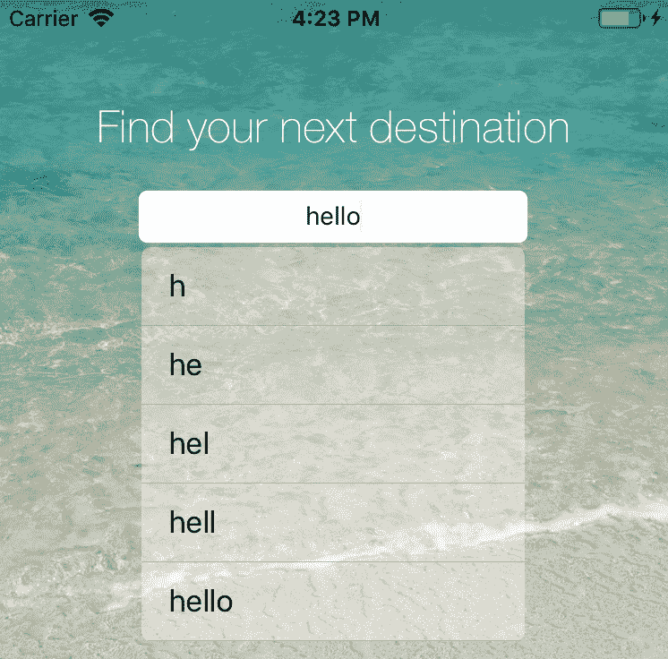
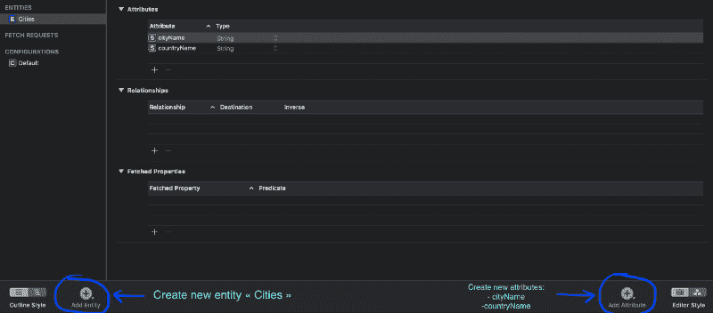

# 如何在 Swift 中使用 CoreData 设置有用的自动完成 UITextField

> 原文：<https://www.freecodecamp.org/news/how-to-create-an-autocompletion-uitextfield-using-coredata-in-swift-dbedad03ea3d/>

作者:Emrick Sinitambirivoutin

# 如何在 Swift 中使用 CoreData 设置有用的自动完成 UITextField

#### 使用 UITableView 和 CoreData 构建自动完成搜索栏所需的一切。


Photo by [Fabian Grohs](https://unsplash.com/@grohsfabian?utm_source=medium&utm_medium=referral) on [Unsplash](https://unsplash.com?utm_source=medium&utm_medium=referral)

在本文中，我将展示我如何构建一个带有自动完成功能的自定义搜索字段来从 CoreData 中检索数据。这是我的一个应用程序中需要的一个组件，在许多情况下，它对改善用户体验非常有用。

#### 我们将会看到:

*   如何设置一个带有搜索 UITextField 的简单应用程序
*   如何配置表视图以显示搜索结果
*   如何对 CoreData 集合进行实时查询

### 1.设置项目

只需使用以下组件创建一个单一视图应用程序(在项目创建时检查 CoreData！).更具体地说，我们假设这是一个旅游推荐应用程序，用户需要提供一个城市名称来获取该地方的所有信息。


UILabel : 我们称之为 *topLabel。我们不需要它。*

**UITextField:** 它是我们将定制为具有自动完成搜索字段的字段，所以我们称它为 *searchTextField。*

UIButton : 它是当用户找到他们想要的地方时按下的按钮。姑且称之为*搜索按钮*。

tableView 将以编程方式添加，这样您将看到如何在任何情况下设置它。

为了有一个漂亮的渲染，我在背景上添加了一个 UIImageView，上面有一个美妙的海滩图像。

要将所有这些组件连接到我们的视图控制器，请选择它们，并使用( **Control(或 Ctrl) ⌃ + Click** )将它们的引用拖到您的主视图控制器 swift 文件中。

### 2.配置 CustomSearchTextField 类

为了创建我们的新类，我们创建了一个名为*customsearchtextfield . swift .*的新文件。正是在这个类中，继承了 UITextField，我们将嵌入实现自动完成搜索字段所需的所有特性。

#### 使用结果创建表视图:

为了能够显示完成结果，我们需要实例化一个 UITableView，它将显示最相关的结果，如下所示:



为此，我们需要创建一个 tableView 对象，然后将其添加到当前视图中。为了处理这个新对象，我们需要覆盖特定的方法，如下所示。构建 searchTableView 所需的所有代码都将由这个方法处理: *buildSearchTableView()* 。

实例化 tableView 就像创建一个新的 UITableView 对象一样简单，但是为了访问这个新的 TableView 对象的所有功能，我们需要从 TableViewDelegates 和 TableViewDataSource 方法继承。重要的是要注意两个重要的变量:

*   **tableView 委托:**这个变量将让我们指定当 table view 中发生一些变化时，视图的哪个对象需要被通知(在我们的例子中，这个对象是我们的 SearchTextField，它在这个上下文中是 *self* 对象)
*   **表格视图数据源:**这个变量将让我们指定表格视图的所有组件将如何被创建，以及来自哪些数据。这里，我们再次需要将它设置为 *self* 。

设置这两个变量允许我们在 CustomSearchTextField 类中处理一些与 UITableView 相关的操作。

既然已经创建了表视图，我们需要在其中添加数据，更具体地说，这些数据将被存储到单元格中。我们使用从 TableViewDataSource 类继承的方法来配置单元格，并将它们添加到 tableView 中。除此之外，TableViewDelegates 的方法将允许我们触发用户单击的位置，并将打印控制台中相应单元格的内容。

但是如果你尝试运行上面的代码，什么都不会发生，因为没有设置 tableView 框架，我们也没有将视图放在前面。为了解决这个问题，我们现在需要添加一个 *updateTableView()* 方法:

我们的 TableView 已经设置好了，现在应该可以完美地工作了！但是此时，如果我们想要显示某些内容，我们必须在 dataList 中添加数据。简单地说，我们将向列表中添加虚拟数据:用户在搜索栏中输入的文本。

但是所有这些的主要目标是当用户在我们的搜索栏中键入时，给我们的用户自动完成结果，所以我们需要观察用户何时键入一个新字母，并据此更新 tableView 数据。

正如您在上面看到的，我们修改了 *willMove()* 方法，以便设置如何处理每个用户与文本字段的交互。让我们感兴趣的是当文本域改变时(当用户输入时)。因此，每次激活该操作时，我们都会向列表中添加数据，并更新我们的 tableView。

#### 改善用户体验:

即使我们的 searchField 根本不搜索，您也一定看到了，当我们输入内容，结果开始显示时，所有的结果都是纯文本的。这看起来不太像自动完成搜索栏。为了更加用户友好，最好突出显示我们已经在文本字段中键入的文本部分，并过滤结果，使它们与我们实际键入的内容相对应。**我们来做这个**？


是时候创建我们的过滤方法了。这个方法将从数据列表中过滤相关的条目(与用户开始输入的内容相对应的条目)。我们将使用 *NSMutableAttributedString 类*来突出显示用户在文本字段*中输入的文本部分。*

首先，我们创建一个 *SearchItem* 类，它将代表我们的每个过滤结果。在我们构建精彩的旅游推荐应用程序时，我们会将这些项目视为城市名称。下面是*的 SearchItem* 类:

我们现在需要更改我们的全局变量，并添加一个新变量来存储我们筛选的项目:

然后，让我们创建我们的过滤方法:

通过将我们的字符串转换成一个 *NSString* ，我们可以使用方法 *range()，即*返回给定字符串在字符串中第一次出现的范围。通过使用这种方法，我们都知道字符串是否对应于用户正在键入的内容以及相应字符串的位置！这就是我们要强调的这部分内容。我们使用 *setAttributes* 方法完成这项工作，然后将我们的项目添加到结果列表中。最后，我们在 tableView 中重新加载数据。

让我们创建新的测试数据来尝试我们的实现:

一切都应该完美地工作，我们几乎完成了！？

### 3.对 CoreData 进行查询

有一个漂亮的带有自定义表格视图的搜索栏来显示我们的自动完成过滤结果是很好的，但是如果没有数据，它不是很有用？。

让我们将搜索文本字段连接到 CoreData 存储。

#### 创建核心数据数据库:

为了存储我们的持久数据，我们将在数据库中创建一个具有两个属性(行)的新实体(表)。为此，我们单击。xcdatamodeld 文件，并创建一个名为 Cities 的新实体，添加我们需要的两个属性:cityName 和 countryName。



CustomSearchField..xcdatamodeld

然后，我们将修改 *CustomSearchField.swift* 中的数据列表类型，使其成为城市列表，而不是搜索项目列表:

```
var dataList : [Cities] = [Cities]()
```

#### 对创建的数据库进行查询:

现在我们需要创建一些方法来处理数据库中新数据的保存和获取。为此，我们需要创建一个环境。上下文是一个特定的区域，在将更改提交到数据库之前，我们将在其中存储所有的更改。如果您使用 git，这就像是中转区。首先将您的文件添加到临时区域，当您准备好您的更改时，将它们提交到您的 git。

我们更改了 *filter()* 方法的开头，以便查询与用户输入相对应的数据，而不是从数据库中获取所有数据:

最后要添加的是一个新的 *addData()* 方法来填充我们的数据库。注意，这个函数只需要被调用一次，因为存储的数据将变得持久，所以在第一次调用之后，在你的代码中注释相应的行(就在 *buildSearchTableView()* 中创建 tableView 之前)!即使重新启动应用程序，设备内部存储器中的数据仍然可用。

### 就是这样！我们完了！？


几周前，我在 Udemy 上发现了一个有趣的 MOOC，开始钻研 Swift 编程。在我掌握了 Swift 和 Xcode 开发的基础知识之后，我开始用我在网上找到的所有有用的文档进行我自己的项目。这第一个教程是一个机会，让我分享我获得的所有知识，所以我希望它能帮助你！

如果你有问题，不要犹豫，在评论中告诉我！如果你喜欢这篇文章，别忘了给我鼓掌？？？

所有最终的项目代码都可以在这里找到:

[**sinitame/customSearchField-Medium**](https://github.com/sinitame/customSearchField-medium)
[*Medium 文章源代码:如何在 Swift 中使用 CoreData 创建自动完成 ui textfield…*github.com](https://github.com/sinitame/customSearchField-medium)