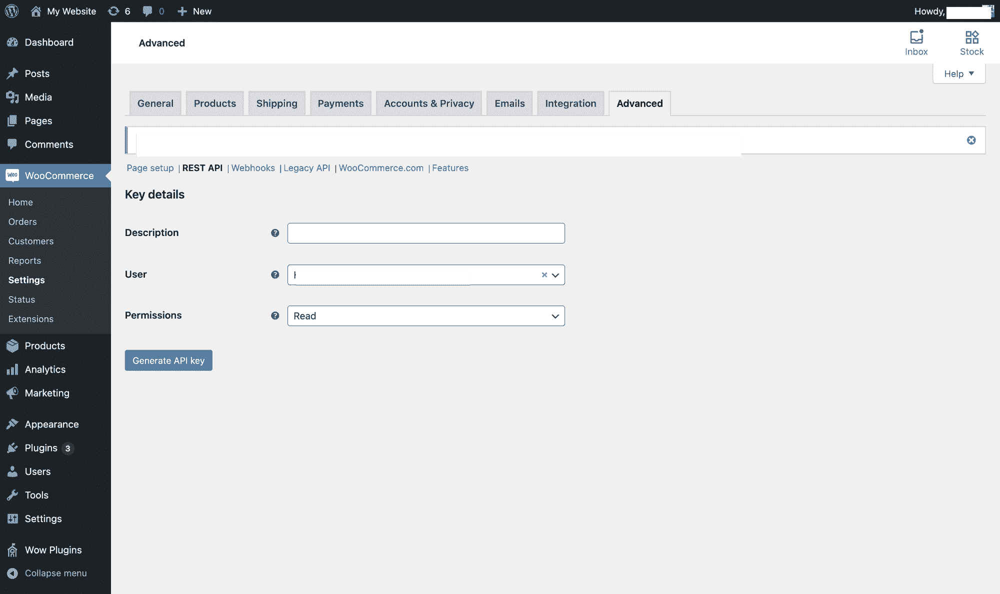
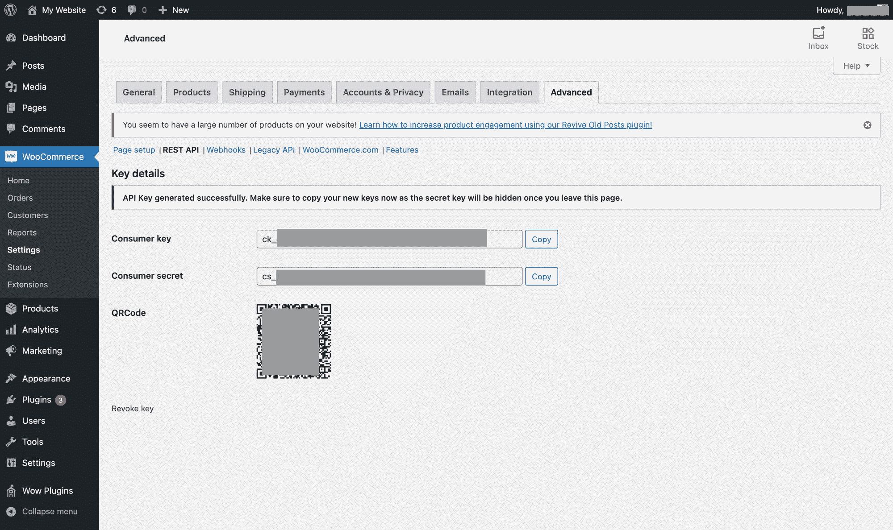
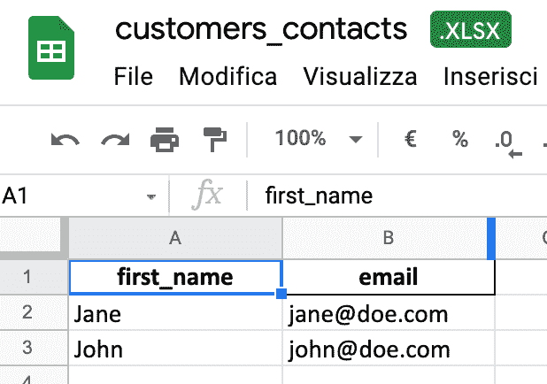

# 如何用 WooCommerce 和 Python 创建一个拉客户数据的 Excel 文件

> 原文：<https://www.freecodecamp.org/news/how-to-create-an-excel-file-with-customers-data-with-woocommerce-and-python/>

“嘿，你能把我们客户的电子邮件发给我吗？我们即将推出一项新的营销活动，而且…我们尽快需要它们。"

如果你在公司的网络部门工作，你可能已经听过这句话几百次了。所以，今天我想分享我是如何为我工作的公司解决这个问题的。

## 要求是什么？

我们用 WooCommerce 开发了一个电子商务应用程序，每天在全球范围内收到数千份订单。要注册，用户必须添加他们的名字、姓氏和电子邮件地址。

我们的市场部要求我的团队向他们提供我们所有客户的电子邮箱地址和名字，以发起一场新的活动。

我预计他们会要求一个 CSV 文件来将大量联系人上传到他们的营销平台。相反，他们告诉我，他们需要一个 Excel 文件，因为他们必须在开展活动之前编辑它。

一旦他们把吉拉问题分配给我，我就准备开始了。

## 分析问题

WooCommerce 为用户提供了获取客户数据的导出功能，但它不会生成 Excel 文件。它生成一个 CSV 或 XML 文件。

当你使用像 WordPress 这样的工具时，你想到的第一个选择是使用一个插件来获得你需要的东西。

我在 WordPress 插件目录上找到了一些选项，但是每次你在你的实例中安装一个新的插件时都有很多要考虑的。您必须考虑维护成本(考虑到每次开发人员进行维护时，他们记录的时间会影响您的预算)、安全漏洞，以及最后但同样重要的是，购买批准可能需要很长时间。

我还考虑了第二个选择:通过用户界面下载 CSV 文件，并使用您可以在网上找到的上千种服务之一将其转换为 Excel 文件。

但是使用第三方服务可能会违反关键的安全和隐私政策，并且最终结果并不总是可靠的。所以我决定不再朝这个方向前进。

最后，我认为开发一个脚本是解决这个任务的最好和最快的选择。

WordPress 为开发者提供 API。WordPress 系统的许多其他插件也提供 API，WooCommerce 也不例外。[文档](https://docs.woocommerce.com/document/woocommerce-rest-api/)很健壮，它提供了最常用语言的库链接，比如 Node.js、Python、PHP 和 Ruby。

我决定使用 Python 并使用这种技术来开发一个脚本，该脚本生成一个具有以下结构的 Excel 文件:

*   两列:名字和电子邮件
*   每个客户一行

我选择 Python 有几个原因:有数百个库可以帮助你完成工作，它很灵活，并且在处理数据时非常有用。

我还决定使用 Pandas 和 Openpyxl 来处理数据和创建 Excel 文件。

## 在编码之前，让我们得到我们需要的东西

为了使用 WooCommerce API，我需要生成要使用的 API 密钥。你可以在 WooCommerce 官方[文档](https://docs.woocommerce.com/document/woocommerce-rest-api/)上获得更多信息。

首先，你需要登录你的 WooCommerce 实例，然后进入 WooCommerce >设置>高级> REST API。



然后我简单描述一下，选择我要为其生成 API 的用户，选择授予的权限(读/写或者两者都有)，然后点击“生成 API key”。

接下来，我将获取消费者密钥和消费者秘密:



## 如何准备环境

我做的第一件事就是添加必要的库来开发我的脚本。我从 WooCommerce 的 Python 库开始。为了安装它，我运行了以下命令:

```
pip install woocommerce 
```

很好。现在，我将安装 Pandas，这是一个用于 Python 的数据分析和操作工具:

```
pip install pandas 
```

之后，我安装了 Openpyxl，这是一个用于读写 Excel 文件的 Python 库:

```
pip install openpyxl 
```

## 让我们编码

我使用 WooCommerce Python 库提供的 API 函数进行 API 调用，并将它存储在一个变量中。然后，我向该函数传递了我的 WooCommerce 网站的基本 URL、消费者密钥、消费者秘密和版本。

```
wcdata = API(
    url='<BASE_URL>',
    consumer_key='ck_XXXXXXXXXXXXXXXXXXXX',
    consumer_secret='cs_XXXXXXXXXXXXXXXXXXXX',
    version='wc/v3'
)
```

然后，我使用 GET 函数调用“customers”端点，并在本地创建了一个 JSON 文件(“contacts.json”)，其中包含我从之前调用的端点获得的数据:

```
newJson = wcdata.get('customers').json()
with open('contacts.json', 'w') as f:
    json.dump(newJson, f, ensure_ascii=False, indent=4)
```

我将它转换成一个熊猫对象，并存储在“df_json”变量中:

```
df_json = pd.read_json('contacts.json')
```

我使用了`to_excel()`函数将对象转换成 Excel 文件。我给这个函数传递了三个参数:

*   我要创建的文件的名称
*   索引，设置为“false ”,因为我不想在我的文件中打印记录 id
*   我想在我的文件上打印的列(名字和电子邮件)

```
df_json.to_excel('customers_contacts.xlsx', index=False, columns=('first_name', 'email'))
```

我运行了脚本，得到了这个:



就是这样。这就是我如何用 WooCommerce APIs 和 Python 用不到 20 行代码创建了一个包含客户电子邮件和名字的 Excel 文件。

当然，它是一个脚本，您可以在需要时通过命令行运行，或者您也可以自动生成关于您和您的团队正在运行的电子商务的报告。

## 最后的想法

我还想分享一些我在研究开发这个脚本时在网上找到的其他内容。

第一个是堆栈溢出[问题](https://stackoverflow.com/questions/12309269/how-do-i-write-json-data-to-a-file)。它帮助我在创建 JSON 文件时优化了代码。我真的很欣赏这个问题，尤其是当它建议如何在现代系统上编写一个“更好”的 JSON 文件时。

第二个是关于熊猫的。如果你写 Python 代码，总有一天，你将不得不处理数据和它们的操作。Erik Marsja 的这篇文章很好地解释了如何用 Pandas 将 JSON 文件转换成 Excel。它为读者提供了一些提示，告诉他们如何使用这个强大的库以高效和有效的方式显示他们想要的数据。

如果你觉得这篇文章有用，欢迎分享！你也可以在这个 Github [repo](https://github.com/mventuri/-woocommerce-to-excel-python) 上找到完整的代码。