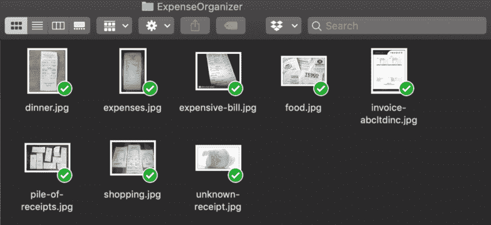

# 如何用 JavaScript 在 10 分钟内创建一个费用管理器

> 原文：<https://www.freecodecamp.org/news/how-to-create-an-expense-organizer-with-javascript-in-10-minutes-d6dd3541ab5e/>

by Per Harald Borgen

# 如何用 JavaScript 在 10 分钟内创建一个费用管理器

#### 让我们使用 ES6 和 Dropbox API 来防止收据变得混乱。

在这篇文章中，我将向你展示如何创建一个方便的小应用程序来跟踪你的收据。它可以让你把所有的收据都放入一个 Dropbox 文件夹，然后点击一个按钮按月进行整理。