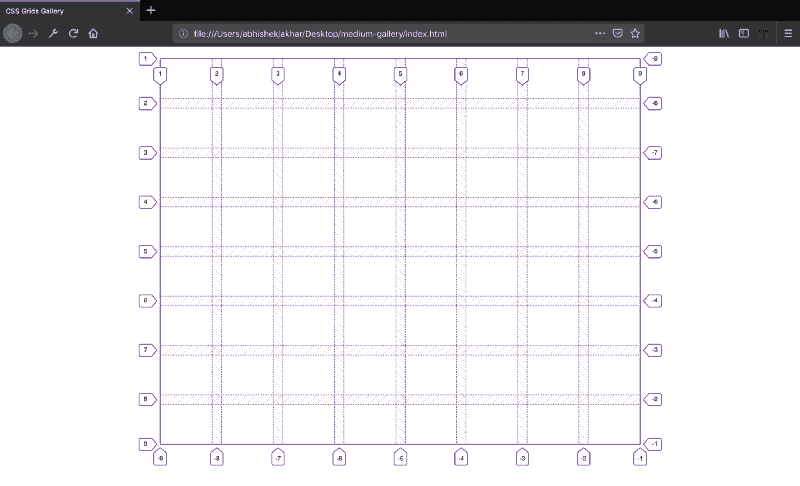
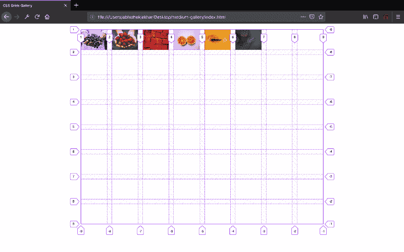
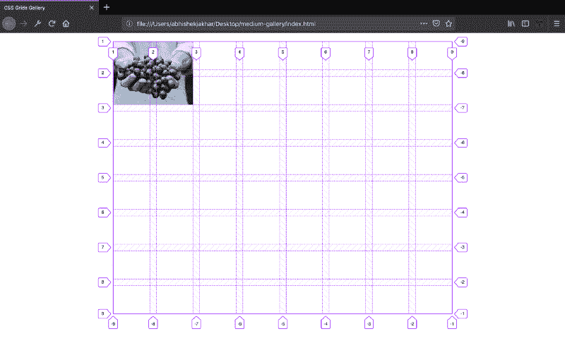
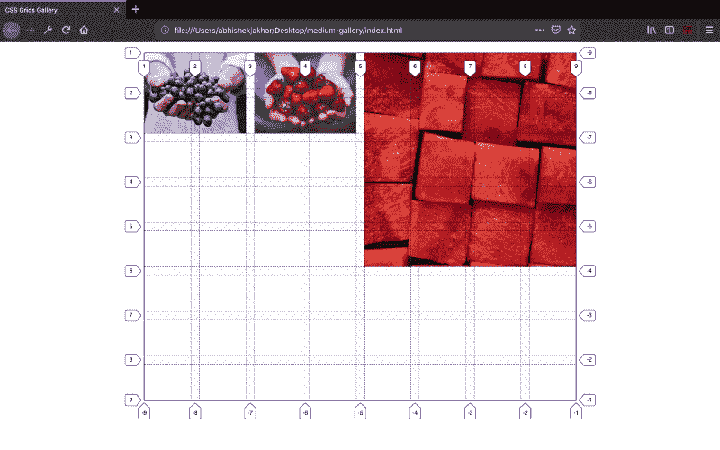
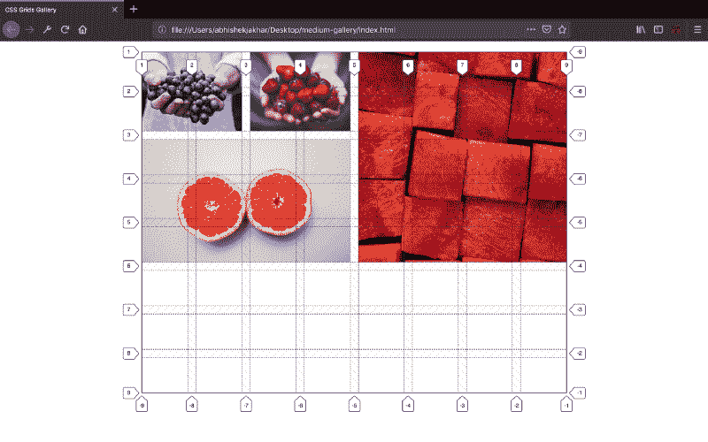
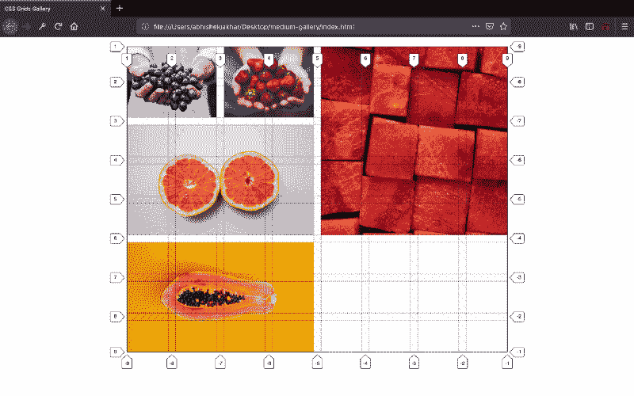
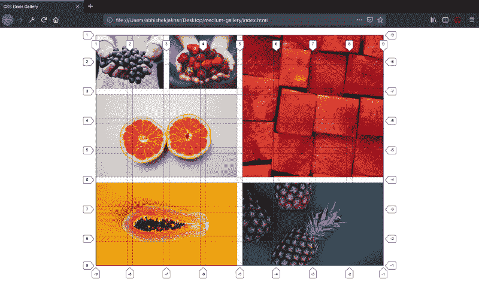

# 如何用 CSS 网格创建图片库

> 原文：<https://www.freecodecamp.org/news/how-to-create-an-image-gallery-with-css-grid-e0f0fd666a5c/>

像 [Unsplash](https://unsplash.com/) 、 [Pinterest](https://www.pinterest.com/) 等网站制作的图片**图库**都是通过**定位**或**翻译**图片项这样的技术来制作的，这是一项非常繁琐的工作。您可以使用 **CSS 网格非常快速地实现相同的功能。**

> **举例来说:**上面是一个图库，图片的**宽度**和**高度**变化，这是 CSS 网格的一个完美用例。

#### **我们开始吧！**

### 底层网格

现在，让我们创建一个 **8x8 的网格**。我们也可以创建其他大小的网格，但这取决于你想要的画廊类型。在我们的情况下，一个 **8x8 网格**将是理想的。

*   通过将元素的**显示**属性设置为**网格**来定义网格容器。因此，带有**类网格**的 **div** 将成为我们的**网格** **容器。**
*   我们使用 **grid-template-columns** 属性来设置**列轨迹**和 **grid-template-rows** 来设置**行轨迹。**我们在网格容器上声明这些属性。在我们的例子中，我们将制作一个 8x8 的网格容器。
*   **grid-gap:** 定义网格布局中行 **和** **列**之间的**间隙的大小。网格间距的值可以是任何 CSS 长度单位。在我们的例子中，我给了 **15px** 的值，以使我们的**网格看起来** **更好**。**

**HTML:**

```
<div class="gallery"></div>
```

**CSS:**

```
.gallery {
    display: grid;
    grid-template-columns: repeat(8, 1fr);
    grid-template-rows: repeat(8, 5vw);
    grid-gap: 15px;
}
```

> ***注意:*** *行的高度依赖于视口的宽度，这样单元格就能完美地保持其纵横比。我们有 **8 排**，每排的高度为 **5，视口宽度为**。我对这些高度进行了试验，得出的结论是**视窗宽度**的 **5%** 是高度的**完美尺寸**。我们通过将行高设置为 **5vw(视口宽度)**来实现这一点。*



**8x8 CSS Grid (8 Column Tracks & 8 Row Tracks) with Grid Lines from 1 to 9 (Both Columns & Rows)**

> ***注:******网格**的所有**直接子**自动成为**网格项**。*

### 插入网格项目

现在，我们将在网格容器中插入网格项目:

```
<div class=”gallery”>
  <figure class=”gallery__item gallery__item--1">
    
  </figure>
  <figure class="gallery__item gallery__item--2">
    
  </figure>
  <figure class="gallery__item gallery__item--3">
    
  </figure>
  <figure class="gallery__item gallery__item--4">
    
  </figure>
  <figure class="gallery__item gallery__item--5">
    
  </figure>
  <figure class="gallery__item gallery__item--6">
    
  </figure>
</div>
```

### 造型图像

```
.gallery__img {
    width: 100%;
    height: 100%;
    object-fit: cover;
}
```

为**背景图像**设置**背景尺寸**到**封面**一样，将**对象适合度**值设置为**封面**。我们这样做是为了让图像能够填充其框(网格项)的高度和宽度，同时保持其纵横比。

> ***注意:*** *只有我们设置了**宽度**和**高度**属性，对象适合属性才有效。*



> ***注:*** *默认情况下**网格项**根据**网格自动放置规则**进行布局。*

### **定位网格项**

在我们开始定位网格项目之前，我们将学习一些基本概念。

网格 **div** 是**网格容器**，所有**直接子**元素都是**网格项**。当我们用 grid-template-columns 和 grid-template-rows 定义网格轨迹时， **grid 提供了** **美国编号的线，称为网格线**，用于定位项目。您可以通过数字索引来引用每条网格线。

**列从一个**开始，默认从**左**到**右**，而**行**也从一个**顶**到**底**开始。需要**两条网格线**组成一列或一行，每侧一行，所以我们的 **8 列**和 **8 行**网格由
**9 列线**和 **9 行线**组成。

垂直线 **1** 和 **2** 决定了**第一列的**起点**和**终点**。**行 **2** 和 **3** 行**第二列**等等。同样，水平线 **1** 和 **2** 确定第一排的位置，水平线 **2** 和 **3** 确定第二排的位置，以此类推。了解以上概念将有助于你理解我们如何在网格上定位**项目(图片)**。

现在，我们将使用**网格行号**通过将属性直接应用于网格项目来控制项目的放置方式。我们可以指定一个网格项目**在哪一行开始**和**在哪一行结束**，以及它应该**扩展多少轨道**。

#### **第一个网格项目**

因此，让我们创建一个针对第一个网格项的新规则。我们将首先使用 **grid-column-start** 属性来指示第一个网格项开始的列网格线。 **grid-column-end** 表示第一个网格项目的结束位置。

所以 grid-column-start **值**是一个数字，表示一列左边的网格线。grid-column-end **值**表示标记列右边缘的网格线。

所以在下面给出的例子中，设置 **grid-column-start** 为 **1** 和 **grid-column-end** 为 **3** 意味着网格项将从网格线的左边缘、 **line 1** 延伸到 **line 3** ，填满 **2 列**。我们还将使用 **grid-row-start** 和 **grid-row-end** 属性来指示**行网格线**上的**网格项开始**和**结束位置**，就像我们对列所做的一样。

```
.gallery__item--1 {
    grid-column-start: 1;
    grid-column-end: 3;
    grid-row-start: 1;
    grid-row-end: 3;
}
```



First Item Placement

> ***注意:*** *现在，我们将根据上面学到的相同原则放置其他物品。*

#### **第二个网格项目**

```
.gallery__item--2 {
    grid-column-start: 3;
    grid-column-end: 5;
    grid-row-start: 1;
    grid-row-end: 3;
}
```


Second Item Placement

#### **第三个网格项目**

```
.gallery__item--3 {
    grid-column-start: 5;
    grid-column-end: 9;
    grid-row-start: 1;
    grid-row-end: 6;
}
```



Third Item Placement

#### **第 4 个网格项目**

```
.gallery__item--4 {
    grid-column-start: 1;
    grid-column-end: 5;
    grid-row-start: 3;
    grid-row-end: 6;
}
```



Fourth Item Placement

#### **第 5 个网格项目**

```
.gallery__item--5 {
    grid-column-start: 1;
    grid-column-end: 5;
    grid-row-start: 6;
    grid-row-end: 9;
}
```



Fifth Item Placement

#### **第 6 个网格项目**

```
.gallery__item--6 {
    grid-column-start: 5;
    grid-column-end: 9;
    grid-row-start: 6;
    grid-row-end: 9;
}
```



Sixth Item Placement

您可以在下面找到完整的代码。

```
<!DOCTYPE html>
<html lang="en">
    <head>
        <meta charset="UTF-8">
        <meta name="viewport" content="width=device-width, initial-scale=1.0">
        <meta http-equiv="X-UA-Compatible" content="ie=edge">

        <link href="https://fonts.googleapis.com/css?family=Josefin+Sans:300,400,400i|Nunito:300,300i" rel="stylesheet">
        <link rel="stylesheet" href="css/style.css">
        <link rel="shortcut icon" type="image/png" href="img/favicon.png">

        <title>CSS Grids Gallery</title>
    </head>
    <body>
        <div class="container">
            <div class="gallery">
                <figure class="gallery__item gallery__item--1">
                    
                </figure>
                <figure class="gallery__item gallery__item--2">
                    
                </figure>
                <figure class="gallery__item gallery__item--3">
                    
                </figure>
                <figure class="gallery__item gallery__item--4">
                    
                </figure>
                <figure class="gallery__item gallery__item--5">
                    
                </figure>
                <figure class="gallery__item gallery__item--6">
                    
                </figure>
            </div>
        </div>
    </body>
</html>
```

和 CSS:

```
*,
*::after,
*::before {
  margin: 0;
  padding: 0;
  box-sizing: inherit; 
}

html {
  box-sizing: border-box;
  font-size: 62.5%; 
}

body {
  font-family: "Nunito", sans-serif;
  color: #333;
  font-weight: 300;
  line-height: 1.6; 
}

.container {
  width: 60%;
  margin: 2rem auto; 
}

.gallery {
  display: grid;
  grid-template-columns: repeat(8, 1fr);
  grid-template-rows: repeat(8, 5vw);
  grid-gap: 1.5rem; 
}

.gallery__img {
  width: 100%;
  height: 100%;
  object-fit: cover;
  display: block; 
}

.gallery__item--1 {
  grid-column-start: 1;
  grid-column-end: 3;
  grid-row-start: 1;
  grid-row-end: 3;

  /** Alternative Syntax **/
  /* grid-column: 1 / span 2;  */
  /* grid-row: 1 / span 2; */
}

.gallery__item--2 {
  grid-column-start: 3;
  grid-column-end: 5;
  grid-row-start: 1;
  grid-row-end: 3;

  /** Alternative Syntax **/
  /* grid-column: 3 / span 2;  */
  /* grid-row: 1 / span 2; */
}

.gallery__item--3 {
  grid-column-start: 5;
  grid-column-end: 9;
  grid-row-start: 1;
  grid-row-end: 6;

  /** Alternative Syntax **/
  /* grid-column: 5 / span 4;
  grid-row: 1 / span 5; */
}

.gallery__item--4 {
  grid-column-start: 1;
  grid-column-end: 5;
  grid-row-start: 3;
  grid-row-end: 6;

  /** Alternative Syntax **/
  /* grid-column: 1 / span 4;  */
  /* grid-row: 3 / span 3; */
}

.gallery__item--5 {
  grid-column-start: 1;
  grid-column-end: 5;
  grid-row-start: 6;
  grid-row-end: 9;

  /** Alternative Syntax **/
  /* grid-column: 1 / span 4; */
  /* grid-row: 6 / span 3; */
}

.gallery__item--6 {
  grid-column-start: 5;
  grid-column-end: 9;
  grid-row-start: 6;
  grid-row-end: 9;

  /** Alternative Syntax **/
  /* grid-column: 5 / span 4; */
  /* grid-row: 6 / span 3; */
}
```

您可以尝试添加自己的 CSS，使此图库呈现您想要的外观。您还可以非常容易地创建更复杂的图库。

你可以在下面的链接中了解更多关于 CSS 网格的信息

[**网格完全指南| CSS-Tricks**](https://css-tricks.com/snippets/css/complete-guide-grid/)
[*CSS 网格布局是 CSS 中最强大的布局系统。这是一个二维系统，意味着它可以…*css-tricks.com](https://css-tricks.com/snippets/css/complete-guide-grid/)

我希望这篇文章对你有所帮助。我希望听到您的反馈！

**感谢您的阅读！**