# 如何创建一个 IntelliJ 插件——让我们构建一个简单的字典查找器

> 原文：<https://www.freecodecamp.org/news/how-to-create-an-intellij-plugin-lets-build-a-simple-dictionary-finder-6c5192b449c/>

作者奥利弗·尼布罗

# 如何创建一个 IntelliJ 插件——让我们构建一个简单的字典查找器


Photo by [Crew](https://unsplash.com/photos/4Hg8LH9Hoxc?utm_source=unsplash&utm_medium=referral&utm_content=creditCopyText) on [Unsplash](https://unsplash.com/search/photos/search?utm_source=unsplash&utm_medium=referral&utm_content=creditCopyText)

我们大多数开发人员使用 IntelliJ 平台，无论是 IDEA、PHPStorm、WebStorm、Android Studio、PyCharm，等等。然而，有时当我们使用它时，我们发现缺少了一个功能，但我们不知道如何实际添加该功能，最终只能没有它。

在这篇文章中，我将讲述我们如何为所有的 IntelliJ IDEs 创建一个简单的插件，这样当你添加一个`project.dic`文件时，它将自动把它添加为你的字典之一。它还会在包中搜索文件，因此包可以将自定义单词添加到字典中。一个`.dic`文件是一个简单的字典，其中每一行都是字典中的一个单词。

该项目只是一个示例，让你开始开发自己的插件。但这实际上也是我一直缺少的一个特性，因为当我开发一个包含我自己的单词的自定义包时，我讨厌每次都必须将它们添加到项目级词典中。

### 创建项目

为 IntelliJ 创建插件时，我们必须选择用 Java 或 Kotlin 来做。我将用 Java 来做，因为大多数用户对此都很熟悉。由于这是一个 Java 项目，我们将使用 IntelliJ IDEA 作为我们的 IDE。

根据[开发指南](https://www.jetbrains.org/intellij/sdk/docs/basics/getting_started.html)，创建项目的推荐方式是使用[grade](https://www.jetbrains.org/intellij/sdk/docs/tutorials/build_system.html)。我们首先打开`preferences`，检查是否安装了`Gradle`和`Plugin DevKit`插件。

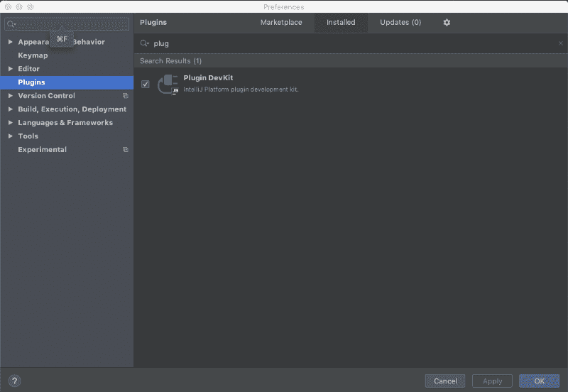

安装插件并重启 IDE 后，我们转到`Gradle`下的新项目流。这里有一个选项叫做`IntelliJ Platform Plugin`，这是我们需要的。

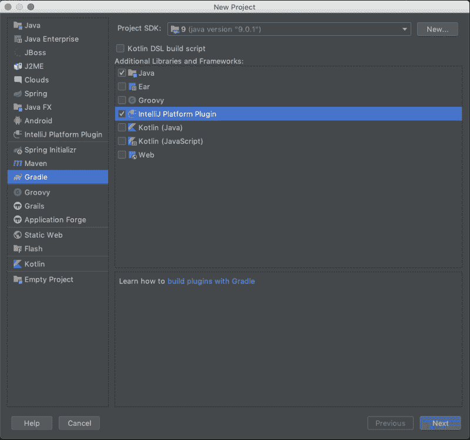

Project creation flow step 1

然后像往常一样完成项目创建流程的剩余部分——在这个项目中，我选择了下面的配置。

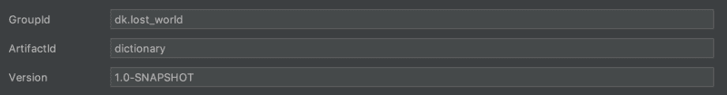

Project creation flow step 2

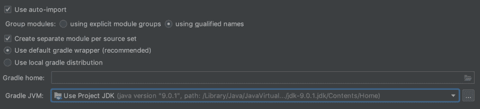

Project creation flow step 3

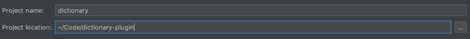

Project creation flow step 4

### 设置`plugin.xml`

现在我们有了一个项目，我们必须设置我们的`plugin.xml`文件和`build.gradle`。`plugin.xml`文件是 IntelliJ 使用的文件，它定义了关于插件的所有信息。这包括名称、依赖项、应该添加什么动作或者是否应该扩展 IntelliJ 中的某些内容。基本上这个文件定义了你的插件应该做的一切，并且是你的项目的根。在我们的`build.gradle`文件中，我们可以定义来自`plugin.xml`的一些值，以及在用 gradle 构建时我们想要在哪个版本的 IntelliJ 上测试我们的插件的信息。

让我们从定义我们的`plugin.xml`文件开始。你可以在`src/main/resources/META-INF/plugin.xml`中找到该文件。我们希望我们的插件可以在所有的 IntelliJ IDE 上使用，所以我们将`dependencies`设置为`com.intellij.modules.lang`。现在我们的文件看起来像这样:

```
<idea-plugin>    <id>dk.lost_world.Dictionary</id>    <name>Dictionary</name>    <vendor email="olivernybroe@gmail.com" url="https://github.com/olivernybroe/intellij-Dictionary">GitHub</vendor>    <depends>com.intellij.modules.lang</depends></idea-plugin>
```

然而现在这没有任何逻辑，我们没有向 IntelliJ 平台注册任何东西。

由于该项目将在项目中找到`project.dic`文件，并将它们注册为该项目中的字典，因此我们必须注册一个项目级组件。打开和关闭项目时将调用该组件。让我们创建一个类并实现`ProjectComponent`接口。当我们将鼠标悬停在类名上时，它告诉我们该组件没有注册。

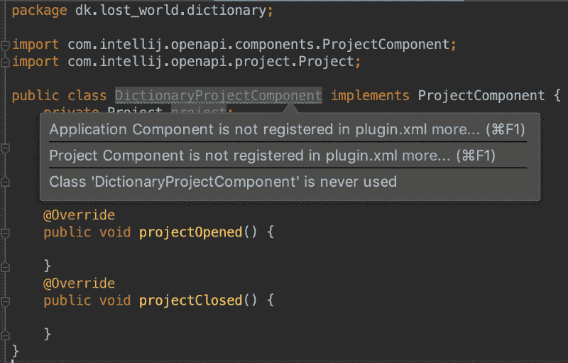

Hints on class

然后我们可以调用名为`Register Project Component`的动作，它会将它注册到`plugin.xml`文件中。

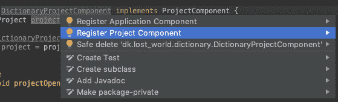

Actions on class

如果我们打开`plugin.xml`，应该添加以下代码。如果在调用动作时没有添加，那么就手动添加。

```
<project-components>    <component>        <implementation-class>dk.lost_world.dictionary.DictionaryProjectComponent</implementation-class>    </component></project-components>
```

#### IntelliJ 文件系统

在 IntelliJ 中处理文件时，我们使用一个[**V**I virtual**F**ile**S**system(VFS)](https://www.jetbrains.org/intellij/sdk/docs/basics/virtual_file_system.html)。VFS 给了我们一个通用的 API 来处理文件，而不需要我们考虑它们是来自 FTP、HTTP 服务器还是本地磁盘。

当我们的插件寻找名为`project.dic`的文件时，它当然需要与 **V** 虚拟 **F** 文件 **S** 系统对话。VFS 中的所有文件都是[虚拟文件](https://www.jetbrains.org/intellij/sdk/docs/basics/architectural_overview/virtual_file.html)。这听起来有点吓人，但实际上它只是文件系统和文件的 API。可以这么想，虚拟文件系统是你的文件系统接口，虚拟文件是你的文件。

#### 拼写检查器设置

由于 IntelliJ 已经支持`.dic`文件和拼写检查，我们唯一需要做的就是在拼写检查器设置中注册我们的`project.dic`文件。

拼写检查器的所有设置都保存在一个名为`com.intellij.spellchecker.settings.SpellCheckerSettings`的类中。要获得它的实例，只需调用`getInstance`方法(大多数 IntelliJ 类都有一个`getInstance`方法，它使用 IntelliJ 的`ServiceManager`)。
settings 类得到了一个名为`getCustomDictionariesPaths`的方法，它返回用户安装的字典的所有路径。

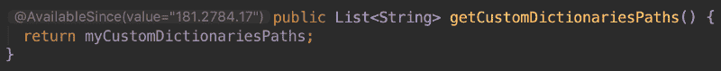

API of getCustomDictionariesPaths

在查看方法签名时，我们还会看到一个名为`AvailableSince`的注释。稍后，我们将使用该注释中的值来指定插件工作所需的最低版本。

当方法返回一个列表时，我们可以简单地调用方法上的`add`来添加一个新的字典路径。

#### 运行插件(build.gradle)

既然我们现在知道了如何向拼写检查器添加字典，那么让我们在我们的`DictionaryProjectComponent`类中添加一个小代码示例来完成这个任务。

```
public class DictionaryProjectComponent implements ProjectComponent {    private Project project;    public DictionaryProjectComponent(Project project) {        this.project = project;    }    @Override    public void projectOpened() {        SpellCheckerSettings            .getInstance(project)            .getCustomDictionariesPaths()            .add("./project.dic");    }}
```

每当项目打开时，这段代码将从我们的项目根目录注册一个`project.dic`文件。

为了测试我们的小例子，我们需要更新我们的`build.gradle`文件。在 gradle 文件的`intellij`部分，我们添加我们想要使用的 IntelliJ 版本。这个版本号来自于`SpellCheckerSettings`类上的`AvailableSince`注释。

```
plugins {    id 'java'    id 'org.jetbrains.intellij' version '0.4.4'}group 'dk.lost_world'version '1.0-SNAPSHOT'sourceCompatibility = 1.8repositories {    mavenCentral()}dependencies {    testCompile group: 'junit', name: 'junit', version: '4.12'}// See https://github.com/JetBrains/gradle-intellij-plugin/intellij {    pluginName 'Dictionary'    version '181.2784.17'    type 'IC'    downloadSources true}
```

从 gradle 运行`runIde`命令将启动特定版本的 IntelliJ 实例。启动测试 IDE 后，我们的插件应该已经运行了。如果我们打开`preferences > Editor > Spelling > Dic` tionaries，我们可以在 custom dictionaries 下看到我们在示例中指定的路径现在被添加了。


Showing dictionaries preferences from IntelliJ IDE

我们现在可以测试我们的插件了，所以现在是时候正确地构建它了，这样它会找到`project.dic`文件并为我们注册它们。

在`DictionaryProjectComponent::projectOpened`方法中，我们需要首先找到所有名为`project.dic`的文件并注册它们，还需要添加一个文件监听器，这样当添加新的`project.dic`文件时，它们会被自动注册。

### 字典类

我们将有一个名为`Dictionary`的类，这个类将包含我们在字典中注册和删除文件的逻辑。该类将有以下公共方法:
`void registerAndNotify(Collection<VirtualFile> files)`
`void registerAndNotify(VirtualFile file)`
`void removeAndNotify(VirtualFile file)`
`void moveAndNotify(VirtualFile oldFile, VirtualFile ne`wFile)

这些方法还会创建一个关于发生了什么的通知，这样最终用户就知道定制词典发生了什么变化。此操作的最终文件将如下所示:

#### 查找所有词典文件

为了找到名为`project.dic`的项目中的所有字典文件，我们使用了类`[FilenameIndex](http://www.jetbrains.org/intellij/sdk/docs/basics/psi_cookbook.html#how-do-i-find-a-file-if-i-know-its-name-but-dont-know-the-path)`。这个文件在名称空间`com.intellij.psi.search.FilenameIndex`中，它有一个方法`getVirtualFilesByName`，我们可以用它来找到我们的`project.dic`文件。

```
FilenameIndex.getVirtualFilesByName(    project,    "project.dic",    false,    GlobalSearchScope.allScope(project))
```

这个调用将返回所有符合搜索条件的虚拟文件。然后，我们将返回结果放入字典类方法`registerAndNotify`。

```
@Overridepublic void projectOpened() {    Dictionary dictionary = new Dictionary(project);    dictionary.registerAndNotify(        FilenameIndex.getVirtualFilesByName(            project,            "project.dic",            false,            GlobalSearchScope.allScope(project)        )    );}
```

我们的代码现在能够在启动时找到`project.dic`文件并注册它们，如果它们还没有注册的话。它还会通知新注册的文件。

#### 添加虚拟文件监听器

下一部分是让我们监听虚拟文件中的变化。为此，我们需要一个倾听者。为此我们需要`com.intellij.openapi.vfs.VirtualFileListener`。

在监听器类的 docblock 中，我们可以看到，要注册它，我们可以使用`VirtualFilemanager#addVirtualFileListener`。
让我们创建一个名为`DictionaryFileListener`的类，并实现我们项目所需的方法。

然后我们更新我们的`projectOpened`类来添加`VirtualFileListener`。

```
@Overridepublic void projectOpened() {    Dictionary dictionary = new Dictionary(project);    dictionary.registerAndNotify(        FilenameIndex.getVirtualFilesByName(            project,            "project.dic",            false,            GlobalSearchScope.allScope(project)        )    );    VirtualFileManager.getInstance().addVirtualFileListener(        new DictionaryFileListener(dictionary)    );}
```

我们的插件现在可以在启动时找到我们的字典文件，而且还可以监听是否有字典文件被添加。接下来，我们需要为插件列表添加信息。

#### 添加插件信息

为了添加关于插件的信息，我们打开`build.gradle`文件并编辑对象`patchPluginXml`。在这里，我们需要指定插件所需的构建版本、插件版本、描述和变更注释。

```
patchPluginXml {    sinceBuild intellij.version    untilBuild null    version project.version    pluginDescription """Plugin for having a shared dictionary for all members of your project. <br><br>It will automatically find any <code>project.dic</code> files and add themto the list of dictionaries. <br><br>It will also search packages for dictionary files and add them to our list of dictionaries.    """    changeNotes """<p>0.2</p><ul>    <li>Added support for listening for when a <code>project.dic</code> file is added, moved, deleted, copied.</li></ul><p>0.1</p><ul>    <li>First edition of the plugin.</li></ul>    """}
```

我们还将 gradle 项目本身的`version`属性更新为`'0.2'`。由于增加了注册自定义词典的方法，该插件现在可以在所有版本上运行。

为了测试它是否生成了想要的输出，我们可以运行 gradle task `patchPluginXml`并且在`build/patchedPluginXmlFiles`下我们生成的`plugin.xml`文件将会在那里。

从 IntelliJ 版本`2019.1`、[开始，所有插件都支持图标](http://www.jetbrains.org/intellij/sdk/docs/basics/plugin_structure/plugin_icon_file.html)。由于这是一个相当新的插件，很多插件没有图标，你的插件可以通过有一个图标脱颖而出。默认图标的命名约定是`pluginIcon.svg`，darcula 主题的命名约定是`pluginIcon_dark.svg`。

插件图标应该与路径`resources/META-INF`中的`plugin.xml`文件一起列出。

#### 用于分配的建筑

插件现在已经准备好构建和发布了。为此，我们运行 gradle 任务`buildPlugin`。在`build/distributions`下会出现一个 zip 文件，您可以在 IDE 中手动分发和安装该文件。将这个 zip 文件作为[版本添加到你的 github repo](https://github.com/olivernybroe/intellij-Dictionary/releases) 下，这样用户可以选择从你的 repo 手动下载。

#### 发布插件

要发布我们的插件，以便可以直接从 IntelliJ 的插件库下载，我们需要在[插件库网站](https://plugins.jetbrains.com/)上登录我们的 JetBrains 帐户。当在这里时，从你的档案名称的下拉菜单显示一个上传插件的选项。


在对话框中输入所有信息(您必须添加一个许可证，但是使用 Github 非常简单[)。这里我们添加了发行版的 zip 文件。](https://help.github.com/en/articles/licensing-a-repository)

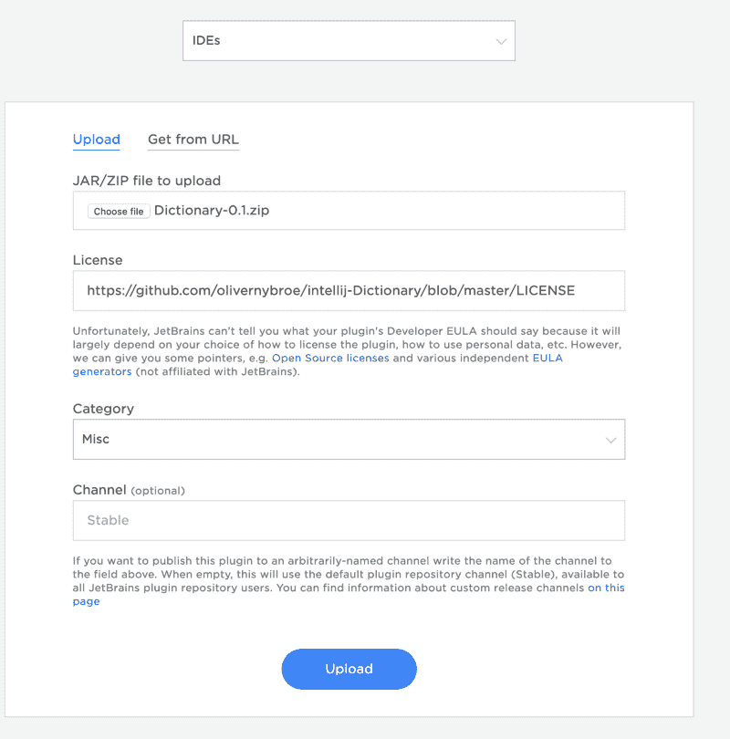

当您提交表单时，您现在可以在插件库中看到您的插件。但是，在 IntelliJ 批准之前，其他用户不能访问它。批准你的插件通常需要 2-3 天。

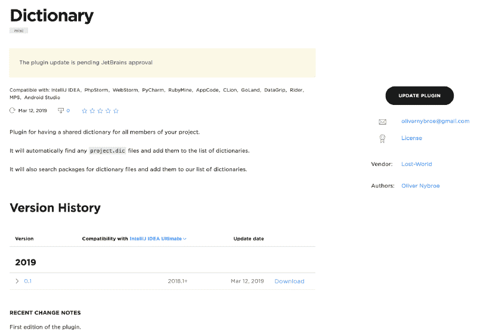

#### 通过 Gradle 更新你的插件

创建插件后，我们可以通过编程来更新它。为此，最佳做法是创建一个令牌。打开 jetbrains hub，进入[认证标签](https://hub.jetbrains.com/users/me?tab=authentification)。从这里按下`New token...`并添加范围`Plugin Repository`。

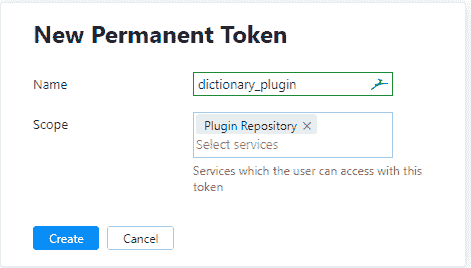

当按下创建键时，你会得到一个令牌。创建一个名为`gradle.properties`的文件，并在键`intellijPublishToken`下添加令牌(记住 git 忽略这个文件)。

在我们的`build.gradle`文件中，我们简单地添加了以下内容:

```
publishPlugin {    token intellijPublishToken}
```

我们现在可以运行 gradle 任务`publishPlugin`来发布我们的新版本。所有版本号必须是唯一的，否则将无法更新。创建更新后，您必须再次等待 2-3 天，让他们批准更新。

经过几天的等待，我们的插件现在已经被批准，现在可以在插件市场通过搜索字典找到了！

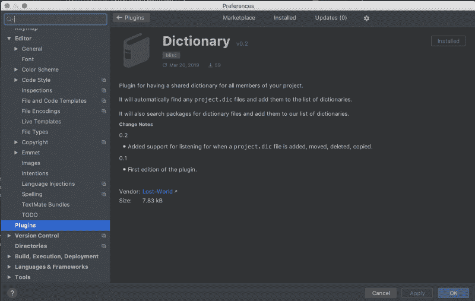

#### 结论

我希望这篇文章给了你更多的勇气开始开发你自己的插件。我在开发它的时候遇到的最大的问题之一是找到要使用的类。IntelliJ 有一个[广泛的指南](https://www.jetbrains.org/intellij/sdk/docs/welcome.html),我建议你从头到尾读一遍，但是很多课程在里面没有提到。如果你陷入困境，他们有一个 [Gitter chat](https://gitter.im/IntelliJ-Plugin-Developers/Lobby) 真的很有帮助，还有来自 IntelliJ 的人在那里帮助你。

这个项目的源代码可以在 [Github](https://github.com/olivernybroe/intellij-Dictionary) 上找到，我们创建的插件在 [JetBrains 市场](https://plugins.jetbrains.com/plugin/12089-dictionary)上。