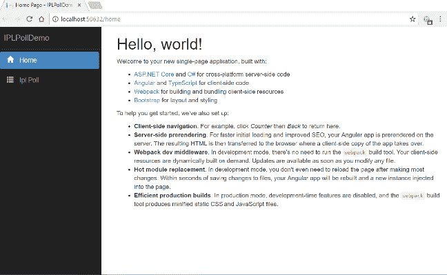
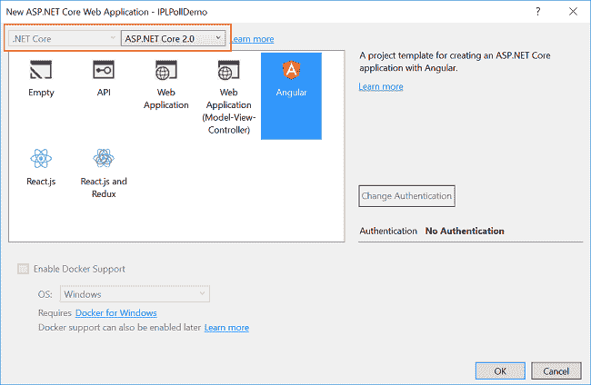
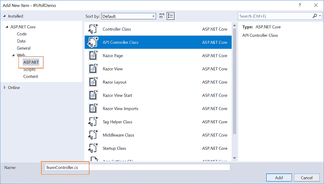
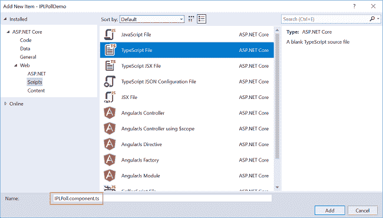
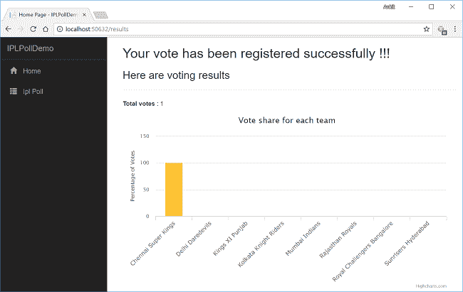

# 如何用 ASP.NET 核心、Angular 5 和 Highcharts 创建在线投票

> 原文：<https://www.freecodecamp.org/news/how-to-create-an-online-poll-with-asp-net-core-angular-5-and-highcharts-85ff7fecbaf1/>

在本文中，我们将使用 ASP.NET 核心、Angular 5 和实体框架核心创建一个在线投票应用程序。由于这是印度板球联赛在印度的赛季，我们将创建一个在线民意调查“谁将赢得 IPL 2018？”投票结果将显示为使用 Highcharts 创建的柱形图。

我们将使用 Visual Studio 2017 和 SQL Server 2014。

看一看最终的应用程序。



### 先决条件

*   安装。NET Core 2.0.0 以上 SDK 从[这里](https://www.microsoft.com/net/core#windowscmd)。
*   从[这里](https://www.visualstudio.com/downloads/)安装最新版本的 Visual Studio 2017 社区版。
*   从[这里](https://nodejs.org/en/download/)下载并安装 Node.js 的最新版本。
*   SQL Server 2008 或以上版本。

### 源代码

在继续之前，我建议您从 [GitHub](https://github.com/AnkitSharma-007/ASPCore.Angular.HighCharts) 获取源代码。

### 创建表

我们将把团队数据存储在 **IplTeams** 表中。执行以下命令来创建表。

```
CREATE TABLE IplTeams   (  TeamId INTEGER IDENTITY(1,1) PRIMARY KEY,  TeamName VARCHAR(30) NOT NULL,  VoteCount INTEGER NOT NULL  )
```

现在，我们将输入团队名称，并将投票计数初始化为零。执行以下 insert 语句。

```
INSERT INTO IplTeams VALUES ('Chennai Super Kings',0)  INSERT INTO IplTeams VALUES ('Delhi Daredevils',0)  INSERT INTO IplTeams VALUES ('Kings XI Punjab',0)  INSERT INTO IplTeams VALUES ('Kolkata Knight Riders',0)  INSERT INTO IplTeams VALUES ('Mumbai Indians',0)  INSERT INTO IplTeams VALUES ('Rajasthan Royals',0)  INSERT INTO IplTeams VALUES ('Royal Challengers Bangalore',0)  INSERT INTO IplTeams VALUES ('Sunrisers Hyderabad',0)
```

### 创建 MVC web 应用程序

打开 Visual Studio 并选择文件>>新建>>项目。选择项目后，将会打开一个“新项目”对话框。选择。NET Core 内的 Visual C#菜单从左侧面板。

然后，选择“ASP。NET Core Web Application”从可用的项目类型。将项目名称设为 **IPLPollDemo** 并按 OK。


单击 OK 后，将打开一个新对话框，要求您选择项目模板。您将在模板窗口的左上角看到两个下拉菜单。选择”。NET Core”和“ASP。NET Core 2.0”。然后，选择“角度”模板并按确定。



现在我们的项目已经创建好了。

因为我们在应用程序中使用了 Highcharts，所以我们需要为它安装软件包。打开 **package.json** 文件，将以下代码放入其中:

```
{    "name": "IPLPollDemo",    "private": true,    "version": "0.0.0",    "scripts": {      "test": "karma start ClientApp/test/karma.conf.js"    },    "devDependencies": {      "@angular/animations": "5.2.10",      "@angular/common": "5.2.10",      "@angular/compiler": "5.2.10",      "@angular/compiler-cli": "5.2.10",      "@angular/core": "5.2.10",      "@angular/forms": "5.2.10",      "@angular/http": "5.2.10",      "@angular/platform-browser": "5.2.10",      "@angular/platform-browser-dynamic": "5.2.10",      "@angular/platform-server": "5.2.10",      "@angular/router": "5.2.10",      "@ngtools/webpack": "6.0.0-rc.10",      "@types/chai": "4.1.3",      "@types/highcharts": "^5.0.22",      "@types/jasmine": "2.8.6",      "@types/webpack-env": "1.13.6",      "angular2-router-loader": "0.3.5",      "angular2-template-loader": "0.6.2",      "aspnet-prerendering": "^3.0.1",      "aspnet-webpack": "^2.0.1",      "awesome-typescript-loader": "5.0.0",      "bootstrap": "4.1.1",      "chai": "4.1.2",      "css": "2.2.1",      "css-loader": "0.28.11",      "es6-shim": "0.35.3",      "event-source-polyfill": "0.0.12",      "expose-loader": "0.7.5",      "extract-text-webpack-plugin": "3.0.2",      "file-loader": "1.1.11",      "html-loader": "0.5.5",      "isomorphic-fetch": "2.2.1",      "jasmine-core": "3.1.0",      "jquery": "3.3.1",      "json-loader": "0.5.7",      "karma": "2.0.2",      "karma-chai": "0.1.0",      "karma-chrome-launcher": "2.2.0",      "karma-cli": "1.0.1",      "karma-jasmine": "1.1.1",      "karma-webpack": "3.0.0",      "preboot": "6.0.0-beta.3",      "raw-loader": "0.5.1",      "reflect-metadata": "0.1.12",      "rxjs": "^6.0.0",      "style-loader": "0.21.0",      "to-string-loader": "1.1.5",      "typescript": "2.8.3",      "url-loader": "1.0.1",      "webpack": "4.6.0",      "webpack-hot-middleware": "2.22.1",      "webpack-merge": "4.1.2",      "zone.js": "0.8.26"    },    "dependencies": {      "angular-highcharts": "^5.2.12",      "highcharts": "^6.1.0"    }  }
```

这里，我们在第 22、64 和 65 行添加了 Highcharts 依赖项。

**重要提示:**如果你的 **package.json** 文件中有 Angular 版本 4，那么复制上面的完整代码将你的 Angular 版本更新为 5。如果您已经在使用 angular 5，那么只需复制这些行来包含 Highcharts 依赖项。

现在，关闭 Visual Studio 实例，导航到包含 **package.json** 文件的项目文件夹，并打开命令提示符。执行“ **npm 安装***”*命令安装所有需要的依赖项。请参考下图:


命令成功执行后，在 Visual Studio 中打开您的项目。您将在解决方案资源管理器中看到文件夹结构，如下图所示。


在这里，我们有我们的**控制器**和**视图**文件夹。在本教程中，我们不会触及**视图**文件夹，因为我们将使用 Angular 来处理 UI。

**控制器**文件夹将包含我们的 Web API 控制器。我们对应用程序客户端所在的 ClientApp 文件夹感兴趣。

在 **ClientApp/app/components** 文件夹中，我们已经创建了一些组件，这些组件是默认情况下与 VS 2017 中的 Angular 模板一起提供的。这些组件不会影响我们的应用程序，但是为了本教程，我们将从**client app/app/components***中删除 **fetchdata** 和 **counter** 文件夹。*

### 将模型搭建到应用程序

我们使用实体框架核心数据库的第一种方法来创建我们的模型。导航到工具>>获取软件包管理器>>软件包管理器控制台。

我们必须为我们的目标数据库提供者安装这个包，在这个例子中是 SQL Server。现在，运行以下命令:

```
Install-Package Microsoft.EntityFrameworkCore.SqlServer
```

因为我们使用实体框架工具从现有的数据库中创建一个模型，所以我们也将安装工具包。运行以下命令:

```
Install-Package Microsoft.EntityFrameworkCore.Tools
```

在您安装了这两个包之后，我们将使用以下命令从数据库表中构建我们的模型:

```
Scaffold-DbContext "Your connection string here" Microsoft.EntityFrameworkCore.SqlServer -OutputDir Models -Tables IplTeams
```

**注意**:不要忘记输入你自己的连接字符串(在" ")里面。

该命令成功执行后，您会看到一个 Models 文件夹被创建，其中包含两个类文件:**mytestdbcontext . cs***和 **IplTeams.cs** 。我们已经使用 EF 核心数据库的第一种方法成功地创建了我们的模型。*

现在，我们将再创建一个类文件来处理与数据库相关的操作。

右击**模型**文件夹，选择添加> >类。将你的**类命名为 TeamDataAccessLa***y*er . cs 并点击 **k t** 他添加按钮。此时，Models 文件夹将具有以下结构。


打开**teamdataaccesslayer . cs***，放入以下代码处理数据库操作:*

```
*`using Microsoft.EntityFrameworkCore;  using System;  using System.Collections.Generic;  using System.Linq;  using System.Threading.Tasks;    namespace IPLPollDemo.Models  {      public class TeamDataAccessLayer      {          myTestDBContext db = new myTestDBContext();            //To get the list of all teams from database          public IEnumerable<IplTeams> GetAllTeams()          {              try              {                  return db.IplTeams.ToList();              }              catch              {                  throw;              }          }            //To update the vote count of a team by one          public int RecordVote(IplTeams iplTeam)          {              try              {                    db.Database.ExecuteSqlCommand("update IplTeams set VoteCount = VoteCount + 1 where TeamID = {0}", parameters: iplTeam.TeamId);                    return 1;              }              catch              {                  throw;              }          }            //To get the total votes count           public int GetTotalVoteCount()          {              try              {                  return db.IplTeams.Sum(t => t.VoteCount);              }              catch              {                  throw;              }          }      }  }`*
```

*在这个类中，我们定义了三个方法。*

1.  *GetAllTeams —从数据库中获取所有八个团队的列表。*
2.  *RecordVote —在用户提交投票后更新每个团队的投票数。*
3.  *GetTotalVoteCount —获得所有团队的投票总数。*

*现在我们将创建我们的 web API 控制器。*

### *向应用程序添加 web API 控制器*

*右击**控制器**文件夹，选择添加> >新项目。*

*将会打开“添加新项目”对话框。从左侧面板中选择**ASP.NET**，然后从模板面板中选择“Web API 控制器类”并将其命名为 **TeamController.cs** 。单击添加。*

**

*这将创建我们的 Web API **TeamController** 类。我们将把所有的业务逻辑放在这个控制器中。我们将调用**TeamDataAccessLayer***的方法来获取数据并将数据传递给 Angular 前端。**

**打开**team controller . cs***文件，将以下代码放入其中。***

```
***`using System;  using System.Collections.Generic;  using System.Linq;  using System.Threading.Tasks;  using IPLPollDemo.Models;  using Microsoft.AspNetCore.Mvc;    namespace IPLPollDemo.Controllers  {      [Route("api/Team")]      public class TeamController : Controller      {          TeamDataAccessLayer objTeam = new TeamDataAccessLayer();            [HttpGet]          [Route("GetTeamList")]          public IEnumerable<IplTeams> GetTeamList()          {              return objTeam.GetAllTeams();          }            [HttpGet]          [Route("TotalVotes")]          public int TotalVotes()          {              return objTeam.GetTotalVoteCount();          }            [HttpPut]          [Route("UpdateVoteCount")]          public int UpdateVoteCount([FromBody] IplTeams team)          {              return objTeam.RecordVote(team);          }      }  }`***
```

### ***创建角度服务***

***我们将创建一个 Angular 服务，将 Web API 响应转换为 JSON，并将其传递给我们的组件。右击 **ClientApp/app** 文件夹，然后添加> >新文件夹，并将 **er 文件夹命名为 Se** *r* 老虎钳。***

**右键单击服务文件夹并选择添加>>新项目。将会打开“添加新项目”对话框。从左侧面板中选择脚本，然后从模板面板中选择“类型脚本”。na**me it teamservice . servi**ce . ts 并点击添加。**

****

**打开 **teamservice.service.ts** 文件，将以下代码放入其中。**

```
**`import { Injectable, Inject } from '@angular/core';  import { Http, Response } from '@angular/http';  import { Observable } from 'rxjs/Observable';  import { Router } from '@angular/router';  import 'rxjs/add/operator/map';  import 'rxjs/add/operator/catch';  import 'rxjs/add/observable/throw';      @Injectable()  export class TeamService {      myAppUrl: string = "";        constructor(private _http: Http, @Inject('BASE_URL') baseUrl: string) {          this.myAppUrl = baseUrl;      }        getTeams() {          return this._http.get(this.myAppUrl + 'api/Team/GetTeamList')              .map((response: Response) => response.json())              .catch(this.errorHandler);      }        getTotalVotes() {          return this._http.get(this.myAppUrl + 'api/Team/TotalVotes')              .map((response: Response) => response.json())              .catch(this.errorHandler);      }        saveVotes(team) {          return this._http.put(this.myAppUrl + 'api/Team/UpdateVoteCount', team)              .map((response: Response) => response.json())              .catch(this.errorHandler);      }        errorHandler(error: Response) {          console.log(error);          return Observable.throw(error);      }  }`**
```

**在构造函数中，我们注入了 HTTP 服务和应用程序的基本 URL 来支持 web API 调用。之后，我们定义了三个函数来调用我们的 Web API，并将结果转换为 JSON 格式。我们将从组件中调用这些函数。**

**此时，您可能会在**empservice . service . ts***文件中得到错误“参数‘employee’隐式具有‘any’类型”。如果您遇到这个问题，那么在 **tsconfig.jsonfile 中添加下面一行:*****

***“noImplicitAny”:假***

******

***现在，我们将继续创建我们的组件。***

### ***创建角度组件***

***我们将在应用程序中添加两个角度组件:***

1.  ***投票组件—显示团队名称和相应的按钮，以便为团队投票。***
2.  ***结果组件—显示投票结果。***

***右键点击**client app/app/components***文件夹，选择添加> >新文件夹，并命名为 f **olde** *r* Poll。****

**右键点击**投票** 文件夹，选择> >添加新项目。将会打开“添加新项目”对话框。S **从左侧面板中选择 S** 脚本，然后从模板面板中选择“类型脚本 t 文件”。na**me it iplpoll . compone**nt . ts 并点击添加。这将在 id**e th**e*e*Poll 文件夹中添加一个类型脚本文件。**

****

**右键点击**投票** 文件夹，选择> >添加新项目。将会打开“添加新项目”对话框。美国**选举 ASP。从左侧面板中选择 NE** T Core，然后从模板面板中选择“HTML 页面”,然后 na**me it iplpoll . componen**T. HTML，点击添加。这将在 id**e th**e*e*Poll 文件夹中添加一个 HTML 文件。**

****

**同样，在**client app/app/components***文件夹内创建一个 **Results** 文件夹，并在其中添加一个**poll result . component . ts**typescript 文件和**PollResult.component.html**HTML 文件。***

***现在，我们的 **ClientApp/app** 将如下图所示。***

****

**打开**iplpoll . component . ts***文件，将以下代码放入其中。***

```
***`import { Component, OnInit } from '@angular/core';  import { Http, Headers } from '@angular/http';  import { PercentPipe } from '@angular/common';  import { Router, ActivatedRoute } from '@angular/router';  import { TeamService } from '../../services/teamservice.service'    @Component({      templateUrl: './IPLPoll.component.html',  })    export class IPLPoll {        public teamList: TeamData[];        constructor(public http: Http, private _teamService: TeamService, private _router: Router) {          this.getTeamList();      }        getTeamList() {          this._teamService.getTeams().subscribe(              data => this.teamList = data          )      }        save(team) {            this._teamService.saveVotes(team)              .subscribe((data) => {                  this._router.navigate(['/results']);              })      }  }  export class TeamData {      teamId: number;      teamName: string;      voteCount: number;      voteShare: number;  }`***
```

***我们创建了一个类 **TeamData** 来保存每个团队的详细信息，例如 teamId、teamName、voteCount 和 voteShare。在我们的组件类 IPLPoll 中，我们创建了一个类型为**团队数据**的数组变量**团队列表**。***

*****getTeamList()** 方法将调用我们的服务 TeamService 的 getTeams 函数，从数据库中获取球队列表，并将其分配给 TeamList 变量。在构造函数内部调用 getTeamList 方法，以便在页面加载时显示团队数据。***

***当用户为他们喜欢的球队投票时，save 方法将被调用。这将调用我们服务的 **saveVotes** 函数来更新特定团队的投票数。然后，用户将被重定向到 PollResults 组件以查看投票结果。***

***打开**IPLPoll.component.html***文件，将下面的代码放入其中。****

```
***`<h1>Who Will Win IPL 2018 ?</h1>    <h3>Vote for your favourite team !!! </h3>  <hr />    <p *ngIf="!teamList"><em>Loading...</em></p>    <table class='table' *ngIf="teamList">      <thead>          <tr>              <th>Team Name</th>          </tr>      </thead>      <tbody>          <tr *ngFor="let team of teamList">              <td>{{ team.teamName }}</td>              <td>                  <button (click)="save(team)" class="btn btn-primary"> Vote <i class="glyphicon glyphicon-thumbs-up"></i></button>              </td>          </tr>      </tbody>  </table>`***
```

***这个 HTML 页面将显示团队列表以及每个团队旁边的**投票**按钮。当用户单击任何投票按钮时，它将更新投票计数并将用户重定向到 PollResults 页面。***

***现在打开**poll results . component . ts***文件，将以下代码放入其中。****

```
***`import { Component, OnInit } from '@angular/core';  import { Http, Headers } from '@angular/http';  import { PercentPipe } from '@angular/common';  import { Router, ActivatedRoute } from '@angular/router';  import { TeamData } from '../poll/IPLPoll.component';  import { TeamService } from '../../services/teamservice.service';    import { Observable } from 'rxjs/Observable';  import 'rxjs/add/observable/zip';    import { Chart } from 'angular-highcharts';    @Component({      templateUrl: './PollResult.component.html',  })    export class PollResult {        public chart: any;      public totalVotes: number;      public resultList: TeamData[];        constructor(public http: Http, private _teamService: TeamService) {            Observable.zip(this._teamService.getTotalVotes(), this._teamService.getTeams())              .subscribe(([totalVoteCount, teamListData]) => {                  this.totalVotes = totalVoteCount;                  this.resultList = teamListData;                    for (let i = 0; i < teamListData.length; i++) {                      teamListData[i].voteShare = (((teamListData[i].voteCount) / this.totalVotes) * 100);                  }                    this.createCharts();              });      }        createCharts() {          this.chart = new Chart({              chart: {                  type: 'column'              },              title: {                  text: 'Vote share for each team'              },              xAxis: {                  type: 'category',                  labels: {                      rotation: -45,                      style: {                          fontSize: '13px',                          fontFamily: 'Verdana, sans-serif'                      }                  }              },              yAxis: {                  min: 0,                  title: {                      text: 'Percentage of Votes'                  }              },              legend: {                  enabled: false              },              tooltip: {                  pointFormat: 'Vote: <b>{point.y:.2f} %</b>'              },                series: [{                  type: 'column',                  data: [                      { name: this.resultList[0].teamName, y: this.resultList[0].voteShare, color: 'rgba(253, 185, 19, 0.85)' },                      { name: this.resultList[1].teamName, y: this.resultList[1].voteShare, color: 'rgba(0, 76, 147, 0.85)' },                      { name: this.resultList[2].teamName, y: this.resultList[2].voteShare, color: 'rgba(170, 69, 69, 0.85)' },                      { name: this.resultList[3].teamName, y: this.resultList[3].voteShare, color: 'rgba(112, 69, 143, 0.85)' },                      { name: this.resultList[4].teamName, y: this.resultList[4].voteShare, color: 'rgba(0, 93, 160, 0.85)' },                      { name: this.resultList[5].teamName, y: this.resultList[5].voteShare, color: 'rgba(45, 77, 157, 0.85)' },                      { name: this.resultList[6].teamName, y: this.resultList[6].voteShare, color: 'rgba(0, 0, 0, 0.85)' },                      { name: this.resultList[7].teamName, y: this.resultList[7].voteShare, color: 'rgba(251, 100, 62, 0.85)' }                  ],              }]            });        }  }`***
```

***我们正在从数据库中获取更新的团队数据列表和所有团队的投票总数。然后，我们将计算每个团队的投票份额，并调用 **createCharts()** 方法为投票结果创建图表。***

***每个团队的投票份额百分比通过将每个团队获得的投票除以总投票数来计算。我们在构造函数中执行所有这些操作，以便在页面加载时显示结果。***

*****createCharts()** 方法将在 Highcharts 库的帮助下创建柱形图。投票百分比被选为 Y 轴，球队名称被选为 X 轴。为了让事情变得有趣，我们将每一列的颜色设置为相应的球队球衣颜色。***

***打开**PollResults.component.html***文件，将以下代码放入其中:****

```
***`<h2>Your vote has been registered successfully !!! </h2>    <h3>Here are voting results </h3>  <hr />    <p><b>Total votes </b> : {{totalVotes}}</p>    <div [chart]="chart"></div>`***
```

***这个 HTML 页面很简单。我们用柱状图展示投票结果。就在图表上方，我们还显示了投票总数。***

### ***为我们的应用程序定义路线和导航菜单***

***打开**/app/app . shared . module . ts**文件，将以下代码放入其中。***

```
***`import { NgModule } from '@angular/core';  import { CommonModule } from '@angular/common';  import { FormsModule } from '@angular/forms';  import { HttpModule } from '@angular/http';  import { RouterModule } from '@angular/router';  import { ChartModule } from 'angular-highcharts';    import { TeamService } from './services/teamservice.service'  import { AppComponent } from './components/app/app.component';  import { NavMenuComponent } from './components/navmenu/navmenu.component';  import { HomeComponent } from './components/home/home.component';  import { IPLPoll } from './components/Poll/IPLPoll.component';  import { PollResult } from './components/Results/PollResult.component';    @NgModule({      declarations: [          AppComponent,          NavMenuComponent,          HomeComponent,          IPLPoll,          PollResult      ],      imports: [          CommonModule,          HttpModule,          FormsModule,          ChartModule,          RouterModule.forRoot([              { path: '', redirectTo: 'home', pathMatch: 'full' },              { path: 'home', component: HomeComponent },              { path: 'poll', component: IPLPoll },              { path: 'results', component: PollResult },              { path: '**', redirectTo: 'home' }          ])      ],      providers: [TeamService]  })  export class AppModuleShared {  }`***
```

***这里，我们还导入了所有组件，并为我们的应用程序定义了如下路径:***

*   ***home —这将重定向到 **Home** 组件***
*   ***轮询—重定向到 **IPLPoll** 组件***
*   ***结果—重定向到**轮询结果**组件***

***最后，我们需要为我们的应用程序定义导航菜单。打开**/app/components/nav menu/nav menu . component . html**文件，将以下代码放入其中:***

```
***`<div class='main-nav'>      <div class='navbar navbar-inverse'>          <div class='navbar-header'>              <button type='button' class='navbar-toggle' data-toggle='collapse' data-target='.navbar-collapse'>                  <span class='sr-only'>Toggle navigation</span>                  <span class='icon-bar'></span>                  <span class='icon-bar'></span>                  <span class='icon-bar'></span>              </button>              <a class='navbar-brand' [routerLink]="['/home']">IPLPollDemo</a>          </div>          <div class='clearfix'></div>          <div class='navbar-collapse collapse'>              <ul class='nav navbar-nav'>                  <li [routerLinkActive]="['link-active']">                      <a [routerLink]="['/home']">                          <span class='glyphicon glyphicon-home'></span> Home                      </a>                  </li>                  <li [routerLinkActive]="['link-active']">                      <a [routerLink]="['/poll']">                          <span class='glyphicon glyphicon-th-list'></span> Ipl Poll                      </a>                  </li>              </ul>          </div>      </div>  </div>`***
```

***仅此而已。我们已经使用 Angular 5 和实体框架核心创建了 IPL Poll 应用程序。***

### ***执行演示***

***按 F5 启动应用程序。***

***将打开一个网页，如下图所示。您可以看到 URL 显示了我们主页组件的路径，左侧的导航菜单显示了 Ipl 投票页面的导航链接。***

******

***点击导航菜单中的 IPL 投票。它将重定向到显示所有球队名称的投票组件，旁边还有一个投票按钮。请注意，URL 中有“/Poll”字样。***

******

***点击投票按钮为你喜欢的球队投票。您将被重定向到以柱形图显示投票结果的结果页面。***

******

***因为这是第一次投票，所以显示一个团队为 100%，其他团队为 0%。在提交了所有团队的几个投票后，我们将得到如下所示的投票结果图表。***

******

### ***结论***

***在 Visual Studio 2017 和 SQL Server 2014 的帮助下，我们使用 ASP.NET 核心、Angular 5 和实体框架核心数据库优先方法创建了一个在线投票。我们还使用 Highcharts 创建了一个柱形图来显示投票结果。***

***从 [Github](https://github.com/AnkitSharma-007/ASPCore.Angular.HighCharts) 中获取源代码，然后到处玩。不要忘记在执行代码之前输入您自己的连接字符串。***

***你也可以在 [C#角](https://www.c-sharpcorner.com/article/asp-net-co-using-highcharts-with-angular-5/)找到这篇文章。***

***你可以在这里查看我关于 Angular 5 [的其他文章](http://ankitsharmablogs.com/category/angular-5/)***

### ***请参见***

*   ***[ASP.NET 核心—带有 React.js 的 CRUD 和实体框架核心](http://ankitsharmablogs.com/asp-net-core-crud-with-react-js-and-entity-framework-core/)***
*   ***[ASP.NET 核心—使用 Blazor 的 CRUD 和实体框架核心](http://ankitsharmablogs.com/asp-net-core-crud-using-blazor-and-entity-framework-core/)***
*   ***[ASP.NET 核心—使用 Angular 5 和实体框架核心的 CRUD】](http://ankitsharmablogs.com/asp-net-core-crud-using-angular-5-and-entity-framework-core/)***
*   ***[使用角度 5°和 ADO.NET 的 ASP.NET 堆芯的积垢操作](http://ankitsharmablogs.com/crud-operations-asp-net-core-using-angular-5-ado-net/)***
*   ***[使用 Visual Studio 代码开始使用 Angular 5](http://ankitsharmablogs.com/getting-started-with-angular-5-using-visual-studio-code/)***
*   ***[使用 Visual Studio 代码和 ADO.NET 的 ASP.NET 核心 MVC 的 CRUD 操作](http://ankitsharmablogs.com/crud-operation-with-asp-net-core-mvc-using-visual-studio-code-and-ado-net/)***

****最初发布于 2018 年 5 月 3 日[ankitsharmablogs.com](http://ankitsharmablogs.com/asp-net-core-using-highcharts-with-angular-5/)。****