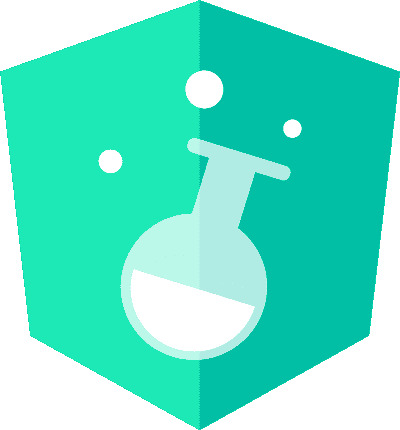
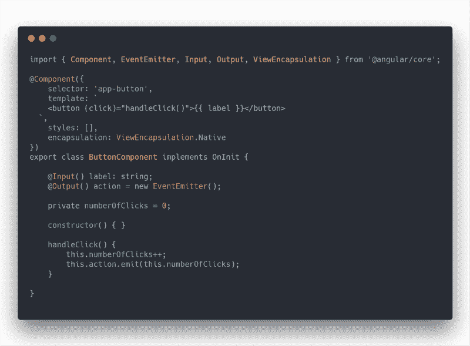
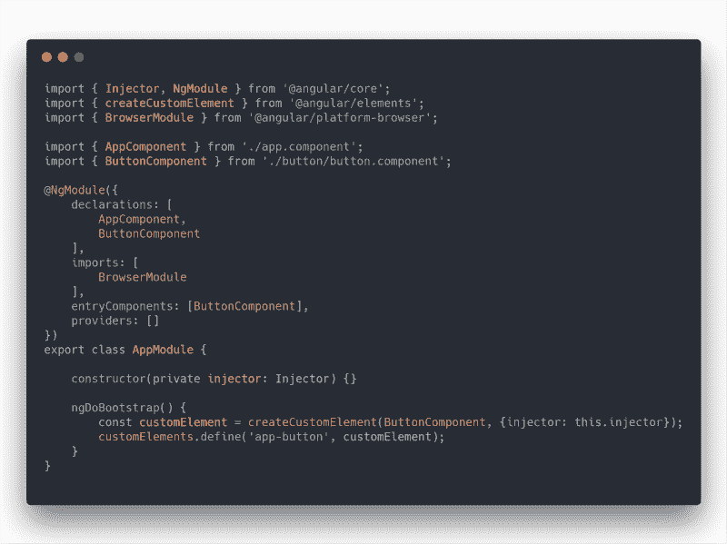
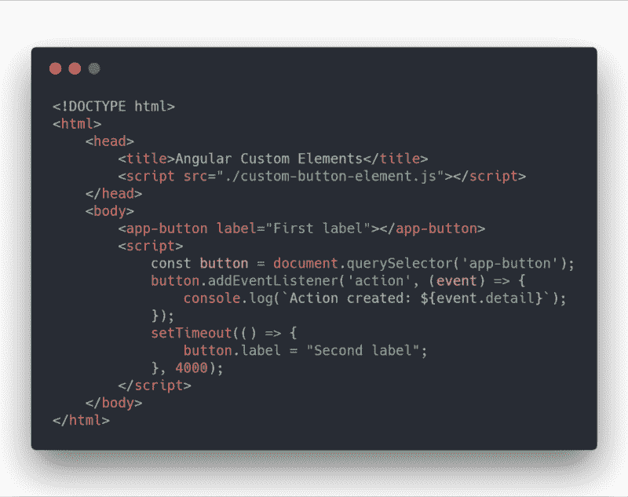

# 如何创建 Angular 6 自定义元素和 Web 组件

> 原文：<https://www.freecodecamp.org/news/how-to-create-angular-6-custom-elements-web-components-c88814dc6e0a/>

作者普拉蒂克·米什拉

# 如何创建 Angular 6 自定义元素和 Web 组件

#### 使用角度 CLI 创建角度元素的 6 个步骤



Angular 6 elements

角形元素是承载整个框架的缩小版本的角形组件。它们允许您以一种与框架无关的方式创建[定制元素](https://developers.google.com/web/fundamentals/web-components/customelements)(web 组件之一)。它们可以在简单的 web 项目中使用，但是具有 Angular 的强大功能。

在阅读了关于角度元素的官方文档后，我意识到它缺少结构化的实现部分。这就是我陈述开始行动的步骤的原因！

### 1.安装 Angular CLI 6 并创建新项目

```
npm i -g @angular/cli

ng new angular-custom-elements
```

由于 Angular 在 Angular 6 中引入了自定义元素的概念，我们必须安装 v6 或更高版本。您还可以添加`--style`标志来设置默认的样式扩展。

### 2.添加元素包

并非所有浏览器都完全实现了自定义元素。因此我们需要[多孔填充物](https://www.webcomponents.org/polyfills)来让它们工作。使用新的 CLI 命令`ng add`可以添加角度库和所需的多边形填充:

```
ng add @angular/elements
```

### 3.创建一个组件

在这篇文章的最后，让我们创建一个作为自定义元素的组件:

```
ng g component button --inline-style --inline-template -v Native
```

我们使用`ViewEncapsulation.Native`来防止组件的样式溢出并影响其他元素。这将在浏览器的 shadow DOM(v 0；对于 v1，我们使用`ViewEncapsulation.ShadowDOM`，将所有的样式、模板和组件类代码捆绑在一个文件中。

### 4.向组件添加属性

在做了一些更改后，我们的按钮组件看起来像:



根据官方文件:

> 创建 API 解析组件，寻找输入属性，并为定制元素定义相应的属性。
> 
> 它转换属性名，使之与定制元素兼容，定制元素不区分大小写。产生的属性名称使用短划线分隔的小写字母。例如，对于带有`@Input('myInputProp') inputProp`的组件，对应的自定义元素定义了一个属性“`my-input-prop”`”。

此外:

> 组件输出作为 HTML [定制事件](https://developer.mozilla.org/en-US/docs/Web/API/CustomEvent)被分派，定制事件的名称与输出名称相匹配。
> 
> 例如，对于一个带有`@Output() valueChanged = new EventEmitter()`的组件，对应的自定义元素会调度名为“valueChanged”的事件。发出的数据将存储在事件的`detail`属性中。如果您提供了别名，则使用该值。比如，`@Output('myClick') clicks = new EventEmitter<string&`gt；();导致名为“myClick”的调度事件。

### 5.更新 NgModule



以下是`app.module.ts`中需要遵循的主要步骤:

1.  删除设置为`AppComponent`的默认`bootstrap`数组
2.  由于我们的`ButtonComponent`不是任何其他组件的一部分，也不是 Angular 应用程序的根，我们需要告诉 Angular 专门编译它。为此，我们将其放在`entryComponents`列表中。否则有角度的树摇动将从产品包中丢弃该组件。
3.  添加`ngDoBootstrap()`告诉 Angular 使用这个模块进行引导。
4.  Angular 提供了`[createCustomElement](https://angular.io/api/elements/createCustomElement)()`函数，用于将一个角度组件及其依赖项转换成一个定制元素。`createCustomElement()`函数期望获得两个参数:

*   首先，应该用于创建元素的角度分量。
*   第二，一个配置对象。该对象需要包含设置为当前注射器实例的注射器属性。

5.下一步是在浏览器中注册新创建的定制元素。这是通过调用`customElements.define()`来完成的。请注意，这不是有角的。 ***customElements*** 只读属性属于*窗口*接口。它返回对***CustomElementRegistry***对象的引用。该对象可用于注册新的自定义元素。它还可以获取以前在浏览器中注册的自定义元素的信息。

`customElements.define()`方法需要两个参数:

*   第一个参数的类型为 string，包含元素的名称。传递字符串' *app-button'* 意味着>上的自定义元素 *< app-butt* 将被注册并可以在 HTML 代码中使用。
*   第二个参数是之前创建的自定义元素。

6.现在将`tsconfig.json`中的`target`值从`es5`替换为`es2015`，因为在原生支持定制元素的浏览器中，规范要求开发者使用 ES2015 类来定义定制元素。

### 6.构建并运行

为了构建，我们将使用标准的`ng build`命令。但是由于它输出四个文件(`runtime.js`、 `scripts.js`、`polyfills.js`和`main.js`)，并且我们希望将我们的组件作为单个 js 文件分发，我们需要关闭散列文件名。让我们修改`package.json`中的`scripts`并添加`package`条目:

```
"scripts": {
    …,

"build": "ng build --prod --output-hashing=none",

// For Windows:
"package": "jscat ./dist/angular-custom-elements/runtime.js ./dist/angular-custom-elements/polyfills.js ./dist/angular-custom-elements/scripts.js ./dist/angular-custom-elements/main.js > custom-button-element.js",

// For Mac or Linux:
"package": "cat ./dist/angular-custom-elements/runtime.js ./dist/angular-custom-elements/polyfills.js ./dist/angular-custom-elements/scripts.js ./dist/angular-custom-elements/main.js > custom-button-element.js",

…,

}
```

由于 Windows 操作系统没有`cat`命令运行`npm i jscat`。

全部保存并最终运行:

```
npm run build && npm run package
```

该命令生成的`custom-button-element.js`可以包含在 HTML 页面的`<script>`中，以查看我们的定制元素的工作情况。

这里有一个例子:



Include custom-button-element.js in any index.html

### 摘要

总之，我们已经:

*   为实现添加了重要的库
*   在浏览器的 CustomElementRegistry 中注册了组件
*   将构建工件合并到一个文件中

完整的源代码可以在[这里](https://github.com/patrick1729/angular-elements)找到。

你学到新东西了吗？如果有请鼓掌？按钮 below️所以更多的人可以看到这一点。