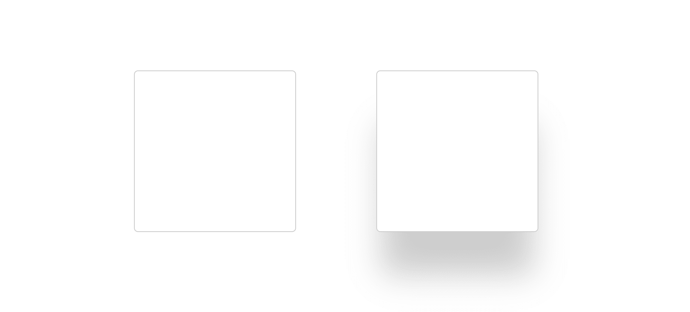
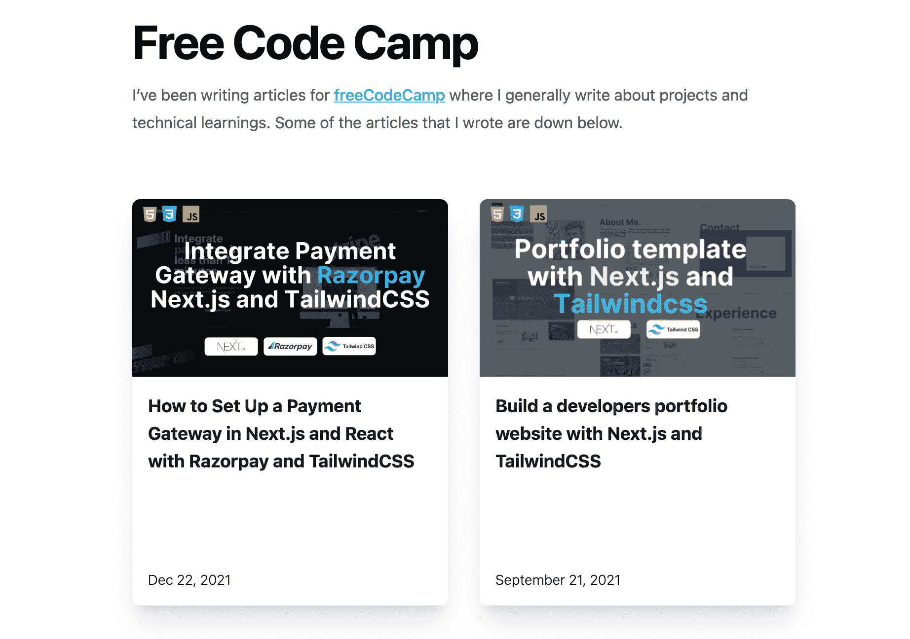

# 如何在 HTML 和 CSS 中创建漂亮的方框阴影

> 原文：<https://www.freecodecamp.org/news/how-to-create-beautiful-box-shadows-in-html-and-css/>

每当你用 HTML 设计卡片时，方框阴影在使卡片突出方面起着至关重要的作用。

无论是价格页卡，甚至是电子商务产品列表卡，阴影都可以创造或破坏卡片需要传达的外观和整个信息。

今天我们就来了解一下如何做出漂亮的盒影，如何让盒影脱颖而出。

## **理解方框阴影语法**

下面是方框阴影的基本语法:

```
box-shadow: 1px 2px 3px 4px rgba(20,20,20,0.4);
```

在上面的代码片段中有 5 个重要的部分。让我们来理解它们的含义:

1.  水平偏移:`1px`上例中。这表示阴影在水平方向离卡片有多远。正表示向右，负表示向左。
2.  垂直偏移:上例中的`2px`。这表示阴影在垂直方向上离卡片有多远。正的意思是下，负的意思是上。
3.  模糊:`3px`上例中。这表示阴影看起来有多模糊。半径越大意味着越模糊。
4.  传播:`4px`上例中。这表明阴影将向各个方向扩散多远。
5.  上例中的颜色:`rgba(20,20,20,0.4)`。这决定了阴影的颜色。如果没有提供，将使用默认的文本颜色。颜色值可以是十六进制、RGB 或 HSL。

让我们来看看上面的代码:

[https://codepen.io/manuarora700/embed/preview/BawrqZZ?default-tabs=css%2Cresult&height=300&host=https%3A%2F%2Fcodepen.io&slug-hash=BawrqZZ](https://codepen.io/manuarora700/embed/preview/BawrqZZ?default-tabs=css%2Cresult&height=300&host=https%3A%2F%2Fcodepen.io&slug-hash=BawrqZZ)

## 方框阴影如何影响卡片

考虑这里的两个例子:



第一个示例没有方框阴影，而第二个示例有方框阴影。第二个出现在屏幕上(这使得它与第一个相比有点突出。)

所以，如果你需要你的卡片脱颖而出，方框阴影可以帮你让它们真正流行起来。

假设您正在构建一个电子商务应用程序，您希望您的产品卡能够脱颖而出。盒子阴影可以帮助你实现这一点，并让你的顾客注意到你的产品。

即使你的 web 应用程序要求你的卡片是微妙的，你也可以总是使用微妙的方框阴影来给卡片一个更愉悦的美感。

## **如何使用多层盒子阴影**

你可以在你的卡片上使用一层以上的阴影，而且你会经常这样做。

创建多层方框阴影的语法如下所示:

```
box-shadow: rgba(240, 46, 170, 0.4) -5px 5px, rgba(240, 46, 170, 0.3) -10px 10px, rgba(240, 46, 170, 0.2) -15px 15px, rgba(240, 46, 170, 0.1) -20px 20px, rgba(240, 46, 170, 0.05) -25px 25px;
```

每个单独的方框阴影由逗号(`,`)分隔。你可以随意添加，但我建议你最多添加 5 个。

上面的例子看起来是这样的:

[https://codepen.io/manuarora700/embed/preview/WNZzaJJ?default-tabs=css%2Cresult&height=300&host=https%3A%2F%2Fcodepen.io&slug-hash=WNZzaJJ](https://codepen.io/manuarora700/embed/preview/WNZzaJJ?default-tabs=css%2Cresult&height=300&host=https%3A%2F%2Fcodepen.io&slug-hash=WNZzaJJ)

注意卡片下面的 5 层，它们的不透明度按降序排列。如果做得正确，它可以给你的卡片带来完全不同的外观。

这张特定的卡片可能看起来并不完美，因为它是为了解释某个概念而设计的。但是让我们通过给阴影添加颜色来使它变得更有趣。

还记得我们讨论过使用`rgba()`语法添加颜色吗？让我们把它用在这里。

[https://codepen.io/manuarora700/embed/preview/jOGzeev?default-tabs=css%2Cresult&height=300&host=https%3A%2F%2Fcodepen.io&slug-hash=jOGzeev](https://codepen.io/manuarora700/embed/preview/jOGzeev?default-tabs=css%2Cresult&height=300&host=https%3A%2F%2Fcodepen.io&slug-hash=jOGzeev)

这里，我没有使用值`rgba(0,0,0,0,2)`来表示颜色(在这个代码片段中是黑色)，而是用不透明度递减的`rgba(240, 46, 170, 0.2)`来代替。这是添加颜色的一种方式——极限是你的想象力。

## **如何使用彩色方框阴影**

尽管颜色可以让你的卡片在视觉上更加突出，但它们并不总是最好的选择。有时，一个普通的灰色阴影在白色背景下会创造奇迹。但是这完全取决于你网站的主题。

考虑一个简单的博客应用程序，它有许多空白和一般的文本内容。如果你有一张在网站上显示博客的卡片，最好的方法是在卡片上添加一个简单而微妙的方框阴影，让它们看起来很流行。

举个例子:考虑下面这些直接取自我的[网站](https://manuarora.in)的卡片，在那里我列出了迄今为止我为 freeCodeCamp 写的所有博客。



我的网站很简单，只做一件事——展示我的个性和我的工作。如果我继续给上面的盒子添加一个红色的盒子阴影，它可能看起来不太好。但是，如果我用灰色阴影加上一些模糊，它只是帮助它突出，而不是太在你的脸上。

那么如何正确使用它们呢？让我们看一个例子。

[https://codepen.io/manuarora700/embed/preview/jOGzeev?default-tabs=css%2Cresult&height=300&host=https%3A%2F%2Fcodepen.io&slug-hash=jOGzeev](https://codepen.io/manuarora700/embed/preview/jOGzeev?default-tabs=css%2Cresult&height=300&host=https%3A%2F%2Fcodepen.io&slug-hash=jOGzeev)

在上面的例子中:

*   背景颜色:`rgb(251 113 133);`
*   方框阴影:`box-shadow: rgba(254, 205, 211, 0.1) 0px 4px 16px, rgba(254,205,211,0.1) 0px 8px 24px, rgba(254,205,211, 0.1) 0px 16px 56px;`

框阴影是我们在上面的例子中使用的背景色的一个较浅的阴影。并且有三层阴影。

当我们有一个背景颜色，它通常是一个好主意，有一个正在使用的背景颜色的浅色阴影。这看起来比有一个简单的白色或黑色阴影更好。

## **如何使用内部阴影**

上面所有的例子都覆盖了我们试图设计的卡片“外面”的阴影。但是如果我们想在内部有阴影呢？

如果您想在保留容器内有方框阴影，您可以使用`inset`方框阴影。

考虑下面的例子:

[https://codepen.io/manuarora700/embed/preview/ZEXxqgd?default-tabs=css%2Cresult&height=300&host=https%3A%2F%2Fcodepen.io&slug-hash=ZEXxqgd](https://codepen.io/manuarora700/embed/preview/ZEXxqgd?default-tabs=css%2Cresult&height=300&host=https%3A%2F%2Fcodepen.io&slug-hash=ZEXxqgd)

阴影的代码是:

```
box-shadow: rgb(204, 219, 232) 3px 3px 6px 0px inset, rgba(255, 255, 255, 0.5) -3px -3px 6px 1px inset;
```

关键字`inset`用于指定我们想要使用阴影`inwards`而不是默认行为`outwards`。

您可以在 web 应用程序中巧妙地使用向内的方框阴影来显示一些重要的信息。比如威尔斯，或者你想表现出来的某种警觉。在这种情况下，该项目看起来像是嵌入在网页中。

## **方框阴影示例**

创建盒子阴影是困难的，不是因为它很难，而是因为它需要一些设计知识来获得最佳效果。

我最近创建了一个应用程序，它是一个漂亮的盒子阴影的精选列表，可以帮助你的卡片脱颖而出。目前，该项目在 ProductHunt 上被评为 [#2，并帮助许多开发人员使他们的卡片变得漂亮而有效。](https://www.producthunt.com/posts/tailwind-box-shadows)

你可以在这里找到项目:[顺风盒阴影](https://manuarora.in/boxshadows)。

目前，您可以在 Vanilla CSS 和 Tailwind JIT 代码中找到方框阴影。点击复制粘贴就大功告成了。还有一个辅助工具，可以将 CSS 盒阴影转换为顺风盒阴影。

## **结论**

我已经在我几乎所有的[项目](https://manuarora.in/projects)中使用了框阴影。这是我遇到的最被低估的事情。一个好的盒子阴影布局确实可以改善你的应用程序的视觉效果。

如果你喜欢这篇文章，试着在你的应用中实现这些阴影，让我知道它给你的应用带来了什么变化。

如果您有任何反馈，您可以通过我的 [Twitter](https://twitter.com/mannupaaji) 和/或我的[个人网站](https://manuarora.in)联系我。