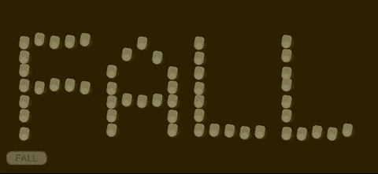
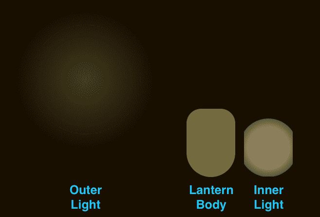
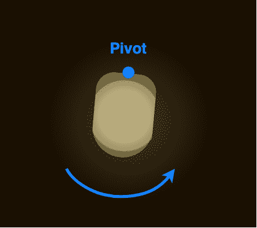
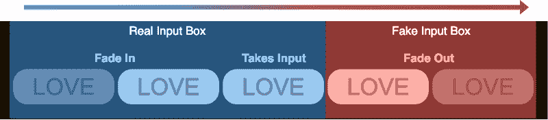
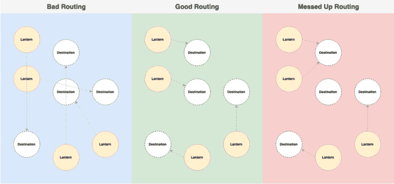
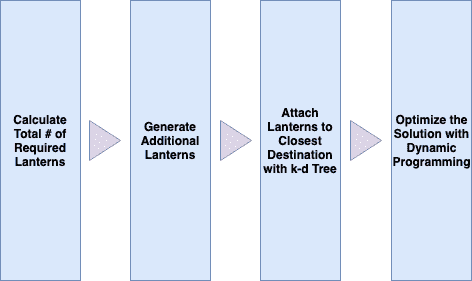
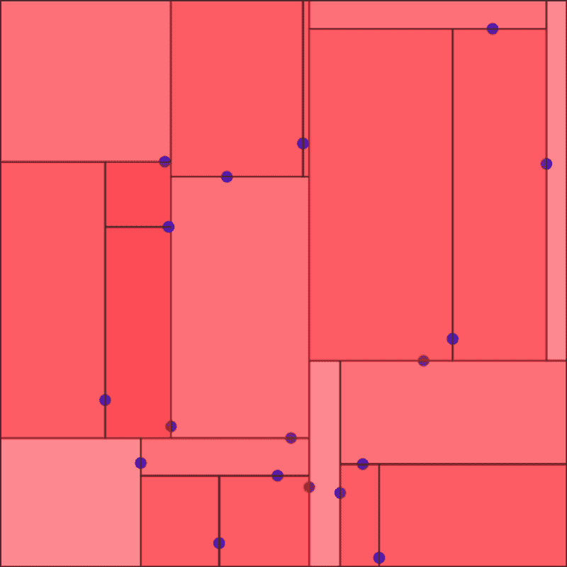
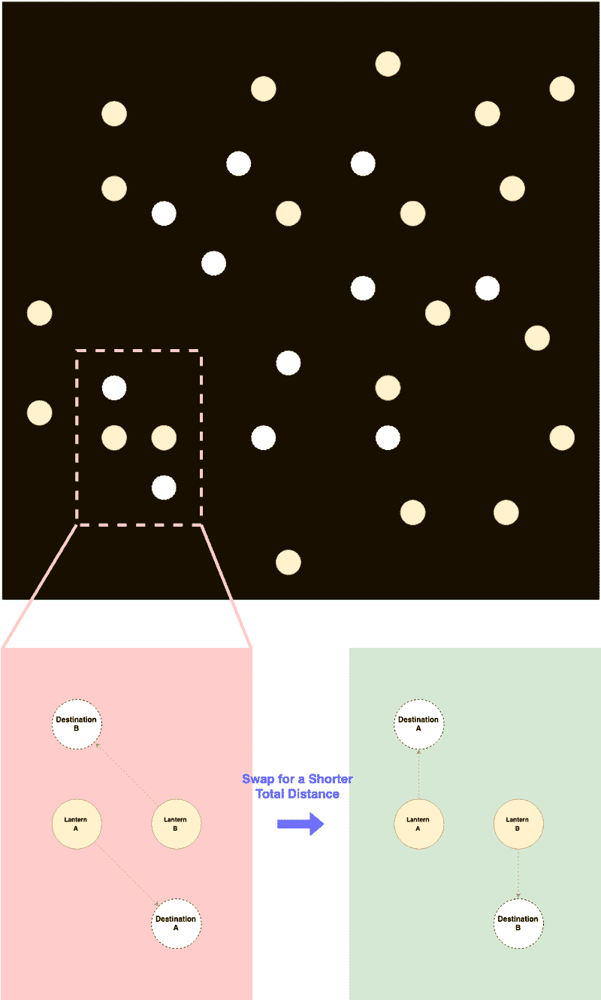
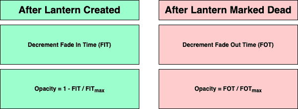
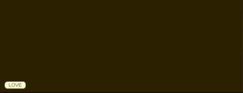

# 如何创造美丽的灯笼，排列成文字

> 原文：<https://www.freecodecamp.org/news/how-to-create-beautiful-lanterns-that-arrange-themselves-into-words-da01ae98238/>

在本教程中，我们将介绍如何创建一组节日灯笼，将它们排列成你选择的单词。在线演示可在[这里](https://shenhuang.github.io/demo_projects/lanterndemo.html)找到。

这个教程比我以前的教程更高级一点。我想你可以自己解决很多基本的问题。我也为完全的初学者做了一些教程，我在最后附上了链接。



Festival Lanterns Arrange into the Words You Like

### 介绍

由于本教程有点长，我们将过一遍你将要阅读的内容。首先，我们将通过如何用 CSS 设计一个呼吸灯。之后，我们将学习如何通过 JavaScript 动态创建灯笼。然后我们将学习如何创建输入框和如何破译输入文本。在那之后，我们将复习一些适当排列灯笼的算法。最后，我们将学习如何制作灯笼的动画。

说够了，我们开始吧！开始之前，你需要一个网站。如果您不想使用自己的代码，可以复制下面的代码，并将其保存为。 **html** 文件。

```
<!--Copyright to Shen Huang, you can reach me out at shenhuang@live.ca-->
<!DOCTYPE html>
<meta name = "viewport" content = "width = device-width, initial-scale = 1.0">
<html>
 <head>
  <title>LANTERN DEMO</title>
  <style>
   body {
    background-color : #190f00;
   }
  </style>
 </head>
 <body>
</body>
 <script>
</script>
</html>
```

### 1.设计灯笼

我们将使用 CSS 来定义灯笼的形状和动画，然后在 HTML 主体中构建它们来测试我们的结果。

灯笼由三部分组成:

*   **外光**
*   **灯体**
*   **内部灯**

**外灯**放置在**灯体**的后面，**内灯**放置在**灯体**的前面。这 3 个元素被放置在一个不可见的**灯笼**对象中，该对象负责左右晃动动画。



Outer Light, Lantern Body & Inner Light

#### **1.1 提灯**

**灯笼**实质上是一个不可见的物体，与**灯笼体**大小相同。它在顶部中心有一个枢轴，定义了钟摆运动的旋转中心。下面的 CSS 代码定义了**灯笼**。

```
@keyframes shake {
 0% {
  transform : rotate(10deg) scale(1);
 }
 50% {
  transform : rotate(-10deg) scale(1);
 }
 100% {
  transform : rotate(10deg) scale(1);
 }
}
.lantern {
 z-index : 999;
 position : absolute;
 height : 70px;
 width : 50px;
 transform-origin : top center;
 animation : shake 4s ease-in-out infinite;
}
```



Lantern & Rotational Pivot

#### **1.2 外部灯**

**外光**实际上是从亮色到透明的径向渐变。动画缩放它的大小，使它呼吸。**外灯**可由以下代码定义:

```
@keyframes outerlightbreathe {
 0% {
  height : 100px;
  width : 100px;
  top : -10px;
  left : -20px;
 }
 50% {
  height : 200px;
  width : 200px;
  top : -60px;
  left : -70px;
 }
 100% {
  height : 100px;
  width : 100px;
  top : -10px;
  left : -20px;
 }
}
.outerLight {
 z-index : -1;
 position : absolute;
 background-image:
  radial-gradient(rgba(117, 107, 60, 1.0), rgba(117, 107, 60, 0.0), rgba(117, 107, 60, 0.0));
 opacity : 0.5;
 border-radius : 50%;
 animation : outerlightbreathe 3s ease-in-out infinite;
}
```

#### **1.3 灯体**

**灯体**为长方形，边框为圆形，底部较圆。**灯体**可以用以下代码定义:

```
.lanternBody {
 position : absolute;
 background-color : #756b3c;
 height : 70px;
 width : 50px;
 border-radius : 15px 15px 25px 25px;
}
```

#### **1.4 内部灯**

与**外光**类似，**内光**也是从亮色到透明的径向渐变，但是具有更大的明亮部分。动画还会在光线达到一定尺寸时将其截断，使其看起来像是被**灯体**所包围。定义**内部灯**的代码如下:

```
@keyframes innerlightbreathe {
 0% {
  height : 30px;
  width : 30px;
  opacity : 0.1;
  top : 35px;
  left : 10px;
 }
 20% {
  clip-path : inset(0px 0px 0px 0px);
 }
 50% {
  height : 60px;
  width : 60px;
  opacity : 0.5;
  top : 5px;
  left : -5px;
  clip-path : inset(0px 5px 0px 5px);
 }
 80% {
  clip-path : inset(0px 0px 0px 0px);
 }
 100% {
  height : 30px;
  width : 30px;
  opacity : 0.1;
  top : 35px;
  left : 10px;
 }
}
.innerLight {
 position : absolute;
 background-image:
  radial-gradient(rgba(255, 241, 181, 1.0), rgba(255, 241, 181, 1.0), rgba(255, 241, 181, 0.0));
 border-radius : 50%;
 animation : innerlightbreathe 3s ease-in-out infinite;
}
```

#### **1.5 灯具结构**

为了测试我们的结果，我们可以使用下面的 CSS 和 HTML 代码在 HTML 页面的中心构建一个灯笼。

CSS:

```
center {
 position : absolute;
 top : 50%;
 left : 50%;
}
```

HTML:

```
<center>
 <div class = "lantern">
  <div class = "outerLight"></div>
  <div class = "lanternBody">
   <div class = "innerLight"></div>
  </div>
 </div>
</center>
```

完整的演示可以在下面的代码栏中找到。

[https://codepen.io/shenhuang/embed/preview/WPLxEO?height=300&slug-hash=WPLxEO&default-tabs=css,result&host=https://codepen.io](https://codepen.io/shenhuang/embed/preview/WPLxEO?height=300&slug-hash=WPLxEO&default-tabs=css,result&host=https://codepen.io)

### 2.制作灯笼

既然我们已经学习了如何绘制灯笼并制作动画，现在我们可以转到动态创建灯笼的 JavaScript。在这一节的最后，我们还将复习如何将灯笼排列成单词。

#### 2.1 使用 Java 脚本创建灯笼

在我们开始之前，我们还应该改变我们的灯笼动画的比例，使其一半大。当试图向你展示一个灯笼是如何建造的时候，这个尺寸还可以，但是当我们想要展示一批灯笼的时候，这个尺寸就太大了。

```
@keyframes shake {
 0% {
  transform : rotate(10deg) scale(0.5);
 }
 50% {
  transform : rotate(-10deg) scale(0.5);
 }
 100% {
  transform : rotate(10deg) scale(0.5);
 }
}
```

然后我们可以使用下面的代码来动态生成灯笼。brd 只是一个占位符，以防我们想把它集成到其他网站上。该代码按照我们使用的 HTML 脚本的相同顺序创建灯笼。这段代码中还有许多其他变量，这些变量在接下来的章节中会有意义。

```
var brd = document.createElement("DIV");
document.body.insertBefore(brd, document.getElementById("board"));
const speed = 0.5;
const fadeInTime = 3000;
const fadeOutTime = 3000;
var lanterns = [];
function generateLantern(x, y)
{
 var lantern = document.createElement("DIV");
 var ltrBdy = document.createElement("DIV");
 var otrLit = document.createElement("DIV");
 var inrLit = document.createElement("DIV");
 lantern.setAttribute('class', 'lantern');
 ltrBdy.setAttribute('class', 'lanternBody');
 otrLit.setAttribute('class', 'outerLight');
 inrLit.setAttribute('class', 'innerLight');
 ltrBdy.appendChild(inrLit);
 lantern.appendChild(ltrBdy);
 lantern.appendChild(otrLit);
 brd.appendChild(lantern);
 lantern.FIT = fadeInTime;
 lantern.FOT = fadeOutTime;
 lantern.style.opacity = 1.0;
 // 0: ALIVE, 1: DEAD.
 lantern.state = 0;
 lantern.x = x;
 lantern.y = y;
 lantern.bounce = 0;
 lantern.destination = [];
 lantern.destination.x = x;
 lantern.destination.y = y;
 lantern.arrived = true;
 lantern.style.left = lantern.x + "px";
 lantern.style.top = lantern.y + "px";
 if(lanterns == null)
  lanterns = [];
 lanterns.push(lantern);
 return lantern;
}
```

我们可以用下面的代码来测试这个代码，它应该在 **x:100** ， **y:100** 生成一个灯笼。

```
generateLantern(100, 100);
```

#### 2.2 灯笼的文字地图

现在为了让灯笼显示一个特定的单词，我们需要为每个字母表准备一张地图。在这个 [GitHub Gist](https://gist.github.com/shenhuang/f88d33c2dc85c7e09ee02bc17b3e86c4) 里可以找到一个灯笼词图，因为篇幅原因这里就不展示了。

完成后，您可以测试单词 map 是否与下面的代码一起工作，该代码绘制单词“LOVE”。

```
var xstart = 50;
var ystart = 100;
var xspace = 50;
var yspace = 50;
var letter = "L";
for(i = 0; i < ltrMap[letter][0].length; i++)
{
 for(j = 0; j < ltrMap[letter].length; j++)
 {
  if(ltrMap[letter][j][i] == 1)
  {
   generateLantern(xstart + i * xspace, ystart + j * yspace);
  }
 }
}
var xstart = 350;
var letter = "O";
for(i = 0; i < ltrMap[letter][0].length; i++)
{
 for(j = 0; j < ltrMap[letter].length; j++)
 {
  if(ltrMap[letter][j][i] == 1)
  {
   generateLantern(xstart + i * xspace, ystart + j * yspace);
  }
 }
}
var xstart = 650;
var letter = "V";
for(i = 0; i < ltrMap[letter][0].length; i++)
{
 for(j = 0; j < ltrMap[letter].length; j++)
 {
  if(ltrMap[letter][j][i] == 1)
  {
   generateLantern(xstart + i * xspace, ystart + j * yspace);
  }
 }
}
var xstart = 950;
var letter = "E";
for(i = 0; i < ltrMap[letter][0].length; i++)
{
 for(j = 0; j < ltrMap[letter].length; j++)
 {
  if(ltrMap[letter][j][i] == 1)
  {
   generateLantern(xstart + i * xspace, ystart + j * yspace);
  }
 }
}
```

查看下面的 CODEPEN 演示:

[https://codepen.io/shenhuang/embed/preview/vbvZgB?height=300&slug-hash=vbvZgB&default-tabs=js,result&host=https://codepen.io](https://codepen.io/shenhuang/embed/preview/vbvZgB?height=300&slug-hash=vbvZgB&default-tabs=js,result&host=https://codepen.io)

### 3.破译文字输入

#### 3.1 创建输入框。

**输入框**淡入并接受输入。一旦输入被接受，灯笼应该开始安排。**输入框**会淡出，直到灯笼全部排列好。为了实现这样的效果，我们在**输入框**接受输入后移除它，并在同一位置创建一个**假输入框**。然后我们淡出**假输入框**来代替。



Input Box Mechanisms

首先，我们在 HTML 中定义**输入框**，然后在 CSS 中定义样式和动画。对于这个项目，我们的**输入框**只接受 5 个大写字母，里面默认的内容是“**爱**”。

HTML:

```
<input  id   = "wordBox"
  class  = "wordInput"
  type  = "text"
  maxlength = "5"
  value  = "LOVE"
  onkeypress = "return (event.charCode > 64 && event.charCode < 91)"
>
```

CSS:

```
@keyframes fadein {
 0% {
  opacity : 0.0;
 }
 100% {
  opacity : 1.0;
 }
}
@keyframes fadeout {
 0% {
  opacity : 1.0;
 }
 50% {
  opacity : 0.0;
 }
 100% {
  opacity : 0.0;
 }
}
.wordInput, .fakeInput{
 position : absolute;
 bottom : 25px;
 left : 25px;
}
.wordInput {
 height : 30px;
 width : 100px;
 color : #a88600;
 font-size : 25px;
 font-family : Arial;
 text-align : center;
 border : 3px;
 border-radius : 15px;
 border-style : solid;
 background-color : #fff9e5;
 border-color : #fff9e5;
 animation : fadein 1s ease-in;
}
.wordInput:hover,  .wordInput:focus{
 border-color : #a88600;
}
.fakeInput {
 height : 30px;
 width : 100px;
 color : #a88600;
 font-size : 25px;
 font-family : Arial;
 text-align : center;
 border : 3px;
 border-radius : 15px;
 border-style : solid;
 background-color : #fff9e5;
 border-color : #fff9e5;
 animation : fadeout 2s ease-out;
}
```

现在我们应该可以在网页的右下角看到一个**输入框**。然后我们使用下面的 JavaScript 代码让它接受输入。一旦用户改变焦点，它创建一个**假输入框**，同样的输入淡出。

```
var wordBox = document.getElementById("wordBox");
var word = "";
wordBox.addEventListener("focusout", wordBoxFocusOut);
function wordBoxFocusOut()
{
 word = wordBox.value;
 var fakeBox = document.createElement("DIV");
 fakeBox.setAttribute('class', 'fakeInput');
 fakeBox.textContent = word;
 wordBox.style.display = "none";
 brd.appendChild(fakeBox);
 setTimeout(function(){
  fakeBox.parentNode.removeChild(fakeBox);
 }, 2000);
 arrangeLanterns(word);
 wordBox.addEventListener("focusout", wordBoxFocusOut);
}
```

我们还需要添加以下 JavaScript，使其在按下**回车键**后淡出。**回车**是为了防止脚本执行两次。

```
window.onkeydown = function(e)
{
 key = e.keyCode;
 if(key == 13)
 {
  wordBox.blur();
 }
};
```

一旦完成，我们应该能够看到一个**输入框**淡入，并且一旦按下**回车键**或者框不在焦点上就淡出。

[https://codepen.io/shenhuang/embed/preview/yZGXop?height=300&slug-hash=yZGXop&default-tabs=css,result&host=https://codepen.io](https://codepen.io/shenhuang/embed/preview/yZGXop?height=300&slug-hash=yZGXop&default-tabs=css,result&host=https://codepen.io)

#### 3.2 处理输入

现在我们已经准备好了**输入框**，我们应该测试一下它是否能正确处理输入。为了做到这一点，我们首先将下面的代码添加到我们的 **wordBoxFocusOut()** 函数的末尾。

```
arrangeLanterns(word);
```

我们可以定义我们的**arrange alterns()**函数。

```
function arrangeLanternsChar(char, charCount)
{
 for(i = 0; i < ltrMap[char][0].length; i++)
 {
  for(j = 0; j < ltrMap[char].length; j++)
  {
   if(ltrMap[char][j][i] == 1)
   {
    generateLantern(xstart + i * xspace + xsplit * charCount, ystart + j * yspace);
   }
  }
 }
}
```

一旦完成，我们应该能够看到如下演示所示的东西，其中一批灯笼将被打印以匹配输入。

[https://codepen.io/shenhuang/embed/preview/jdXwza?height=300&slug-hash=jdXwza&default-tabs=js,result&host=https://codepen.io](https://codepen.io/shenhuang/embed/preview/jdXwza?height=300&slug-hash=jdXwza&default-tabs=js,result&host=https://codepen.io)

### 4.布置灯笼

现在这部分可能有点干。我们将无法看到效果，直到我们动画的灯笼，内容倾向于理论方面。但是这些理论对于最终有效地创造出酷的效果是必不可少的。

我们将首先检查我们的问题，然后介绍两种有效解决问题的算法。对于那些已经知道的人来说，我们将尽力减少灯笼走过的总距离。为此，我们将使用一个 **k-d 树**和一些**动态编程**。

#### 4.2 最短总距离计算

首先，我们要定义我们的问题。我们有一些由单词输入定义的**目的地**，灯笼必须在这些位置结束以显示单词。我们想要和**目的地**一样多的灯笼，我们将在屏幕上的随机位置生成它们。这些灯笼将会飞向目的地，但是我们希望所有的灯笼飞行的总距离是最小的。我们还希望每个目的地**都有一个灯笼**。



Bad Routing, Good Routing & Messed Up Routing Demonstrated

为了做到这一点，我们必须用下面的代码修改我们的代码。代码按顺序执行 4 个主要操作:

1.  计算所需灯具的总数。
2.  如果需要的灯笼比我们场地上的多，就在随机地点生成额外的灯笼。
3.  借助 **k-d 树**将每个提灯的目的地设置为最近的目的地。
4.  用**动态规划**进一步优化每个灯笼的去向。



Steps of Setting the Destination for Lanterns Illustrated

为了正确地测试我们的代码，我们将不得不注释掉我们还没有完成的部分。我们将很快深入研究代码的细节。

```
var distance = function(a, b){
 return Math.pow(a.x - b.x, 2) +  Math.pow(a.y - b.y, 2);
}
var lanternDesinationTree;
var arrivedCount = 0;
var requiredLanterns = 0;
function arrangeLanterns(word)
{
 requiredLanterns = 0;
 for(c = 0; c < word.length; c++)
 {
  requiredLanterns += ltrMap[word[c]].lanternCount;
 }
 while(lanterns.length < requiredLanterns)
 {
  generateLantern(window.innerWidth * Math.random(), window.innerHeight * Math.random());
 }
 lanternDestinationTree = new kdTree([], distance, ["x", "y"]);
 for(c = 0; c < word.length; c++)
 {
  appendLanternDestinations(word[c], c);
 }
 for(i = 0; i < lanterns.length; i++)
 {
  if(i < requiredLanterns)
  {
   var nearest = lanternDestinationTree.nearest(lanterns[i].destination, 1);
   lanternDestinationTree.remove(nearest[0][0]);
   lanterns[i].destination = nearest[0][0];
   lanterns[i].arrived = false;
  }
  else
  {
   lanterns[i].state = 1;
  }
 }
 optimizeTotalDistance();
}
```

#### 4.2.1 k-d 树

为了找到最短的总距离，我们需要一个叫做 **k-d 树**的东西。 **k-d 树**是一种数据结构，允许我们更有效地映射多维坐标并对其执行操作。如果你有兴趣了解 **k-d 树**和运行时复杂性，你可以在这里找到更多关于它们的信息[。](https://en.wikipedia.org/wiki/K-d_tree)



Visualization of a k-d Tree

为了实现 **k-d 树**，我们首先必须从 **Ubilabs** 下载 **k-d 树**。的。 **js** 文件可以在 GitHub 上的[这里](https://github.com/ubilabs/kd-tree-javascript/blob/master/kdTree.js)找到，实现指南可以在 GitHub 主页面[这里](https://github.com/ubilabs/kd-tree-javascript)找到。一旦你把它和你的 ***放在同一个文件夹里。* html** 文件，可以用以下 html 脚本引用:

```
<script src = "./kdTree.js"  type= "text/javascript" ></script>
```

然后，您可以测试您的 **k-d 树**是否与下面的代码一起工作(返回的 2 个最近点应该打印在控制台中)。

```
var points = [
 {x: 1, y: 2},
 {x: 3, y: 4},
 {x: 5, y: 6},
 {x: 7, y: 8}
];
var distance = function(a, b){
 return Math.pow(a.x - b.x, 2) +  Math.pow(a.y - b.y, 2);
}
var tree = new kdTree(points, distance, ["x", "y"]);
var nearest = tree.nearest({ x: 5, y: 5 }, 2);
console.log(nearest);
```


Testing the k-d Tree

现在我们可以用 **k-d 树**构造我们的**appendlanterdestinations()**函数。

```
function appendLanternDestinations(char, charCount)
{
 for(i = 0; i < ltrMap[char][0].length; i++)
 {
  for(j = 0; j < ltrMap[char].length; j++)
  {
   if(ltrMap[char][j][i] == 1)
   {
    var destination = {};
    destination.x = xstart + i * xspace + xsplit * charCount;
    destination.y = ystart + j * yspace;
    lanternDestinationTree.insert(destination);
   }
  }
 }
}
```

为了测试，我们可以修改我们的**arrange alterns()**函数来添加下面的代码。然后我们应该看到控制台打印出由我们的单词输入构建的 **k-d 树**的最近距离。

```
lanternDestinationTree = new kdTree([], distance, ["x", "y"]);
for(c = 0; c < word.length; c++)
{
 appendLanternDestinations(word[c], c);
}
// Test kdTree with Lantern Destinations.
var nearest = lanternDestinationTree.nearest({ x: 200, y: 200 }, 1);
console.log(nearest[0][0]);
```


Testing appendLanternDestinations()

现在，append 函数下面的代码将每个提灯的目的地设置为最近的可用目的地。对于任何额外的灯，它们的状态被设置为 1，这意味着它们应该被动画控制器淡出，我们将在下一节中讨论。

#### 动态编程

**k-d 树**优化不错，但并不完美。我们将需要一些**动态编程**来确保算法返回最小的总距离。**动态编程**是这样一个概念，你试图通过从先前存储的状态逐渐接近一个更好的状态来找到优化的解决方案。

我们正在使用的算法实际上类似于**冒泡排序**，可描述如下:

1.  我们遍历每一对灯笼。
2.  我们检查交换一对灯笼的目的地是否会缩短总距离。
3.  如果总距离较短，我们交换他们的目的地。
4.  对于***"**"***的灯笼，它们到目的地的距离被认为是 0，交换使得另一个灯笼到目的地的距离为 0。
5.  当不能进行更多的交换来缩短距离时结束。



Algorithm Illustrated, Incrementally Swap for Shorter Total Distance

这个算法的代码实现可以在下面找到。我们还必须处理他们的状态和到达状态，这将在下一节中进一步解释。请注意，距离公式不是平方根，这意味着该算法将严重惩罚更长的距离。

```
function optimizeTotalDistance()
{
 var undone = true;
 while(undone)
 {
  undone = false;
  for(i = 0; i < lanterns.length; i++)
  {
   var lanternA = lanterns[i];
   for(j = 0; j < lanterns.length; j++)
   {
    var lanternB = lanterns[j];
    if(lanternA.state == 0 && lanternB.state == 0)
    {
     var oldDistance = distance(lanternA, lanternA.destination) + distance(lanternB, lanternB.destination);
     var newDistance = distance(lanternA, lanternB.destination) + distance(lanternB, lanternA.destination);
     if(newDistance < oldDistance)
     {
      [lanternA.destination, lanternB.destination] = [lanternB.destination, lanternA.destination];
      undone = true;
     }
    }
    else if(lanternA.state == 0 && lanternB.state == 1)
    {
     var oldDistance = distance(lanternA, lanternA.destination);
     var newDistance = distance(lanternB, lanternA.destination);
     if(newDistance < oldDistance)
     {
      lanternB.destination = {x: lanternA.destination.x, y: lanternA.destination.y};
      lanternA.destination = {x: lanternA.x, y: lanternA.y};
      lanternA.state = 1;
      lanternB.state = 0;
      lanternA.arrived = true;
      lanternB.arrived = false;
      undone = true;
     }
    }
    else if(lanternA.state == 1 && lanternB.state == 0)
    {
     var oldDistance = distance(lanternB, lanternB.destination);
     var newDistance = distance(lanternA, lanternB.destination);
     if(newDistance < oldDistance)
     {
      lanternA.destination = {x: lanternB.destination.x, y: lanternB.destination.y};
      lanternB.destination = {x: lanternB.x, y: lanternB.y};
      lanternA.state = 0;
      lanternB.state = 1;
      lanternA.arrived = false;
      lanternB.arrived = true;
      undone = true;
     }
    }
   }
  }
 }
}
```

### 5.制作灯笼动画

终于是最后一节了！我们现在将完成这个项目。前面提到的许多秘密将在这里解释。坐稳了，魔术表演就要开始了。

#### 5.1 用 JavaScript 淡入淡出

如果你想知道这个灯笼是什么。安装和**灯。FOT** 确实在 **generateLantern()** 中，给你:它实际上允许动画控制器在创建后淡入灯笼，在它是**后淡出。**

**现在，为了实现这一点，我们必须首先做一些脚本修改，以便灯笼最初是透明的。**

**我们需要改变:**

```
**`lantern.style.opacity = 1.0;`**
```

**变成:**

```
**`lantern.style.opacity = 0.0;`**
```

**之后，我们可以用下面的代码构造我们的动画控制器。 **spedFctr** 定义了灯移动的速度。 **arivThsh** 定义了程序认为灯笼到达目的地的容忍程度。**按钮**定义了提灯上下跳动的速度，而**按钮**定义了跳动的宽度。这些参数以后会更有意义。**

**动画控制器每 10 毫秒刷新一次，因此帧速率为 100fps。现在，它会慢慢减少**灯。安装**计数器，并为新创建的灯设置相应的不透明度。对于死去的灯笼来说，情况正好相反。曾经的**灯笼。死灯的 FOT** 为零，将被永久移除。**

**

Fade In & Fade Out Animation Explained** 

```
**`const spedFctr = 0.025;
const arivThsh = 5 * spedFctr;
const bonsFctr = 0.001;
const bonsMrgn = 5;
var before = Date.now();
var id = setInterval(frame, 10);
function frame()
{
 var current = Date.now();
 var deltaTime = current - before;
 before = current;
 for(i in lanterns)
 {
  var lantern = lanterns[i];
  switch(lantern.state)
  {
   case 0:
    if(lantern.FIT > 0)
    {
     lantern.FIT -= deltaTime;
     lantern.style.opacity = 1 - lantern.FIT / fadeOutTime;
    }
    break;
   case 1:
    if(lantern.FOT > 0)
    {
     lantern.FOT -= deltaTime;
     lantern.style.opacity = lantern.FOT / fadeOutTime;
    }
    else
    {
     lantern.parentNode.removeChild(lantern);
     lanterns.splice(i, 1);
    }
    break;
  }
 }
}`**
```

#### **5.2 移动动画**

**现在，为了制作灯笼的动画，我们在动画控制器的 for 循环中的 case 1 下添加了以下代码。该代码基本上只是慢慢地增加灯笼的位置向他们的目的地。一旦灯笼到达目的地，它将被标记为已到达，到达计数将增加。**

```
**`var xDiff = lantern.destination.x - lantern.x;
var yDiff = lantern.destination.y - lantern.y;
var dDiff = Math.sqrt(xDiff * xDiff + yDiff * yDiff);
if(!lantern.arrived)
{
 if(Math.abs(dDiff) < arivThsh)
 {
  lantern.arrived = true;
  arrivedCount++;
 }
 else
 {
  lantern.x += xDiff / dDiff * spedFctr * deltaTime;
  lantern.y += yDiff / dDiff * spedFctr * deltaTime;
 }
 lantern.style.left = lantern.x + "px";
}
else
{
 lantern.bounce += bonsFctr * deltaTime;
}
lantern.style.top = lantern.y + Math.sin(lantern.bounce) * bonsMrgn + "px";`**
```

**我们使用下面的代码每隔 0.1 秒检查一次是否所有的灯笼都已经到达。一旦所有的灯笼都到了，我们再次返回输入字段。**

```
**`var gr = setInterval(check, 100);
function check()
{
 if(arrivedCount == requiredLanterns)
 {
  wordBox.style.display = "inline";
  arrivedCount = 0;
 }
}
function check()
{
 if(arrivedCount == requiredLanterns)
 {
  wordBox.style.display = "inline";
  arrivedCount = 0;
 }
}`**
```

**恭喜你！！！现在，您已经学习了如何创建一批灯笼，这些灯笼会自动排列以显示您喜欢的单词。完整项目的演示可以在[这里](https://shenhuang.github.io/demo_projects/lanterndemo.html)找到。希望你有一个伟大的元宵节！！！**

**

Hello World for Lantern Demo** 

### **话到最后**

**今年的中国元宵节是在 2 月 19 日。如果你住在中国的一个小城镇，你会看到节日的气氛遍布大街小巷。回到过去，这个具有启发性的节日实际上是中国的情人节。男孩和女孩们走上街头，希望遇到他们的另一半，并送上手工制作的灯笼，人们相信这些灯笼会在一年的接下来的时间里实现愿望。**

**我有一些类似项目的指南。**

****初学者:****

*   **[如何用可爱的情人节心形图案填满你的网站](https://medium.com/front-end-weekly/how-to-fill-your-website-with-lovely-valentines-hearts-d30fe66d58eb)**
*   **[如何给你的网站添加一些焰火](https://medium.com/front-end-weekly/how-to-add-some-fireworks-to-your-website-18b594b06cca)**
*   **[如何给你的网站添加一些泡泡](https://medium.com/front-end-weekly/how-to-add-some-bubbles-to-your-website-8c51b8b72944)**

****高级:****

*   **[如何用计算机视觉将妖精帽放入你的网站](https://medium.freecodecamp.org/how-to-drop-leprechaun-hats-into-your-website-with-computer-vision-b0d115a0f1ad)**

**我对编码充满热情，并且喜欢学习新的东西。我相信知识可以让世界变得更美好，因此我愿意主动分享。如果你对阅读什么特别感兴趣，请告诉我。**