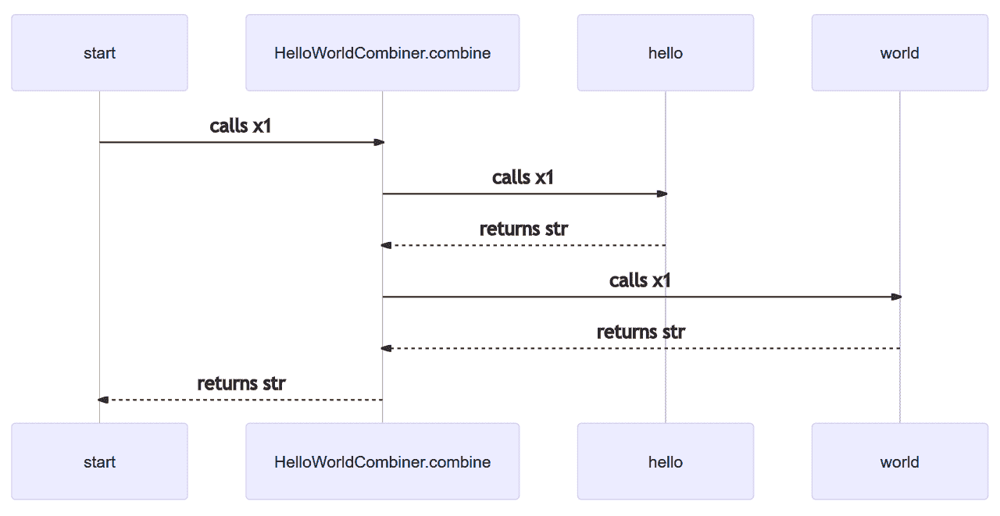

# 如何从 Python 测试中创建文档

> 原文：<https://www.freecodecamp.org/news/how-to-create-documentation-from-your-python-tests/>

如果我告诉您，您可以从现有的测试中自动创建文档，并且总是最新的，会怎么样？

如果它是 markdown 格式的，那么它会和你的代码一起被提交，并显示在 GitLab / GitHub 上呢？

听起来很酷，对吧？让我们看看它是怎么做的。

### 语境

像西蒙·布朗这样的人做了大量的工作来说服我，我没有足够的项目文档。并且文档应该是最新的，在各种抽象层次上显示简明的信息。

我很乐意在这样的文档基础上工作。

## 文档的问题是

我阅读了大量关于软件架构和相关事物的书籍和文章。但我从来没有能够鼓起足够的能量，或足够的政治资本，能够创造这种标准的文件。更不用说更新了。

因此，至少对于我的情况，我需要一种自动创建和更新文档的方法。

我还希望将图表存储为“代码”，这样它们就可以被签入到存储库中。这样，在拉请求和其他代码评审中，可以很容易地看到和讨论对它们的更改。

有许多[工具](https://structurizr.com/help/code)可以从代码中生成构建时依赖图，我已经使用了相当多的工具。

但是问题似乎是这些图看起来总是像意大利面条，即使代码是好的。而且设置起来很复杂。

似乎很难把细节的层次搞对。没有办法在高级图的逻辑组中显示相关的代码。也没有办法挑选出特定于低层图的特定上下文的代码关系。

它们也没有提供关于代码运行时关系的信息，这通常是一个比设计时关系更大的问题。

## 一个解决方案

要捕获运行时关系，从运行代码生成图是唯一的选择。我们已经有大量的代码以测试的形式定期执行。

存储库应该已经有了一套好的测试(例如，单元测试、集成测试和端到端测试)，并且每个测试应该相对简短。

这些测试应该已经包含了代码的逻辑分组和合理的抽象层次。所以它们是生成文档的绝佳候选。

解决方案包括检测由测试导入的代码。然后，这个插装代码保存运行时调用层次结构的记录，并且能够将结果写成[美人鱼降价图](https://mermaid-js.github.io/mermaid/#/)(技术上是一个[序列图](http://agilemodeling.com/artifacts/sequenceDiagram.htm))。

下面的代码([来自 python 包](https://github.com/resgroup/docs-from-tests/blob/master/tests/test_hello_world.py)的一个测试)展示了它是如何工作的。

对于每个现有的测试，您创建一个“包装器”测试，它负责初始化调用层次结构并保存图表。如果你有很多测试，你可能想引入一个[装饰器](https://realpython.com/primer-on-python-decorators/)来避免重复。

```
from docs_from_tests.instrument_call_hierarchy import instrument_and_import_package, instrument_and_import_module, initialise_call_hierarchy, finalise_call_hierarchy
from samples.hello_world_combiner import HelloWorldCombiner

# you can instrument entire packages / folders at once like this
instrument_and_import_package(os.path.join(Path(__file__).parent.absolute(), '..', 'samples'), 'samples')
# You can instrument individual modules like this
# instrument_and_import_module('tests.blah')

# this is a wrapper around the test that also outputs the documentation / sequence diagram
def test_hello_world():
    # the initialises the recording of the call hierarchy
    initialise_call_hierarchy('start')

    # This runs the actual test
    _test_hello_world()

    # this finalises the call hierarchy and returns the root
    root_call = finalise_call_hierarchy()

    # this returns a sequence diagram of the call hierarchy
    sequence_diagram = root_call.sequence_diagram(
        show_private_functions=False,
        excluded_functions=[
            'HelloWorldCombiner.__init__',
        ]
    )

    # this writes out the markdown to disk    
    sequence_diagram_filename = os.path.join(os.path.dirname(__file__), '..', 'doc', 'top-level-sequence-diagram.md')
    Path(sequence_diagram_filename).write_text(sequence_diagram)

# this is the original / source test
def _test_hello_world():
    assert HelloWorldCombiner().combine() == 'Hello world' 
```

对该代码运行`pytest`将导致测试运行，并且在 doc 目录中创建 [markdown“图为代码”](https://github.com/resgroup/docs-from-tests/blob/master/doc/top-level-sequence-diagram.md)(如下所示):

```
sequenceDiagram
  start->>HelloWorldCombiner.combine: calls x1
  HelloWorldCombiner.combine->>hello: calls x1
  hello-->>HelloWorldCombiner.combine: returns str
  HelloWorldCombiner.combine->>world: calls x1
  world-->>HelloWorldCombiner.combine: returns str
  HelloWorldCombiner.combine-->>start: returns str 
```

如下图所示:



对图表的更改将会在 Git 中显示出来，并与导致更改的代码一起提交。这意味着对代码的更改和对图的更改是联系在一起的，可以一起看到。

私有方法通常会被排除在外(尽管它是可选的)，您可以排除其他函数，以便图形看起来像期望的那样。

因为调用层次结构存储在树结构中，所以排除一个函数也会排除它下面的所有函数。

## 代码质量

希望你已经有了适当抽象层次的测试(传统上你会有单元、集成和端到端)。这使得在这些层次上创建图表变得容易。

如果没有，那么创建好的图的愿望应该引导你创建好的测试。

有时候这些图看起来有点疯狂，你可能会忽略很多功能。这是一个提示，代码可能会变得更简单。在这种情况下，创建良好图表的愿望应该引导您简化代码。

## 结论

希望这将激励你创建和维护文档，你的队友和你未来的自己会感谢你！这很容易做到。

所有的功能都在一个 Python 包中( [docs-from-tests)](https://pypi.org/project/docs-from-tests/) ，还有一个展示如何使用它的[示例 repo】。](https://github.com/ceddlyburge/docs-from-tests-example)