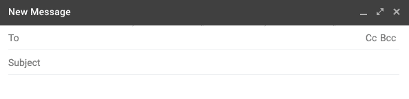
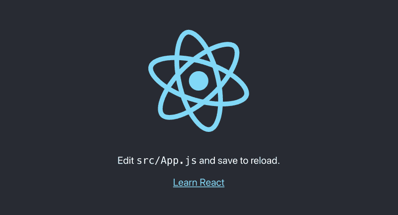
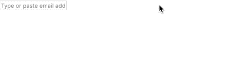
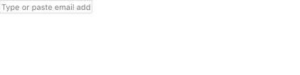
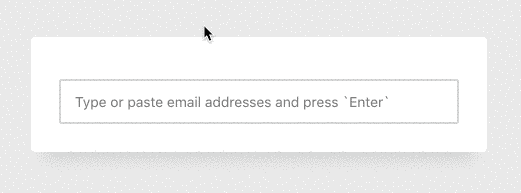
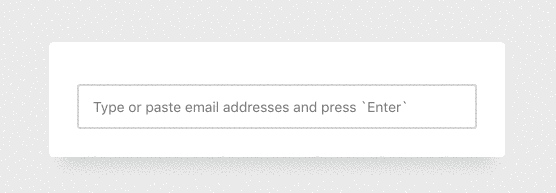
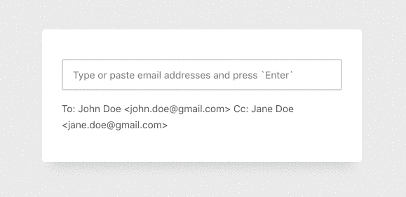

# 如何在 pure React 中创建电子邮件芯片

> 原文：<https://www.freecodecamp.org/news/how-to-create-email-chips-in-pure-react-ad1cc3ecea16/>

作者安德烈亚斯·雷姆特

# 如何在 pure React 中创建电子邮件芯片


As it turns out, chips can also be found on your computer’s mainboard. Photo by [Alexandre Debiève](https://unsplash.com/photos/FO7JIlwjOtU?utm_source=unsplash&utm_medium=referral&utm_content=creditCopyText) on [Unsplash](https://unsplash.com/search/photos/chip?utm_source=unsplash&utm_medium=referral&utm_content=creditCopyText).

想象一下你，那个长得好看的开发者(没错，我就是在和你说话！)，希望构建一个邀请表单，用户可以在其中向列表中添加一个或多个电子邮件地址，并向所有人发送消息。

考虑到如何以最好的方式解决这个问题，我看了看谷歌在 Gmail 应用程序中做了什么。在“新消息”覆盖中，您可以输入电子邮件地址，然后按“Return”、“Tab”或逗号将其添加到收件人列表中。你甚至可以粘贴一堆电子邮件地址，应用程序会继续解析并把它们添加到你的列表中。很整洁，不是吗？



Entering some emails into Gmail will add them as chips.

这些可视化组件通常被称为**芯片**或**徽章**，可以在类似[物化](https://materializecss.com/chips.html)、[引导](https://getbootstrap.com/docs/4.0/components/badge/)或[材质 UI](https://material-ui.com/demos/chips/) 的框架中找到。

### 我们将会建造什么

在本教程中，我想在 pure React 中构建这样一个特性，而不使用任何其他库或框架。我们将创建一个只接受电子邮件地址的输入字段。用户可以一个接一个地输入它们，或者粘贴一堆，这样就可以创建芯片，如下例所示:

[https://codesandbox.io/embed/ypyxr11109?from-embed](https://codesandbox.io/embed/ypyxr11109?from-embed)

Don’t be shy, go ahead and enter your email address.

**免责声明:**已经有各种各样的 [npm 包](https://react-select.com/)在做同样的工作，但是，我喜欢从头实现这样的小功能，因为我不喜欢依赖(有时是巨大的)第三方脚本。另外，这也是锻炼反应能力的好方法。

### 搭建项目

既然我们不需要什么特别的东西来开始，我们就用 [create-react-app](https://facebook.github.io/create-react-app/) 。如果你还没有在你的电脑上安装它，打开你的终端并输入`npm install -g create-react-app`。

在命令运行之后， *create-react-app* 应该已经安装好了(如果在安装过程中出现错误，您可能需要使用管理员权限来运行它:`sudo npm install -g create-react-app`)并且可以使用了。

进入你的工作区，输入`create-react-app chips`。在我的例子中，我将把我的文件夹命名为`chips`，但是你可以选择任何你喜欢的名字。

*create-react-app* 将继续做它的事情，安装我们开始需要的所有依赖项。完成之后，您可以输入`cd chips`进入我们新创建的目录，输入`npm start`启动开发服务器。如果一切顺利，您应该会看到默认的 React 应用程序屏幕。



Seeing this screen means that you have successfully set up your project scaffolding. Let’s dive right into the code!

### 设计机构

在我们的`chips`目录中，我们有一堆为了方便而创建的文件夹和文件。我们大部分时间将在`src/App.js`中工作，所以在您最喜欢的代码编辑器中打开这个文件。

删除你在`App.js`中看到的所有代码。接下来，让我们添加一个基本的 React 类组件:

```
import React from 'react';

class App extends React.Component {
  render() {
    return <p>Hello World</p>;
  }
}
```

保存`App.js`后，你应该会看到你的浏览器自动刷新。带有 React 标志的黑色页面不见了，取而代之的是简单的文本“Hello World”。伟大的开始！

### 输入字段和状态

下一步，我们将用更合适的东西替换 JSX 中不太有用的“Hello World”文本:input 元素。

```
return (
  <input
    placeholder="Type or paste email addresses and press `Enter`"
    value={this.state.value}
    onChange={this.handleChange}
  />
);
```

我们现在有了一个带有`placeholder`属性的 HTML input 元素，只要用户没有输入任何东西，它就会显示。

在`placeholder`属性下面，你会注意到一个在 React 世界中很常见的东西，叫做[受控组件](https://reactjs.org/docs/forms.html#controlled-components)。通常情况下，像`input`或`textarea`这样的 HTML 表单元素有它们自己的状态，我们可以用像`document.getElementById('input').value`这样的 DOM 方法来读写。

使用受控组件的想法是，我们的 React 组件的状态是直通的单一来源，这意味着输入值和我们的状态是同步的。

这使我们能够即时操纵输入的数据*并添加我们以后需要的某些功能。*

如果您保存并在浏览器中运行它，您会看到错误消息`TypeError: Cannot read property 'value' of null`。如果你看看代码片段，它是有意义的，因为我们试图从`this.state`访问`value`，但是我们还没有设置状态，我们也没有`handleChange`方法来控制我们的状态。我们来补充一下。

```
class App extends React.Component {
  state = {
    value: ''
  }

  handleChange = (evt) => {
    this.setState({
      value: evt.target.value
    });
  };

  render() { ... }
}
```

首先，我们初始化一个[状态对象](https://reactjs.org/docs/state-and-lifecycle.html#adding-local-state-to-a-class)，它包含一个空的`value`属性。在此之下，我们定义方法`handleChange`,每次输入元素上的[改变事件](https://developer.mozilla.org/en-US/docs/Web/API/HTMLElement/change_event)被触发时都会调用该方法。`handleChange`然后运行并使用`setState`更新状态。

`evt.target.value`是没有什么反应给我们提供了；它自带 JavaScript。`evt.target`是我们键入的输入，`value`是输入的值(多么令人惊讶)。

继续尝试:在你的浏览器中，你应该能够在输入中输入一些东西。您看不到的是，在幕后，您输入的数据与 React 组件的状态是同步的。如此神奇！

### 添加电子邮件作为筹码

下一步是让用户能够通过按下键盘上的“Return”、“Tab”或逗号键将电子邮件添加到列表中。在我们这样做之前，我们需要在我们的状态中有一个列表(或者更确切地说是数组),我们可以在其中添加电子邮件:

```
state = {
  value: '',
  emails: []
}
```

现在我们有了一个数组，我们需要对用户按下这些特殊的键做出反应。最好的方法是[按键事件](https://developer.mozilla.org/en-US/docs/Web/Events/keydown):

```
return (
  <input
    placeholder="Type or paste email addresses and press `Enter`"
    value={this.state.value}
    onChange={this.handleChange}
    onKeyDown={this.handleKeyDown}
  />
);
```

注意我是如何添加`onKeyDown`事件监听器的，它引用了下面的方法:

```
handleKeyDown = (evt) => {
  if (['Enter', 'Tab', ','].includes(evt.key)) {
    evt.preventDefault();

    var email = this.state.value.trim();

    if (email) {
      this.setState({
        emails: [...this.state.emails, email],
        value: ''
      });
    }
  }
};
```

哇，这里发生了很多事，对吧？别急，让我们一步一步地经历变化:

1.  `if (['Enter', 'Tab', ','].includes(evt.key))`是魔法开始的地方:在这个条件中，我们检查被按下的键(`evt.key`)是否是我们的触发器之一。我用这三个键创建了一个数组(您可以很容易地添加另一个键，如“Space”)。使用`[includes](https://developer.mozilla.org/en-US/docs/Web/JavaScript/Reference/Global_Objects/Array/includes)`方法，我们检查是否按下了数组的键。也就是说，如果用户按下“Tab ”,那么`evt.key`将是存在于数组内部的`Tab`,因此条件为真。
2.  如果条件为真，我们将防止违约发生。通常，在输入元素中按下“Tab”键，你会聚焦在页面或浏览器的另一个元素上([键盘导航](https://www.nngroup.com/articles/keyboard-accessibility/))，这意味着我们会离开当前的输入。但是使用`evt.preventDefault()`，您可以覆盖默认的浏览器行为。
3.  下面，我们保存到目前为止得到的输入。`this.state.value`总是包含用户输入的内容，这就是我们的`handleChange`方法的用途。使用`[trim](https://developer.mozilla.org/en-US/docs/Web/JavaScript/Reference/Global_Objects/String/trim)`只是允许我们删除输入前后的空白。
4.  接下来，我们检查用户是否实际输入了一些数据。如果没有，我们什么都不想做。
5.  然而，如果`email`实际上包含了一些数据(现在可能是任何数据)，我们将它添加到状态中的`emails`数组中。
6.  最后，我们重置了状态中的`value`属性，这意味着我们的输入字段将被清空，用户可以开始键入新的电子邮件地址(如果他愿意的话)。这就是受控组件的美妙之处！

你可能想知道`[...this.state.emails, email]`是做什么的，对吗？这是一个相当新的 JavaScript 特性，叫做 s [pread syntax](https://developer.mozilla.org/en-US/docs/Web/JavaScript/Reference/Operators/Spread_syntax) 。3 个点表示我们提取了来自`this.state.emails`的所有电子邮件。既然我们已经提取了它们，我们可以将它们和新的`email`合并到一个新的数组中。最后，我们通过给新创建的数组赋值来覆盖当前的`emails`属性。如果你想了解更多关于这种技术以及为什么我们不能使用`array.push()`的信息，看看这个[堆栈溢出线程](https://stackoverflow.com/questions/26253351/correct-modification-of-state-arrays-in-reactjs)。

去试试吧。在输入框中输入一些东西，然后按下 3 个按钮中的任何一个。等等，你说没什么特别的事情发生？嗯，这是意料之中的，因为尽管我们将每个输入添加到电子邮件数组中，但我们实际上并没有对它做任何事情，不是吗？该把它们打印出来了:

```
return (
  <React.Fragment>
    {this.state.emails.map(email => <div key={email}>{email}</div>)}

    <input
      placeholder="Type or paste email addresses and press `Enter`"
      value={this.state.value}
      onChange={this.handleChange}
      onKeyDown={this.handleKeyDown}
    />
  </React.Fragment>
);
```

如果你看上面的 JSX，你会看到我已经用一个 [React 片段](https://reactjs.org/docs/fragments.html)包装了我们的整个输出，并在输入字段上面放了一个表达式。

这个片段使我不必在 DOM 中呈现不必要的 HTML 元素。

第 3 行的表达式是另一个[典型的反应模式](https://reactjs.org/docs/lists-and-keys.html)，你会在几乎所有的应用程序中发现:在这里，我们从我们的状态开始循环(或者更简洁地映射)数组`emails`,并为每一项输出一个`div`。`div`将电子邮件地址作为文本内容(不要忘记`key`道具，否则 React 会对你发火)。

让我们看看迄今为止我们已经取得的成就:



Isn’t that the greatest app of all times?

### 从列表中删除电子邮件

这很好，但是如果你添加了一个你不喜欢的人呢？我们需要一个功能来删除列表中已经添加的电子邮件！

```
{this.state.emails.map(email => (
  <div key={email}>
    {email}

    <button
      type="button"
      onClick={() =>  this.handleDelete(email)}
    >
      &times;
    </button>
  </div>
))}
```

看上面的代码。还记得我们添加 JSX 循环所有电子邮件并打印出来吗？这是相同的代码块，但是现在我在我们的`div`中添加了一个按钮，它有一个[点击事件](https://developer.mozilla.org/en-US/docs/Web/API/Element/click_event)监听器。一旦用户按下按钮，这个监听器将调用`handleDelete`。

但是，请注意这个函数调用是如何不同的。它实际上是一个被调用的箭头函数，作为回报，它调用带有参数的`handleDelete`方法，在本例中，是我们的 email。

这是一种不同于你目前所看到的方法，我们只是做了类似于`onChange={this.handleChange}`的事情。原因是，这一次，我们需要将用户想要删除的电子邮件作为参数传递到我们的方法中，否则我们将无法知道要删除哪个电子邮件。如果你想知道更多的细节，[这篇文章](https://medium.freecodecamp.org/reactjs-pass-parameters-to-event-handlers-ca1f5c422b9)已经覆盖了你。

让我们实现`handleDelete`方法:

```
handleDelete = (toBeRemoved) => {
  this.setState({
    emails: this.state.emails.filter(email => email !== toBeRemoved)
  });
};
```

我们在这里所做的就是再次设置我们的状态，但是这次我们过滤掉了作为参数传递的电子邮件地址。JavaScript 中的`[filter](https://developer.mozilla.org/en-US/docs/Web/JavaScript/Reference/Global_Objects/Array/filter)`方法在这种情况下非常方便。

我们不必使用您之前看到的奇怪的 spread 语法(`[...array1, newItem]`)，因为`filter`返回一个新的数组，它不包括我们刚刚过滤掉的值。然后我们可以将这个新数组设置为我们的`emails`列表。



Deletion is now part of our component.

### 让它变漂亮

如果你和我一样，你可能会对大量的无样式内容感到畏缩。让我们把这个坏男孩变漂亮:

```
return (
  <main className="wrapper">
    {this.state.emails.map(email => (
      <div className="email-chip" key={email}>
        {email}

        <button
          type="button"
          className="button"
          onClick={() =>  this.handleDelete(email)}
        >
          &times;
        </button>
      </div>
    ))}

    <input
      className="input"
      placeholder="Type or paste email addresses and press `Enter`"
      value={this.state.value}
      onChange={this.handleChange}
      onKeyDown={this.handleKeyDown}
    />
  </main>
);
```

1.  你会注意到的第一件事是我用`<main className="wrappe` r" >代替了`React.Fragment`。这只是出于样式的目的，我想把包装器放在页面的中央。
2.  我还向输入、按钮和芯片本身添加了一些类，它们将从我们的 CSS 文件中获得一个漂亮的样式。
3.  在文件的顶部，在`import React from 'react'`下面，我添加了另一个导入:`import './app.css'`。如果你使用过*创建-反应-应用*，你很可能会在你的`src`目录中找到一个`App.css`。我刚刚将我的重命名为小写的 app.css 并导入它。

你可以[在这里](https://codesandbox.io/embed/ypyxr11109)找到 CSS，我不会在这里展示它，因为它会给这篇已经很长的文章增加太多的臃肿。

让我们看看我们的应用程序现在是什么样子:



Isn’t that a thing of beauty?

### 确认

我们的组件正在成形，但是您可能开始想知道如果用户输入一些胡言乱语而不是实际的电子邮件地址会发生什么，对吗？对吗？

目前，我们的组件接受各种类型的输入，下一步我们应该解决这个问题。让我们先添加一个`isValid`方法:

```
isValid(email) {
  var error = null;

  if (!this.isEmail(email)) {
    error = `${email} is not a valid email address.`;
  }

  if (this.isInList(email)) {
    error = `${email} has already been added.`;
  }

  if (error) {
    this.setState({ error });

    return false;
  }

  return true;
}
```

`isValid`方法接收一个参数，这是我们想要验证的输入(最好是一个电子邮件地址)。它用`null`初始化一个`error`变量，这意味着我们还没有任何错误。

然后我们看到两个 if 条件。第一个是利用`isEmail`方法检查该值是否是有效的电子邮件:

```
isEmail(email) {
  return /[\w\d\.-]+@[\w\d\.-]+\.[\w\d\.-]+/.test(email);
}
```

在这里，我们收到一个参数，它应该是，但可能不是我们想要添加的电子邮件。使用一个[正则表达式](https://developer.mozilla.org/en-US/docs/Web/JavaScript/Guide/Regular_Expressions)和`[test](https://developer.mozilla.org/en-US/docs/Web/JavaScript/Reference/Global_Objects/RegExp/test)`方法，我们检查它是否确实是一个有效的电子邮件地址。

**免责声明:**我不保证提供的正则表达式是验证电子邮件的最佳表达式。这是一个困难的话题，有许多不同的变化，而且事情[会变得非常复杂](https://stackoverflow.com/questions/201323/how-to-validate-an-email-address-using-a-regular-expression)。但我会坚持这一点，因为它做的工作。

第二个方法`isInList`也接收单个参数(电子邮件),并检查它是否已经被添加到状态中的`emails`数组中。再次使用了令人敬畏的`[includes](https://developer.mozilla.org/en-US/docs/Web/JavaScript/Reference/Global_Objects/Array/includes)`方法:

```
isInList(email) {
  return this.state.items.includes(email);
}
```

我们的`isValid`方法所做的就是使用另外两个方法来检查给定值是否是一个有效的电子邮件地址，并且还不属于我们的列表。如果这两个条件都不成立，我们不设置任何错误消息并返回`true`。

否则，如果这些条件之一实际上是真的，这意味着电子邮件是无效的或已经在列表中，我们设置一个错误消息并返回`false`。错误存在于组件状态中，因此我们需要添加属性 it:

```
class App extends React.Component {
  state = {
    value: '',
    emails: [],
    error: null
  }

  // ...
}
```

请注意，error 属性是用`null`初始化的，因为当我们最初加载应用程序时，当然没有错误。

仍然缺少两件事:在我们的`handleKeyDown`方法中，我们需要实际使用`isValid`方法。我们应该向用户显示错误，否则一开始就显示错误消息是没有意义的。

```
handleKeyDown = (evt) => {
  if (['Enter', 'Tab', ','].includes(evt.key)) {
    evt.preventDefault();

    var email = this.state.value.trim();

    if (email && this.isValid(email)) {
      this.setState({
        emails: [...this.state.emails, email],
        value: ''
      });
    }
  }
};
```

还记得`handleKeyDown`法吗？我当然希望你这样做，因为你需要改变它以获得确认。在第 7 行，注意我已经在条件中添加了`&& this.isValid(email)`。这意味着我们现在正在使用我们的验证，将用户输入的值传递给它。只有当`email`有一个实际值**并且**是一个有效的电子邮件地址，我们才继续设置状态。

这个难题的最后一部分是向用户显示错误消息。

```
return (
  <main className="wrapper">
    {this.state.emails.map(email => (
      // Hidden...
    ))}

    <input
      className={'input' + (this.state.error && ' has-error')}
      placeholder="Type or paste email addresses and press `Enter`"
      value={this.state.value}
      onChange={this.handleChange}
      onKeyDown={this.handleKeyDown}
    />

    {this.state.error &&
      <p className="error">{this.state.error}</p>}
  </main>
);
```

两件事发生了变化:

1.  在`input`下面，我们[有条件地呈现](https://reactjs.org/docs/conditional-rendering.html)一个段落，将我们的错误消息作为文本内容。
2.  我们输入的`className`不再是一个简单的字符串，而是一个 JSX 表达式，如果`error`为真，它会将`has-error`附加到类名上。如果输入无效，这对于给我们的输入一些自定义样式很有用。

继续并在你的浏览器中尝试结果。请尝试输入无效的电子邮件地址或已在列表中的电子邮件地址。您应该会看到错误消息显示在输入下方。

不过有一个问题:如果你让错误信息出现，它将永远存在，即使你后来添加了有效的电子邮件地址。我们需要在用户再次开始输入后重置错误:

```
handleChange = (evt) => {
  this.setState({
    value: evt.target.value,
    error: null
  });
};
```

我们的`handleChange`方法是这样做的最好地方！每次用户更改输入值时都会调用它，这意味着我们可以再次将错误设置为`null`。如果用户没有吸取教训，试图再次添加一个无效的电子邮件地址，那么…好吧，错误消息将再次出现。



No more invalid data!

### 处理从剪贴板粘贴

我们的小组件已经成长了不少，变得有些有用，但是仍然缺少一个重要的特性:从剪贴板粘贴电子邮件地址。

这个可能相当有趣，因为用户可能想从他们的邮件应用程序中复制一堆电子邮件地址，然后一次全部粘贴。然而，不同的邮件应用程序有不同的格式。例如，如果你从苹果邮件应用程序中复制一堆电子邮件，它看起来像这样:

```
To: John Doe <john.doe@gmail.com> Cc: Jane Doe <jane.doe@gmail.com>
```

您的应用程序可能会有不同的处理方式。那么，我们如何解析这些字符串，只得到我们想要的部分呢？

```
handlePaste = (evt) => {
  evt.preventDefault();

  var paste = evt.clipboardData.getData('text');
  var emails = paste.match(/[\w\d\.-]+@[\w\d\.-]+\.[\w\d\.-]+/g);

  if (emails) {
    var toBeAdded = emails.filter(email => !this.isInList(email));

    this.setState({
      emails: [...this.state.emails, ...toBeAdded]
    });
  }
};
```

上面的方法很难理解，所以让我们开始吧。

1.  在第 2 行，我们阻止了默认值，这意味着文本实际上没有粘贴到输入字段中。我们会自己处理的。
2.  在第 4 行，我们使用[剪贴板 API](https://developer.mozilla.org/en-US/docs/Web/API/ClipboardEvent/clipboardData) 获得用户将要粘贴的剪贴板数据。`paste`是一个字符串。
3.  在下面的第 5 行，我们使用`[match](https://developer.mozilla.org/en-US/docs/Web/JavaScript/Reference/Global_Objects/String/match)`方法对剪贴板数据应用正则表达式。`match`方法将遍历我们的整个字符串，并获取与我们的正则表达式匹配的所有部分(它与我们用于验证部分的是同一个)。结果是一个匹配数组，如果没有匹配，则返回`undefined`。
4.  在第 7 行，我们检查是否有实际的电子邮件。如果是这样，我们将在第 8 行过滤它们，以排除已经在我们列表中的电子邮件。再次成为我们的朋友。变量`toBeAdded`现在应该是一个数组，包含还不在我们列表中的电子邮件。注意我们如何很好地重用了我们的`isInList`方法。
5.  在第 10 行，我们再次使用[扩展语法](https://developer.mozilla.org/en-US/docs/Web/JavaScript/Reference/Operators/Spread_syntax)将当前的`emails`数组与新创建的`toBeAdded`数组合并。

请注意我们没有使用`isEmail`来验证电子邮件。这一步是隐式完成的，因为我们依赖相同的正则表达式来获取所有有效的电子邮件地址。如果用户粘贴了无效的电子邮件地址，它将永远不会成功。

所缺少的只是我们的输入和`handlePaste`方法之间的联系:

```
<input
  className={'input' + (this.state.error && ' has-error'}
  placeholder="Type or paste email addresses and press `Enter`"
  value={this.state.value}
  onChange={this.handleChange}
  onKeyDown={this.handleKeyDown}
  onPaste={this.handlePaste}
/>
```

谢天谢地，[粘贴事件](https://developer.mozilla.org/en-US/docs/Web/API/Element/paste_event)已经覆盖了你。



### 结论

你有它，我们完成的组件，接受多个电子邮件地址，甚至让你粘贴它们。

[https://codesandbox.io/embed/ypyxr11109?from-embed](https://codesandbox.io/embed/ypyxr11109?from-embed)

The finished component.

当然，如果您可以添加更多的功能和改进，这里有几个例子:

*   如果用户输入了电子邮件地址，但没有按“Enter”或“Tab”，会发生什么情况？您可以将一个[模糊事件](https://developer.mozilla.org/en-US/docs/Web/API/Element/blur_event)附加到输入中，如果用户点击页面上的其他东西，比如提交按钮，它会尝试验证和添加内容。
*   你可以把芯片做成可点击的，这样用户就可以选择它们来编辑电子邮件地址。
*   可访问性肯定可以改进，让屏幕阅读器更容易理解。

我希望你喜欢这个教程，随时告诉我你的建议或反馈。编码快乐！